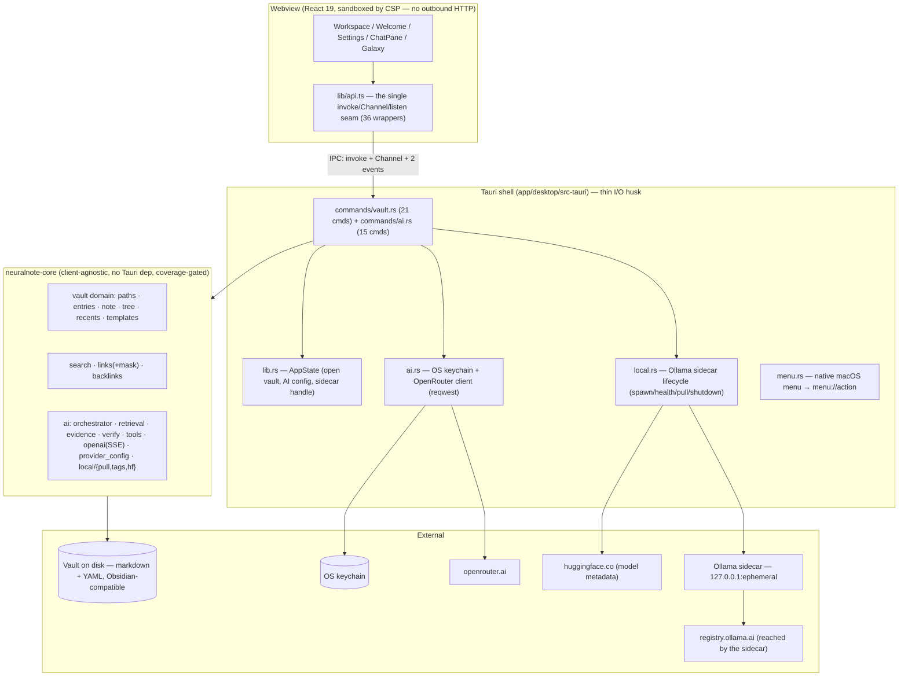
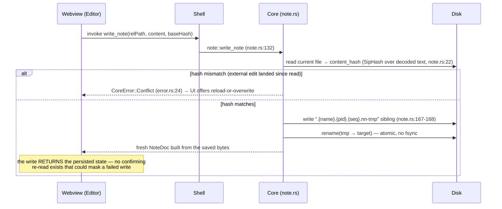

# NeuralNote — System Overview (as-built HLD)

> This document describes what the code **actually does** as of 2026-07-10 (branch
> `feature/conversational-chat` base). Every factual claim carries a `file:line` anchor;
> where something is inferred rather than cited, it says so. For intent-vs-reality
> reconciliation, see [`spec-vs-built.md`](spec-vs-built.md).

NeuralNote is a Tauri 2 desktop app: a client-agnostic Rust core
(`crates/neuralnote-core`) behind a thin Tauri shell (`app/desktop/src-tauri`), with a
React 19 webview frontend (`app/desktop/src`). What is built today is a **vault
editor** (open/browse/edit an Obsidian-compatible markdown vault), **lexical search +
link graph**, and **cited chat** over the vault via an agentic keyword-search loop,
with two AI providers: BYO-key OpenRouter or a bundled local Ollama sidecar. There is
no capture pipeline, no distiller, no index, no embeddings, and no vector store —
those remain spec-only (see the drift ledger).

---

## 1. Layered architecture



The IPC surface is exactly: **36 `#[tauri::command]`s** registered in one
`generate_handler!` block (`app/desktop/src-tauri/src/lib.rs:140-177`), **two global
events** — `vault://tree-changed` and `menu://action`
(`app/desktop/src-tauri/src/event_names.rs:14,17`) — and **two streaming
`ipc::Channel` payloads**: `ChatEvent` (chat) and `PullEvent` (model download). Event
name constants are Rust-owned; a `#[cfg(test)]` generator mirrors them into
`src/lib/bindings/events.ts` (`event_names.rs:19-30`), and the ts-rs binding drift
check fails the Rust gate if either side moves.

## 2. Component responsibilities

| Component | Location | Responsibility | Notes |
|---|---|---|---|
| Frontend state | `app/desktop/src/lib/store.tsx` | React Context + `useState` holding `{status, vault, tree, recents, error}` | No Zustand/reducer. Open-note state is a separate `useOpenNote` hook; `dirty` is derived, never stored. |
| IPC seam | `app/desktop/src/lib/api.ts` | Sole importer of `invoke`/`Channel`/`listen`; 36 typed wrappers | One exception: `Workspace.tsx:19` imports `getCurrentWindow` for the close-guard. |
| Chat UI | `app/desktop/src/workspace/` (ChatPane et al.) | Renders the `ChatEvent` stream; total switch over all 11 variants | ChatPane never unmounts (it owns a live Channel) — toggled via `display:contents\|none` (`Workspace.tsx:391`). |
| Galaxy | `app/desktop/src/workspace/galaxy/` | 3D link-graph view; re-derives clusters/bridges per focus level in `graphTransform.ts` | Backend `cluster`/`bridge` fields are ignored by the frontend. 500-node cap with an honest truncation notice. |
| Shell commands | `src-tauri/src/commands/{vault,ai}.rs` | Wrap core functions; own async worker-pool dispatch | Mostly delegate-only; exceptions in §6. |
| Keychain + OpenRouter | `src-tauri/src/ai.rs` | Key storage (`com.neuralnote.desktop` / `openrouter-api-key`, `ai.rs:30-31`); HTTP client construction | Key read Rust-side at call time; never crosses to the webview. |
| Sidecar lifecycle | `src-tauri/src/local.rs` | Spawn Ollama on an ephemeral loopback port, health-poll, pull models, shutdown | Private `OLLAMA_MODELS` dir (`local.rs:229`) so a user's own Ollama is untouched. |
| Vault domain | `crates/neuralnote-core/src/{paths,entries,note,tree,recents,templates}` | Path safety, CRUD, atomic writes, frontmatter parsing, template rendering | The security spine; see §3. |
| Search / links | `crates/neuralnote-core/src/{search,links,backlinks}` | Lexical substring search; wikilink + md-link graph; backlinks | **No index** — full filesystem rescan per query/call. |
| AI core | `crates/neuralnote-core/src/ai/` | The agentic chat loop, evidence registry, citation verification, SSE parsing, provider config, local-model logic | All AI *logic* is here and coverage-gated; the shell holds only transport. |

## 3. Trust boundaries and controls

There are four trust boundaries. Controls at each, as built:

### Boundary 1 — webview ⇄ shell (the IPC line)

The webview is treated as compromisable; everything it can do is enumerated.

- **CSP (prod)**: `connect-src 'self' ipc: http://ipc.localhost` — the webview **cannot
  make outbound HTTP at all**; every network egress is Rust-side `reqwest`
  (`app/desktop/src-tauri/tauri.conf.json:26`). `devCsp` is looser, dev only.
- **Capabilities**: only `core:default`, `core:window:allow-destroy`,
  `core:window:allow-start-dragging` (`src-tauri/capabilities/default.json:6-10`).
  `shell:allow-execute` is deliberately omitted — the webview has no spawn primitive;
  the sidecar is spawned from Rust, which does not consult the capability (rationale
  documented in `default.json:4`).
- **No ambient FS authority**: the webview reaches the filesystem only through the 21
  typed vault commands; there is no fs plugin scope.
- **Secrets never cross**: `ApiKeyStatus`/`AiStatus` expose only `has_key: bool`; the
  key itself is read from the keychain at call time in Rust (`src-tauri/src/ai.rs:85-95`).
- **Rendered markdown is safe by construction**: `react-markdown` v10 with no
  `rehype-raw` installed renders no raw HTML; `urlTransform` delegates to
  `defaultUrlTransform` (strips `javascript:`/`data:`) while passing the private
  `nn-wikilink:` scheme; all anchors `preventDefault()`. The one raw-innerHTML sink is
  the galaxy tooltip, hand-escaped via `escapeHtml` + `safeHex`.

### Boundary 2 — app ⇄ the vault on disk (untrusted user data)

- **Path containment**: `paths::ensure_within` canonicalizes root + target and checks
  containment component-wise (`crates/neuralnote-core/src/paths.rs:16`). For existing
  targets it follows symlinks; for not-yet-existing targets it canonicalizes the
  *parent* and joins the literal leaf. Escape → `CoreError::OutsideVault`
  (`crates/neuralnote-core/src/error.rs:18-19`, "the security spine").
- **Frontmatter is hostile input**: capped at 4 KiB (`note.rs:257`) — over-cap is
  reported "too large" and never parsed (`note.rs:281-285`). Alias-bomb defence is
  deliberately **delegated to `serde_yaml_ng`'s libyaml repetition limit** with a
  canary test — a hand-rolled guard was tried and adversarially bypassed twice, so it
  was removed (the cautionary tale is codified in `docs/definition-of-done.md:79-82`).
  The note body is always preserved on any frontmatter failure.
- **Deletes are recoverable**: `delete_entry` routes to the OS trash
  (`crates/neuralnote-core/src/entries.rs:175`), never `unlink`.
- **Writes are crash-consistent**: temp-file + rename (§5b), though not fsync'd (§7).

### Boundary 3 — shell ⇄ network (OpenRouter, Hugging Face)

- Outbound hosts are exactly: `openrouter.ai` (chat), `huggingface.co` (model
  metadata), `127.0.0.1:{port}` (sidecar). The sidecar itself reaches
  `registry.ollama.ai` for pulls.
- **Key redaction**: provider/proxy error bodies pass through `openai::redact`
  (`crates/neuralnote-core/src/ai/openai.rs:17`) before reaching the user or logs.
  One gap: a mid-stream SSE `error` frame is returned unredacted as
  `CoreError::Llm(msg)` (`openai.rs:63`) — not a proven leak (it carries response
  content, not the request header), but it is the one un-redacted path.
- **No TLS pinning, no response size caps** on any outbound call. The HF metadata
  fetch has no cache, no user-agent, no auth, no rate limit.

### Boundary 4 — shell ⇄ the Ollama sidecar (a subprocess running downloaded weights)

- **Supply chain**: the binary is fetched at build time by
  `scripts/fetch-ollama-sidecar.sh`, pinned to v0.31.1 with a fail-closed SHA-256
  check (`fetch-ollama-sidecar.sh:29-30,80-82`). No code-signature verification.
- **Loopback-only, ephemeral port**: bind `127.0.0.1:0`, read the assigned port, drop
  the listener, then spawn with `OLLAMA_HOST=127.0.0.1:{port}` (`local.rs:435-438,
  225-229`). The bind→spawn gap is a small accepted TOCTOU window with no retry.
- **Curated model allowlist enforced in Rust at three sites** — pull, provider
  selection, chat pre-flight (`src-tauri/src/commands/ai.rs:108,205,415`) — so a
  hand-edited config or non-UI caller cannot make a non-tool-calling model the
  cited-chat model. The list: `qwen3.5:{4b,9b,27b}`, `granite4.1:{3b,8b,30b}`
  (`crates/neuralnote-core/src/ai/local/mod.rs:95-140`).
- **Static args only**: spawned as `sidecar("ollama")` with `["serve"]`; model names
  travel in HTTP bodies, never CLI args (inferred from `local.rs:225-229` + the
  capability note; consistent with the slice spec's review record).
- **Shutdown**: `shutdown_ollama` runs on `ExitRequested|Exit` and drains both the
  running sidecar and a still-starting child (`local.rs:301-332`,
  `lib.rs:180-185`). SIGKILL / panic-abort still orphans the process.

## 4. The AI chat architecture (the crux)

`run_chat` (`crates/neuralnote-core/src/ai/orchestrator.rs`) drives an agentic tool
loop, bounded by `Guards { max_iterations: 8, max_spans: 60, max_context_chars:
60_000 }` (`orchestrator.rs:26-43`), with the budget checked inside the per-tool-call
loop (`orchestrator.rs:255`).

- **Four tools**: `list_notes`, `list_folders`, `search_notes`, `read_note_span`
  (registered in `ai/tools.rs`; note the module doc at `tools.rs:3` still says
  "Three tools" — stale). `dispatch` is total: bad tool names / malformed args become
  an error *tool result* the model recovers from (`tools.rs:9-10`).
- **Streaming discipline**: tool-deciding turns are non-streamed (`complete`); the
  final answer turn is streamed (`complete_streaming`) **with an empty tools array**,
  so the model cannot emit a tool call mid-stream.
- **Evidence**: `EvidenceRegistry` assigns ids `e1..eN`, deduped on
  `(rel_path, start_line, end_line)`. The model cites ids only, never paths. A
  "chunk" is a single line (from search) or an arbitrary line range (from a read);
  there are no char offsets.
- **Verification** (`ai/verify.rs:29-46`): non-empty span text → re-read the note →
  `content_hash` equality (`verify.rs:39`) → `raw.contains(span.text)`
  (`verify.rs:44`). **This is a provenance check, not an entailment check** — a real
  quote attached to an unsupported claim passes as verified, and an answer with zero
  `[eN]` markers streams to the user entirely unchecked. Grounding is prompt-only.
  This is the single largest gap against the product spec's stated crux
  (`specs/neural-note.md:294-300`); see the drift ledger.
- **Cross-turn hygiene**: `[eN]` markers are stripped from history
  (`orchestrator.rs:460`) so a stale marker can't re-validate against an unrelated
  fresh span; history is windowed to 12,000 chars (`orchestrator.rs:449`), owned by
  the frontend and resent each turn; the core coerces any non-`assistant` role to
  `user`.
- **SSE parsing** (`ai/openai.rs`): the in-band error frame is checked **before** the
  empty-delta filter, because the failure frame carries an empty `delta.content`
  (`openai.rs:172-186`); reasoning tokens are extracted before that filter too and
  never folded into the answer string. An empty answer is always an error
  (`finish_answer`, `openai.rs:72-75`). `ANSWER_MAX_TOKENS = 4096` (`openai.rs:88`);
  truncation at that ceiling is not signalled (`TODO(answer-truncation-signal)`,
  `openai.rs:83`).
- **The `LlmClient` contract**: the string returned by `complete_streaming` must equal
  the concatenation of streamed `Answer` deltas, because citations are verified
  against the returned text — a divergent client would surface a citation for text
  the user never saw.
- **No retries/backoff anywhere** — one transient 429 ends the run
  (`TODO(llm-retry)`, `orchestrator.rs:179`).
- **Retrieval** is `KeywordRetriever` over `search::search_vault_with_content`. No
  embeddings, no vector store, no SQLite, no chunker. A future `VectorRetriever`
  would slot in as another `RetrievalProvider` (`ai/mod.rs:13`).

Providers converge: both OpenRouter and the local sidecar speak the same
OpenAI-compatible wire through one client (`ai/openai.rs`), differing only in base
URL and auth. Provider choice, model tag, and the reasoning opt-in persist in
`ai-config.json`; `reasoning` is `#[serde(default)]` so pre-existing configs migrate
to `false` (`ai/provider_config.rs:34-40`), and `set_reasoning` returns the freshly
persisted `AiStatus` so a failed re-read can't silently leave the user billed.

## 5. Data-flow walkthroughs

### (a) Open vault → tree → read note

```mermaid
sequenceDiagram
    participant W as Webview (api.ts)
    participant S as Shell (commands/vault.rs)
    participant C as Core
    participant D as Disk

    W->>S: invoke open_vault(path)
    S->>C: vault::open (validates, records recent)
    C->>D: recent-vaults.json (config dir, cap 12 — recents.rs:11)
    S-->>W: Vault
    Note over S: notify watcher starts → emits vault://tree-changed on external edits
    W->>S: invoke read_tree
    S->>C: tree::read_tree (skips symlinks + dotfiles; MAX_DEPTH 48 — tree.rs:10)
    S-->>W: TreeNode (recursive)
    W->>S: invoke read_note(relPath)
    S->>C: paths::ensure_within → note::read_note
    Note over C: frontmatter parsed (4 KiB cap); non-UTF-8 → lossy_text=true;<br/>binary → binary=true, body empty (model.rs:84,89)
    S-->>W: NoteDoc { frontmatter, body, raw, contentHash, frontmatterError?, ... }
```

### (b) Save note — optimistic concurrency + conflict



There is **no file locking**: two windows (or NeuralNote + Obsidian) are
last-writer-wins, guarded only by the hash. The microsecond check-then-rename TOCTOU
is documented and accepted.

### (c) A full cited-chat turn

```mermaid
sequenceDiagram
    participant W as Webview (ChatPane)
    participant S as Shell (commands/ai.rs)
    participant O as Orchestrator (core)
    participant L as LlmClient (OpenRouter | Ollama)
    participant V as Verifier

    W->>S: invoke chat(prompt, history, Channel<ChatEvent>)
    S->>S: effective_provider → build client (key from keychain, Rust-side)
    S->>O: run_chat(...)
    loop tool loop (≤ 8 iterations, budget-checked per tool call)
        O->>L: complete (non-streamed, tools attached)
        L-->>O: tool call(s)
        O->>O: dispatch → search/read → EvidenceRegistry (e1..eN)
        O-->>W: Searching / Retrieved / Reading events
    end
    O-->>W: Verifying
    O->>L: complete_streaming (EMPTY tools — no mid-stream tool calls)
    L-->>W: Thinking / Answer deltas (streamed through the Channel)
    O->>V: verify each cited span (re-read → hash match → raw.contains(text))
    V-->>W: Citation (verified) / CitationDropped (failed)
    O-->>W: Coverage { searched_terms, notes_read, truncated, skipped_files }
    O-->>W: Done
    Note over O,W: on any error: Error event, terminal — no Done.<br/>Verification is provenance-only; uncited claims are never checked.
```

### (d) Local-model pull with progress + cancel

```mermaid
sequenceDiagram
    participant W as Webview (Settings)
    participant S as Shell (local.rs)
    participant OL as Ollama sidecar

    W->>S: invoke pull_local_model(tag, Channel<PullEvent>)
    S->>S: is_curated_model(tag)? (commands/ai.rs:108) — reject if not
    S->>S: install_pull_cancel → fresh Arc<AtomicBool> (local.rs:117-119)
    S->>OL: POST /api/pull (NDJSON stream)
    loop each NDJSON line
        OL-->>S: progress line
        S->>S: check cancel token at the line boundary
        S-->>W: PullEvent { status, progress }
    end
    alt user cancels
        W->>S: invoke cancel_pull → token.store(true)
        Note over S: an idle socket only notices at the 60s read timeout;<br/>partial downloads are NOT cleaned up app-side
        S-->>W: terminal PullEvent (exactly one: success xor error)
    else completes
        S-->>W: terminal PullEvent success
    end
```

## 6. Cross-cutting invariants the code actually enforces

1. **Every path stays inside the vault root** — `paths::ensure_within`
   (`crates/neuralnote-core/src/paths.rs:16`); escape is `CoreError::OutsideVault`
   (`error.rs:18-19`).
2. **Writes are atomic (rename), never in-place** — dot-prefixed
   `.{name}.{pid}.{seq}.nn-tmp` sibling then `rename`
   (`note.rs:167-168`); the dot prefix keeps temps out of the tree scan.
3. **Saves cannot silently clobber an external edit** — decimal-string
   `content_hash` compared before write; mismatch → `CoreError::Conflict`
   (`note.rs:22`, `error.rs:22-24`).
4. **Deletes are recoverable** — OS trash, never `unlink` (`entries.rs:175`).
5. **Content is never hidden or lost** — frontmatter failure preserves the body and
   rides in `NoteDoc.frontmatter_error` (`note.rs:281-285`); non-UTF-8 shown lossily
   with `lossy_text: true`, binaries flagged `binary: true` (`model.rs:84,89`). One
   exception exists: `MAX_DEPTH = 48` silently truncates deeper folders
   (`tree.rs:10,40`) — the single place content disappears without a flag.
6. **Frontmatter is bounded hostile input** — 4 KiB cap, over-cap never parsed
   (`note.rs:257,281`); YAML-bomb defence delegated to the library, with a canary test.
7. **The model cites evidence ids, never paths** — `EvidenceRegistry` in
   `ai/evidence.rs`; every surfaced citation is re-verified for provenance
   (`ai/verify.rs:29-46`) and dropped (with a `CitationDropped` event) on failure.
8. **Stale citation markers cannot survive across turns** — `strip_cited_markers`
   (`orchestrator.rs:460`) + 12k-char history window (`orchestrator.rs:449`).
9. **An empty streamed answer is always an error** — `finish_answer`
   (`openai.rs:68-75`); and the in-band SSE error frame is checked before the
   empty-delta filter so it can never be swallowed (`openai.rs:172-186`).
10. **The API key never reaches the webview** — keychain read at call time
    (`ai.rs:30-31,85-95`); status types expose `has_key: bool` only; error bodies
    redacted (`openai.rs:17`).
11. **Only curated, tool-calling-capable local models can be installed or chatted
    with** — enforced Rust-side at pull, selection, and chat pre-flight
    (`commands/ai.rs:108,205,415`).
12. **The webview has no egress and no spawn primitive** — prod CSP
    (`tauri.conf.json:26`) + minimal capabilities (`capabilities/default.json:6-10`).
13. **The TS contract cannot drift from Rust** — bindings are generated (ts-rs +
    the event-name generator, `event_names.rs:19-30`) and `rust-quality-gate.sh`
    fails on any uncommitted diff. Frontend-side, `reduceAssistant` is a total switch
    over all 11 `ChatEvent` variants, so a new backend variant is a compile error.
14. **Billed settings return their persisted state** — `set_reasoning` (and
    `write_note`) return the fresh entity, so no confirming re-read can mask a failed
    write (`provider_config.rs:34-40` for the opt-in default).

## 7. Known architectural limitations

Stated plainly. Each is real today; several carry greppable `TODO(...)` markers.

**Citation & AI**
- **Verification is provenance, not entailment.** A verbatim quote attached to a
  claim it does not support passes verification, and a completely uncited answer is
  never checked at all (`verify.rs:29-46`). The spec's "no unverified citation
  reaches the user" guarantee (`specs/neural-note.md:294-300`) is met only in the
  narrow provenance sense. This is the most important gap in the codebase.
- **No retry/backoff** — one transient 429 kills the chat turn
  (`orchestrator.rs:179`).
- **Answer truncation at 4096 tokens is silent** (`openai.rs:83,88`).
- One un-redacted error path: the mid-stream SSE error frame (`openai.rs:63`).

**Storage & search**
- **No index of any kind.** Search, the link graph, and backlinks each rescan the
  whole vault per call. Fine at hobby scale; a large vault pays full I/O per
  keystroke-debounced query. No max-file-size cap on search.
- **No fsync** — atomic-rename writes are crash-consistent, not power-loss-durable.
- **No file locking** — concurrent writers are last-writer-wins behind the hash check.
- Three divergent markdown-extension sets (`tree::is_markdown_ext`,
  `note::is_text_note`, `entries::ensure_md_extension`) plus a TS mirror
  (`TODO(PA-029)`, `tree.rs:111`).
- `CoreError::Frontmatter` (`error.rs:28`) is never constructed — vestigial;
  frontmatter failures ride in `NoteDoc.frontmatter_error` instead.
- Link masking (`links/mask.rs:9`) blanks fenced + inline code but not HTML comments,
  `$…$` math, or escaped brackets — link false positives are possible.

**Providers & sidecar**
- `key_configured` is a persisted flag, not derived from keychain presence — a crash
  between the two writes desynchronises them (`TODO(key-configured-derive)`,
  `ai.rs:171`).
- SIGKILL / panic-abort orphans the sidecar; a quit during the health-poll can orphan
  a starting child (`TODO(startup-orphan)`, per `specs/ai-providers-slice.md:108-111`).
- Cancelled pulls leave partial downloads on disk; no free-disk pre-check
  (`TODO(pull-disk-precheck)`, `local.rs:376`).
- GPU/VRAM is never detected — sizing is RAM-only, macOS-only
  (`TODO(local-gpu-detection)`, `local.rs:179`).
- No TLS pinning or response-size caps on outbound HTTP; the sidecar binary is
  SHA-256-verified but not signature-verified.

**Process & test gaps**
- **CI runs only the native e2e smoke** (`.github/workflows/e2e.yml`, Linux +
  Windows). No workflow runs the quality gate, `cargo test`, vitest, typecheck, or
  Sonar — the gates are local-discipline only. This is the largest process gap.
- The coverage gate is core-only; the shell's Rust reports 0% coverage.
- `mockVault.ts` implements 34 of the 36 commands — `set_menu_editing` and
  `set_chat_visible` have no e2e seam, which is exactly the bug class only that seam
  catches.
- The native e2e tier has no macOS driver (`tauri-driver` limitation), so the primary
  dev platform is smoke-tested only on the other two OSes.
- `cargo-audit` is currently RED on pre-existing Tauri-transitive advisories
  (`plist → quick-xml`), failing on `main` too; audit SKIPs (not RED) when offline,
  and a SKIP is not green.

**Convention drift (minor, worth knowing)**
- The "commands delegate, never re-implement" convention (`CLAUDE.md`) mostly holds,
  but `read_backlinks` and `create_note_from_template` do path arithmetic in the
  shell, and `chat` / `pull_local_model` / `set_active_provider` carry genuine
  control logic.
- `tools.rs:3` still documents "Three tools" — there are four (`list_folders` was
  added).
- Template-folder discovery precedence is **ASCII-lexicographic on the on-disk
  name** (`Templates` > `_templates` > `templates`, via the sort at
  `templates/discovery.rs:41,261`), not the `FALLBACK_FOLDERS` array order
  (`discovery.rs:19`) — an easy misreading.
