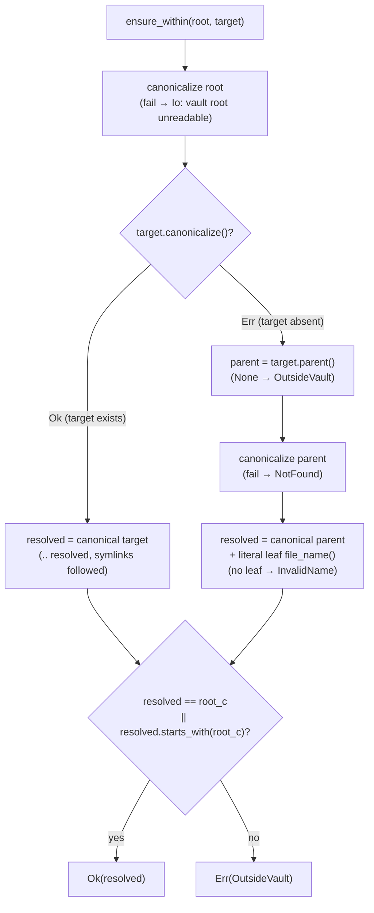

# LLD-001 — Vault Lifecycle & Path Safety

**Status:** as-built · **Sources of truth:** `crates/neuralnote-core/src/{vault,paths,entries,recents}.rs`,
`app/desktop/src-tauri/src/lib.rs`, `app/desktop/src-tauri/src/commands/vault.rs`
**Every claim carries a `file:line` anchor. Claims marked "inferred:" are reasoning, not citation.**

---

## 1. Purpose & scope

This subsystem owns the vault as a *filesystem object*: opening and creating vault roots
(`vault.rs`), keeping every path operation inside the open root (`paths.rs`), file/folder CRUD —
create, rename, move, delete-to-trash (`entries.rs`) — and the persisted recent-vaults list
(`recents.rs`). On the shell side it owns the authorisation gate that decides *which* paths may
become a vault root at all (`app/desktop/src-tauri/src/commands/vault.rs`,
`app/desktop/src-tauri/src/lib.rs`).

A vault is deliberately just a folder — any folder — which is what makes opening an existing
Obsidian vault a zero-migration operation (`vault.rs:1-2`).

**Explicitly not owned here:**

- Note content I/O, frontmatter parsing, atomic note writes, optimistic-concurrency hashing —
  `note.rs` (referenced only for the temp-naming asymmetry in §5.3).
- Tree scanning and `TreeNode` construction — `tree.rs` (`entries.rs` consumes `node_for`,
  `entries.rs:7`).
- Search, link graph, backlinks, templates, AI — their own modules.
- The filesystem *watcher* is shell glue in `commands/vault.rs:77-116`; it is described here only
  where it interacts with vault open/close lifecycle.

## 2. Position in the architecture

See [`../architecture/system-overview.md`](../architecture/system-overview.md) for the layered
picture. In short: the webview invokes Tauri commands; `commands/vault.rs` is the thin shell that
(a) gates which paths may become roots and (b) delegates every file operation to
`neuralnote-core`, passing the session root from `AppState` (`lib.rs:33-59`,
`commands/vault.rs:1-6`). The core is client-agnostic — no Tauri dependency
(`crates/neuralnote-core/src/lib.rs:1-5`) — so path safety is enforced below the IPC boundary,
not in the UI.

`paths::ensure_within` is self-described as "the security spine": *"Every command that touches a
path runs it through `ensure_within` first, so nothing can read, write, or delete outside the
open vault, even via `..` segments or symlinks"* (`paths.rs:1-3`).

## 3. Public API surface

### Core (`crates/neuralnote-core/src/`)

```rust
// vault.rs
pub fn open_vault(path: &Path) -> CoreResult<Vault>                       // vault.rs:11
pub fn create_vault(parent: &Path, name: &str) -> CoreResult<Vault>       // vault.rs:30

// paths.rs
pub fn ensure_within(root: &Path, target: &Path) -> CoreResult<PathBuf>   // paths.rs:16
pub fn validate_name(name: &str) -> CoreResult<()>                        // paths.rs:47
pub fn rel_path(root: &Path, abs: &Path) -> String                        // paths.rs:78

// entries.rs
pub fn create_folder(root: &Path, parent: &Path, name: &str) -> CoreResult<TreeNode>   // entries.rs:25
pub fn create_note(root: &Path, parent: &Path, name: &str) -> CoreResult<TreeNode>     // entries.rs:38
pub fn rename_entry(root: &Path, path: &Path, new_name: &str) -> CoreResult<TreeNode>  // entries.rs:51
pub fn move_entry(root: &Path, path: &Path, new_parent: &Path) -> CoreResult<TreeNode> // entries.rs:137
pub fn delete_entry(root: &Path, path: &Path) -> CoreResult<()>                        // entries.rs:170

// recents.rs
pub fn list_recent_vaults(config_dir: &Path) -> CoreResult<Vec<RecentVault>>  // recents.rs:14
pub fn record_recent_vault(config_dir: &Path, vault: &Vault) -> CoreResult<()> // recents.rs:22
```

### Shell commands (`app/desktop/src-tauri/src/commands/vault.rs`)

Registered in `lib.rs:141-161`. The ones owned by this LLD:

```rust
#[tauri::command] pub(crate) fn list_recent_vaults(app: AppHandle) -> Result<Vec<RecentVault>, CoreError>          // commands/vault.rs:119
#[tauri::command] pub(crate) async fn pick_vault_folder(app, state) -> Result<Option<String>, ()>                  // commands/vault.rs:138
#[tauri::command] pub(crate) async fn pick_new_vault_location(app, state) -> Result<Option<String>, ()>            // commands/vault.rs:153
#[tauri::command] pub(crate) fn open_vault(app, state, path: String) -> Result<Vault, CoreError>                   // commands/vault.rs:166
#[tauri::command] pub(crate) fn create_vault(app, state, parent_dir: String, name: String) -> Result<Vault, CoreError> // commands/vault.rs:209
#[tauri::command] pub(crate) fn close_vault(app, state)                                                             // commands/vault.rs:248
#[tauri::command] pub(crate) fn create_folder / create_note / rename_entry / delete_entry / move_entry             // commands/vault.rs:359-437
```

The CRUD commands are one-line delegations: they resolve the session root via `root_of`
(`lib.rs:86-92`) and call the corresponding core function (`commands/vault.rs:359-437`).

## 4. Data model

All types live in `model.rs`, serialise `camelCase`, and are exported to TypeScript by ts-rs
(`model.rs:1-8`; the generated bindings in `app/desktop/src/lib/bindings/` are emitted during
`cargo test` and must never be hand-edited — repo `CLAUDE.md`).

| Type | Shape | Attributes | Anchor |
|---|---|---|---|
| `Vault` | `{ name: String, path: String }` — display name (final path component) + absolute canonical root | `#[derive(Serialize, Deserialize, TS)]`, `#[serde(rename_all = "camelCase")]`, `#[ts(export)]` | `model.rs:12-20` |
| `RecentVault` | `{ name, path, last_opened: i64 }` — `last_opened` is Unix epoch millis | same derive set | `model.rs:104-112` |
| `EntryKind` | `Folder \| File` | `#[serde(rename_all = "lowercase")]`, `Copy, PartialEq, Eq` | `model.rs:23-29` |
| `TreeNode` (as consumed here) | `{ kind, name, path, rel_path, ext: Option<String>, children: Option<Vec<TreeNode>> }` — `rel_path` is `/`-joined and the UI's stable id | same derive set | `model.rs:32-48` |

`entries.rs` does not build `TreeNode`s itself; every mutation returns the node for the entry it
just produced via `tree::node_for` (`entries.rs:7`, `tree.rs:83-108`), which uses
`symlink_metadata` (does not follow a symlink at the node itself, `tree.rs:84`).

**Persistence:** the only state this subsystem persists is `recent-vaults.json` — a pretty-printed
JSON array of `RecentVault` in the app config dir (`recents.rs:10,35-39`). The `authorized` set
and the open session are transient, per-process (`lib.rs:33-59`). Vault content itself is plain
folders and files, owned by the user.

## 5. Design & algorithms

### 5.1 `ensure_within` — path containment



- **Existing target:** `canonicalize` resolves `..` *and follows symlinks*, then containment is
  checked against the canonical root (`paths.rs:21-22,38-42`). A symlink inside the vault whose
  real target is outside therefore resolves outside and is refused (inferred: consequence of
  canonicalisation; there is no direct test for it — see §11).
- **Non-existent target** (a file about to be created): `canonicalize` fails, so the *parent* is
  canonicalised and containment-checked, and the literal leaf name is rejoined
  (`paths.rs:23-35`). A path ending in `..` has no `file_name()` and is refused as `InvalidName`
  (`paths.rs:31-33`).
- **The accepted TOCTOU:** because the leaf of a non-existent target is joined literally, a
  symlink created *at the leaf* between the check and the subsequent write is not re-resolved —
  the write would follow it. This is a documented risk class accepted under the app's threat
  model (single cooperative user on their own machine; the gate in §7 exists for the
  *compromised-webview* case, not a hostile local user). See GAP-001-3.

### 5.2 `validate_name` — the name rule set

Rejects, in order (`paths.rs:47-74`):

1. Empty or whitespace-only (after trim) — `paths.rs:48-51`.
2. `.` or `..` — `paths.rs:52-54`.
3. **Leading dot** — the tree hides dotfiles (as Obsidian does, `tree.rs:34,76-78`), so a
   dot-named entry would silently vanish from the sidebar; refused loudly instead
   (`paths.rs:55-62`).
4. `/` or `\` anywhere — `paths.rs:63-67`.
5. NUL or any `char::is_control()` — `paths.rs:68-72`.

All violations are `CoreError::InvalidName`. Note the separator/control checks run on the
*untrimmed* name while the dot checks run on the trimmed name (`paths.rs:48,52,58,63,68`) —
inferred: harmless, since trimming only strips whitespace, which neither check targets. What it
does **not** reject: Windows-reserved device names (`CON`, `NUL`, …) and trailing dots/spaces,
which are invalid or auto-stripped on Windows (GAP-001-6).

### 5.3 Case-only rename — two-step temp with restore-on-failure

Problem: on a case-insensitive filesystem (macOS APFS, default NTFS) `Todo.md → todo.md` is the
same file, so `ensure_within` canonicalises the target back to the current case and a direct
rename is a no-op — the new case never lands (`entries.rs:77-83`).

- **Detection** is on the literal names, and Unicode-aware: `final_name != current_name &&
  final_name.to_lowercase() == current_name.to_lowercase()` (`entries.rs:84`) — deliberately not
  `eq_ignore_ascii_case`, so `café.md → CAFÉ.md` is caught (`entries.rs:80-83`, test
  `lib.rs:229-239`).
- **Collision guard:** if `final_target` exists *and* is not the same on-disk entry, it is a
  genuine collision (case-sensitive FS) → `AlreadyExists` (`entries.rs:110-113`).
  `is_same_entry` canonicalises both sides and compares, distinguishing same-inode case-rename
  from real collision (`entries.rs:20-22`).
- **Two-step rename:** through a hidden temp `.{final_name}.{pid}.nn-caserename`
  (`entries.rs:114-118`). If the second rename fails, the original name is restored; if the
  restore *also* fails, the returned `Io` error names the stranded temp path so content never
  silently vanishes (`entries.rs:119-131`).
- **Asymmetry worth knowing:** this temp name uses **pid only** — unlike `note::write_note`,
  whose temp adds a per-process `AtomicU64` sequence precisely so concurrent writers can't
  collide on the temp path (`note.rs:8-12,167-168`). Two concurrent case-renames producing the
  same `final_name` in the same parent within one process would collide on the temp name
  (GAP-001-4).

### 5.4 Create / move / delete

- **Create** (`create_folder` `entries.rs:25-34`, `create_note` `entries.rs:38-48`,
  `create_vault` `vault.rs:30-41`): `validate_name` → `ensure_within` (twice for entries: parent
  and target) → `exists()` refusal → create. The `exists()` → create sequence is itself TOCTOU;
  for `create_dir` it self-heals because `From<io::Error>` maps `ErrorKind::AlreadyExists` to
  `CoreError::AlreadyExists` (`error.rs:54-62`) — but **not** for `create_note`, whose
  `std::fs::write(&target, "")` (`entries.rs:46`) truncates rather than fails if a file appears
  in the race window (GAP-001-9). `create_note` appends `.md` unless the name already ends in
  `.md`/`.markdown`/`.mdx` (`entries.rs:180-187`).
- **Move** (`entries.rs:137-166`): both paths `ensure_within`-resolved; refuses a missing source
  or non-directory destination (`entries.rs:140-145`); **blocks moving a folder into itself or a
  descendant** via `new_parent == path || new_parent.starts_with(&path)` → `InvalidName`
  (`entries.rs:146-151`) — sound because both sides are canonical at that point (inferred). A
  move to where it already is returns the node as a no-op (`entries.rs:156-158`); a name
  collision at the destination is `AlreadyExists` (`entries.rs:159-163`).
- **Delete** (`entries.rs:170-177`): always `trash::delete` — OS trash, recoverable, never
  `remove_file`/`remove_dir_all`: *"A wrong delete should always be undoable"*
  (`entries.rs:168-169`). A trash failure maps to
  `CoreError::Io("could not move to trash: …")` via `From<trash::Error>` (`error.rs:64-68`) —
  surfaced, never swallowed.
- **Rename** (`entries.rs:51-97`): preserves a markdown extension only on files that already had
  one — never re-labels a `.png` as `.md` (`entries.rs:65-75`); exact no-op renames return early
  (`entries.rs:89-91`).

### 5.5 Recents — atomic replace + cap

`recent-vaults.json` in the app config dir; `MAX = 12` (`recents.rs:10-11`).

- **Record** (`recents.rs:22-50`): load → drop any existing entry with the same path → insert at
  front with `now_millis()` → truncate to 12 → serialise pretty → **atomic replace**: write to
  `.{FILE}.{pid}.tmp` then `rename` (`recents.rs:39-48`), so a crash mid-write cannot leave a
  truncated file (PA-015 per the comment, `recents.rs:37-38`). A failed temp write or rename
  removes the temp and returns the error (`recents.rs:41-48`). Like §5.3, the temp is
  **pid-only, no sequence** (`recents.rs:40`) — inferred: benign today because the process is
  single-instance-per-user in practice and the mutex-serialised command layer prevents
  intra-process concurrency (§9), but it is the same asymmetry vs `note.rs`.
- **List** (`recents.rs:14-19`): drops vaults no longer on disk (`is_dir()` check) and sorts
  newest-first. The pruned list is *not* written back (inferred from absence of a write).
- **`load` never errors** (`recents.rs:52-70`): a parse failure or any read error other than
  `NotFound` is `log::warn!`-ed and treated as an empty list. Deliberate — recents is "UI
  convenience, not vault data" (`recents.rs:1-3`) — but it has a sharp edge: after a *transient*
  read failure (e.g. permissions blip), a subsequent `record_recent_vault` loads empty and
  atomically writes a list containing only the new entry, silently truncating the user's whole
  history. Logged, but lost (GAP-001-2).

### 5.6 Vault open/create (core)

`open_vault` canonicalises (missing → `NotFound`), requires a directory (else `InvalidName`
"… is not a folder"), and proves readability up front with a `read_dir` so failures surface at
open rather than later (`vault.rs:11-27`). The vault name is the canonical folder's final
component (`vault.rs:43-48`). `create_vault` validates the name, canonicalises the parent, joins
the **trimmed** name, refuses an existing target, creates the dir, then re-opens it
(`vault.rs:30-41`). Cosmetic inconsistency: the `AlreadyExists` error echoes the **untrimmed**
`name` while the path was built from `name.trim()` (`vault.rs:35-37`, GAP-001-5).

## 6. Invariants & guarantees

| # | Invariant | Anchor |
|---|---|---|
| I-1 | No core file operation touches a path outside the canonical vault root; every entry op resolves through `ensure_within` first | `paths.rs:16-43`; call sites `entries.rs:27-28,42,53,88,138-139,155,171` |
| I-2 | No vault root is ever set from an arbitrary webview-supplied path — only picker-authorized paths or recents | `commands/vault.rs:175-181,218-225`; `lib.rs:36-44` |
| I-3 | Delete is always recoverable (OS trash), never a permanent remove | `entries.rs:170-177` |
| I-4 | Creates never clobber: `exists()` refusal + `ErrorKind::AlreadyExists` mapping (caveat: `create_note` race window, GAP-001-9) | `entries.rs:29-31,43-45`; `vault.rs:36-38`; `error.rs:58` |
| I-5 | A case-only rename never loses content: collision-guarded, two-step temp, restore-on-failure, and a stranded temp is *named* in the error | `entries.rs:110-131` |
| I-6 | Names cannot be navigational, separator-bearing, control-bearing, or hidden-by-dot | `paths.rs:47-74` |
| I-7 | The recents file is replaced atomically; a crash cannot leave it truncated | `recents.rs:39-48` |
| I-8 | A corrupt/unreadable recents file degrades to empty with a logged warning — it never blocks the app | `recents.rs:52-70` |
| I-9 | A watcher failure never blocks opening a vault — it degrades live external refresh only | `commands/vault.rs:103-116,185-186,228-229`; `lib.rs:23-31` |
| I-10 | Errors cross the IPC boundary typed (`{kind, message}`), so the UI reacts to kind, not prose | `error.rs:1-3,10-34` |
| I-11 | Recents/menu bookkeeping failures on open are logged, never silent, and never fail the open | `commands/vault.rs:30-51` |

## 7. Security model

**Threat defended against:** a compromised webview (XSS or supply-chain in the frontend) calling
`open_vault`/`create_vault` with an attacker-chosen path. Repointing the vault root repoints
*every subsequent file command* — `root_of` feeds all CRUD (`lib.rs:86-92`) — so the root is the
crown jewel. The defence (PA-004 in code comments):

- `AppState.authorized: HashSet<PathBuf>` — "Folders the user explicitly chose via the native
  picker this session" (`lib.rs:36-44`).
- **Sole write path:** `authorize_picked` (`commands/vault.rs:126-132`), reached exclusively from
  the two OS-native folder pickers, `pick_vault_folder` (`commands/vault.rs:138-148`) and
  `pick_new_vault_location` (`commands/vault.rs:153-163`). It stores the **canonicalised** path
  (`canon_or_self`, `commands/vault.rs:25-27,130`) so later comparisons don't refuse a legitimate
  pick over a trailing slash, symlink, or case spelling difference.
- **`open_vault`** accepts iff the (canonicalised) path is in `authorized` **or**
  `path_in_recents(path)` (`commands/vault.rs:175-181`). The recents fallback is *transitively
  picker-derived*: recents are only written by `record_recent` after a successful authorized
  open/create (`commands/vault.rs:32-41,203,242`), so every recorded path traces back to a
  native-picker pick — "a trusted root, since recents are only ever written from a folder the
  user picked" (`commands/vault.rs:53-55`).
- **`create_vault`** accepts iff the *parent* is in `authorized` — **no recents fallback**
  (`commands/vault.rs:216-225`).

```mermaid
sequenceDiagram
    participant W as Webview
    participant S as Shell (commands/vault.rs)
    participant OS as OS-native picker
    participant C as Core (neuralnote-core)
    W->>S: pick_vault_folder()
    S->>OS: blocking_pick_folder()
    OS-->>S: /Users/tom/Vault (user's explicit choice)
    S->>S: authorized.insert(canon(/Users/tom/Vault))
    S-->>W: "/Users/tom/Vault"
    W->>S: open_vault(path)
    S->>S: canon(path) ∈ authorized? or in recents?
    alt neither
        S-->>W: Err(OutsideVault "refusing to open a path not chosen via the folder picker")
    else authorized
        S->>C: vault::open_vault(path)
        C-->>S: Vault (canonical root)
        S->>S: session.root = root; record_recent()
        S-->>W: Vault
    end
```

**Residual trust dependencies and limits:**

- There is **no webview bypass**: no command other than the two pickers writes `authorized`
  (verified by reading every write site in `commands/vault.rs`; the set is only touched at
  `commands/vault.rs:130` and read at `commands/vault.rs:175-177,218-221`).
- The recents fallback puts trust in the **integrity of `recent-vaults.json`**: any process with
  write access to the app config dir can pre-seed a path that `open_vault` will then accept
  (GAP-001-7). Inferred: acceptable under the threat model — local FS access to the config dir
  already implies the ability to read/write the user's files directly.
- The set is **never pruned**. Quoted verbatim (`lib.rs:41-43`):
  > `// TODO(authorized-set-unbounded): this grows once per folder picked and is`
  > `// never pruned. Bounded by picks-per-session (tiny in practice), so deferred —`
  > `// round-9 FYI. Cap or LRU-evict it if a session could realistically pick many.`

  (GAP-001-1.)
- **Path-escape prevention** below the root is I-1: every entry op canonicalises through
  `ensure_within`, defeating `..` segments and existing symlinks (`paths.rs:16-43`; test
  `lib.rs:54-62`).
- **Symlink handling:** existing symlinked targets are resolved and containment-checked
  (§5.1); the tree scan refuses to follow symlinks at all ("avoids escape + loops",
  `tree.rs:29-31`); the non-existent-leaf symlink race remains (GAP-001-3).

## 8. Error handling & failure modes

`CoreError` variants this subsystem produces, and their triggers:

| Variant | Triggers in this subsystem | Anchors |
|---|---|---|
| `NotFound` | open/create vault path or parent fails to canonicalise (`vault.rs:12-14,32-34`); non-existent parent in `ensure_within` (`paths.rs:28-30`); rename/move/delete source missing (`entries.rs:54-56,140-142,172-174`); move destination not a dir (`entries.rs:143-145`); `io::ErrorKind::NotFound` via `From` (`error.rs:57`) | — |
| `AlreadyExists` | create folder/note/vault target exists (`entries.rs:29-31,43-45`, `vault.rs:36-38`); rename/move collision (`entries.rs:92-94,159-163`); genuine case-rename collision (`entries.rs:110-113`); `io::ErrorKind::AlreadyExists` via `From` (`error.rs:58`) | — |
| `OutsideVault` | `ensure_within` containment failure or root-less target (`paths.rs:27,40-42`); rename on a parentless path (`entries.rs:57-59`); shell gate refusal on open/create (`commands/vault.rs:179-181,222-224`) — the shell reuses the variant for "path not authorized" | — |
| `InvalidName` | every `validate_name` rule (`paths.rs:49-72`); opening a non-directory as a vault (`vault.rs:15-20`); nameless target (`paths.rs:31-33`); move-into-self (`entries.rs:147-151`); nameless move source (`entries.rs:152-154`) | — |
| `Io` | unreadable vault root (`paths.rs:17-19`, `entries.rs:11-14`); trash failure — `"could not move to trash: …"` (`error.rs:64-68`); double-failed case-rename naming the stranded temp (`entries.rs:125-130`); recents serialise/write/rename failure (`recents.rs:35-48`); "no vault is open" from `root_of` (`lib.rs:91`); watcher init/watch failure (`commands/vault.rs:96,99`, though converted to a logged warning by `try_start_watcher`); no config dir (`lib.rs:97`); any other `io::Error` via `From` (`error.rs:59`) | — |

Not produced here: `Conflict`, `Frontmatter`, `Llm`, `LocalAi` (note/AI subsystems,
`error.rs:22-33`).

**Degradation (logged, not surfaced) rather than error:** recents record failure and menu
refresh failure on open (`commands/vault.rs:30-51`), watcher failure (`commands/vault.rs:103-116`),
recents load failure (`recents.rs:56-69`), watcher runtime errors (`commands/vault.rs:91-94`).
The log plugin persists these to stdout *and* a rotated file in the OS log dir precisely so these
warnings survive in a bundled build (`lib.rs:104-127`).

## 9. Concurrency

- **No file locking anywhere.** The vault is shared with external editors (Obsidian, `git`, the
  user) by design; the core takes no advisory or mandatory locks (inferred from absence in all
  four modules).
- **Command-level serialisation:** the shell's `AppState` sits behind a single
  `std::sync::Mutex` (`lib.rs:73,130`), but the guard is taken and dropped *inside* `root_of` /
  the gate checks (`lib.rs:86-92`, `commands/vault.rs:175,195,218`) — the filesystem work itself
  runs unlocked, and the async commands run on Tauri's worker pool
  (`commands/vault.rs:300-304`). So two in-flight commands *can* interleave on disk.
- **Poisoned-mutex recovery:** `lock_state` adopts a poisoned mutex rather than panicking — a
  panic in one critical section must not brick every later vault command (`lib.rs:75-83`).
- **Accepted TOCTOU windows** (all under the single-cooperative-user threat model):
  1. `ensure_within` check → subsequent FS operation (§5.1, GAP-001-3).
  2. `exists()` → create in create_folder/create_note/create_vault (§5.4, GAP-001-9).
  3. `rename_entry`/`move_entry` `target.exists()` → `fs::rename` — a concurrently created
     target can be clobbered by the rename (`entries.rs:92-95,159-164`; inferred: `fs::rename`
     replaces an existing destination file on Unix).
  4. `recents` load → modify → replace is not serialised across processes; last writer wins
     (`recents.rs:22-50`). The atomic rename protects file *integrity*, not read-modify-write
     *atomicity*.
- Why accepted: the app is a single-user desktop tool; the realistic concurrent actor is the
  user's own editor, and every damaging outcome is bounded (delete goes to trash, note writes
  have hash-based conflict detection in `note.rs`, creates mostly fail closed). Inferred — no
  ADR records this; the threat-model framing comes from the code comments
  (`lib.rs:36-44`, `paths.rs:1-3`).

## 10. Performance characteristics

- `ensure_within` costs 1–2 `canonicalize` syscalls per call; entry operations call it 2–3 times
  plus a `canon_root` (`entries.rs:11-14,27-28`) — O(path depth) syscalls, negligible per
  operation. Inferred: no caching of the canonical root per session; every command re-canonicalises.
- Every mutation returns `node_for`, which for a **folder** re-scans its entire subtree
  (`tree.rs:96`) — creating/renaming/moving a large folder pays a full recursive walk
  (depth-capped at 48, `tree.rs:10`).
- `open_vault` is O(1) beyond one `read_dir` readability probe (`vault.rs:22`); it does *not*
  scan the vault. The first `read_tree` after open pays the full walk on a worker thread, not the
  UI thread (`commands/vault.rs:300-307`).
- `list_recent_vaults` stat()s up to 12 paths (`recents.rs:16`); `record_recent_vault` rewrites a
  ≤12-entry JSON file (`recents.rs:34-48`). Both trivial.
- The watcher is recursive over the whole vault (`commands/vault.rs:97-99`); on Linux, inotify
  watch exhaustion on huge vaults is anticipated and non-fatal (`commands/vault.rs:104-107`).

## 11. Testing

Tests for this subsystem live in `crates/neuralnote-core/src/lib.rs` `mod tests`
(`lib.rs:27` onward), on `tempfile` vaults.

**Covered:**

- `..` escape rejected / inside path allowed — `lib.rs:54-62,64-69`.
- `validate_name` separators, `..`, whitespace, leading dot — `lib.rs:71-78`.
- `create_note` appends `.md`, refuses duplicates — `lib.rs:143-150`.
- Move-into-self refused — `lib.rs:152-160`.
- Case-only rename allowed, ASCII and non-ASCII — `lib.rs:219-227,229-239`.
- Vault create/open roundtrip, duplicate create refused — `lib.rs:267-282`.
- `open_vault` rejects missing paths and files — `lib.rs:284-297`.
- Recents record/list roundtrip, 12-cap, newest-first retention, corrupt-file-as-empty —
  `lib.rs:299-322`.
- Folder create/move/rename happy path + invalid rename — `lib.rs:324-339`.

**Not covered:**

- `delete_entry` — nothing exercises the trash path at all (understandably: `trash::delete` hits
  the real OS trash), so the trash error-mapping (`error.rs:64-68`) is also untested.
- `apply_case_only_rename` failure branches: second-rename failure → restore, and the
  double-failure stranded-temp error (`entries.rs:119-131`).
- Symlink behaviour of `ensure_within` (both the follow-and-refuse case and the non-existent-leaf
  race) and the tree's symlink skip.
- The recents transient-read-error truncation path (`recents.rs:65-69` + GAP-001-2).
- **The entire shell authorisation gate** — `commands/vault.rs` has no `#[cfg(test)]` module;
  the jsdom e2e tier mocks IPC (`docs/definition-of-done.md`, "mockIPC"), so the PA-004 refusal
  paths in `open_vault`/`create_vault` are exercised only by the CI-only native WebdriverIO tier,
  if at all (inferred: not verified which flows that tier drives).
- Cross-process concurrency (two app instances sharing a recents file or vault).

## 12. Known gaps & edge cases

| ID | Description | Evidence | Impact | Suggested fix |
|---|---|---|---|---|
| GAP-001-1 | `authorized` set grows per pick and is never pruned (acknowledged `TODO(authorized-set-unbounded)`) | `lib.rs:41-44` | Negligible in practice (picks/session is tiny); unbounded in principle | Cap or LRU-evict; or clear entries consumed by a successful open |
| GAP-001-2 | A *transient* recents read error makes `load` return empty; the next `record_recent_vault` then atomically writes a 1-entry list — the user's history is silently truncated (logged, but lost) | `recents.rs:52-70` (load-as-empty), `recents.rs:24-34` (rewrite) | Loss of a convenience list; welcome screen goes near-empty with no in-app explanation | Distinguish "missing" from "unreadable" in `load`'s return; refuse to rewrite (or merge-on-next-success) when the prior read failed |
| GAP-001-3 | `ensure_within` on a non-existent target joins the literal leaf; a symlink created at the leaf between check and write is followed by the write, not re-resolved | `paths.rs:21-35` | Write outside the vault — only exploitable by an actor who can already write inside the vault (accepted threat model) | Open with `O_NOFOLLOW`/`create_new` semantics at the write sites, or re-verify after create |
| GAP-001-4 | Case-rename temp name is pid-only (`.{name}.{pid}.nn-caserename`) — no `AtomicU64` sequence, unlike `note::write_note`'s temp scheme | `entries.rs:114-117` vs `note.rs:8-12,167-168` | Two concurrent same-name case-renames in one process could collide on the temp; today intra-process CRUD is effectively user-serialised, so latent | Reuse the shared `TMP_SEQ` counter (extract it from `note.rs`) |
| GAP-001-5 | `create_vault` joins the **trimmed** name but echoes the **untrimmed** name in `AlreadyExists` | `vault.rs:35-37` | Cosmetic: error message can name a string that differs by whitespace from the folder that exists | Echo `name.trim()`; bind the trimmed name once |
| GAP-001-6 | `validate_name` does not reject Windows-reserved names (`CON`, `NUL`, `COM1`…) or trailing dots/spaces | `paths.rs:47-74` | On Windows, creates fail with an opaque `Io` error, or the FS silently strips trailing dots/spaces, breaking the returned `TreeNode` name | Add a Windows-reserved-name + trailing-dot/space rule (cheap, cross-platform-safe to enforce everywhere) |
| GAP-001-7 | `open_vault`'s recents fallback trusts `recent-vaults.json`: anything with write access to the app config dir can pre-seed a path the gate will accept | `commands/vault.rs:56-66,178`; `recents.rs:10` | Bypass of PA-004 by a *local* actor — who by definition already has direct FS access, so no privilege gained (accepted) | Document as accepted; optionally HMAC the recents file with a per-install key if the threat model ever hardens |
| GAP-001-8 | `rel_path` silently falls back to the bare file name when `abs` is not under `root` ("somehow") | `paths.rs:76-92` | A wrong `rel_path` is a wrong stable id for the UI; masks a containment bug instead of surfacing it | `debug_assert!` or log when the fallback branch is taken |
| GAP-001-9 | `create_note`'s `exists()` → `fs::write` race **truncates** a file created in the window (fs::write is create-or-truncate); the `AlreadyExists` self-heal via `From<io::Error>` only protects `create_dir` | `entries.rs:43-46`; `error.rs:58` | Narrow data-loss window if an external process creates the same file mid-create | Use `OpenOptions::new().write(true).create_new(true)` so the race fails closed as `AlreadyExists` |
| GAP-001-10 | `rename_entry`/`move_entry` `target.exists()` → `fs::rename` race can clobber a concurrently created destination (rename replaces an existing file on Unix) | `entries.rs:92-95,159-164` | Same narrow window as GAP-001-9, for rename/move; destination file created mid-operation is lost (not trashed) | `renameat2(RENAME_NOREPLACE)` / `std::fs` equivalents where available; otherwise accept and document |
| GAP-001-11 | The shell authorisation gate has zero direct test coverage (no unit tests in `commands/vault.rs`; jsdom e2e mocks the IPC boundary) | `commands/vault.rs` (whole file — no `#[cfg(test)]`) | The single security-critical decision (PA-004) can regress silently | Extract the gate predicate (authorized-or-recents) into a testable core-side or plain function and unit-test refusal/acceptance matrices |

Adjacent, owned by the tree subsystem but quoted here because it was found in a file this LLD
reads (`tree.rs:111-114`, verbatim):

> `// TODO(PA-029): this predicate (and the `.md`/`.markdown`/`.mdx` set) is mirrored`
> `// independently in the TS client (`app/desktop/src/lib/fileMeta.ts`). They agree`
> `// today but can silently diverge. Deferred: expose this set from the core as the`
> `// single source of truth (e.g. a generated shared constant) when next touched.`

## 13. Suggested improvements

Beyond fixing the gaps above:

1. **Unify the temp-file scheme.** Three hand-rolled temp conventions exist
   (`.{name}.{pid}.{seq}.nn-tmp` in `note.rs:168`, `.{name}.{pid}.nn-caserename` in
   `entries.rs:114-117`, `.{FILE}.{pid}.tmp` in `recents.rs:40`). One `temp_sibling(path) ->
   PathBuf` helper with the sequence counter would eliminate GAP-001-4, keep the watcher's
   hidden-path filter (`commands/vault.rs:67-74`) trivially correct for all of them, and give one
   place to add cleanup-on-startup for orphaned temps (none exists today — inferred: a crash
   between the two case-rename steps leaves a hidden `.…nn-caserename` file forever).
2. **Fail-closed create/rename primitives.** Replace the `exists()`-then-act idiom with
   `create_new`/no-replace rename primitives (GAP-001-9/10) so the invariant I-4 holds without a
   race caveat — cheaper than any locking scheme and consistent with "failures are never silent".
3. **Session-scoped canonical root.** `VaultSession.root` is already canonical
   (`commands/vault.rs:183-184` stores `vault.path`, which `open_vault` canonicalised at
   `vault.rs:12-14`), yet every core call re-canonicalises it (`paths.rs:17-19`,
   `entries.rs:11-14`). A `CanonicalRoot` newtype constructed once at open would remove repeated
   syscalls and, more importantly, make "root is canonical" a type-level fact instead of a
   convention.
4. **Make the authorisation gate a core-testable policy.** The PA-004 predicate is three inline
   blocks in the shell (`commands/vault.rs:175-181,218-225` plus `path_in_recents:56-66`). As a
   pure function `fn may_open(authorized: &HashSet<PathBuf>, recents: &[RecentVault], requested:
   &Path) -> bool` it becomes unit-testable (GAP-001-11) without dragging Tauri into tests.
5. **Prune-and-persist recents on list.** `list_recent_vaults` filters dead vaults on every read
   but never persists the pruned list (`recents.rs:14-19`), so dead entries are re-filtered
   forever and still count against nothing (they don't — the cap applies at record time to the
   unfiltered list, `recents.rs:34`, meaning dead entries can crowd out live ones within the cap
   of 12). Prune at record time before truncating.
6. **Name the delete in the trash error.** `From<trash::Error>` produces "could not move to
   trash: …" without the path (`error.rs:64-68`); `delete_entry` knows the path and could wrap it
   for a self-sufficient error message.

## 14. References

| Topic | Anchors |
|---|---|
| Vault open/create | `crates/neuralnote-core/src/vault.rs:11-27,30-41,43-48` |
| Path containment (`ensure_within`) | `crates/neuralnote-core/src/paths.rs:16-43` |
| Name validation | `crates/neuralnote-core/src/paths.rs:47-74` |
| `rel_path` | `crates/neuralnote-core/src/paths.rs:78-93` |
| Entry CRUD | `crates/neuralnote-core/src/entries.rs:25-48` (create), `51-97` (rename), `103-133` (case-rename), `137-166` (move), `170-177` (delete), `180-187` (`.md` extension) |
| Same-entry detection | `crates/neuralnote-core/src/entries.rs:20-22` |
| Recents | `crates/neuralnote-core/src/recents.rs:10-11` (file+cap), `14-19` (list), `22-50` (record+atomic replace), `52-70` (tolerant load) |
| Error taxonomy + `From` impls | `crates/neuralnote-core/src/error.rs:10-34,54-68` |
| Note-write temp scheme (contrast) | `crates/neuralnote-core/src/note.rs:8-12,167-168` |
| `TreeNode` construction | `crates/neuralnote-core/src/tree.rs:83-108`; model `crates/neuralnote-core/src/model.rs:32-48` |
| Domain types | `crates/neuralnote-core/src/model.rs:12-20` (Vault), `104-112` (RecentVault), `23-29` (EntryKind) |
| Shell state + authorized set | `app/desktop/src-tauri/src/lib.rs:28-59` (incl. `TODO(authorized-set-unbounded)` at `41-43`), `73-98` (lock/root/config helpers) |
| Authorisation gate | `app/desktop/src-tauri/src/commands/vault.rs:25-27` (canon), `56-66` (recents fallback), `126-132` (sole write path), `138-163` (pickers), `166-245` (open/create gates) |
| Vault session lifecycle + watcher | `app/desktop/src-tauri/src/commands/vault.rs:77-116,183-206,226-257` |
| Command registry | `app/desktop/src-tauri/src/lib.rs:140-177` |
| Tests | `crates/neuralnote-core/src/lib.rs:54-78,143-160,219-239,267-339` |
| Shipping bar | `docs/definition-of-done.md` |
