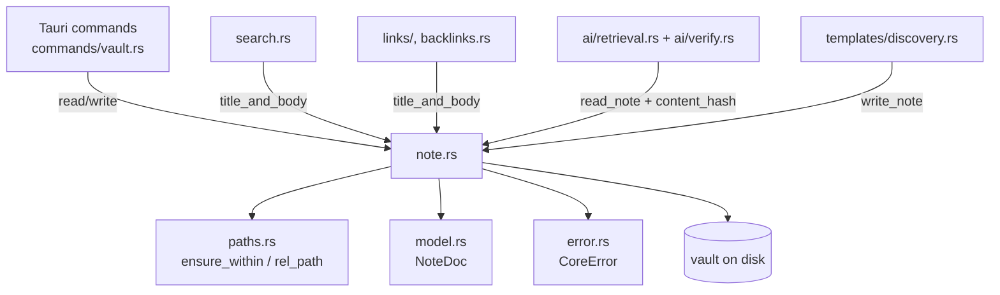
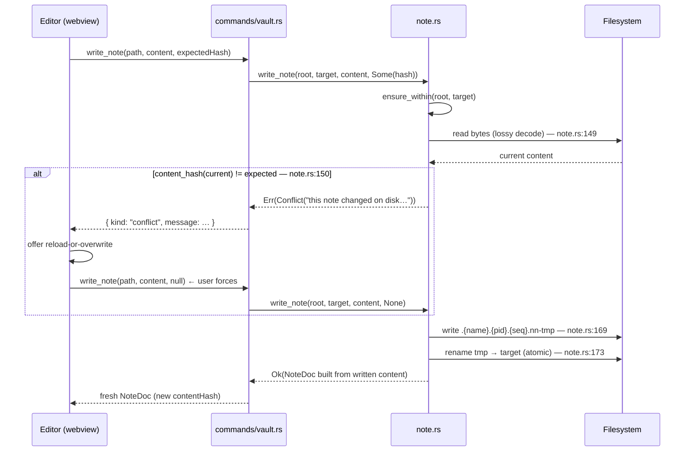

# LLD-002 — Note I/O, Frontmatter & the Error Model

**Status:** as-built · **Sources:** `crates/neuralnote-core/src/note.rs` (321 lines),
`crates/neuralnote-core/src/error.rs` (84 lines), `crates/neuralnote-core/src/model.rs`
(the `NoteDoc` definition, lines 50–90) · **Tests:** `crates/neuralnote-core/src/lib.rs`
`mod tests`

Every claim in this document carries a `file:line` anchor into the code as it exists today.
Where a statement is inference rather than citation, it is marked `inferred:`.

---

## 1. Purpose & scope

This LLD documents the layer that moves note content between disk and the rest of the
system: reading a note into a `NoteDoc` (frontmatter parsed, body split out, raw file
retained), writing it back crash-safely with optimistic-concurrency conflict detection,
fingerprinting content for that detection, and the typed error model every failure crosses
the Tauri boundary in.

In scope:

- `read_note`, `write_note`, `content_hash`, `title_and_body` (`note.rs`)
- Frontmatter extraction and parsing, including the YAML denial-of-service defence
- The `NoteDoc` data model (`model.rs:55-90`)
- `CoreError` / `CoreResult` and the `From` conversions (`error.rs`)

Out of scope (own LLDs / other docs): path safety (`paths.rs` — `read_note`/`write_note`
merely call into it), file/folder CRUD (`entries.rs`), search/graph/backlinks (which
*consume* `title_and_body`), templates, and the AI retrieval layer (which consumes
`content_hash`).

## 2. Position in the architecture

See [`../architecture/system-overview.md`](../architecture/system-overview.md) for the
layered picture. This module sits in the client-agnostic Rust core (`lib.rs:1-5`) and is
the single place note bytes are interpreted. Its consumers:

- **Tauri commands** — `read_note`/`write_note` are exposed nearly verbatim at
  `app/desktop/src-tauri/src/commands/vault.rs:312` and `:322` (thin delegation, per the
  project convention).
- **Search, graph, backlinks** — all import `title_and_body` so every surface agrees on a
  note's title and frontmatter-stripped body (`search.rs:14`, `links/mod.rs:13`,
  `backlinks.rs:13`).
- **AI retrieval & citation verification** — `ai/retrieval.rs:12` imports both
  `content_hash` and `read_note`; the citation verifier re-reads via `read_note`
  (`ai/verify.rs:10`) and compares the hash captured at retrieval time
  (`ai/evidence.rs:14-24`). This is why `content_hash` must be the single source of truth
  for the fingerprint algorithm (`note.rs:18-21`).
- **Template note creation** — `templates/discovery.rs:74` writes rendered templates
  through `write_note` (with `expected_hash: None`).



## 3. Public API surface

Exact signatures as-built. Note the visibility split: two functions are `pub` (crossing
the crate boundary to the Tauri shell), two are `pub(crate)` (shared across core modules
but not exported).

```rust
// note.rs:78
pub fn read_note(root: &Path, target: &Path) -> CoreResult<NoteDoc>

// note.rs:132-137
pub fn write_note(
    root: &Path,
    target: &Path,
    content: &str,
    expected_hash: Option<String>,
) -> CoreResult<NoteDoc>

// note.rs:22
pub(crate) fn content_hash(content: &str) -> String

// note.rs:183
pub(crate) fn title_and_body(raw: &str, stem: &str) -> (String, String)
```

Both `read_note` and `write_note` take the vault `root` plus a `target` path and run the
target through `paths::ensure_within` before touching disk (`note.rs:79`, `note.rs:138`) —
the security spine (`paths.rs:1-3`). Both require the target to already be a file, else
`CoreError::NotFound` (`note.rs:80-82`, `note.rs:139-141`); note *creation* lives in
`entries.rs`, not here.

`write_note` returns the fresh `NoteDoc` built from the content just written, so a caller
never needs (and never risks the failure of) a second read after saving
(`note.rs:125-126`, `note.rs:177`; asserted at `lib.rs:123-124`).

## 4. Data model — `NoteDoc`

Defined at `model.rs:55-90`, derives `Debug, Clone, Serialize, Deserialize, TS` with
`#[serde(rename_all = "camelCase")]` and `#[ts(export)]` (`model.rs:52-54`) — the TS
mirror in `app/desktop/src/lib/bindings/` is generated from this by ts-rs, never
hand-written (per repo `CLAUDE.md`).

| Field | Type | Meaning |
|---|---|---|
| `path` | `String` | Absolute path on disk (`model.rs:56`). |
| `rel_path` | `String` | Vault-relative, `/`-joined (`model.rs:57`; computed by `paths::rel_path`, `paths.rs:78-93`). |
| `title` | `String` | Best-effort title: frontmatter `title` → first H1 → file stem (`model.rs:58-59`; algorithm in §5.6). |
| `frontmatter` | `Option<serde_json::Value>` | Parsed YAML as JSON, `None` if absent/unparseable (`model.rs:60-67`). |
| `frontmatter_raw` | `Option<String>` | The raw block between the fences, if a closed block existed (`model.rs:68-69`). |
| `frontmatter_error` | `Option<String>` | Set when a block existed but did not parse — failures are never silent (`model.rs:70-72`). |
| `body` | `String` | Markdown body with the frontmatter block stripped (`model.rs:73-74`). |
| `raw` | `String` | The entire file, verbatim — "the safety net behind every other field" (`model.rs:75-76`). |
| `content_hash` | `String` | Fingerprint at read; echoed back on save for conflict detection (`model.rs:77-79`). Empty string for binary docs (`note.rs:68`). |
| `binary` | `bool` | Non-UTF-8 non-text attachment; `body`/`raw` are empty and bytes never cross IPC; editing disabled (`model.rs:80-84`). |
| `lossy_text` | `bool` | A *text* note that was not valid UTF-8 and was decoded with replacement chars — shown, flagged, still editable (`model.rs:85-89`). |

### Why `frontmatter` needs `#[ts(type = "Record<string, unknown> | null")]`

`serde_json::Value` has no single TypeScript shape, so ts-rs would emit `any` — which the
project's `strict` TS config and no-`any` rule forbid. Since the parser only ever accepts a
YAML *mapping* as frontmatter (§5.5), the frontend has always modelled it as a string-keyed
record, and the annotation pins exactly that. The `| null` must be written out explicitly
because `#[ts(type)]` overrides the **whole** field type, discarding the `| null` that
`Option` would otherwise contribute (`model.rs:60-66`). This override is the one place the
generated binding is shaped by hand-authored intent rather than pure derivation — a
`frontmatter` that somehow serialised to a non-object would violate the TS type silently,
but `parse_frontmatter_block` structurally prevents that (`note.rs:294`).

## 5. Design & algorithms

### 5.1 The read path — bytes first, never `read_to_string`

`read_note` reads **bytes** (`std::fs::read`, `note.rs:86`) rather than
`read_to_string`, because a vault's attachments folder is full of images and PDFs and a
strict UTF-8 read would fail on them, dead-ending the reader's graceful binary branch
(`note.rs:83-85`). It then attempts `String::from_utf8` (`note.rs:87`) and branches:

- **Valid UTF-8** → `build_doc(root, path, raw, lossy: false)` (`note.rs:88`).
- **Invalid UTF-8** → branch on `is_text_note` (`note.rs:95`):
  - Extension is one of `md | markdown | txt | text | mdx` (case-insensitive,
    `note.rs:107-112`) → the file is text in some other encoding (e.g. Windows-1252 from a
    migrated vault); decode lossily with `String::from_utf8_lossy` and flag
    `lossy_text: true` (`note.rs:96-97`). Content is **shown, never hidden**
    (test: `lib.rs:174-190`).
  - Anything else → `build_binary_doc`: `binary: true`, empty `body`/`raw`/`content_hash`,
    title = file stem (`note.rs:56-74`; test: `lib.rs:163-171`). The bytes are never
    marshalled to the webview (`note.rs:55`).

`build_doc` (`note.rs:31-51`) does the shared assembly: parse frontmatter, derive the
title, compute `content_hash(&raw)`, fill `NoteDoc`. It is reused by the write path so a
save can't be mislabelled a failure by a redundant re-read (`note.rs:28-30`).

### 5.2 The atomic write — temp sibling → `rename`

`write_note` (`note.rs:132-178`) never writes into the target file directly. The sequence:

1. Vault-scope the path; require it exists (`note.rs:138-141`).
2. Optional conflict check (§5.4).
3. Write the full content to a **temp sibling**, then `rename` over the target
   (`note.rs:169-176`). Rename on the same filesystem is atomic, so a crash mid-write can
   never leave a half-written, corrupt note (`note.rs:123-124`) — the reader either sees
   the old file or the new one.

The temp name is `.{file_name}.{pid}.{seq}.nn-tmp` (`note.rs:168`), and every part earns
its place (`note.rs:156-159`):

| Part | Why |
|---|---|
| Leading `.` | Hidden — the tree scan filters dotfiles (`lib.rs:81-86`), so an in-flight temp never flashes into the sidebar. |
| `{file_name}` | Debuggability: a leaked temp identifies its note. Also keeps the temp in the same directory → same filesystem → atomic rename. |
| `{pid}` | Two app processes writing the same note can't collide on the temp path. |
| `{seq}` | Per-process `AtomicU64` counter (`note.rs:12`, `note.rs:167`) — two concurrent writes *in the same process* each get a unique temp (PA-016; proven by the 8-thread test at `lib.rs:242-265`, which also asserts zero leaked `.nn-tmp` files). |
| `.nn-tmp` suffix | Greppable/recognisable; the leak test keys off it (`lib.rs:261`). |

On failure of either the temp write or the rename, the temp is best-effort removed
(`note.rs:170`, `note.rs:174` — the `remove_file` result is deliberately discarded) and
the error propagates via `From<io::Error>`.

### 5.3 `content_hash` — what, and what not

```rust
// note.rs:22-26
let mut h = std::collections::hash_map::DefaultHasher::new();
content.hash(&mut h);
h.finish().to_string()
```

- **What it hashes:** the entire decoded string — `raw` on read (`note.rs:45`), the
  current on-disk content (lossily re-read) on the write-path check (`note.rs:149-150`).
  For a BOM-bearing file the BOM is *included* (the BOM strip in `parse_frontmatter` is
  for fence detection only; `raw` is untouched, `note.rs:201-203`).
- **Why a decimal string:** the u64 digest exceeds JavaScript's safe-integer range;
  serialising as a string survives the JS number-precision boundary (`note.rs:16`).
- **Why it is stable:** `DefaultHasher::new()` uses fixed keys, so the digest is stable
  across runs (`note.rs:15`). inferred: the std docs do not guarantee the algorithm across
  *Rust versions*, but the hash only ever round-trips within a session (read → save), so
  toolchain drift cannot corrupt anything — at worst a stale hash yields a spurious
  `Conflict`.
- **Why it is not cryptographic:** it exists to detect *accidental* concurrent edits
  between a cooperative user and their other tools (Obsidian, sync), not to resist an
  adversary forging collisions. A 64-bit SipHash-1-3 is cheap and sufficient for that
  threat model; the collision consequence is analysed as GAP-002-5.
- **Why `pub(crate)`:** AI retrieval hashes content it already loaded via `search_vault`
  without re-reading the file, so a reused span carries the exact hash the citation
  verifier expects (PA-007; `note.rs:18-21`, `ai/retrieval.rs:167`, `ai/verify.rs:10`).
  One algorithm, one definition.

### 5.4 Optimistic concurrency — `expected_hash` → `Conflict`

When `expected_hash` is `Some`, `write_note` re-reads the file **lossily**
(`read_to_string_lossy`, `note.rs:119-121`) and compares hashes (`note.rs:149-150`). Any
mismatch — including an I/O-level surprise producing different content — is a
`CoreError::Conflict` with a user-facing message, never a silent overwrite
(`note.rs:150-154`; test: `lib.rs:128-141`, which also proves the external content stays
intact). `None` skips the check entirely — the "user chose overwrite" path
(`note.rs:131`, `lib.rs:139-140`).

The lossy re-read is load-bearing: a non-UTF-8 note was lossy-decoded on *read*, so the
conflict check must decode the *same* way or the hashes could never match and **every save
of that note would fail** (`note.rs:114-118`; regression test `lib.rs:193-207` — a lossy
note is savable, not just readable, and the saved doc comes back with
`lossy_text: false` because the new content is clean UTF-8).



There is a microsecond check-then-rename TOCTOU window between the hash compare and the
rename; it is **acknowledged and accepted in the code** (`note.rs:145-147`) — see §10.

### 5.5 Frontmatter extraction and parsing

Extraction (`parse_frontmatter`, `note.rs:199-251`) is a small hand-rolled line scanner —
only the *YAML inside the fences* goes to a real parser:

- **BOM:** a leading U+FEFF is stripped **for detection and extraction only**; `raw` (and
  therefore the content hash and the editor draft) is untouched (`note.rs:200-203`; test:
  `lib.rs:1166-1181`).
- **Opening fence:** the (BOM-stripped) content must begin with exactly `---\n` or
  `---\r\n` (`note.rs:205`). Anything else — including `--- ` with a trailing space —
  means "no frontmatter": the whole file is the body, no error (`note.rs:206-213`).
  Frontmatter must be the very first thing in the file (`note.rs:204`).
- **Closing fence:** the scanner walks lines via `split_inclusive('\n')`, trims only
  `\n`/`\r` from each line's end, and closes on a line exactly equal to `---` **or**
  `...` (YAML document-end marker) (`note.rs:216-228`). CRLF files therefore close
  correctly, but `--- ` with a trailing space does **not** close the block (GAP-002-3).
- **Opened but never closed:** if no closer is found, no frontmatter is extracted, the
  error `` "frontmatter block was opened with `---` but never closed" `` is surfaced in
  `frontmatter_error`, and the **whole file** (fence included) stays as the body — no
  content lost (`note.rs:230-239`; test: `lib.rs:105-112`).
- **On success**, the block lines (CR-trimmed, `\n`-joined — CRLF is normalised in
  `frontmatter_raw`) go to `parse_frontmatter_block`, and the body is everything after the
  closing fence (`note.rs:240-249`).

Parsing (`parse_frontmatter_block`, `note.rs:280-301`) treats the block as
hostile-by-default (notes come from migrated/synced/shared vaults, `note.rs:259-260`):

1. **The 4 KiB cap** (`MAX_FRONTMATTER_BYTES = 4 << 10`, `note.rs:257`): a block over
   4096 bytes is refused as "too large" without ever reaching the YAML parser
   (`note.rs:281-289`). Real frontmatter is a few hundred bytes, so the cap is generous
   (boundary tests: over-cap refused `lib.rs:1131-1146`, just-under parses
   `lib.rs:1149-1163`). The cap is deliberately small because it doubles as the quadratic
   DoS bound (§6).
2. **Mapping-only check:** the block is parsed as `serde_json::Value` via
   `serde_yaml_ng`. `Null` (an empty block) → no frontmatter, no error; an `Object` → the
   frontmatter; a top-level list or scalar → `None` plus the error
   `"frontmatter must be a set of key: value pairs"` (`note.rs:290-298`; test:
   `lib.rs:1184-1197`).
3. **YAML error surfacing:** any parse error becomes
   `frontmatter_error: Some("invalid YAML frontmatter: {e}")` — surfaced, never swallowed,
   body preserved (`note.rs:299`; test: `lib.rs:1200-1212`).

In every failure mode the outcome is the same shape: `frontmatter: None`,
`frontmatter_error: Some(_)`, content intact.

### 5.6 Title precedence

`title_from` (`note.rs:304-321`): frontmatter `title` (must be a YAML **string**; trimmed,
non-empty — a numeric `title: 123` parses to a JSON number and is skipped) → the first
body line that, after trimming, starts with `# ` (H1 text trimmed, non-empty) → the file
stem. `title_and_body` (`note.rs:183-187`) packages the same precedence for search, graph,
tree, and reader, so all surfaces agree on a note's name (`note.rs:180-182`; agreement
test: `lib.rs:1724`). inferred: the H1 scan does not skip fenced code blocks, so a
`# heading` inside a code fence can win the title when no real H1 precedes it
(GAP-002-6).

## 6. The YAML denial-of-service defence

This is the most instructive part of the file, and it is deliberately **two layers of
someone else's code plus one small constant** — not a hand-rolled detector. The full
rationale lives in the doc comment at `note.rs:259-279`.

### Layer 1 — exponential ("billion laughs") bombs: the parser's own repetition limit

An alias bomb (anchors referencing anchors, `fan^levels` expansion) is rejected by
`serde_yaml_ng` itself — its `unsafe-libyaml` backend enforces a repetition limit that
aborts in milliseconds with "repetition limit exceeded", surfaced here as an ordinary
`frontmatter_error` (`note.rs:262-267`). This defence is **exact**: it is the same
tokenizer that would otherwise do the expanding, so unlike any external detector it cannot
be evaded by a grammar edge case (`note.rs:267-268`).

Because the protection lives in a dependency, it is guarded by a **canary test**:
`serde_yaml_dependency_rejects_alias_bombs` (`lib.rs:1057-1083`) feeds real bombs (built by
`alias_bomb`, `lib.rs:1041-1054`) straight into `serde_yaml_ng`, including *the exact byte
sequence that bypassed the old hand-rolled guard* (`lib.rs:1071-1078`), and also asserts a
benign single alias still parses — it is a repetition budget, not an alias ban
(`lib.rs:1079-1082`). **If a dependency bump ever drops the repetition limit, this test
fails and the decision must be revisited** (`lib.rs:1062-1063`). An integration test
proves the bomb-in-a-note path end-to-end: error surfaced, body preserved
(`lib.rs:1086-1098`).

### Layer 2 — quadratic flat fan-out: bounded only by the 4 KiB cap

One large anchor referenced N times expands quadratically, and the repetition limit does
**not** catch that (`note.rs:270-271`; the DoD §2 says the same: "serde_yaml_ng's
repetition limit stops *exponential* alias bombs but not *quadratic* flat fan-out —
verify, don't assume", `docs/definition-of-done.md:86-87`). The defence is the size cap:
at 4 KiB the worst case is a sub-second, recoverable hitch instead of an OOM or
multi-second hang, which suits v1's own-vault threat model (`note.rs:271-273`).

The deferred hardening is recorded at the code site, verbatim (`note.rs:274-279`):

> `TODO(quadratic-yaml-dos): when vaults become shareable/synced (untrusted
> notes), replace this size bound with a real-lexer anchor ban — scan
> unsafe-libyaml's (in-tree) or saphyr-parser's token stream and refuse any
> anchor/alias outright (legit frontmatter never uses them); a hand-rolled
> byte-scan is NOT acceptable (it was bypassed twice — quote-mid-scalar and
> hyphenated anchor names).`

### Why there is no hand-rolled anchor guard — a load-bearing decision

A hand-rolled anchor/alias detector **used to exist**. It passed its full unit suite and a
green SonarQube gate — and was then bypassed **twice** by adversarial review, each time via
a YAML grammar edge case the byte-scanner misread: a quote mid-plain-scalar (`it's` hid
every subsequent anchor from the scanner) and hyphenated anchor names
(`lib.rs:1058-1063`, `lib.rs:1071-1073`; the episode is cited as the founding rationale of
the DoD's security-adjacent bar at `docs/definition-of-done.md:79-85`). It was deleted in
favour of relying on the parser, on the principle the DoD now codifies: *"re-implementing
a parser's grammar by hand is a bypass farm — prefer the platform/library's own
protection"* (`docs/definition-of-done.md:83-85`).

**Do not re-add a byte-level anchor guard.** The record of the bypasses lives in three
places precisely so this decision survives personnel and context loss: the TODO at
`note.rs:274-279`, the canary test at `lib.rs:1056-1083`, and the DoD §2. The false-positive
risk was real too: legitimate Obsidian frontmatter is full of `&` and `*` in quoted
strings, comments, globs, and block scalars — all proven to parse cleanly at
`lib.rs:1101-1128`, protecting the free Obsidian-migration path.

## 7. The error model

`CoreError` (`error.rs:13-34`) is hand-rolled — no `thiserror` — to keep the dependency
surface minimal (`error.rs:5`). Nine variants, each carrying one `String`:

| Variant | Meaning (doc comment) |
|---|---|
| `NotFound` | Target path does not exist (`error.rs:15`). |
| `AlreadyExists` | Create/rename/move would clobber an existing entry (`error.rs:17`). |
| `OutsideVault` | Path escapes the vault root — the security spine (`error.rs:19`). |
| `InvalidName` | Empty, reserved, or separator-bearing name (`error.rs:21`). |
| `Conflict` | File changed on disk since read; UI offers reload-or-overwrite (`error.rs:24`). |
| `Io` | Underlying filesystem error (`error.rs:26`). |
| `Frontmatter` | Frontmatter parse failure — **vestigial, see below** (`error.rs:28`). |
| `Llm` | LLM transport/protocol failure from the chat loop (`error.rs:31`). |
| `LocalAi` | Local-AI failure, rendered distinctly from hosted-provider failures (`error.rs:33`). |

### Wire shape

`#[serde(tag = "kind", content = "message", rename_all = "camelCase")]` plus
`#[ts(export)]` (`error.rs:10-12`): every failure crosses the Tauri boundary as a tagged
JSON object `{ "kind": "conflict", "message": "…" }`, so the UI reacts to the *kind*
rather than parsing prose (`error.rs:1-3`). The camelCase renaming applies to the tag
values (`localAi`, asserted at `error.rs:76-83`).

### Conversions

- `From<std::io::Error>` (`error.rs:54-62`): `ErrorKind::NotFound` → `NotFound`,
  `ErrorKind::AlreadyExists` → `AlreadyExists`, everything else → `Io`. This is what makes
  the bare `?` on `std::fs::read` at `note.rs:86` yield typed errors. Tested at
  `lib.rs:1028-1033`.
- `From<trash::Error>` (`error.rs:64-68`): always `Io("could not move to trash: …")` —
  surfaced, never swallowed (tested at `lib.rs:1034-1038`).

`Display` covers all nine variants (`error.rs:36-50`), `impl std::error::Error` at
`error.rs:52`, and `pub type CoreResult<T> = Result<T, CoreError>` at `error.rs:70`.

### `CoreError::Frontmatter` is vestigial

The variant is defined (`error.rs:28`), has a `Display` arm (`error.rs:45`), and is
exercised by the Display-coverage test (`lib.rs:1022`) — but it is **never constructed
anywhere in production code**. A workspace grep finds exactly three occurrences: the
definition, the Display arm, and one *destructuring* arm in the shell's exhaustive
message-extractor (`app/desktop/src-tauri/src/ai.rs:126-135`), which pattern-matches every
variant and so proves nothing about construction. Frontmatter failures deliberately do
**not** travel as errors: `read_note` succeeds and the failure rides in
`NoteDoc.frontmatter_error: Option<String>` (`model.rs:70-72`, §5.5), because a note with
broken frontmatter must still open and show its body. The variant is dead weight kept
alive by the exhaustive match; see GAP-002-2.

## 8. Invariants & guarantees

1. **Content is never lost or hidden.** The DoD names this a project invariant
   (`docs/definition-of-done.md:55-57`); the code delivers it in four ways:
   - Malformed/unterminated frontmatter → error surfaced, body (or whole file) intact
     (`note.rs:196-198`, `note.rs:230-239`; tests `lib.rs:105-112`, `lib.rs:1200-1212`,
     `lib.rs:1086-1098`).
   - A non-UTF-8 `.md`/`.txt` is shown lossily with `lossy_text: true`, never hidden as
     binary (`note.rs:90-97`; test `lib.rs:174-190`).
   - A lossy note remains **savable**: the write-path conflict check re-reads with the
     same lossy decode, so the hash compares equal (`note.rs:114-121`, `note.rs:148-149`;
     regression test `lib.rs:193-207`).
   - `NoteDoc.raw` always carries the entire file verbatim for text notes
     (`model.rs:75-76`).
2. **No half-written note is ever observable.** Writes go temp-sibling → atomic rename
   (`note.rs:169-176`); temp names are unique per write (`note.rs:12`, `note.rs:167-168`)
   and never leak, even under 8-way concurrency (`lib.rs:242-265`).
3. **A conflicting save never clobbers an external edit** unless the user forces it with
   `expected_hash: None` (`note.rs:142-155`; test `lib.rs:128-141`) — modulo the accepted
   TOCTOU window (§10) and hash collisions (GAP-002-5).
4. **Every path is vault-scoped before any disk access** (`note.rs:79`, `note.rs:138`;
   `paths.rs:16-43`; tests `lib.rs:55-69`).
5. **Failures are never silent.** Frontmatter failures → `frontmatter_error`
   (`model.rs:70-72`); lossy decode → `lossy_text` (`model.rs:85-89`); binary → `binary`
   flag with a distinct UI notice (`note.rs:53-55`); I/O errors → typed `CoreError`
   (`error.rs:54-62`).
6. **One fingerprint algorithm.** `content_hash` is the single source of truth shared by
   read, write-conflict-check, retrieval, and citation verification (`note.rs:18-21`;
   `ai/retrieval.rs:537` asserts retrieval's hash equals `note::content_hash`).
7. **Every surface agrees on a note's title** — search, graph, tree, backlinks, and reader
   all derive it through the same precedence (`note.rs:180-182`; `lib.rs:1724`).
8. **Binary bytes never cross the IPC boundary** as a lossy string (`note.rs:55`,
   `model.rs:82-83`).

## 9. Error handling & failure modes

| Failure | Behaviour |
|---|---|
| Target outside vault | `OutsideVault` before any I/O (`note.rs:79`, `note.rs:138`; `paths.rs:38-42`). |
| Target missing / not a file | `NotFound` (`note.rs:80-82`, `note.rs:139-141`). |
| Read I/O error | `?` on `std::fs::read` → `From<io::Error>` mapping (`note.rs:86`, `error.rs:54-62`). |
| Non-UTF-8 bytes | Never an error: lossy text-note or binary attachment (§5.1). |
| Frontmatter malformed / unterminated / oversized / non-mapping | `read_note` still **succeeds**; `frontmatter_error` set, content intact (§5.5). |
| Conflict-check read fails | The I/O error surfaces — never a silent skip of the check (`note.rs:143-144`, `note.rs:149`). |
| Hash mismatch | `Conflict` with a user-facing message; disk untouched (`note.rs:150-154`). |
| Temp write fails | Best-effort temp removal, error propagates; target untouched (`note.rs:169-172`). |
| Rename fails | Best-effort temp removal, error propagates; target still holds old content (`note.rs:173-176`). |
| Target has no parent | `OutsideVault` (`note.rs:164-166`) — inferred: unreachable in practice after `ensure_within`, since a vault-scoped file always has a parent; it exists to avoid an `unwrap`. |
| Trash failures (elsewhere in core) | Mapped to `Io`, message-prefixed (`error.rs:64-68`). |

## 10. Concurrency & durability

- **Same-process concurrent writers:** the `AtomicU64` `TMP_SEQ`
  (`note.rs:12`, fetched with `Ordering::Relaxed` at `note.rs:167` — only uniqueness
  matters, not ordering) gives each write a unique temp path. This was PA-016; the
  8-thread test (`lib.rs:242-265`) proves no temp collision, no leaked `.nn-tmp`, and a
  final file that is one writer's complete content.
- **Cross-process writers:** the `{pid}` component covers two app instances; last rename
  wins, each rename atomic.
- **The accepted TOCTOU:** between the conflict-check read (`note.rs:149`) and the rename
  (`note.rs:173`) there is a microsecond window in which an external edit can land and be
  overwritten. This is acknowledged in the code: the threat model is a single cooperative
  user, not racing writers, and the worst case is losing an edit that landed inside that
  window — **not corruption** (`note.rs:145-147`).
- **The absence of `fsync`:** there is no `sync_all`/`fsync` anywhere in `note.rs` — the
  temp is written with `std::fs::write` (`note.rs:169`) and renamed (`note.rs:173`) with
  neither the file's data nor the parent directory synced. Writes are therefore
  **crash-consistent** (a process crash leaves old-or-new, never half) but **not
  power-loss durable**: on kernel panic or power cut, the rename can be journalled before
  the data blocks, leaving a zero-length or stale target on some
  filesystem/mount-option combinations. **Nothing in the code flags this** — unlike the
  TOCTOU, which carries an explicit accepted-risk comment, the fsync omission is
  undocumented at the code site. See GAP-002-1.

## 11. Performance characteristics

- `read_note` is one `fs::read` plus O(n) UTF-8 validation; the lossy branch allocates a
  second copy (`note.rs:96`). No caching — every read hits disk (inferred: fine for a
  single open note; the bulk consumers — search/graph — do their own file walking and use
  `title_and_body` on already-read content instead).
- `write_note` with a conflict check reads the whole file once more (`note.rs:149`) — a
  save is read + write + rename.
- Frontmatter extraction is a single forward pass over the head of the file
  (`note.rs:216-228`); the body split is an O(n) copy. `Parsed.body` and `raw` mean a
  `NoteDoc` holds roughly 2× the file in memory (plus `frontmatter_raw`), by design — raw
  is the safety net (`model.rs:75-76`).
- YAML parsing is capped at 4 KiB of input (`note.rs:257`), which bounds the quadratic
  worst case to a sub-second hitch (`note.rs:271-273`).
- `content_hash` is a single SipHash pass — O(n), no allocation beyond the output string.

## 12. Testing

The invariants are encoded in `lib.rs`'s `mod tests` (plus `error.rs:72-84`). Coverage of
this module is strong on exactly the paths that matter:

- **Read/parse:** golden path (`lib.rs:89-102`), unterminated fence (`lib.rs:105-112`),
  BOM (`lib.rs:1166-1181`), non-mapping (`lib.rs:1184-1197`), malformed YAML
  (`lib.rs:1200-1212`), size-cap boundary both sides (`lib.rs:1131-1163`).
- **Encoding:** binary attachment (`lib.rs:163-171`), lossy `.md` shown not hidden
  (`lib.rs:174-190`), lossy note savable (`lib.rs:193-207`), plain UTF-8 (`lib.rs:210-217`).
- **Write:** atomic roundtrip + returned doc (`lib.rs:115-125`), conflict detection +
  force-overwrite (`lib.rs:128-141`), 8-thread no-leak (`lib.rs:242-265`).
- **DoS:** dependency canary incl. the historical bypass bytes (`lib.rs:1057-1083`),
  end-to-end bomb-in-note (`lib.rs:1086-1098`), false-positive corpus of legit `&`/`*`
  frontmatter (`lib.rs:1101-1128`).
- **Errors:** all-variant Display + `From` mappings (`lib.rs:1014-1039`), serde tag shape
  (`error.rs:76-83`).

**Gaps in coverage** (verified by absence — no test in `lib.rs` exercises these):

- No test for the `...` closing fence (`note.rs:223` accepts it; untested).
- No test for CRLF frontmatter (`note.rs:205` accepts `---\r\n`; the CR-trim at
  `note.rs:222` is untested).
- No test for the trailing-whitespace fence behaviour, either direction (GAP-002-3/-4) —
  the strictness is currently an *unasserted* behaviour, so a well-meaning "fix" or a
  regression would pass the suite silently.
- No test for a non-string frontmatter `title` falling through the precedence
  (`note.rs:305`).
- No test pinning the H1-inside-code-fence title behaviour (GAP-002-6).
- Power-loss durability is untestable in-suite; the point is that no code exists to test
  (GAP-002-1).

## 13. Known gaps & edge cases

| ID | Description | Evidence | Impact | Suggested fix |
|---|---|---|---|---|
| GAP-002-1 | **No `fsync` before or after the rename.** Writes are crash-consistent but not power-loss durable; on power cut the target can end up empty/stale on some filesystems. Unlike the TOCTOU (`note.rs:145-147`), this trade-off is nowhere acknowledged in code. | `note.rs:169-176` (no `sync_all` anywhere in the file) | Low probability, high severity: silent loss of a just-saved note after power failure — collides with the "cannot silently lose data" DoD bar (`docs/definition-of-done.md:8-9`). | Open the temp via `File`, `sync_all()` before rename (and optionally fsync the parent dir); or add an explicit accepted-risk comment mirroring the TOCTOU one if the cost is deemed unjustified for v1. |
| GAP-002-2 | **`CoreError::Frontmatter` is vestigial** — defined, Displayed, tested, never constructed; frontmatter failures ride in `NoteDoc.frontmatter_error` instead. | `error.rs:28`; only other refs `error.rs:45`, `lib.rs:1022`, destructure at `app/desktop/src-tauri/src/ai.rs:132` | Dead weight in the enum and the generated TS union; misleads readers into thinking frontmatter failures are throwable. | Remove the variant (regenerate bindings) or document it as reserved at the definition site. |
| GAP-002-3 | **Closing fence is whitespace-strict:** the line must equal exactly `---` or `...` after `\n`/`\r` trimming, so `--- ` (trailing space) is not a closer and the note reads as "opened but never closed" — error surfaced, frontmatter unparsed. inferred: Obsidian tolerates this, making it an Obsidian-compat edge for migrated vaults. | `note.rs:222-223` | A migrated note that renders fine in Obsidian shows a frontmatter error in NeuralNote (content still intact). | Trim trailing spaces/tabs too (`trim_end()`), matching common frontmatter dialects; add tests either way. |
| GAP-002-4 | **Opening fence is likewise whitespace-strict** (`---\n` / `---\r\n` only); `--- \n` silently means "no frontmatter" — the block renders as body text with **no error surfaced** (unlike GAP-002-3). | `note.rs:205` | Frontmatter silently ignored on such notes; asymmetric with the closing-fence case, which at least errors. | Same trim fix; at minimum add a test pinning the current behaviour. |
| GAP-002-5 | **A `content_hash` collision silently defeats conflict detection:** if an external edit happens to hash (64-bit SipHash) to the same digest as the opened content, the save proceeds as if nothing changed and the external edit is overwritten. | `note.rs:22-26`, `note.rs:150` | Probability ≈ 2⁻⁶⁴ per accidental pair — negligible for the cooperative-user threat model, but the failure is silent data loss when it hits, and the hash is not adversary-resistant. | Accept (document at the definition) for v1; move to a 128/256-bit hash (e.g. blake3) if vaults ever become shared/synced. |
| GAP-002-6 | **Title H1 scan does not skip code fences:** the first trimmed line starting `# ` wins, even inside a fenced code block (and indented `# `, which CommonMark would not render as a heading). | `note.rs:311-318` | Wrong display title across all surfaces for notes whose first `#`-line is code — cosmetic, but propagates to search/graph/backlinks via `title_and_body`. | Reuse the fence-masking logic the link graph already has (cf. `lib.rs:1611`) or accept and pin with a test. |
| GAP-002-7 | **Quadratic YAML fan-out is bounded only by the 4 KiB cap** — a deliberate, recorded deferral until vaults hold untrusted notes. | `note.rs:270-279` (`TODO(quadratic-yaml-dos)`) | Sub-second hitch worst case today; becomes a real DoS surface only with shared/synced vaults. | Execute the TODO when the trigger fires: token-stream anchor ban via the real lexer — never a byte-scan (bypassed twice; §6). |

## 14. Suggested improvements

Beyond the gap-table fixes:

1. **Extract the atomic-write helper.** The temp-name scheme
   `.{file_name}.{pid}.{seq}.nn-tmp` is duplicated, sequence counter and all, in
   `ai/provider_config.rs:125`. One `write_atomic(path, bytes)` in a shared module would
   keep the (eventual) fsync fix in one place.
2. **Pin the untested accepted grammar** — `...` closers, CRLF fences — with tests before
   anyone refactors the scanner; today those behaviours are load-bearing but unasserted
   (§12).
3. **Document the durability posture** at the write site regardless of whether fsync is
   added: the codebase's own standard is that accepted risks carry an in-code rationale
   (the TOCTOU comment at `note.rs:145-147` is the model).
4. **Consider surfacing "frontmatter ignored" for GAP-002-4** — a `--- ` opening line is
   almost certainly intended frontmatter, and silence is out of character for this module.

## 15. References

- Source: `crates/neuralnote-core/src/note.rs`, `crates/neuralnote-core/src/error.rs`,
  `crates/neuralnote-core/src/model.rs:50-90`, `crates/neuralnote-core/src/paths.rs`
- Tests: `crates/neuralnote-core/src/lib.rs:28-1212` (note/frontmatter/error subset),
  `crates/neuralnote-core/src/error.rs:72-84`
- Consumers: `app/desktop/src-tauri/src/commands/vault.rs:312,322`;
  `crates/neuralnote-core/src/{search.rs:14, links/mod.rs:13, backlinks.rs:13,
  ai/retrieval.rs:12, ai/verify.rs:10, templates/discovery.rs:74}`;
  `app/desktop/src-tauri/src/ai.rs:124-136`
- Architecture: [`../architecture/system-overview.md`](../architecture/system-overview.md);
  docs map [`../architecture/README.md`](../architecture/README.md)
- Shipping bar & the alias-bomb episode: [`../definition-of-done.md`](../definition-of-done.md)
  (§2, lines 79-87)
- Generated TS bindings: `app/desktop/src/lib/bindings/` (ts-rs, emitted during
  `cargo test`; never hand-edited)
