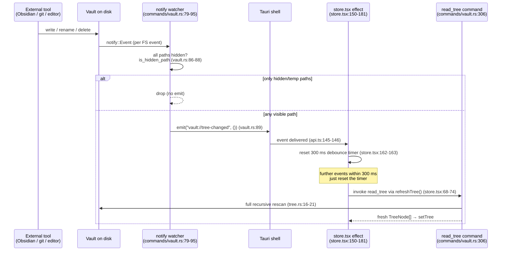

# LLD-003 — Vault Tree Scanning & External-Change Detection

> As-built low-level design, verified against the code on 2026-07-10 (branch
> `feature/conversational-chat` base). Every factual claim carries a `file:line` anchor;
> where something is inferred rather than cited, it says "inferred:".

## 1. Purpose & scope

This document covers how NeuralNote turns the vault folder on disk into the `TreeNode[]`
the UI renders, and how external edits (Obsidian, git, a text editor) reach the frontend
while the app is running. Concretely:

- The recursive scan in `crates/neuralnote-core/src/tree.rs` (`read_tree`, `node_for`,
  `is_markdown_ext`, `markdown_files`).
- The `notify` filesystem watcher owned by the vault session in
  `app/desktop/src-tauri/src/commands/vault.rs:77-116`.
- The `vault://tree-changed` event contract in
  `app/desktop/src-tauri/src/event_names.rs:14`.
- The frontend's debounced consumption of that event in
  `app/desktop/src/lib/store.tsx:150-181`.

Out of scope: entry CRUD (`entries.rs`), note read/write and the atomic-write protocol
(`note.rs` — only its `.nn-tmp` temp-file naming matters here), search/links/backlinks
internals (they are covered only as *consumers* of the scan).

## 2. Position in the architecture

See [`../architecture/system-overview.md`](../architecture/system-overview.md) for the
full layered picture. This slice sits across all three layers:

- **Core** (`neuralnote-core`): `tree.rs` is pure, client-agnostic filesystem scanning —
  no Tauri dependency. It is the *sole* enumeration path for the vault: `search`
  (`crates/neuralnote-core/src/search.rs:76,85`), the link graph
  (`crates/neuralnote-core/src/links/mod.rs:87-88`), backlinks
  (`crates/neuralnote-core/src/backlinks.rs:26-27`), and AI chat retrieval
  (`crates/neuralnote-core/src/ai/retrieval.rs:193,199,236`) all start from
  `read_tree` + `markdown_files`, so they inherit the scan's skip rules by construction
  (`crates/neuralnote-core/src/tree.rs:119-122`).
- **Shell** (`app/desktop/src-tauri`): the async `read_tree` Tauri command
  (`app/desktop/src-tauri/src/commands/vault.rs:305-308`) delegates to the core; the
  `notify` watcher lives on the `VaultSession` and is dropped (stopping the watch) when
  the vault closes (`app/desktop/src-tauri/src/lib.rs:28-31`).
- **Frontend** (`app/desktop/src`): `store.tsx` owns the `tree` state and the
  debounced `vault://tree-changed` subscription; `api.ts` is the listen seam
  (`app/desktop/src/lib/api.ts:145-146`).

The event name is Rust-owned and mirrored into `src/lib/bindings/events.ts` by a
`#[cfg(test)]` generator that runs under `cargo test`
(`app/desktop/src-tauri/src/event_names.rs:19-47`), so a renamed constant fails the
bindings drift check rather than silently breaking the bridge
(`app/desktop/src-tauri/src/event_names.rs:1-10`).

## 3. Public API surface

All in `crates/neuralnote-core/src/tree.rs` unless noted.

| Symbol | Signature (shape) | Purpose | Anchor |
|---|---|---|---|
| `read_tree` | `fn read_tree(root: &Path) -> CoreResult<Vec<TreeNode>>` | Canonicalize the root, then recursively scan it into a sorted tree. | `tree.rs:16-21` |
| `node_for` | `fn node_for(root: &Path, path: &Path) -> CoreResult<TreeNode>` | Build one node (folders include scanned children) — used by entry operations to return the node they just produced. | `tree.rs:83-108` |
| `is_markdown_ext` | `fn is_markdown_ext(ext: Option<&str>) -> bool` | `md` \| `markdown` \| `mdx`. | `tree.rs:115-117` |
| `markdown_files` | `fn markdown_files(nodes: &[TreeNode]) -> Vec<&TreeNode>` | Flatten every markdown file out of a scanned tree in deterministic tree-walk order. | `tree.rs:123-127` |
| `read_tree` (command) | `#[tauri::command] async fn read_tree(state) -> Result<Vec<TreeNode>, CoreError>` | IPC verb: resolves the session root and delegates to the core. `async` so the walk runs on Tauri's worker pool, not the UI thread. | `commands/vault.rs:300-308` |

`node_for` documents a precondition rather than enforcing it: "`root` must be the
canonical vault root; `path` an absolute path within it" (`tree.rs:82`). Callers
(`entries.rs`) satisfy it via `ensure_within`.

## 4. Data model

Defined in `crates/neuralnote-core/src/model.rs`, exported to TypeScript via ts-rs
(`#[ts(export)]`, camelCase serde).

```
EntryKind = Folder | File            // serialized lowercase   (model.rs:26-29)

TreeNode {                           //                        (model.rs:35-48)
  kind:      EntryKind,              // model.rs:36
  name:      String,                 // final path component            (model.rs:38)
  path:      String,                 // absolute OS-native path on disk (model.rs:40)
  rel_path:  String,                 // vault-root-relative, `/`-joined — the stable
                                     // id the UI keys on               (model.rs:42)
  ext:       Option<String>,         // lowercased, no dot; files only  (model.rs:44)
  children:  Option<Vec<TreeNode>>,  // folders only; sorted            (model.rs:47)
}
```

Everything here is **transient**: the tree is rebuilt from disk on every `read_tree`
call and held only in React state (`app/desktop/src/lib/store.tsx:53`). Nothing about
the tree is persisted — the filesystem *is* the source of truth.

`ext` on the Rust side is derived with `to_string_lossy().to_lowercase()`
(`tree.rs:54`); the frontend independently re-derives extensions from path strings in
`extFromPath` (`app/desktop/src/workspace/fileMeta.ts:52-58`) for paths that arrive
outside a `TreeNode` (see GAP-003-3).

## 5. Design & algorithms

### 5.1 The recursive scan

`read_tree` first canonicalizes the root, mapping failure to a
`CoreError::Io("vault root unreadable: …")` (`tree.rs:17-19`), then calls
`scan_dir(&canon, &canon, 0)` (`tree.rs:20`). `scan_dir` (`tree.rs:23-73`) does one
`std::fs::read_dir` pass per directory:

1. **Symlink skip** — `file_type.is_symlink()` entries are skipped entirely, folders
   and files alike. Rationale in-code: "prevents escapes and cycles" (`tree.rs:29-31`).
   Symlinks are never followed, so a link out of the vault cannot leak content in, and
   a link cycle cannot recurse.
2. **Hidden-entry skip** — any name starting with `.` is dropped
   (`tree.rs:34-36`, `is_hidden` at `tree.rs:76-78`). This covers `.obsidian`, `.git`,
   NeuralNote's own `.neuralnote` sidecar (`tree.rs:75`), and the atomic-write temp
   siblings, which are deliberately dot-prefixed:
   `.<name>.<pid>.<seq>.nn-tmp` (`crates/neuralnote-core/src/note.rs:168`; the same
   pattern in `crates/neuralnote-core/src/ai/provider_config.rs:125`). One predicate —
   the leading dot — hides all of them.
3. **Recursion with a depth cap** — directories recurse with `depth + 1` while
   `depth + 1 < MAX_DEPTH`; at the cap the folder is emitted with `children:
   Some(Vec::new())` (`tree.rs:40-44`). `MAX_DEPTH = 48` (`tree.rs:10`), documented
   as a guard against pathological nesting and stack overflow: "folders beyond this
   depth show as empty" (`tree.rs:8-10`). There is **no flag, count, or error** when
   this fires — see GAP-003-1.
4. **Non-file, non-dir entries** (sockets, FIFOs, …) fall through both branches and
   are silently omitted (`tree.rs:39-63` — the `if/else if` has no `else`).
5. **Sort** — after the pass, each directory's children are sorted folders-first, then
   within each kind case-insensitively by `name.to_lowercase()` (`tree.rs:66-70`).
   This ordering is part of the contract: `markdown_files` documents that consumers
   inherit it as a deterministic walk order (`tree.rs:119-121`).

Any I/O error mid-scan (`read_dir`, `entry`, `file_type` — `tree.rs:26-28`) propagates
via `?` and fails the whole scan; there is no per-entry skip-and-continue at the tree
level (contrast with per-file skipping in search, §8).

### 5.2 `markdown_files`

A straight recursive flatten (`tree.rs:129-140`): nodes with `children: Some(_)` recurse;
leaf nodes are kept iff `is_markdown_ext(node.ext)`. Note the discriminator is the
*presence of `children`*, not `kind` — safe because the scan only ever sets `children`
on folders (`tree.rs:51,61`).

### 5.3 The watcher

`start_watcher` (`commands/vault.rs:77-101`) creates a `notify::recommended_watcher`
(FSEvents on macOS — inferred: `RecommendedWatcher` resolves per-platform) watching the
vault root in `RecursiveMode::Recursive` (`commands/vault.rs:97-99`). The callback:

- Drops any event whose paths are **all** hidden (`event.paths.iter().all(is_hidden_path)`,
  `commands/vault.rs:86-88`) — a save's temp-file create/remove churn and dotfile edits
  aren't shown in the tree, so they shouldn't each drive a full rescan (PA-009, per the
  in-code comment `commands/vault.rs:81-85`). The save's final rename to the real file
  carries a visible path, so real saves still emit.
- `is_hidden_path` checks only the **final** path component
  (`commands/vault.rs:71-74`) — see GAP-003-6 for the consequence.
- Otherwise emits `TREE_CHANGED` with a unit payload, discarding the emit result
  (`commands/vault.rs:89`).
- Watcher **runtime** errors are logged at `warn`, never dropped silently
  (`commands/vault.rs:92-94`).

The watcher handle lives on the session as `VaultSession._watcher:
Option<RecommendedWatcher>` (`app/desktop/src-tauri/src/lib.rs:28-31`) — held only to
keep the watch alive; dropping the session on `close_vault`
(`commands/vault.rs:248-257`) drops the watcher and stops the watch.

### 5.4 The frontend debounce

While `status === "open"`, `store.tsx` subscribes via `api.onTreeChanged`
(`store.tsx:150-156`; the listen seam is `api.ts:145-146`). Each event resets a
`setTimeout`; only after **300 ms** of quiet does `refreshTree()` run
(`store.tsx:162-163`), which re-invokes the `read_tree` command and replaces the `tree`
state (`store.tsx:68-74`). The in-code rationale: coalesce bursts "like a git pull or
Obsidian sync" (`store.tsx:146-149`). Teardown clears the pending timer and unlistens,
including the race where the effect is torn down before `listen()` resolves
(`store.tsx:165-180`). A *failed* subscription is surfaced through the store's error
channel, not swallowed (`store.tsx:171-175`).

## 6. The external-change pipeline



Failure legs: a dead watcher means this pipeline simply never fires (the vault stays
usable, §8); a failed `read_tree` inside `refreshTree` lands in the store's error
channel (`store.tsx:70-73`).

## 7. Invariants & guarantees

| # | Invariant | Anchor |
|---|---|---|
| I-1 | The tree never contains a dot-prefixed entry; `.neuralnote`, `.obsidian`, `.git`, and `.nn-tmp` temp files are invisible to the UI. | `tree.rs:34-36,76-78` |
| I-2 | Symlinks are never followed or listed — no escape outside the root, no recursion cycle. | `tree.rs:29-31` |
| I-3 | Sibling order is deterministic: folders first, then case-insensitive by name; every consumer of `markdown_files` inherits it. | `tree.rs:66-70,119-122` |
| I-4 | Recursion depth is bounded by `MAX_DEPTH = 48` — the scan cannot stack-overflow on pathological nesting. (The cost: silent truncation, GAP-003-1.) | `tree.rs:10,40-44` |
| I-5 | `search`, `links`, `backlinks`, and AI retrieval enumerate the vault only through `read_tree` + `markdown_files`, so I-1/I-2/I-4 hold for them by construction. | `search.rs:76,85`; `links/mod.rs:87-88`; `backlinks.rs:26-27`; `ai/retrieval.rs:193,199` |
| I-6 | Watcher failure never blocks opening a vault (PA-008); `_watcher` is `Option`, and both open paths call the non-fatal `try_start_watcher`. | `commands/vault.rs:103-116,186,229`; `lib.rs:23-31` |
| I-7 | Watcher errors — init and runtime — are always logged, never silent. | `commands/vault.rs:92-94,112` |
| I-8 | The event name is a single Rust-owned constant, mirrored into TS by a deterministic generator; drift fails the bindings check, not the user. | `event_names.rs:14,19-47` |
| I-9 | `read_tree`/`search_vault`/`read_link_graph` run on Tauri's async worker pool — a large-vault walk never freezes the window; the state mutex guard never crosses an await point. | `commands/vault.rs:300-308,325-327` |
| I-10 | The frontend subscription is leak-free across vault reopens: pending timers are cleared and the pre-resolution teardown race is handled. | `store.tsx:165-180` |

## 8. Error handling & failure modes

- **Watcher init failure is non-fatal (PA-008).** `try_start_watcher` returns
  `Option<RecommendedWatcher>`; on failure it logs
  `"vault watcher unavailable; opening without live external refresh"` and returns
  `None`, and the vault opens anyway (`commands/vault.rs:103-116`, called at
  `commands/vault.rs:186,229`). The in-code rationale names the realistic triggers —
  inotify `max_user_watches` exhaustion on a large vault, an unwatchable filesystem —
  and why degradation is acceptable: only *live external-edit* refresh is lost, because
  every in-app mutation (create/rename/move/delete/save) refreshes the tree itself
  (`commands/vault.rs:103-107`; frontend side confirmed at `store.tsx:146-149`). The
  failure is **not surfaced in the UI**, only in logs — the user isn't told live refresh
  is off (noted under §12).
- **Watcher runtime errors** are logged at `warn` and never dropped
  (`commands/vault.rs:92-94`). There is no retry or re-arm; a watch that dies stays
  dead until the vault is reopened (inferred: nothing recreates the watcher between
  `open_vault` calls).
- **Scan errors are fatal to that scan.** Any `read_dir`/`file_type` I/O error aborts
  `read_tree` with a `CoreError` (`tree.rs:26-28`); the command propagates it and
  `refreshTree` routes it to the store's error channel (`store.tsx:70-73`). Contrast
  the *per-file* readers layered on top: search/links/backlinks skip an unreadable
  file loudly — logged **and** counted in `skipped_files`
  (`search.rs:83-92`; `model.rs:153-155,191,225-227`) — the honesty pattern the depth
  cap lacks (GAP-003-1).
- **Failed frontend subscription** (`listen()` rejects) surfaces through the shared
  error channel rather than silently losing live refresh (`store.tsx:171-175`).
- **Emit failure** is discarded (`let _ = handle.emit(…)`, `commands/vault.rs:89`) —
  inferred: acceptable because an emit can only fail if the webview is gone, at which
  point there is no one to refresh.

## 9. Performance characteristics

- **Full rescan per call, no caching.** Every `read_tree` — initial open
  (`store.tsx:83`), every in-app mutation's refresh, and every debounced external
  change — walks the entire vault: one `read_dir` per directory, one `file_type` stat
  per entry, plus an O(n log n) sort per directory with a fresh `to_lowercase()`
  allocation per comparison (`tree.rs:66-70`). There is no incremental update, mtime
  short-circuit, or diffing; the frontend replaces the whole `tree` state
  (`store.tsx:71`).
- On a large vault (tens of thousands of files) this is a burst of syscalls and
  allocations per refresh. It stays off the UI thread (I-9), so the window doesn't
  freeze, but the tree is only as fresh as the last completed walk. Inferred: fine at
  v1's target vault sizes; the first real cost will show up on network filesystems or
  very large vaults, and the fix (an incremental tree fed by the watcher's own event
  paths) is a known classic.
- **Debounce math:** a bulk operation emitting events over > 300 ms quiet-gaps triggers
  multiple full rescans; a tight burst costs exactly one. The trailing-edge-only timer
  (`store.tsx:162-163`) means a *continuous* stream of events (e.g. a long sync) defers
  refresh until the stream pauses — no intermediate repaint, but also no starvation
  cap (see GAP-003-2).
- `markdown_files` consumers (search/links/backlinks/retrieval) each call `read_tree`
  themselves (`search.rs:76`; `links/mod.rs:87`; `backlinks.rs:26`;
  `ai/retrieval.rs:193,236`) — the scan cost is paid again per feature invocation, not
  shared.

## 10. Testing

**Covered:**

- Core scan behaviour: `tree_hides_dotfiles_and_sorts_folders_first` asserts I-1 and
  the folders-first ordering (`crates/neuralnote-core/src/lib.rs:81-86`).
- The frontend pipeline: `store.test.tsx` has a dedicated
  "live tree-changed subscription" suite — subscribes on open, fake-timer-advances
  300 ms, and asserts `read_tree` is re-invoked; plus teardown-on-unmount and
  surfaced-listen-failure cases (`app/desktop/src/lib/store.test.tsx:299-352`).
- The listen seam: `api.test.ts` asserts `onTreeChanged` subscribes to the literal
  `"vault://tree-changed"` (`app/desktop/src/lib/api.test.ts:265-274`).
- The name contract: the `#[cfg(test)]` generator plus the bindings drift check make a
  renamed event constant a build failure (`event_names.rs:19-47`).

**Not covered:**

- The Rust watcher itself: `start_watcher`, `try_start_watcher`, and `is_hidden_path`
  have no unit tests (no `#[cfg(test)]` module in `commands/vault.rs` — verified by
  inspection), so the hidden-path filter's semantics (including GAP-003-6) and the
  PA-008 degradation path are exercised only implicitly at runtime.
- `MAX_DEPTH` truncation: no test constructs a > 48-deep vault, so the
  silent-empty-children behaviour is unasserted (GAP-003-1).
- Symlink skipping and `node_for` have no direct tests in the core test module
  (inferred from the `lib.rs` test list).

## 11. Known gaps & edge cases

| ID | Description | Evidence | Impact | Suggested fix |
|---|---|---|---|---|
| GAP-003-1 | **`MAX_DEPTH = 48` silently truncates.** Folders at the cap render with `children: Some(vec![])` — no error, no flag, no count. Because search, links, backlinks, and chat retrieval all enumerate via the same scan (I-5), content below depth 48 is invisible to *every* feature, including cited recall. This is the one place in the codebase where content is hidden without being surfaced — in direct tension with the "failures are never silent" convention, and in contrast with search/links/backlinks, which honestly report a `skipped_files` count for unreadable files (`search.rs:83-92`, `model.rs:153-155`). | `tree.rs:10,40-44` | Notes in absurdly deep hierarchies vanish from the tree, search, and chat with zero signal. Depth 48 makes real-world impact near-zero, but the silence pattern is the problem. | Return a `truncated_dirs: u32` (or per-node flag) alongside the tree, surfaced the same way `skipped_files` is; assert it in a test with a 49-deep fixture. |
| GAP-003-2 | **No Rust-side debounce.** Every visible FS event emits its own `vault://tree-changed`; a `git checkout`, Obsidian sync, or large move emits one IPC event per FS event, and coalescing is entirely the frontend's 300 ms trailing-edge timer. Assessment: the frontend is a *defensible* layer for coalescing today — the emit payload is `()`, there is exactly one consumer, and the expensive part (the rescan) is already debounced. But it's fragile by construction: any second listener (a future index re-embedder is the obvious one, per the spec's re-index plans) must reimplement the debounce or pay per-event costs, and the trailing-edge-only timer has no max-wait, so a continuous event stream starves refresh indefinitely. | Emit: `commands/vault.rs:86-89`; frontend timer: `store.tsx:162-163` | IPC chatter during bulk operations; duplicated-coalescing risk for future consumers; unbounded staleness during a continuous stream. | Move coalescing into the watcher callback (a `std::time` last-emit gate or small channel + timer task) when a second consumer appears; give the frontend timer a max-wait cap regardless. |
| GAP-003-3 | **Divergent markdown-extension predicates, mirrored in four places.** Rust: `tree::is_markdown_ext` = `md\|markdown\|mdx` (`tree.rs:115-117`); `note::is_text_note` = `md\|markdown\|txt\|text\|mdx` (`note.rs:107-112` — a deliberately wider "renderable as text" set); `entries::ensure_md_extension` = `.md\|.markdown\|.mdx` (`entries.rs:180-186`). TypeScript mirrors the set independently: `MARKDOWN_EXTS = md\|markdown\|mdx` in `app/desktop/src/workspace/fileMeta.ts:9,61-63`. They agree today and can silently drift. The code knows — quoted verbatim from `tree.rs:111-114`: <br><br>*// TODO(PA-029): this predicate (and the \`.md\`/\`.markdown\`/\`.mdx\` set) is mirrored*<br>*// independently in the TS client (\`app/desktop/src/lib/fileMeta.ts\`). They agree*<br>*// today but can silently diverge. Deferred: expose this set from the core as the*<br>*// single source of truth (e.g. a generated shared constant) when next touched.* Note the TODO itself already cites a **stale path** — the real file is `src/workspace/fileMeta.ts`, not `src/lib/fileMeta.ts` — a small live demonstration of exactly the drift it warns about. | `tree.rs:111-117`; `note.rs:107-112`; `entries.rs:180-186`; `fileMeta.ts:9,61-63` | If one side adds an extension, a file could be counted as a note in the tree but not searchable, or renderable but not counted — inconsistencies with no error anywhere. | Do PA-029: export the set from the core as a generated constant (the `events.ts` generator at `event_names.rs:19-47` is the existing template for exactly this). Fix the TODO's path while there. |
| GAP-003-4 | **Reader staleness on external edit.** The subscription refreshes only the *tree*; an open note keeps showing pre-edit content after an external edit or delete. Not data loss — a subsequent save hits the `content_hash` Conflict (or NotFound) backstop — but a correctness surprise: the reader claims content the disk no longer holds. The code knows — quoted verbatim from `store.tsx:157-161`: <br><br>*// TODO(reader-stale-on-external-edit): this refreshes the tree only, so the*<br>*// open reader can show stale content after an external edit/delete. Not a*<br>*// loss — a save then hits the content-hash Conflict (or NotFound) backstop.*<br>*// Deferred — round-10; fix by also reloading the open note when its file*<br>*// changes on disk (debounced, draft-preserving).* | `store.tsx:157-163`; backstop at `commands/vault.rs:316-323` (`expected_hash`) | User reads stale content; edits collide only at save time (surfaced as Conflict, not silently). | As the TODO says: also reload the open note when its file changes, debounced and draft-preserving. |
| GAP-003-5 | **Benign divergence from the spec.** `specs/neural-note.md` lists "live file-watching" as a v1 **non-goal** — "v1 re-indexes on launch/focus instead" (`specs/neural-note.md:240`), reconciling external edits by re-indexing on launch/focus with live watching as a fast-follow (`specs/neural-note.md:326-332,391`). The built system inverts this: the *tree view* is watched live, and there is no index to re-build (no indexer/embeddings exist — see the system overview). The spec's non-goal was about index maintenance cost; the built watcher maintains only cheap UI state, so the divergence is benign — but the spec should be reconciled when the index lands, since "re-index on the watcher's events" then becomes the natural design. | `commands/vault.rs:77-101` vs `specs/neural-note.md:240,326-332,391` | None today; a future indexer team could be misled by the spec's stated non-goal. | Note the inversion in the spec's next revision (owned by the main session, not this doc). |
| GAP-003-6 | **The hidden-path filter checks only the final path component.** `is_hidden_path` tests `p.file_name()` for a leading dot (`commands/vault.rs:71-74`), while the scan's `is_hidden` prunes whole dot-directories by skipping them at their own level (`tree.rs:34-36`). Consequence: an event for `.obsidian/workspace.json` has a visible final component, passes the filter, and emits — even though nothing inside `.obsidian` is ever shown in the tree. Obsidian running alongside (the headline migration story) rewrites `.obsidian/workspace.json` frequently, so each write triggers a debounced full rescan that can't change the rendered tree. | `commands/vault.rs:71-74` vs `tree.rs:34-36` | Wasted full rescans while Obsidian is open on the same vault; the 300 ms debounce caps UI churn but not the per-burst scan cost. No correctness impact. | Make `is_hidden_path` check every component under the vault root (or strip the root prefix and test each segment), mirroring the scan's rule; unit-test it alongside GAP-003-1's fixture. |

## 12. Suggested improvements

Ordered by leverage; none is urgent.

1. **Honest truncation (GAP-003-1)** — smallest diff that restores the "never silent"
   invariant; pattern already exists (`skipped_files`).
2. **Component-wise hidden filter (GAP-003-6)** — one function, directly serves the
   Obsidian-side-by-side story; ship with the first Rust-side watcher tests
   (`start_watcher`/`is_hidden_path` are currently untested, §10).
3. **PA-029 shared extension set (GAP-003-3)** — reuse the `events.ts` generator
   pattern; fixes the stale path in the TODO comment at the same time.
4. **Draft-preserving note reload (GAP-003-4)** — already scoped in the code's own TODO.
5. **Surface a dead watcher to the user** — PA-008 correctly keeps init failure
   non-fatal, but log-only means the user silently loses live refresh; a one-line
   status-bar hint would fit the "failures are never silent" convention
   (`commands/vault.rs:110-114`).
6. **Rust-side coalescing + frontend max-wait (GAP-003-2)** — defer the Rust half until
   a second event consumer exists; the max-wait cap is cheap now.
7. **Incremental tree updates** — only if large-vault profiling ever shows the full
   rescan hurting; the watcher already carries the changed paths needed to do it.

## 13. References

- [`../architecture/system-overview.md`](../architecture/system-overview.md) — as-built HLD; §1 for the IPC surface this slice sits in.
- `crates/neuralnote-core/src/tree.rs` — the scan (all of §3-§5.2).
- `crates/neuralnote-core/src/model.rs:26-48` — `EntryKind` / `TreeNode`.
- `app/desktop/src-tauri/src/commands/vault.rs:71-116,300-308` — watcher + `read_tree` command.
- `app/desktop/src-tauri/src/lib.rs:23-31` — `VaultSession` and the `Option<RecommendedWatcher>`.
- `app/desktop/src-tauri/src/event_names.rs` — `vault://tree-changed` contract + TS generator.
- `app/desktop/src/lib/api.ts:145-146` — `onTreeChanged` listen seam.
- `app/desktop/src/lib/store.tsx:68-74,146-181` — debounce and `refreshTree`.
- `app/desktop/src/workspace/fileMeta.ts` — the TS mirror of the markdown-extension set.
- `specs/neural-note.md:240,326-332,391` — the spec's launch/focus re-index stance (GAP-003-5).
- Tests: `crates/neuralnote-core/src/lib.rs:81-86`; `app/desktop/src/lib/store.test.tsx:299-352`; `app/desktop/src/lib/api.test.ts:265-274`.
