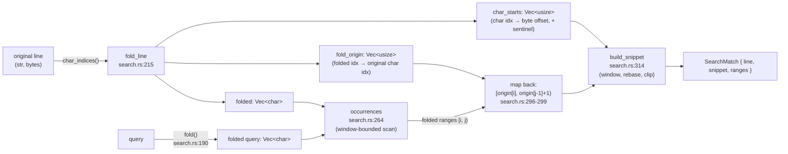

# LLD-004 — Vault Search

> As-built low-level design of `crates/neuralnote-core/src/search.rs` and its result types in
> `crates/neuralnote-core/src/model.rs`, as of 2026-07-10 (branch `feature/conversational-chat`
> base). Every factual claim carries a `file:line` anchor; where something is inferred rather
> than cited, it says so. Line anchors refer to files inside this repo snapshot.

---

## 1. Purpose & scope

Search finds every markdown note in the open vault whose file name, frontmatter title, or raw
content contains the query, and returns per-line snippets with highlight ranges the UI can
render directly.

Be clear about what this is: **lexical substring search with no index**. There is no regex, no
fuzzy matching, no stemming, no ranking beyond a two-group ordering, and no persisted state of
any kind. **Every query is a full filesystem rescan** — the module's own header says so and
names the successor: the AI phase's embeddings supersede ranking later
(`crates/neuralnote-core/src/search.rs:1-2`).

Matching is case-insensitive via a per-line Unicode fold map (`search.rs:4-10`); that fold
design is the intellectually load-bearing part of this module and gets its own section (§5).

In scope for this document:

- `search.rs` in full — public functions, `pub(crate)` helpers, constants, algorithm.
- The wire types `SearchMatch`, `FileHit`, `SearchResponse` (`model.rs:114-156`).
- The internal `FoldedLine` bookkeeping struct (`search.rs:204-213`).
- The test suite in `crates/neuralnote-core/src/lib.rs` `mod tests` (`lib.rs:28`, search block
  at `lib.rs:1214-1546`), which encodes the Unicode invariants precisely.

Out of scope: the link graph and backlinks scanners (they share the tree walk but are separate
modules), and the AI retrieval layer itself (LLD-008), which consumes this module's seam.

---

## 2. Position in the architecture

See the system HLD: [`../architecture/system-overview.md`](../architecture/system-overview.md).
Search sits in the client-agnostic core's vault-read layer ("search · links(+mask) ·
backlinks" in the HLD component diagram) and is exposed to the webview through the thin Tauri
command `search_vault` (`app/desktop/src-tauri/src/commands/vault.rs:329-334`), which delegates
without adding logic.

Two consumers, one scan body:

- **The UI search pane** calls the public `search_vault` (`search.rs:34-36`) via IPC.
- **The AI retrieval layer** (`KeywordRetriever`, `crates/neuralnote-core/src/ai/retrieval.rs:116`)
  calls the `pub(crate)` variant `search_vault_with_content` (`ai/retrieval.rs:253`). This is
  the deliberate seam: the variant additionally returns the raw text of every content-hit file,
  keyed by absolute path, so the AI path builds citation evidence spans **without a second
  read** of each hit — one read per file per search, not two (`search.rs:38-51`, referencing
  PA-007). The returned text is byte-identical to what `read_note` would load, so it hashes to
  the same `content_hash` the citation verifier expects (`search.rs:43-45`). Details of the
  consuming side belong to **LLD-008 (AI retrieval)** — forthcoming at the time of writing.

Because search starts from `read_tree` + `markdown_files`, it inherits the tree scanner's rules
by construction (`tree.rs:119-122`): hidden dot-entries skipped (`tree.rs:34`, `tree.rs:76`),
symlinks never followed (`tree.rs:29-30`), depth capped at 48 (`tree.rs:10`), and the
markdown-extension predicate `md`/`markdown`/`mdx` (`tree.rs:115-117`).

---

## 3. Public API surface

| Item | Visibility | Signature (shape) | Anchor |
|---|---|---|---|
| `search_vault` | `pub` | `(root: &Path, query: &str) -> CoreResult<SearchResponse>` | `search.rs:34-36` |
| `search_vault_with_content` | `pub(crate)` | `(root, query) -> CoreResult<(SearchResponse, HashMap<String, String>)>` | `search.rs:46-51` |
| `fold` | `pub(crate)` | `(s: &str) -> Vec<char>` — case-fold a string the same way lines are folded | `search.rs:190-192` |
| `fold_line` | `pub(crate)` | `(line: &str) -> FoldedLine` — build a line's fold map | `search.rs:215-232` |
| `clip_line_around` | `pub(crate)` | `(line: &str, first: (usize, usize)) -> String` — snippet-window clip of an arbitrary line | `search.rs:251-255` |
| Constants | `pub` | `MAX_TOTAL_MATCHES`, `MAX_MATCHES_PER_FILE`, `SNIPPET_MAX_CHARS`, `MAX_QUERY_CHARS` | `search.rs:20-27` |

Both search entry points share one body, `search_vault_inner(root, query, retain_content)`
(`search.rs:58-62`); the public path passes `retain_content = false` and is byte-for-byte the
same scan (`search.rs:53-57`). The `pub(crate)` fold/clip helpers exist so the AI retrieval
layer reuses the exact same fold semantics rather than re-implementing them (inferred: from
their `pub(crate)` visibility plus `ai/retrieval.rs`'s imports of the search module).

Everything else — `contains_folded`, `scan_content`, `occurrences`, `match_line`,
`build_snippet`, `snippet_window`, `build_file_hit`, `fold_char` — is private.

---

## 4. Data model

All three wire types are `Serialize`/`Deserialize`/`TS`-exported with camelCase renaming
(`model.rs:115-117`), so the TypeScript bindings are generated, never hand-written.

### `SearchMatch` (`model.rs:118-128`)

| Field | Type | Meaning |
|---|---|---|
| `line` | `u32` | 1-based line number in the **raw** file (frontmatter counts; `search.rs:169`, test `lib.rs:1435`) |
| `snippet` | `String` | The matching line, clipped to a window around the first match when long (`model.rs:121-122`) |
| `ranges` | `Vec<(u32, u32)>` | `[start, end)` **Unicode-scalar (char) offsets into `snippet`** — see §5.4 (`model.rs:123-127`) |

### `FileHit` (`model.rs:134-143`)

| Field | Type | Meaning |
|---|---|---|
| `path` | `String` | Absolute path on disk — also the key of the `search_vault_with_content` map (`search.rs:40-41`) |
| `rel_path` | `String` | Vault-relative path |
| `title` | `String` | From frontmatter via `title_and_body` (`note.rs:183`), falling back to the file stem |
| `name_match` | `bool` | File stem **or** title matched — ranked first (`model.rs:139-140`) |
| `matches` | `Vec<SearchMatch>` | Content matches; **empty for a name-only hit** (`model.rs:141-142`, test `lib.rs:1389-1390`) |

### `SearchResponse` (`model.rs:149-156`)

| Field | Type | Meaning |
|---|---|---|
| `hits` | `Vec<FileHit>` | Name-match hits first, then content-only hits; tree-walk order within each group (`search.rs:113`) |
| `truncated` | `bool` | A match cap clipped at least one further matching line (the UI shows a banner) — exact semantics in §7 |
| `skipped_files` | `u32` | Markdown files that could not be read (each also logged) — "no results" vs "couldn't look" (`model.rs:153-155`) |

### `FoldedLine` — internal (`search.rs:204-232`)

The per-line fold map that makes the Unicode design work:

| Field | Type | Meaning |
|---|---|---|
| `folded` | `Vec<char>` | Each original char's `to_lowercase()` output, concatenated (`search.rs:205-206`) |
| `fold_origin` | `Vec<usize>` | The original **char** index each folded char came from — pushed once per emitted folded char, so expansion (`İ` → 2 chars) stays mapped (`search.rs:207-209`) |
| `char_starts` | `Vec<usize>` | Byte offset of each original char plus a final `line.len()` sentinel, making `line[char_starts[a]..char_starts[b]]` boundary-safe for any `a ≤ b` (`search.rs:210-212`) |

---

## 5. The Unicode case-folding design

### 5.1 What the fold is

One char folds to `ch.to_lowercase()` — which can emit **multiple** scalars — plus exactly one
extra equivalence: Greek final sigma `ς` is mapped to `σ`, so a word-final sigma matches an
uppercase query whose `Σ` also lowercases to `σ` (`search.rs:181-187`, test `lib.rs:1532-1543`).

Multi-char equivalences such as `ß`→`ss` are **deliberately absent**. The code comment is
explicit: hand-rolled Unicode equivalence tables are a known bug farm, and the `ß` limitation
is documented in the spec rather than half-fixed in code (`search.rs:183-184`). This is a
recorded trade-off, not an oversight — see GAP-004-6.

### 5.2 Why a fold *map*, not a lowercased copy

`İ` (U+0130, Latin capital I with dot above) lowercases to **two** scalars: `i` + U+0307
combining dot above. So folded text can be *longer* than the original, and any index computed
against a lowercased copy drifts relative to the original string (`search.rs:6-10`).

The classic bug this design exists to avoid: find a match in `lowercase(line)`, then slice the
*original* `line` with those offsets. With any fold expansion before the match, the offsets
point at the wrong chars — or at a non-boundary byte, which panics in Rust. `fold_line`
prevents this by recording, for every folded char, the original char index it came from
(`fold_origin`, `search.rs:207-209`). A folded match `[i, j)` maps back to original chars
`[fold_origin[i], fold_origin[j-1] + 1)` (`search.rs:295-299`).

There is a dedicated regression test for exactly this: `"İİ Istanbul trip"` puts two `İ`
*before* the match, shifting folded indices by +2 relative to original char indices; the test
asserts the reported range still slices out `"Istanbul"` from the snippet
(`lib.rs:1263-1273`). The symmetric case — the fold expansion *inside* the match — is covered
by `search_matches_across_unicode_case_folds` (`lib.rs:1249-1260`).

### 5.3 The pipeline

Query and line pass through the **same** `fold` function (`search.rs:75`, `search.rs:190-192`),
so equivalence is symmetric by construction.

### 5.4 The `ranges` contract — char offsets, explicitly

`SearchMatch.ranges` are `[start, end)` offsets counted in **Unicode scalar values (chars) into
`snippet`** — not bytes, not UTF-16 code units (`model.rs:123-127`). The frontend consumes them
by materialising the snippet with `Array.from(snippet)` so both sides count code points; a
naive JS `snippet.slice(start, end)` would count UTF-16 units and break on astral-plane chars.
This is a cross-language contract, stated in the type's doc comment and enforced by tests: the
test helper `slice_chars` slices by chars exactly as the frontend does (`lib.rs:1216-1218`),
and `search_ranges_are_scalar_offsets_with_emoji_before_match` puts emoji (surrogate pairs in
UTF-16) before the match to prove the offsets are scalar, not UTF-16 (`lib.rs:1286-1295`).

### 5.5 Slice safety

Every byte slice in the module derives its boundaries from `char_indices` — either via
`FoldedLine.char_starts` (`search.rs:219-226`) or the standalone `char_starts` helper
(`search.rs:234-238`), both of which append a `line.len()` sentinel. Byte-boundary panics are
therefore impossible by construction (`search.rs:9-10`); `search_clips_long_lines_on_char_boundaries`
guards this with a snippet window that would land mid-char if byte-sliced (`lib.rs:1314-1324`).

---

## 6. Algorithm walkthrough

`search_vault_inner` (`search.rs:58-122`), step by step:

1. **Trim and cap the query.** Whitespace-only input returns an empty, non-truncated response
   immediately (`search.rs:63-73`, test `lib.rs:1227-1234`). Otherwise the query is capped to
   its first `MAX_QUERY_CHARS` chars — silently, never an error (`search.rs:74`, test
   `lib.rs:1511-1519`) — and folded once (`search.rs:75`).
2. **Walk the vault.** `read_tree(root)` scans the tree; `markdown_files` flattens it to
   markdown leaves in deterministic tree-walk order (`search.rs:76`, `search.rs:85`;
   `tree.rs:119-126`). Non-markdown files and hidden directories never enter the scan (tests
   `lib.rs:1413-1421`, `lib.rs:1424-1432`).
3. **Read each file lossily.** `std::fs::read` + `String::from_utf8_lossy`, so a Latin-1 note
   cannot error the whole search (`search.rs:86-89`, test `lib.rs:1449-1459`). A read failure
   is skipped **loudly**: logged via `log::warn!` and counted in `skipped_files`
   (saturating add), never fatal (`search.rs:90-94`, test `lib.rs:1462-1476`).
4. **Compute the per-file budget.** `MAX_MATCHES_PER_FILE.min(MAX_TOTAL_MATCHES - total)`
   (`search.rs:96`) — the per-file cap, shrunk by whatever the total cap has left.
5. **Build the file hit** (`build_file_hit`, `search.rs:130-161`):
   - **Name/title check** — `contains_folded` on the file stem and the frontmatter title (via
     `title_and_body`, `note.rs:183`), using the same fold (`search.rs:137-142`, `195-200`). A
     name match **costs no match budget** and runs for every file (`search.rs:124-125`); a
     title match counts the same as a stem match (test `lib.rs:1395-1410`).
   - **Content scan** — `scan_content` unless the budget is zero *and* truncation is already
     known; a zero-budget scan still runs otherwise, so a clipped match can raise the
     truncation flag (`search.rs:144-148`, doc `search.rs:126-129`).
6. **Scan content per line** (`scan_content`, `search.rs:166-179`): iterate `raw.lines()`,
   1-based line numbers clamped into `u32` (`search.rs:169`); each matching line becomes one
   `SearchMatch` via `match_line`. A match found when the budget is already full returns
   `(out, true)` — the exact "a cap clipped something" signal (`search.rs:163-165`, `173-175`).
   Matching is strictly per-line; a query spanning a newline can never match (see GAP-004-5).
7. **Find occurrences on the folded line** (`occurrences`, `search.rs:264-284`):
   non-overlapping folded-index ranges, scanned left to right. The first occurrence pins the
   snippet window and sets a cutoff of `first_end + SNIPPET_MAX_CHARS` in **original** chars
   (`search.rs:273-276`); anything starting past the cutoff would be discarded by
   `build_snippet` anyway, so the scan stops there structurally — a multi-MB single-line note
   cannot amplify allocations (`search.rs:259-263`). Short lines keep every occurrence (test
   `lib.rs:1522-1529`).
8. **Map back and build the snippet** (`match_line` → `build_snippet`,
   `search.rs:289-334`): a line at or under `SNIPPET_MAX_CHARS` is returned whole with ranges
   as-is (`search.rs:320-323`); a longer line gets a `SNIPPET_MAX_CHARS`-wide window centred on
   the midpoint of the first match, clamped to the line (`snippet_window`, `search.rs:240-249`;
   clamp test `lib.rs:1327-1338`). Ranges are rebased to the window; a range **straddling** a
   window edge is *clipped* to its visible part, and only fully-outside ranges are dropped —
   so the first match always yields a range even when wider than the window itself
   (`search.rs:308-333`, tests `lib.rs:1479-1495`, `lib.rs:1498-1508`).
9. **Order and return.** Name-match hits first, then content-only hits, tree-walk order within
   each group (`search.rs:78-79`, `106-113`; test `lib.rs:1379-1392`). When `retain_content` is
   set, the raw text of each file with at least one *quotable* content match is kept in the
   returned map — a name-only hit carries no line to cite, so its content is never retained
   (`search.rs:101-105`).

Note the raw file text is searched **frontmatter included** — Obsidian behaviour
(`search.rs:30-31`, tests `lib.rs:1435-1446`, `lib.rs:1406-1410`).

---

## 7. Caps and honesty

| Constant | Value | Bounds | Anchor |
|---|---|---|---|
| `MAX_TOTAL_MATCHES` | 200 | Content matches across the whole response | `search.rs:19-20` |
| `MAX_MATCHES_PER_FILE` | 50 | Content matches per file | `search.rs:21-22` |
| `SNIPPET_MAX_CHARS` | 200 | Snippet window width, in chars | `search.rs:23-24` |
| `MAX_QUERY_CHARS` | 256 | Query length actually searched — longer input silently trimmed, **never an error** | `search.rs:25-27`, `search.rs:74` |

This is the project's "no silent caps" invariant (failures are never silent — project
`CLAUDE.md`) in practice:

- **`truncated`** is set **iff a cap clipped at least one further matching line**. The signal
  comes from `scan_content` returning `true` only when a match was found *beyond* the budget
  (`search.rs:163-165`, `173-175`). A file with exactly `MAX_MATCHES_PER_FILE` matching lines —
  exact-at-cap — is **not** truncated (test `lib.rs:1341-1355`); the total cap works the same
  way across files (test `lib.rs:1358-1373`). Once the total budget is spent, later files still
  run a zero-budget scan until truncation is known, precisely so the flag stays exact
  (`search.rs:126-129`, `144-148`).
- **`skipped_files`** counts markdown files that could not be read; each is also logged
  (`search.rs:90-94`). The UI can therefore distinguish "no results" from "couldn't look"
  (`model.rs:153-155`) — a permissions failure is not silently reported as an empty result set
  (test `lib.rs:1462-1476`).
- The query cap is the one *silent* trim — deliberate, documented as anti-abuse ("a pasted
  blob can't drive unbounded work", `search.rs:25-27`), and behaviour-preserving for any sane
  query.

What the caps do **not** bound: file size and total files read. See GAP-004-2 and §10.

---

## 8. Invariants & guarantees

| # | Invariant | Anchor |
|---|---|---|
| I-1 | Matching is case-insensitive under per-scalar `to_lowercase()` + ς→σ; query and line use the identical fold | `search.rs:185-192`, tests `lib.rs:1237`, `1532` |
| I-2 | `ranges` are `[start, end)` char offsets into `snippet`, valid under `Array.from`-style slicing | `model.rs:123-127`, tests `lib.rs:1216-1218`, `1286` |
| I-3 | Reported ranges survive fold expansion anywhere in the line (offsets map back through `fold_origin`) | `search.rs:207-209`, `296-299`, tests `lib.rs:1249`, `1263` |
| I-4 | No byte-boundary panic is reachable: every slice boundary comes from `char_indices` | `search.rs:9-10`, `210-212`, `234-238`, test `lib.rs:1314` |
| I-5 | A content match never carries empty ranges — the first match always yields a (possibly clipped) visible range | `search.rs:308-313`, test `lib.rs:1498-1508` |
| I-6 | `truncated` is exact: set iff a cap clipped ≥ 1 further matching line; exact-at-cap is `false` | `search.rs:163-165`, `173-175`, tests `lib.rs:1341`, `1358` |
| I-7 | An unreadable file is never fatal and never silent: logged + counted in `skipped_files` | `search.rs:90-94`, test `lib.rs:1462` |
| I-8 | Hits order: name/title matches first, then content-only; deterministic tree-walk order within each group | `search.rs:113`, `tree.rs:119-122`, test `lib.rs:1379` |
| I-9 | Name-only hits have `matches == []` and cost no match budget | `search.rs:124-125`, `model.rs:141-142`, test `lib.rs:1389-1390` |
| I-10 | Scan scope: markdown extensions only, hidden dirs skipped, symlinks not followed, depth ≤ 48 — inherited from the tree scanner | `tree.rs:10, 29-34, 115-126`, tests `lib.rs:1413`, `1424` |
| I-11 | Raw text is searched frontmatter-included; `line` is 1-based over the raw file | `search.rs:30-31`, `169`, test `lib.rs:1435` |
| I-12 | `search_vault_with_content` returns text byte-identical to `read_note`'s load, so content hashes match the citation verifier | `search.rs:43-45` (asserted in doc comment; verified downstream in `ai/retrieval.rs` tests — inferred) |
| I-13 | Per-line allocation is bounded: the occurrence scan stops at `first_end + SNIPPET_MAX_CHARS` original chars | `search.rs:259-276` |

---

## 9. Error handling & failure modes

- **The only `Err` path** is `read_tree(root)` failing (`search.rs:76`) — e.g. the vault root
  itself is unreadable or gone. Everything downstream is infallible or degrades per-file.
- **Per-file read failure** → skip, log, count (`search.rs:90-94`). Never fatal, never silent
  (I-7).
- **Non-UTF-8 content** → lossy decode with U+FFFD replacement; the file still participates
  (`search.rs:86-89`). Consequence: a query containing the literal bytes that got replaced will
  not match them — matching runs over the lossy text (inferred from the lossy decode; no test
  asserts this negative).
- **Empty/whitespace query** → empty response, not an error (`search.rs:63-73`).
- **Oversized query** → trimmed to 256 chars, not an error (`search.rs:74`).
- **Line numbers past `u32::MAX`** → clamped via `u32::try_from(...).unwrap_or(u32::MAX)`
  (`search.rs:169`); `skipped_files` uses `saturating_add` (`search.rs:92`). No arithmetic
  panics.
- **Binary bytes inside a `.md` file** → *not* detected; the file is lossily decoded and
  scanned like text (GAP-004-4), unlike the reader, which has a graceful binary branch
  (`note.rs:78-106`).

---

## 10. Performance characteristics

Be honest about the ceiling: **each query costs O(total vault bytes)**.

- Every markdown file in the vault is `fs::read` in full on every call (`search.rs:85-95`) —
  including after both match caps are exhausted, since the read happens before the budget
  check (`search.rs:88-96`). The caps bound the *output*, not the *input work*.
- Every line of every file is folded char-by-char with fresh `Vec` allocations per line
  (`fold_line`, `search.rs:215-232`) — except that `scan_content` is skipped entirely once the
  budget is zero *and* truncation is known (`search.rs:144-148`), which saves folding but not
  reading.
- Matching is naive windowed comparison — `windows(q.len()).any(...)` for names
  (`search.rs:195-200`) and a linear scan with per-position slice compare in `occurrences`
  (`search.rs:268-282`): O(line_chars × query_chars) worst case. No Boyer–Moore/memchr-style
  skipping.
- **There is no cache between calls.** On a 10 000-note vault, every keystroke-triggered
  search re-reads and re-folds every file (any debouncing lives in the frontend, not here —
  inferred; the core has no throttle). And search is not alone: `search_vault`,
  `read_link_graph` (`links/mod.rs:86-87`), and `read_backlinks` (`backlinks.rs:25-26`) each
  independently call `read_tree` and rescan the same files — three uncoordinated full scans
  for a workspace showing search results, the graph, and a backlinks panel.
- Mitigations that *are* built in: the per-line occurrence cutoff (I-13) prevents a multi-MB
  single-line note from amplifying allocations (`search.rs:259-263`), and the query cap bounds
  per-position compare cost (`search.rs:25-27`).

For a personal vault of hundreds to low-thousands of small notes this is fine; the module
header explicitly frames the design as provisional until embeddings land (`search.rs:1-2`).
For the target migration persona — a large existing Obsidian vault — the rescan cost is the
headline limit (GAP-004-1).

---

## 11. Testing

Coverage lives in `crates/neuralnote-core/src/lib.rs` `mod tests` (`lib.rs:28`), search block
`lib.rs:1214-1546` — 23 tests. What they pin down:

- **Unicode invariants, precisely**: ASCII case (`1237`), fold expansion inside the match
  (`1249`) and *before* it (`1263` — the classic-bug regression), CJK (`1276`), scalar-offset
  contract with emoji (`1286`), combining marks in text and query (`1298`), Greek final sigma
  (`1532`).
- **Snippet windowing**: char-boundary clipping (`1314`), window clamp at line end (`1327`),
  straddling-range clip (`1479`), match wider than the window (`1498`).
- **Caps and honesty**: per-file cap + exact-at-cap not truncated (`1341`), total cap (`1358`),
  query cap (`1511`), short-line all-occurrences regression (`1522`).
- **Scan scope & robustness**: markdown-only (`1413`), hidden dirs (`1424`), frontmatter
  included with raw-file line numbers (`1435`), lossy non-UTF-8 (`1449`), unreadable-file skip
  counted (`1462`, unix-only), empty query (`1227`).
- **Ranking**: name before content (`1379`), title counts as name (`1395`).

The frontend consumption contract is mirrored by the `slice_chars` helper, which slices by
chars "exactly how the frontend consumes ranges" (`lib.rs:1216-1218`).

**Gaps in coverage** (all inferred from absence):

- No direct unit tests of `search_vault_with_content` in this block — the retained-content map
  and its byte-identity/hash claim (I-12) are exercised only via `KeywordRetriever`'s tests
  (`ai/retrieval.rs:400` ff.).
- No test for NFC-vs-NFD non-matching (the behaviour in GAP-004-3 is undocumented by tests).
- No test for a huge file or a memory-pressure scenario (GAP-004-2).
- No test that binary content inside a `.md` scans without pathological output (GAP-004-4).
- The `skipped_files` test is `#[cfg(unix)]` only (`lib.rs:1461-1462`); Windows has no
  equivalent.
- No performance/regression benchmark exists for the full-rescan cost.

---

## 12. Known gaps & edge cases

| ID | Description | Evidence | Impact | Suggested fix |
|---|---|---|---|---|
| GAP-004-1 | **No index; full rescan per query.** Every search reads and folds every markdown file; no state survives between calls. The headline scaling limit for the target persona (large migrated Obsidian vault). | `search.rs:1-2`, `76`, `85-95` | Latency grows linearly with vault bytes; keystroke-driven search on a 10k-note vault does 10k file reads per query. | Incremental index keyed by (path, mtime/hash) — see §13. |
| GAP-004-2 | **No max-file-size cap.** The `MAX_*` constants bound matches and query length, never file size. A single huge `.md` is read entirely into memory and every line folded (per-line allocation is bounded, whole-file read is not). | `search.rs:20-27` (what's bounded), `88-89` (unbounded read) | A multi-GB stray `.md` can spike memory and stall the search; with `retain_content`, the whole text is additionally held in the returned map (`search.rs:103-105`). | Cap per-file bytes read (skip + count oversized files in `skipped_files`, or scan a bounded prefix and flag it). |
| GAP-004-3 | **No Unicode normalization.** Folding is per-scalar, so precomposed NFC `é` (U+00E9) never matches decomposed NFD `e`+U+0301. A vault migrated from macOS — which historically stored NFD in filenames, and whose editors mix forms — is exactly the population that hits this. | `search.rs:185-192` (per-scalar fold, no NFC/NFD step); test `lib.rs:1298` covers same-form matching only | Silent false negatives: the note exists, the text "matches" visually, search returns nothing. Violates the spirit of "no silent failure" without ever erroring. | NFC-normalise both query and text at the fold boundary (`fold`/`fold_line`), extending `fold_origin` bookkeeping to normalization expansion the same way it already handles case expansion. |
| GAP-004-4 | **No binary-content detection in search.** Unlike `read_note`, which routes binary content to a graceful no-preview branch, search lossily decodes any `.md` regardless of content and scans it. | `search.rs:86-89` vs `note.rs:78-106` (`build_binary_doc` at `note.rs:56`) | A binary blob misnamed `.md` is scanned as U+FFFD-ridden text; possible garbage snippets in the UI and wasted fold work. Low likelihood, nonzero. | Reuse the reader's binary heuristic before scanning; count such files like unreadable ones or skip content scan while keeping the name match. |
| GAP-004-5 | **No multi-line matching**, and on a single line, occurrences starting beyond `first_end + SNIPPET_MAX_CHARS` (original chars) are never reported — the occurrence scan stops at the snippet cutoff by design. | `search.rs:168` (per-line iteration), `264-284` (cutoff) | A phrase spanning a newline never matches; on a very long line, later occurrences are invisible (the line still surfaces once, so no file is missed — only extra highlights on that line). | Document as-is (the file-level result is unaffected); revisit only if per-line multi-highlight beyond the window ever matters to the UI. |
| GAP-004-6 | **`ß`→`ss` and all other multi-char case equivalences intentionally absent** — a deliberate trade-off, not a defect: hand-rolled equivalence tables are called out as a bug farm, and the limitation is documented in the spec. Only ς→σ is special-cased. | `search.rs:181-187`; test `lib.rs:1532-1543` asserts sigma is the ONLY extra fold | Query `STRASSE` does not match `Straße` (and vice versa). German-heavy vaults see false negatives on a known, documented class. | If ever needed, adopt full Unicode case folding (e.g. the `unicode-case-mapping`/ICU tables) behind the existing `fold_char` seam — the `fold_origin` design already supports 1→n expansion, so the plumbing is ready. |
| GAP-004-7 | **Files are still fully read after all caps are exhausted.** The `fs::read` happens before the budget check; once truncation is known only the *scan* is skipped, not the read. | `search.rs:88-96`, `144-148` | On a saturating query (200 matches early in the walk), the remaining thousands of files are still read for nothing but name-match checks. | Once truncation is known, restrict the remaining walk to name/title checks against tree metadata (stem is already in `TreeNode`; title requires the read — could be dropped or deferred for capped responses). |

---

## 13. Suggested improvements

Ordered by leverage:

1. **An incremental index — the one that matters.** Concretely, what it would need to be:
   - **Granularity**: per-file entries keyed by absolute path, invalidated by
     `(mtime, size)` or the `content_hash` the note layer already computes
     (`note.rs` — `content_hash`, imported at `ai/retrieval.rs:14`). On a query, only changed
     files are re-read and re-folded; unchanged files serve from the index.
   - **Contents per file**: the folded line stream plus `fold_origin`/`char_starts`
     bookkeeping (or a compact re-derivable form: fold maps are cheap to rebuild per matched
     line, so indexing just the folded text with line offsets may be enough), plus stem/title
     for the budget-free name pass.
   - **The seam is already right**: `search_vault_inner`'s walk (`search.rs:85-111`) is the
     only place that touches the filesystem; an index slots in as a content provider behind
     that loop without changing `SearchResponse`, the fold semantics, or either caller.
     `read_link_graph` and `read_backlinks` could share the same cached file table, collapsing
     today's three independent rescans (§10) into one.
   - **It also serves the AI core's future.** The retrieval layer is explicitly designed for a
     later embedding-RAG `VectorRetriever` implementing the same `RetrievalProvider` trait and
     returning the same `EvidenceSpan` shape (`ai/retrieval.rs:3-7`, `ai/evidence.rs:4`). An
     embedding store has the identical invalidation problem — which chunks are stale — so the
     same (path, content_hash) change-detection table should drive both the lexical index and
     the future chunk/embedding pipeline. Building change detection once, under search, is the
     cheapest path to the vector store the spec anticipates.
2. **Per-file size cap** (GAP-004-2) — the cheapest robustness win; folds into `skipped_files`
   honesty for free.
3. **NFC normalization at the fold boundary** (GAP-004-3) — small, self-contained, directly
   targets the Obsidian-migration persona; the `fold_origin` machinery already handles 1→n
   expansion so normalization expansion is the same bookkeeping.
4. **Stop reading after saturation** (GAP-004-7) — a modest constant-factor win on saturating
   queries; only worth it if profiling shows it matters before the index lands.
5. **Windows coverage for the skip path** — the `skipped_files` test is unix-only
   (`lib.rs:1461`); a Windows-compatible unreadable-file fixture would close the platform gap.

Not recommended: regex/fuzzy layers on top of the current scan — they multiply the per-byte
cost of a design already at its scaling ceiling, and embeddings (the planned successor,
`search.rs:1-2`) address the recall problem more directly.

---

## 14. References

- Source: `crates/neuralnote-core/src/search.rs` (335 lines, the whole module)
- Types: `crates/neuralnote-core/src/model.rs:114-156`
- Tests: `crates/neuralnote-core/src/lib.rs:1214-1546` (search block, 23 tests)
- Tree scanner (scan rules inherited by search): `crates/neuralnote-core/src/tree.rs`
- Title extraction: `crates/neuralnote-core/src/note.rs:183` (`title_and_body`); binary
  branch contrast at `note.rs:56-106`
- AI consumer of the content seam: `crates/neuralnote-core/src/ai/retrieval.rs`
  (`KeywordRetriever`, `search_vault_with_content` call at `ai/retrieval.rs:253`) — LLD-008
- Tauri command: `app/desktop/src-tauri/src/commands/vault.rs:325-334`
- System HLD: [`../architecture/system-overview.md`](../architecture/system-overview.md)
- Shipping bar: [`../definition-of-done.md`](../definition-of-done.md)
- Project guide: `CLAUDE.md` (repo root) — "failures are never silent" convention
