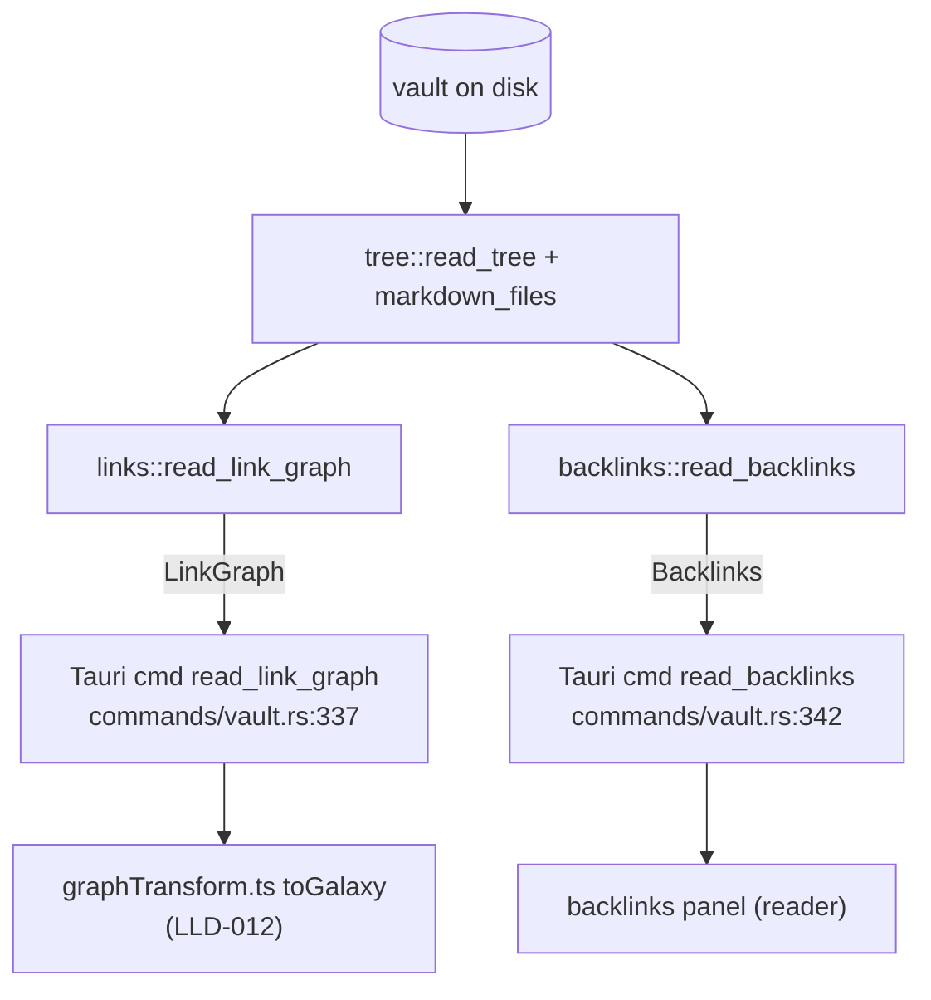

# LLD-005 — Wikilinks, Backlinks & the Link Graph

**Status:** as-built · **Scope:** `crates/neuralnote-core/src/links/` (`mod.rs`, `mask.rs`), `crates/neuralnote-core/src/backlinks.rs`, the graph/backlink types in `crates/neuralnote-core/src/model.rs`, and the core/frontend boundary at `app/desktop/src/workspace/graphTransform.ts`.

---

## 1. Purpose & scope

This subsystem gives NeuralNote its Obsidian-style link structure:

- **The link graph** — one undirected, deduplicated graph over the whole vault: a node per markdown note (orphans included), an edge per resolved wikilink or relative markdown link (`links/mod.rs:84-96`).
- **Directional backlinks** — for one target note, every occurrence of a link pointing at it, with source-line evidence for the reader panel (`backlinks.rs:23-60`).
- **Unlinked mentions** — plain-text occurrences of the target note's *title* in other notes' bodies, for "you mentioned this but didn't link it" (`backlinks.rs:126-140`).

**This is literal link parsing, not semantic or AI inference.** Edges exist only where the user typed a link; mentions match only the literal title string. The spec locks this framing: cross-folder links are "relabelled honestly as **'cross-folder link'** (no AI-inference claim until it exists)" (`specs/search-and-graph-view.md:20-21`), and the AI phase "later layers semantic search and inferred links on top" (`specs/search-and-graph-view.md:13-14`). Nothing in this LLD may be presented to the user as AI-derived.

Out of scope here: full-text search (LLD-004), the 3D galaxy renderer and drill-down UI (LLD-012 — `graphTransform.ts` appears below only to pin the boundary), and tags/aliases (not implemented).

## 2. Position in the architecture

See [`../architecture/system-overview.md`](../architecture/system-overview.md). This is a pure-core capability: two public functions in the client-agnostic Rust core, each wrapped by a thin Tauri command that delegates without re-implementing (`app/desktop/src-tauri/src/commands/vault.rs:337-355`). The frontend consumer of `LinkGraph` is the galaxy view's `toGalaxy` transform (`app/desktop/src/workspace/graphTransform.ts:221`), documented in LLD-012; the `Backlinks` payload feeds the reader's backlinks panel.



Both functions reuse the vault walk (`tree.rs:123` `markdown_files`), the shared title rule (`note.rs:183` `title_and_body` — frontmatter `title`, else first H1, else stem), and search's fold/clip helpers (`search.rs:190,215,251`).

## 3. Public API surface

Public (crate boundary):

| Function | Signature | Purpose |
|---|---|---|
| `links::read_link_graph` | `(root: &Path) -> CoreResult<LinkGraph>` (`links/mod.rs:86`) | Whole-vault node/edge graph. |
| `backlinks::read_backlinks` | `(root: &Path, target_rel: &str) -> CoreResult<Backlinks>` (`backlinks.rs:25`) | Linked + unlinked mentions of one note. |

`pub(crate)` seam — the pieces backlinks reuses so both features share one grammar and one resolver:

| Item | Location | Role |
|---|---|---|
| `mask_code` | `links/mask.rs:9`, re-exported `links/mod.rs:21` | Blank code fences + inline spans before any scan. |
| `RawTarget` (`Wiki`/`Md`) | `links/mod.rs:26-30` | A raw target as written; the kind is kept because the two resolve by different rules. |
| `extract_link_occurrences` | `links/mod.rs:219` | Every occurrence with `line` + `snippet` (directional backlinks). |
| `LinkResolutionIndex` | `links/mod.rs:40-82` | Case-folded `by_name` / `by_rel` indices + `resolve`. |
| `stem_of` | `links/mod.rs:193` | Filename stem (title fallback). |
| `resolve_rel` | `links/mod.rs:425` | Case-insensitive rel-path resolution with exact-case preference. |

## 4. Data model

All types serialise camelCase and are mirrored to TS via `ts-rs` (`model.rs:1-8`); the bindings in `app/desktop/src/lib/bindings/` are generated, never hand-edited.

| Type | Fields | Notes |
|---|---|---|
| `GraphNode` (`model.rs:162-168`) | `id: String` (rel_path, stable id), `title: String`, `cluster: String` (first path segment; `""` for root notes) | One per markdown note, orphans included. |
| `GraphLink` (`model.rs:174-179`) | `source: String`, `target: String`, `bridge: bool` (endpoints in different clusters) | Resolved, deduplicated. |
| `LinkGraph` (`model.rs:185-192`) | `nodes: Vec<GraphNode>`, `links: Vec<GraphLink>`, `skipped_files: u32` | `skipped_files` distinguishes "sparse graph" from "couldn't look". |
| `Backlink` (`model.rs:198-204`) | `source_rel`, `source_title`, `snippet: String`, `line: u32` (1-based) | One per resolved link occurrence. |
| `UnlinkedMention` (`model.rs:210-216`) | `source_rel`, `source_title`, `snippet: String`, `line: u32` | One per plain-title occurrence. |
| `Backlinks` (`model.rs:222-228`) | `linked: Vec<Backlink>`, `unlinked: Vec<UnlinkedMention>`, `skipped_files: u32` | The panel payload. |

Everything here is transient — computed from disk per call, never persisted.

**Snippet asymmetry:** `Backlink`/`UnlinkedMention` carry `snippet` + `line` but **no highlight `ranges`**, unlike `SearchMatch` (`model.rs:118-128`, which carries `ranges: Vec<(u32, u32)>`). The backlinks panel therefore cannot highlight the match inside the snippet the way search results can. The snippet is clipped around the match via `search::clip_line_around` (`links/mod.rs:263`, `backlinks.rs:136`), so the match is *near* the window centre, but its exact position is discarded.

## 5. The link grammar

Extraction runs over the **body only** (frontmatter stripped by `title_and_body`, `links/mod.rs:132`) after code masking (§6).

**Wikilinks** (`links/mod.rs:299-317`): the scanner finds `[[` … `]]` pairs; the target is the text before the first `#` or `|`, trimmed (`links/mod.rs:310`). This covers:

| Form | Target extracted |
|---|---|
| `[[t]]` | `t` |
| `[[t\|alias]]` | `t` |
| `[[t#heading]]` | `t` |
| `[[t#heading\|alias]]` | `t` |
| `![[t]]` (embed) | `t` — the same `[[`-scan catches it (`links/mod.rs:300-301`); embeds are edges like any link |
| `[[t#^blockid]]` (block ref) | `t` — via the `#` split; a bare `^` is **not** a delimiter, only `#` and `|` are (`links/mod.rs:310`) |

An empty target after trimming (e.g. `[[#heading]]`, `[[|alias]]`) emits nothing (`links/mod.rs:311`). No closing `]]` in the rest of the body ends the scan (`links/mod.rs:309`).

**Markdown links** (`links/mod.rs:319-349`): `[text](target)` — image links `` count; `[[wikilinks]]` are skipped here because a second `[` immediately after the first restarts the scan (`links/mod.rs:328-332`), leaving them to the wikilink scan. The raw target is everything up to the first `)` (`links/mod.rs:344-345`). It is then normalised lexically against the source note's folder (`normalize_md_target`, `links/mod.rs:354-372`):

- `#fragment` stripped (`:355`); empty, absolute (`/…`), or scheme-bearing (`https:`, `mailto:` — RFC 3986 scheme test, `:376-389`) targets → external, dropped (`:356-358`).
- `%20` decoded to space — **only `%20`, no general percent-decoding** (`:359`).
- `.`/empty segments dropped; `..` pops a segment, and popping past the vault root drops the link entirely (`:362-370`).
- Extension optional: resolution tries the candidate as written, then with `.md` appended (`resolve_md_rel`, `:437-439`).

Pinned by tests: all wikilink forms + embed (`lib.rs:1554-1568`), relative/`%20`/scheme/absolute/root-escape (`lib.rs:1588-1608`), extensionless (`lib.rs:1755-1765`).

## 6. Code masking (`mask.rs`)

`mask_code` = `mask_inline_spans(mask_fences(body))` (`mask.rs:9-11`). Both passes blank characters **space-for-space with newlines preserved** (`mask.rs:87-91`, `:72-74`), so byte/char offsets and line numbers in the masked text remain valid against the original — the property `LineContext` (§10 evidence, `links/mod.rs:240-281`) and the mention scanner's line-zip (`backlinks.rs:133`) depend on.

**Fences** (`mask.rs:17-42`): a fence opens on a line whose first non-whitespace run is ≥3 backticks or tildes (`fence_marker`, `:45-53`) and closes only on a run of the **same character at least as long** — CommonMark, so a 3-backtick line inside a 4-backtick fence is content, not a closer (`:29`, pinned `lib.rs:1767-1783`). Opener, interior, and closer lines all mask (`:32`). An unclosed fence masks to end of body (pinned `lib.rs:1625-1634`).

**Inline spans** (`mask.rs:58-84`): scanned over the whole body because CommonMark spans may cross newlines (pinned `lib.rs:1785-1800`). A run of N backticks closes on the next run of **exactly** N (`find_closing_run`, `:98-112`); an unmatched opener is copied literally (`:77-80`).

**Why masking matters:** `[[link]]` inside a code block or span is code being *shown*, not a link being *made*. Without masking, every code example mentioning link syntax would become a graph edge and a backlink — false structure. Masking before both the link scan (`links/mod.rs:204,220`) and the plain-title mention scan (`backlinks.rs:131`) matches Obsidian's behaviour (pinned `lib.rs:1610-1623`, `lib.rs:1897-1912`).

## 7. Resolution rules

`LinkResolutionIndex::from_files` builds three structures in one pass (`links/mod.rs:49-74`): `by_name` (lowercased stem **and** filename → rel_paths), `by_rel` (lowercased rel_path → rel_paths), and `all_rels`.

**Wikilink targets** (`resolve_wikilink`, `links/mod.rs:395-419`):

- **Filename target** (`[[note]]`): lowercased lookup in `by_name` — matches with or without `.md`, case-insensitively (pinned `lib.rs:1636-1645`).
- **Path-qualified target** (`[[folder/note]]`): case-insensitive rel-path suffix match over `all_rels`, tried with and without `.md`, and **segment-aligned** — the suffix must be the whole path or preceded by `/`, so `[[projects/note]]` matches `deep/projects/note.md` but neither `other/note.md` nor `xprojects/note.md` (`:401-411`, pinned `lib.rs:1570-1586`).
- **Ambiguity**: shortest rel_path wins, then lexicographic — Obsidian's own rule (`:415-418`, pinned `lib.rs:1647-1664`).

**Markdown targets** (`resolve_rel` / `resolve_md_rel`, `links/mod.rs:425-439`): the normalised candidate is looked up in `by_rel` case-insensitively; an **exact-case match is preferred** (a case-sensitive filesystem can hold both `Target.md` and `target.md`), else the same shortest-then-lexicographic tiebreak (`:427-432`, pinned at function level because the macOS test filesystem can't create both files — `lib.rs:1817-1839`). The candidate is tried as written, then with `.md` (`:437-439`).

## 8. Graph construction

One vault walk (`collect_notes`, `links/mod.rs:110-151`), then one edge-building pass (`build_links`, `:155-183`):

1. **A node per markdown note, orphans included** (`:133-137`; pinned `lib.rs:1684-1699`). `id` = rel_path, `title` from the shared title rule, `cluster` = first path segment (`cluster_of`, `:186-191`).
2. **Targets deduped during extraction** — an insertion-ordered `HashSet` inside `extract_targets` (`:203-214`), so a note repeating one target N times retains O(distinct), never O(occurrences), and the body drops immediately after extraction (`:142`) so memory stays O(distinct targets), not O(vault text) (`:4-8`). Pinned `lib.rs:1802-1815`.
3. **Unresolved targets skipped silently — no ghost nodes** (`:160-162`; pinned `lib.rs:1666-1673`). The spec lists ghost nodes as an explicitly deferred feature (`specs/search-and-graph-view.md:174-175`).
4. **Self-links skipped** (`:163-165`).
5. **Edges deduped on the unordered pair** — the seen-key is `(min, max)` of the two rel_paths, so A→B twice plus B→A is one edge (`:166-172`; pinned `lib.rs:1675-1682`). Direction is deliberately an implementation detail (`lib.rs:1546-1547`).
6. **`bridge`** = the two endpoints' `cluster_of` values differ, i.e. different top-level folders (`:174`; pinned `lib.rs:1701-1712`).

Unreadable notes keep their node (titled by stem, links skipped); the failure is logged **and** counted into `skipped_files` (`:120-130`; pinned `lib.rs:1733-1753`). Non-UTF-8 notes are read lossily rather than erroring the graph (`:120-121`).

## 9. The core/frontend boundary

The backend computes `cluster` per node and `bridge` per edge. The frontend's `toGalaxy` transform **ignores both and re-derives them per drill-down level** (`app/desktop/src/workspace/graphTransform.ts:9-12`):

- The galaxy supports cluster drill-down: `focusPath` narrows the view to one folder, and at that level "cluster" means *the next path segment under the focus* (`graphTransform.ts:69-73`) — not the vault-level first segment the backend baked in.
- "Bridge" must therefore mean "crosses the **current** boundary", so `buildLinks` recomputes it from the level's derived clusters (`graphTransform.ts:195-203`); the spec mandates exactly this recompute-per-level semantics (`specs/search-and-graph-view.md:160-166`).
- At root the frontend derivation matches the backend fields by construction, pinned by `graphTransform.test.ts` (per the header comment, `graphTransform.ts:11-12` — inferred: test file not re-verified here).

**Consequence:** for the graph view — currently the only consumer of `LinkGraph` — `GraphNode.cluster` and `GraphLink.bridge` are **vestigial payload**. They "stay on the wire for other consumers" (`graphTransform.ts:10-11`), but no other consumer exists today (inferred: no other reader of these fields found in the shell or frontend). This is a documented gap (GAP-005-5): dead bytes on every IPC transfer, and a drift risk — a future consumer trusting the backend fields would silently disagree with what the galaxy displays at any non-root level.

## 10. Backlinks & unlinked mentions

`read_backlinks(root, target_rel)` (`backlinks.rs:25-60`):

1. Walk the tree; if `target_rel` is not among the markdown files → `CoreError::NotFound` (`:28-30`).
2. Compute the target's **title** (shared title rule; stem fallback if the target itself is unreadable, `:119-124`).
3. For every *other* note (`:38-41`), `scan_source` (`:62-88`):
   - Extract every link occurrence from the masked body with line + snippet (`links::extract_link_occurrences`, `links/mod.rs:219-227` — `LineContext` maps masked byte offsets back to 1-based original lines and char columns, `:240-281`).
   - Each occurrence that resolves (same resolver as the graph) to exactly `target_rel` becomes a `Backlink` (`:75-84`).
   - **The suppression rule:** if the source contributed ≥1 *linked* backlink, it yields **no** unlinked mentions at all — `add_unlinked_mention` runs only when `linked.len()` didn't grow (`:74, :85-87`; pinned `lib.rs:1914-1949`). Rationale (inferred): a note that already links the target has "done its job"; surfacing its remaining plain mentions would be noise.
   - Otherwise, every plain-text occurrence of the **target's title** in the masked body becomes an `UnlinkedMention` — a source can contribute several (`:90-104`; pinned `lib.rs:1951-1977`).
4. Both lists sort by `source_rel`, then `line` (`:172-186`).

**Mention matching** (`:126-170`): the title is case/diacritic-folded via `search::fold` (`:127`); each masked line is folded with an origin map (`search::fold_line`) and scanned for the folded title with **word-boundary anchoring**: a match is rejected only when a word character sits immediately adjacent on either side, where `is_word_char` = `char::is_alphanumeric() || '_'` (`:158-170`). Matching is against the target's **title** (frontmatter title / first H1 / stem — whichever the title rule yields) — **not** its filename when a title overrides it, and never its aliases (no alias support exists). Snippets are clipped around the match's char range (`:136`); mentions inside code never match because the scan runs over the masked body (`:131`; pinned `lib.rs:1979-1993`).

## 11. Invariants & guarantees

| # | Invariant | Anchor |
|---|---|---|
| I1 | Every markdown note is a node, including orphans and unreadable files. | `links/mod.rs:116-137`, `lib.rs:1684-1699,1733-1753` |
| I2 | No ghost nodes: an unresolved target never creates a node or edge. | `links/mod.rs:160-162`, `lib.rs:1666-1673` |
| I3 | Edges are unique per unordered pair; self-links never appear. | `links/mod.rs:163-172`, `lib.rs:1675-1682` |
| I4 | Link syntax inside code fences/spans is never an edge or a mention. | `mask.rs:9-11`, `links/mod.rs:204,220`, `backlinks.rs:131`, `lib.rs:1610-1623,1979-1993` |
| I5 | Masking preserves offsets: every masked char maps 1:1 to an original char, newlines intact — so `line`/`snippet` evidence is exact. | `mask.rs:72-74,87-91`, `links/mod.rs:240-281` |
| I6 | Frontmatter is never scanned for links or mentions. | `links/mod.rs:132`, `backlinks.rs:115` (`title_and_body`, `note.rs:183`) |
| I7 | Resolution is deterministic under ambiguity: shortest rel_path, then lexicographic; exact case preferred for rel-path candidates. | `links/mod.rs:415-418,427-432`, `lib.rs:1647-1664,1817-1839` |
| I8 | Node titles agree with the reader's title for the same note. | `links/mod.rs:132`, `lib.rs:1723-1731` |
| I9 | Honest failure: an unreadable note is logged **and** counted into `skipped_files`; it never fails the call and is never silent. | `links/mod.rs:120-130`, `backlinks.rs:106-114`, `model.rs:189-192,225-228`, `lib.rs:1733-1753,1995-2013` |
| I10 | Memory during graph build is O(distinct targets), not O(vault text): bodies drop per file. | `links/mod.rs:142,200-214` |
| I11 | Backlinks/mentions order is deterministic: `source_rel`, then `line`. | `backlinks.rs:172-186` |
| I12 | A source with a linked backlink contributes zero unlinked mentions. | `backlinks.rs:74,85-87`, `lib.rs:1914-1949` |

## 12. Error handling & failure modes

- **Fatal errors:** `read_tree` failure (vault root unreadable/absent) propagates as `CoreResult` from both entry points (`links/mod.rs:87`, `backlinks.rs:26`). `read_backlinks` on a rel_path not in the tree → `CoreError::NotFound` (`backlinks.rs:28-30`).
- **Per-file failures are never fatal:** unreadable notes are logged (`log::warn!`) and counted (I9). In the graph the note keeps its node with links unknown; in backlinks the source is skipped entirely (and an unreadable *target* falls back to its stem as the title, `backlinks.rs:119-124`).
- **Encoding:** non-UTF-8 files are decoded lossily (`String::from_utf8_lossy`, `links/mod.rs:120-121`, `backlinks.rs:107-108`) — a Latin-1 note degrades to `�` in snippets rather than erroring.
- **Overflow hygiene:** `skipped_files` uses `saturating_add` (`links/mod.rs:127`); line numbers saturate at `u32::MAX` (`links/mod.rs:262`, `backlinks.rs:134`).

## 13. Performance characteristics

**Both entry points perform a full vault rescan per call — there is no cache, no index, no incrementality.**

- `read_link_graph`: one `read_tree` walk + one full read of every markdown file + one mask/extract pass per file (`links/mod.rs:86-151`). Cost ≈ O(total vault bytes) I/O and CPU per call, every time the graph view opens or refreshes.
- `read_backlinks`: the same — one tree walk + a full read/mask/extract of every markdown file per call (`backlinks.rs:25-52`), and additionally a per-line fold-and-scan for title mentions (`backlinks.rs:133-139`). Cost ≈ O(total vault bytes) per note the user opens the panel for.
- `mask_inline_spans` allocates a `Vec<char>` of the whole body (`mask.rs:59`) — a second full-body allocation per file per call.

Mitigating structure exists *within* a call (single walk, extraction-level dedupe, bodies dropped immediately — I10), but nothing amortises *across* calls. This is the same shape as search's per-query rescan — cross-reference LLD-004 — and is fine for the vaults tested, but scales linearly with vault size on every panel open. The spec already defers "live graph refresh on `vault://tree-changed`" and very-large-vault work (`specs/search-and-graph-view.md:174-176`).

## 14. Known gaps & edge cases

| ID | Description | Evidence | Impact | Suggested fix |
|---|---|---|---|---|
| GAP-005-1 | **Masking gaps → false-positive edges and mentions.** Only fences and inline spans are masked. Not masked: HTML comments (`<!-- [[b]] -->`), LaTeX math (`$…$`, `$$…$$`), and backslash escapes — the escape is simply not inspected, so `\[[b]]` and `\[text](b.md)` still extract despite rendering as literal text. (The fully-escaped form `\[\[b\]\]` happens *not* to extract, because its brackets are never adjacent — the scanner needs a literal `[[`.) Indented (4-space) code blocks are also unmasked. | `mask.rs:9-11` (only two passes exist); `links/mod.rs:305,324` (raw `find("[[")` / `find('[')`, no escape/comment/math awareness) | Commented-out, mathematical, or escaped link syntax becomes graph edges and backlinks — false structure, diverging from Obsidian. | Extend `mask_code` with passes for HTML comments and `$`/`$$` math; honour a preceding `\` in both extractors; mask indented code blocks. |
| GAP-005-2 | **Minor CommonMark divergences in fencing.** A closing-fence line with trailing text (e.g. ```` ``` trailing ````) still closes the fence (CommonMark requires only whitespace after a closer); fence indentation beyond CommonMark's 3-space limit is accepted as a fence (`trim_start` strips any amount). | `mask.rs:28-31` (any same-char run ≥ len closes); `mask.rs:46` (`line.trim_start()`) | Rare mis-masking: a fence can close early (links after it wrongly extracted) or a deeply-indented literal ``` can open a phantom fence (links after it wrongly masked). | In `fence_marker`, cap leading indentation at 3 spaces; for closers, require only trailing whitespace after the run. |
| GAP-005-3 | **Unlinked-mention false positives.** A common-word title ("Rust", "Note", "Index") matches every standalone occurrence vault-wide; punctuation is a word boundary, so `rust-lang` contains a match for the title "rust" (`-` is not a word char); aliases/synonyms are never matched (no alias support). | `backlinks.rs:142-170` (`is_word_char` = alphanumeric or `_`; boundary check only); `backlinks.rs:126-139` (title string is the only pattern) | Noisy backlinks panel for short/common titles; missed mentions for notes known by aliases. Obsidian has the same title-noise problem, but also matches aliases. | Frontmatter `aliases` support; optionally a minimum-length or stop-word heuristic for mention candidates, surfaced honestly in the UI. |
| GAP-005-4 | **Markdown-link parsing limits.** A link title breaks resolution: `[t](url "title")` extracts `url "title"` as the target (everything to the first `)`), which never resolves. Angle-bracket destinations `[t](<url>)` and reference-style `[t][ref]` are unsupported. Only `%20` is percent-decoded (`%2F`, `%C3%A9`, `+` etc. are not). | `links/mod.rs:344-345` (target = up to first `)`); `:328-332` (second `[` restarts scan → `[t][ref]` skipped); `:359` (`replace("%20", " ")` only) | Valid CommonMark links silently produce no edge (unresolved targets are dropped silently per I2) — missing structure with no user-visible signal. | Strip a trailing quoted title and angle brackets in `normalize_md_target`; general percent-decoding; reference-style links if ever needed. |
| GAP-005-5 | **`cluster`/`bridge` computed in core but ignored by the only consumer.** `graphTransform.ts` re-derives both per drill-down level; the backend fields ride the IPC payload unused. | `links/mod.rs:136,174`; `graphTransform.ts:9-12,195-203` | Dead payload on every graph fetch; drift risk if a future consumer trusts the backend fields, which only agree with the UI at root level. | Either drop the fields from the wire (breaking-change to bindings) or document them as "vault-root-level semantics only" in the type docs (`model.rs:166-167,177-178`) — at minimum the latter. |
| GAP-005-6 | **No index; full vault rescan per call** — shared with search (LLD-004). Every graph open and every backlinks-panel open re-reads and re-parses the entire vault. | `links/mod.rs:86-96,110-151`; `backlinks.rs:25-52` | O(vault bytes) latency per interaction; will degrade on large migrated Obsidian vaults. Spec defers live refresh + large-vault work (`specs/search-and-graph-view.md:174-176`). | A persistent or in-memory link index invalidated by the existing `vault://tree-changed` signal, shared with search. |

## 15. Suggested improvements

Ordered by value against the spec's own deferred list (`specs/search-and-graph-view.md:174-176`):

1. **Shared incremental index** (GAP-005-6): one masked-body extraction cached per note keyed by content hash, invalidated on `vault://tree-changed`, serving graph, backlinks, and search — the single change that fixes the per-call cost for all three.
2. **Escape + comment + math masking** (GAP-005-1) and the two fencing fixes (GAP-005-2): small, test-pinnable correctness wins toward Obsidian parity.
3. **Alias support** (GAP-005-3): read frontmatter `aliases` into `LinkResolutionIndex.by_name` and the mention pattern set — improves both resolution parity and mention recall.
4. **Markdown-link target normalisation** (GAP-005-4): quoted titles and `<…>` destinations.
5. **Resolve the `cluster`/`bridge` wire question** (GAP-005-5) before any second consumer appears.
6. **Highlight ranges on `Backlink`/`UnlinkedMention`** (§4): the char ranges already exist at extraction time (`backlinks.rs:135-136`, `links/mod.rs:263`) and are discarded; carrying them would give the panel search-style highlighting.

## 16. References

- Source: `crates/neuralnote-core/src/links/mod.rs`, `crates/neuralnote-core/src/links/mask.rs`, `crates/neuralnote-core/src/backlinks.rs`, `crates/neuralnote-core/src/model.rs:158-228`
- Tests: `crates/neuralnote-core/src/lib.rs:1544-2014` (`mod tests` — links + backlinks sections)
- Shell commands: `app/desktop/src-tauri/src/commands/vault.rs:325-356`
- Frontend boundary: `app/desktop/src/workspace/graphTransform.ts`
- Spec: `specs/search-and-graph-view.md` (locked decisions `:17-24`, drill-down addendum `:158-170`, deferred gaps `:172-176`)
- Related LLDs: LLD-004 (search — shared rescan cost, fold/clip helpers), LLD-012 (graph view frontend — consumer of `LinkGraph`)
- Architecture: [`../architecture/system-overview.md`](../architecture/system-overview.md)
- Shipping bar: [`../definition-of-done.md`](../definition-of-done.md)
