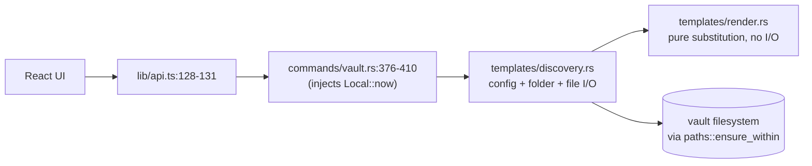
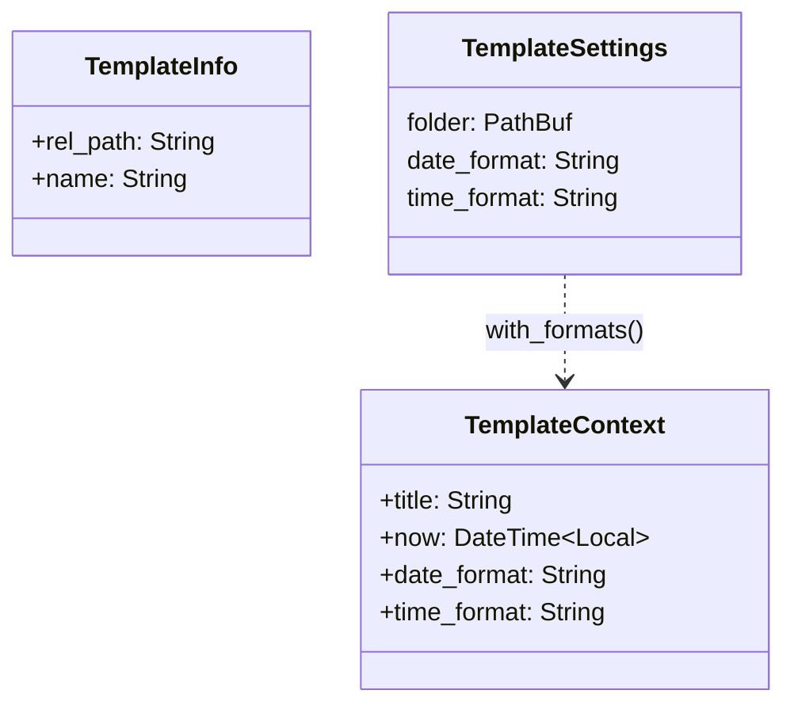
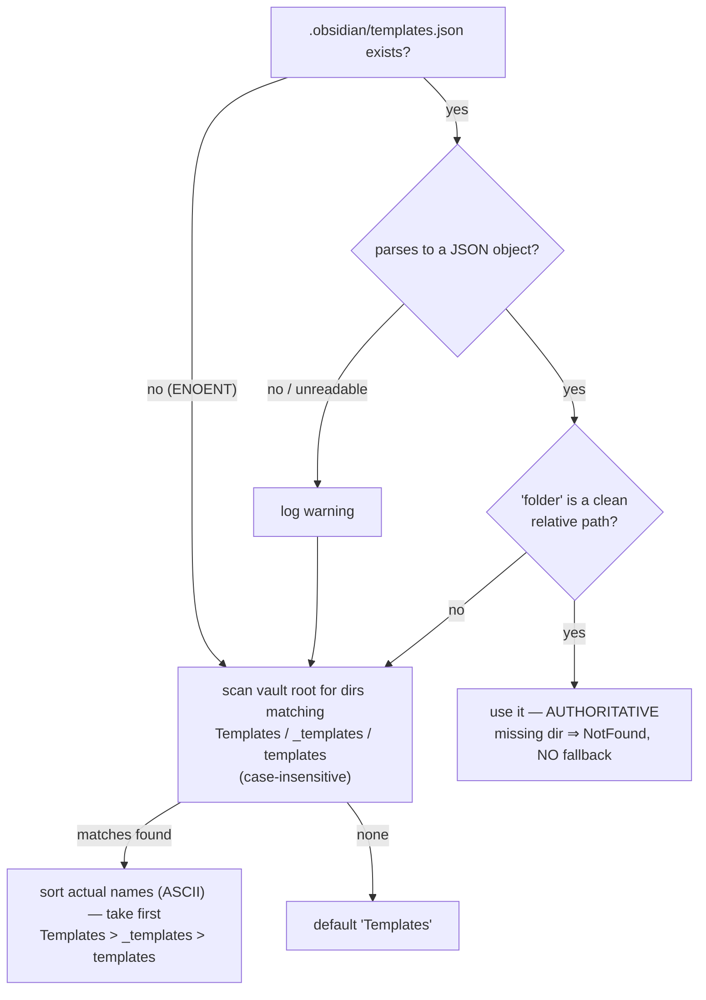

# LLD-006 — Note Templates (as-built)

> Status: **as-built documentation**, written 2026-07-10 against the
> `crates/neuralnote-core/src/templates/` module. **This subsystem has no spec** — no
> document in `specs/` describes it (see GAP-006-1). This LLD is therefore its first
> and only design record. Every factual claim carries a `file:line` anchor; anything
> inferred rather than cited says "inferred".

---

## 1. Purpose & scope

The templates subsystem lets a user create a new note pre-seeded from an
Obsidian-compatible template file living inside their vault. It understands the
Obsidian core-Templates variables (`{{title}}`, `{{date}}`, `{{time}}`, with moment.js
format strings) and a small read-only subset of the Templater plugin's syntax
(`crates/neuralnote-core/src/templates/mod.rs:1-6`).

Its security posture is stated up front because it shapes everything else: **templates
are untrusted vault content**. A migrated or shared Obsidian vault can contain
Templater templates that embed arbitrary JavaScript. NeuralNote never executes any of
it — the renderer is a whitelist interpreter over a fixed variable table, with no code
evaluation, no shelling out, no user-function dispatch, and unknown syntax passed
through verbatim (`mod.rs:3-6`). Template *files* are additionally path-scoped to the
vault's template folder, so the template argument cannot be used to read arbitrary
files (§10).

In scope: template folder discovery and Obsidian config, template listing, variable
rendering, and template-seeded note creation. Out of scope (not built): template
insertion into an existing note, Templater write-side features (`tp.file.move`,
execution blocks), and any UI concerns beyond the two Tauri commands in §2.

## 2. Position in the architecture

See the as-built HLD: [`../architecture/system-overview.md`](../architecture/system-overview.md).

Templates live entirely in the client-agnostic core (`crates/neuralnote-core/src/templates/`,
declared at `crates/neuralnote-core/src/lib.rs:17`), split into two files with a
deliberate purity boundary:

- `templates/discovery.rs` — folder discovery, Obsidian config, file resolution,
  note creation. All I/O lives here (`discovery.rs:1-6`).
- `templates/render.rs` — pure text substitution, no filesystem or vault access
  (`render.rs:1-6`).

The Tauri shell exposes exactly two commands, both thin delegators per the project's
"thin shell" convention: `list_templates`
(`app/desktop/src-tauri/src/commands/vault.rs:376-379`) and
`create_note_from_template` (`vault.rs:381-410`), consumed by the frontend via
`listTemplates` / `createNoteFromTemplate` in `app/desktop/src/lib/api.ts:128-131`.
The clock is injected by the shell (`chrono::Local::now()` at `vault.rs:408`), which
is what makes the core deterministic under test (fixed clock helper,
`crates/neuralnote-core/src/lib.rs:41-48`).



Dependencies inside the core: `paths::{ensure_within, rel_path}` (the path-safety
spine, `paths.rs:1-3`), `entries::create_note`, `note::write_note`, and
`tree::{read_tree, markdown_files, is_markdown_ext}` (`discovery.rs:12-13`).

## 3. The central design decision: a whitelist interpreter, never an evaluator

This is the most important thing in this document.

Obsidian's Templater plugin is a JavaScript evaluator. A Templater template can run
`<% tp.system.command("…") %>` (shell out), `<%* app.vault.delete() %>` (execution
block with full API access), or `require('child_process')`. Opening a hostile vault in
Obsidian-with-Templater and instantiating a template is code execution.

NeuralNote takes the opposite design: the renderer **parses a fixed whitelist of
variables and emits everything it does not recognise verbatim**. Concretely:

- There is no `eval`, no embedded JS engine, and no dispatch table of callables
  anywhere in the module. `render_templater` is a chain of literal string matches
  against exactly five names (`render.rs:142-172`); anything else returns `None`,
  which makes the scanner copy the original `<% … %>` block unchanged into the output
  (`render.rs:89-92`).
- `render.rs` performs no I/O of any kind — its only imports are `chrono` and the two
  format-default constants (`render.rs:8-9`); the module doc declares the boundary
  (`render.rs:2-6`).
- The whitelist is closed over *values*, not behaviour: every supported variable
  expands to either the note title or a formatted timestamp (§7). There is no
  variable that can touch the vault, the filesystem, the network, or the process.

The hostile-input test corpus (`lib.rs:866-881`,
`untrusted_templater_commands_are_left_verbatim`) renders these inputs:

```text
<% process.exit(1) %>
<%* app.vault.delete() %>
<% require('child_process') %>
<% tp.system.command("rm -rf /") %>
<% tp.user.somefn() %>
```

and asserts the output equals the input, byte for byte. The same fail-safe covers
unknown Obsidian variables and unclosed markers: `{{evil}}`, `{{ }}`, `unclosed {{`,
`unclosed <%` all round-trip verbatim, and a note created from such a template
contains the literal text (`lib.rs:909-934`).

**Consequence:** NeuralNote can safely open a vault containing hostile Templater
templates, because it never executes them — it renders them as literal text. The
worst a malicious template can do is look ugly. This is the property that makes the
headline onboarding path ("open an existing Obsidian vault") safe without a template
audit step, and it must be preserved: any future "extend template support" work that
introduces callable dispatch or an expression evaluator would forfeit it.

## 4. Public API surface

All exports funnel through `templates/mod.rs:11-15`:

| Item | Signature (as built) | Anchor |
|---|---|---|
| `list_templates` | `fn(root: &Path) -> CoreResult<Vec<TemplateInfo>>` | `discovery.rs:29-48` |
| `create_note_from_template` | `fn(root: &Path, parent: &Path, name: &str, template: Option<&str>, now: DateTime<Local>) -> CoreResult<TreeNode>` | `discovery.rs:51-80` |
| `render_template` | `fn(content: &str, ctx: &TemplateContext) -> String` | `render.rs:46-99` |
| `TemplateContext::new` | `fn(title: impl Into<String>, now: DateTime<Local>) -> Self` — default formats | `render.rs:21-28` |
| `TemplateContext::with_formats` | `pub(super)`; adds `date_format`/`time_format` (used by discovery with vault config) | `render.rs:30-42` |
| `remove_created_note_after_template_write_failure` | `pub(crate)` cleanup helper, re-exported for tests only (`#[cfg(test)]`) | `mod.rs:14-15`, `discovery.rs:82-91` |

Notes:

- `list_templates` returns `Ok(vec![])` when no template folder exists — zero-config
  vaults are not an error (`discovery.rs:32-34`, test `lib.rs:407-410`). Results are
  sorted case-insensitively by `rel_path` with a case-sensitive tiebreak
  (`discovery.rs:41-46`).
- `render_template` is infallible by design: `-> String`, never `Result`, never
  panics (§12).
- The shell command wrapper pre-normalises the `template` argument through
  `ensure_within` + `rel_path` before calling the core (`vault.rs:390-401`) — see
  GAP-006-6 for a behavioural wrinkle this introduces.

## 5. Data model



- `TemplateInfo { rel_path, name }` (`crates/neuralnote-core/src/model.rs:92-101`):
  `rel_path` is the vault-relative `/`-joined path; `name` is the file stem. It is
  `ts-rs`-exported, so `app/desktop/src/lib/bindings/TemplateInfo.ts` is generated,
  never hand-edited (project convention).
- `TemplateContext { title, now, date_format, time_format }` (`render.rs:12-18`).
  Defaults: `date_format = "YYYY-MM-DD"`, `time_format = "HH:mm"` (`mod.rs:17-18`).
- `TemplateSettings` is private plumbing between config and rendering
  (`discovery.rs:21-26`); it is where the Obsidian `dateFormat`/`timeFormat` land
  before being handed to `TemplateContext::with_formats` (`discovery.rs:71-72`).

Everything is transient — nothing in this subsystem persists state of its own; the
only writes are the created note itself.

## 6. Template folder discovery

`infer_template_settings` (`discovery.rs:159-171`) resolves the folder in this
precedence order:

**(a) `.obsidian/templates.json`** (`read_obsidian_template_config`,
`discovery.rs:173-218`). Recognised keys: `folder`, `dateFormat`, `timeFormat` —
matching Obsidian's core-Templates plugin config. `dateFormat`/`timeFormat` are taken
when non-empty strings (`discovery.rs:204-213`; empty strings keep defaults, test
`lib.rs:731-760`). `folder` is sanitised through `parse_relative_path`
(`discovery.rs:215-218`) — absolute paths, `..`, and empty values are discarded as if
unset.

The configured `folder` is **authoritative**: if it parses cleanly but names a
directory that does not exist, there is **no fallback** — discovery does not go
looking for a `Templates/` folder instead. `existing_template_folder` returns `None`
(`discovery.rs:147-149`), so `list_templates` returns empty (`discovery.rs:32-34`)
and `create_note_from_template` with a template fails `NotFound("template folder not
found: …")` (`discovery.rs:104-109`, test `lib.rs:593-608` for the analogous
no-folder case).

A *malformed or unreadable* config, by contrast, **does** fall back to scan
discovery: unreadable file (`discovery.rs:178-184`), invalid JSON
(`discovery.rs:186-194`), or non-object JSON (`discovery.rs:196-202`) each log a
warning and return `None`, after which step (b) runs. Tests: `lib.rs:641-670`
(malformed), `lib.rs:672-697` (config path is a directory), `lib.rs:699-729`
(malformed + array configs).

Document the asymmetry, because it is surprising: **a config you can't parse is
ignored; a config you can parse is obeyed even when it points at nothing.** A user
whose `templates.json` names a folder they later renamed gets an empty template list
with no error from `list_templates` (only `create` errors), while a user whose config
is corrupt silently gets fallback behaviour. Inferred: this follows Obsidian's own
semantics (the config is the user's explicit choice), but nothing in the code or a
spec records that intent. See GAP-006-3.

**(b) Vault-root scan** (`discover_top_level_template_folder`,
`discovery.rs:220-263`). Scan the vault root (one level only, not recursive) for
directories whose name case-insensitively matches one of
`FALLBACK_FOLDERS: ["Templates", "_templates", "templates"]` (`discovery.rs:19`).
Non-directories with matching names are skipped (`discovery.rs:250-259`, tests
`lib.rs:762-786`). All matches are collected, then **sorted, and the first taken**
(`discovery.rs:261-262`).

> **Critical correction — the precedence is lexicographic on the actual on-disk
> directory name, NOT the order of the `FALLBACK_FOLDERS` array.** The array at
> `discovery.rs:19` is only a case-insensitive *membership set*; the tie-break is
> `matches.sort()` over the real names at `discovery.rs:261`, which is ASCII byte
> order. Because `'T'` (0x54) < `'_'` (0x5F) < `'t'` (0x74), the effective precedence
> is `Templates` > `_templates` > `templates`. For the three canonical spellings this
> *happens to coincide* with the array's order — which is exactly what makes it a
> trap: the coincidence invites the reading "earlier in the array wins", but the
> array is never consulted for precedence, so reordering it changes nothing, and
> mixed-case on-disk names (`TEMPLATES/`, `TeMpLaTeS/`) match via the
> case-insensitive membership test but then sort by their **actual on-disk
> spelling**, where array intuition gives no answer at all. The test
> `template_folder_discovery_prefers_sorted_matching_directory_names`
> (`lib.rs:813-825`) pins the sort semantics: with both `templates/` and
> `_templates/` present, **`_templates` wins** and only its contents are listed.
> See GAP-006-4.

**(c) Default.** If neither (a) nor (b) yields a folder, the setting defaults to
`"Templates"` (`discovery.rs:18`, `discovery.rs:169`). If that folder doesn't exist
either, behaviour is the empty-list / `NotFound` pair described above.



## 7. The variable grammar — exhaustive

The renderer recognises exactly the following. Everything not listed here renders
**verbatim**.

### Obsidian core variables (`{{ … }}`, `render_obsidian`, `render.rs:123-140`)

| Variable | Expansion | Notes |
|---|---|---|
| `{{title}}` | `ctx.title` | `render.rs:126` |
| `{{date}}` | `ctx.date_format` over `now` | `render.rs:127` |
| `{{time}}` | `ctx.time_format` over `now` | `render.rs:128` |
| `{{date:FMT}}` | `FMT` over `now` | prefix match on `date:`; `FMT` is trimmed (`render.rs:129-132`) |
| `{{time:FMT}}` | `FMT` over `now` | `render.rs:133-138` |

The inner text is trimmed first (`render.rs:124`), so `{{ title }}` works; `{{ }}` and
`{{evil}}` match nothing and stay verbatim (`lib.rs:913-919`).

### Templater subset (`<% … %>`, `render_templater`, `render.rs:142-172`)

| Expression | Expansion | Notes |
|---|---|---|
| `tp.file.title` | `ctx.title` | exact string match (`render.rs:144-146`) |
| `tp.date.now([fmt])` | `fmt` (or default date format) over `now` | `render.rs:147-152` |
| `tp.date.tomorrow([fmt])` | same, over `now + 1 day` | `render.rs:153-158`; day shift saturates to `now` on overflow (`render.rs:204-206`) |
| `tp.date.yesterday([fmt])` | same, over `now − 1 day` | `render.rs:159-164` |
| `tp.file.creation_date([fmt])` | `fmt` (or default date format) over **`now`** | `render.rs:165-170` — this is the **injected render clock, not the file's real creation time**; a freshly created note makes them coincide, but the value is not read from the filesystem (see GAP-006-5) |

Everything else falls through `None` → verbatim: `tp.system.*`, `tp.user.*`,
`tp.web.*`, `tp.frontmatter.*`, `<%* … %>` execution blocks (the leading `*` makes the
trimmed inner text match nothing), and any unlisted `tp.date.*` member
(`render.rs:171`, corpus in §3).

Marker interleaving: whichever of `{{` / `<%` occurs first in the remaining text is
handled first; on a tie the Obsidian marker wins (`next_marker`, `render.rs:113-121`;
test `lib.rs:883-892`). An opener with no matching closer dumps the rest of the input
verbatim and stops (`render.rs:64-67`, `render.rs:80-83`).

### Format-argument parsing (`parse_format_call`, `render.rs:174-202`)

Accepted argument shapes inside `name( … )`:

- `"FMT"` or `'FMT'` — quoted string, first char must be the quote and the arg must
  end with the same quote, length ≥ 2 (`parse_quoted`, `render.rs:193-202`).
- `["FMT"]` — a single-element array wrapping a quoted string
  (`parse_optional_format`, `render.rs:186-191`; exercised at `lib.rs:1002-1003`).
- Empty argument list `()` → default format (`render.rs:179-182`).

Anything else — unquoted args, unbalanced quotes (`<% tp.date.now("oops) %>`), a
missing `(` or `)` — makes the parse return `None` and **the whole call is left
verbatim** (`render.rs:174-178`; test `lib.rs:894-899`). Note the parse is strict
`strip_prefix(name)` then `strip_prefix('(')`: a space between the name and `(`
(`tp.date.now ("…")`) also falls through verbatim (inferred from `render.rs:175-177`;
no test pins this).

### The moment.js token table (`format_moment` / `render_moment_token`, `render.rs:208-263`)

Exhaustive supported set, matched **longest-first** by the order of the array at
`render.rs:236-254` (`YYYY`/`MMMM`/`dddd` before their shorter prefixes):

| Token | chrono | Meaning | | Token | chrono | Meaning |
|---|---|---|---|---|---|---|
| `YYYY` | `%Y` | 4-digit year | | `HH` | `%H` | 24h, zero-padded |
| `YY` | `%y` | 2-digit year | | `H` | `%-H` | 24h, no pad |
| `MMMM` | `%B` | full month name | | `hh` | `%I` | 12h, zero-padded |
| `MMM` | `%b` | short month name | | `h` | `%-I` | 12h, no pad |
| `MM` | `%m` | month, zero-padded | | `mm` | `%M` | minutes |
| `M` | `%-m` | month, no pad | | `ss` | `%S` | seconds |
| `DD` | `%d` | day, zero-padded | | `A` | `%p` | AM/PM |
| `D` | `%-d` | day, no pad | | `a` | `%p` lowercased | am/pm (`render.rs:259-261`) |
| `dddd` | `%A` | full weekday | | `ddd` | `%a` | short weekday |

Literal escape: `[ … ]` emits its contents verbatim with the brackets stripped
(`render.rs:213-220`); `{{date:YYYY [at] HH:mm}}` → `2026 at 15:04`
(`lib.rs:454-467`). An **unclosed `[`** dumps the remainder of the format string
verbatim *including the bracket*: `{{date:[unclosed}}` → `[unclosed`
(`render.rs:214-217`, test `lib.rs:901-907`).

Any character that is not a supported token and not a bracket is copied through
one char at a time (`render.rs:225-227`) — which means **unknown moment tokens
(`w`, `Do`, `E`, `Z`, …) silently become literal text**: `{{date:[Week] w}}` renders
`Week w` (`lib.rs:454-459`). No warning is produced anywhere (see GAP-006-2).

## 8. The linear-time scan

`render_template` is a single forward scan with cached marker positions
(`render.rs:46-105`). The subsection exists because both the fix and the *test design*
carry a lesson.

**The pathological input is completed marker pairs, not unmatched ones.** Consider
`"{{}}"` repeated 200 000 times. A naive scanner that, after consuming each tiny
`{{}}` block, re-runs `content.find("{{")` *and* `content.find("<%")` over the entire
remaining tail does O(n) work per block searching for the **absent other marker**
(`<%` never occurs, so that `find` scans to the end every time) — O(n²) overall,
minutes of wall time at this size. Unmatched openers (`"{{"` × 50 000) do **not**
exhibit this: with no closing `}}`, the scanner dumps the tail and breaks after one
pass (`render.rs:64-67`), so an unmatched-only test would pass even against the
quadratic implementation and proves nothing about linearity. The test suite says
exactly this in its own comment (`lib.rs:937-939`).

**The fix is `refresh_marker`** (`render.rs:101-105`): each marker's next position is
computed once up front (`render.rs:49-50`) and cached; on each loop iteration the
cache is re-searched *only if the cached hit has fallen behind the cursor*
(`cached.is_some_and(|pos| pos < cursor)`), and the re-search starts *from the
cursor*, not from the beginning. A cached `None` stays `None` — once a marker is
known to be absent from the tail it is never searched again. Each byte of input is
therefore scanned a bounded number of times.

**Performance tests** (`assert_template_renders_under`, `lib.rs:936-990`), each
bounded at 2 seconds and asserting verbatim output:

| Test | Input | Anchor |
|---|---|---|
| `completed_obsidian_pairs_render_linearly` | `{{}}` × 200 000 | `lib.rs:952-959` |
| `completed_templater_pairs_render_linearly` | `<%%>` × 200 000 | `lib.rs:961-968` |
| `far_marker_mix_renders_linearly` | `{{}}` × 200 000 then one `<%%>` (the "other marker exists, but far away" shape) | `lib.rs:970-977` |
| `pathological_unmatched_delimiters_render_without_hanging` | `{{` × 50 000 | `lib.rs:979-990` |

Why the test design matters as much as the fix: a regression that reintroduced
tail-re-searching would sail through the unmatched-openers test and through every
functional test (output is identical either way — the bug is purely complexity). Only
the completed-pairs corpus distinguishes O(n) from O(n²). When touching this scanner,
keep those three completed-pair tests; they *are* the specification of linearity.

## 9. Note creation ordering and cleanup

`create_note_from_template` (`discovery.rs:51-80`) sequences deliberately:

1. **Read and validate the template first** (`discovery.rs:60-63`): resolve settings,
   scope-check the path, read the file. Any failure here — missing folder, missing
   file, out-of-scope path — returns **before any note exists**, so a bad template
   creates no note (tests `lib.rs:559-591`, `lib.rs:610-625`: the note file is
   asserted absent after the error).
2. `entries::create_note` creates an empty `.md` (`discovery.rs:65`) — this is also
   where name validation and duplicate refusal happen (`AlreadyExists` leaves an
   existing note untouched, `lib.rs:496-507`).
3. Render with the note's file stem as `title` and the configured formats
   (`discovery.rs:66-73`), then `note::write_note` (`discovery.rs:74`).
4. **On write failure**, `remove_created_note_after_template_write_failure` deletes
   the just-created blank note and the original error is returned
   (`discovery.rs:74-77`). The cleanup is idempotent: a `NotFound` from
   `remove_file` is swallowed; any other cleanup error is logged (`log::warn!`) and
   otherwise ignored — the write error, not the cleanup error, is what surfaces
   (`discovery.rs:82-91`, test `lib.rs:627-639`).

A `None` template is the legitimate "blank note" path: step 1 is skipped and the
empty note from step 2 is the result (`discovery.rs:60-63`, `discovery.rs:78-79`;
test `lib.rs:407-422`).

```mermaid
sequenceDiagram
    participant C as create_note_from_template
    participant D as discovery (I/O)
    participant E as entries/note
    C->>D: read_template (validate scope, read bytes)
    Note over C,D: any error here ⇒ return; no note created
    C->>E: entries::create_note → empty .md
    C->>C: render_template (pure)
    C->>E: note::write_note(rendered)
    alt write fails
        C->>E: remove created blank note (NotFound swallowed)
        C-->>C: return the write error
    end
```

## 10. Security model

Two independent layers:

**Rendering is inert** — §3. No whitelisted variable performs I/O; hostile syntax is
literal text.

**Template paths are scoped** (`resolve_template_file`, `discovery.rs:99-131`):

- `parse_relative_path` (`discovery.rs:265-288`) rejects absolute paths, any `..`
  component, root/prefix components, `.`-only and empty paths → `InvalidName:
  "template path must be vault-relative"` (`discovery.rs:110-111`). Backslashes are
  normalised to `/` first (`discovery.rs:266`), closing the Windows-separator
  variant.
- `ensure_within(root, …)` (`paths.rs:16-43`) canonicalises and proves vault
  containment — this is the symlink/`..` escape guard.
- The resolved path must additionally sit **inside the template folder**, not merely
  inside the vault → `InvalidName` otherwise (`discovery.rs:113-118`; test corpus
  includes an in-vault-but-outside-folder file, `lib.rs:568-569`).
- Extension whitelist: `.md`/`.markdown`/`.mdx` via `tree::is_markdown_ext`
  (`discovery.rs:119-123`, `tree.rs:115-117`) → `InvalidName: "template must be a
  markdown file"`.
- The template-folder path itself is also `ensure_within`-checked when it exists
  (`discovery.rs:151`), so a template folder that is a symlink out of the vault
  errors rather than being followed (inferred from `ensure_within` semantics; no
  test pins the symlinked-folder case specifically).

The rejection corpus test (`lib.rs:559-591`) covers: out-of-folder, non-markdown,
`/etc/passwd`, `../secret.md`, empty string, and `"."` — all `InvalidName`, all with
no note created.

**Non-UTF-8 templates decode lossily rather than failing**: `read_template` uses
`String::from_utf8_lossy` (`discovery.rs:93-97`), so a Latin-1 template from an old
vault produces a note with `�` replacement characters instead of an error
(test `lib.rs:788-811`). Inferred trade-off: creation always succeeds, at the cost of
silent byte replacement in this path (the note-*reading* side surfaces a `lossy_text`
notice, `model.rs:85-89`, but template instantiation itself does not warn).

## 11. Invariants & guarantees

| # | Invariant | Anchor |
|---|---|---|
| I-1 | Rendering never executes template content; unrecognised syntax is emitted verbatim | `render.rs:142-172`, `render.rs:74-76/89-92`; tests `lib.rs:866-881`, `lib.rs:909-934` |
| I-2 | `render.rs` performs no I/O; all filesystem access lives in `discovery.rs` | `render.rs:1-9` (imports are `chrono` + constants only) |
| I-3 | `render_template` is total: returns `String`, never errors, never panics on hostile input | `render.rs:46`; `catch_unwind` sweep `lib.rs:992-1011` |
| I-4 | Rendering is O(n) in template length, including completed-pair floods | `render.rs:101-105`; perf tests `lib.rs:952-990` |
| I-5 | A template that cannot be resolved/read creates **no** note (validate-before-create) | `discovery.rs:60-65`; tests `lib.rs:589`, `lib.rs:624` |
| I-6 | A failed template write leaves no blank note behind (cleanup, idempotent) | `discovery.rs:74-77`, `discovery.rs:82-91`; test `lib.rs:627-639` |
| I-7 | Template files are only ever read from inside the resolved template folder, inside the vault, with a markdown extension | `discovery.rs:110-123`; test `lib.rs:559-591` |
| I-8 | The clock is injected, never read ambiently in the core — deterministic rendering under test | `discovery.rs:56`, `vault.rs:408`; fixture `lib.rs:41-48` |
| I-9 | A vault with no templates is zero-config: empty list, no error | `discovery.rs:32-34`; test `lib.rs:407-410` |
| I-10 | Rendered output composes with the rest of the core: a frontmatter template yields parseable Obsidian markdown | test `lib.rs:827-864` |

## 12. Error handling & failure modes

Error surface (all `CoreError`, `error.rs` via `discovery.rs:10`):

| Failure | Result | Anchor |
|---|---|---|
| Vault root unreadable | `Io("vault root unreadable: …")` | `discovery.rs:295-298` |
| Template folder missing (configured or default) | `list` → `Ok(vec![])`; `create` with template → `NotFound("template folder not found…")` | `discovery.rs:32-34`, `discovery.rs:104-109` |
| Template folder path is a file | treated as missing (above) | `discovery.rs:152-156`; tests `lib.rs:762-786` |
| Template path invalid (absolute / `..` / `.` / empty / non-markdown / outside folder) | `InvalidName` | `discovery.rs:110-123` |
| Template path escapes vault via symlink/`..` | `OutsideVault` (from `ensure_within`) | `discovery.rs:112`, `paths.rs:38-42` |
| Template file missing | `NotFound("template not found: …")` | `discovery.rs:124-129` |
| Duplicate note name | `AlreadyExists`, existing note untouched | via `entries::create_note`, test `lib.rs:496-507` |
| Note write fails after create | write error returned; blank note removed | `discovery.rs:74-77` |
| Config unreadable / malformed / non-object | warn + fall back to scan discovery | `discovery.rs:178-202` |
| Root-scan I/O errors | warn + skip (per entry) or warn + no match (whole scan) | `discovery.rs:221-259` |
| Non-UTF-8 template | lossy decode, succeeds | `discovery.rs:96` |
| Hostile Unicode / malformed markers / weird format args | verbatim output, **never a panic** — `catch_unwind` sweep over `""`, lone `{{`/`<%`, truncated calls, emoji inside format strings, bracketed-array args | `lib.rs:992-1011` |

Consistency with the project's "failures are never silent" rule: template *resolution*
failures are loud (typed errors), config failures are logged warnings with fallback —
but two degradations are genuinely silent to the user: unknown moment tokens
(GAP-006-2) and lossy template decoding at instantiation time (§10, noted under
GAP-006-2's suggested fix as the same warning channel).

## 13. Testing

The templates section of `crates/neuralnote-core/src/lib.rs` (`lib.rs:341-1011`) is
the module's whole test suite — there are no unit tests inside `templates/` itself
(test-only re-export at `mod.rs:14-15` exists precisely so `lib.rs` can reach the
cleanup helper).

Covered:

- Config honouring (folder + both formats), fallback folders, zero-config vaults
  (`lib.rs:343-422`).
- Full variable grammar: Obsidian core, Templater subset, bracket literals, marker
  ordering (`lib.rs:424-467`, `lib.rs:883-892`).
- Note creation golden path incl. frontmatter round-trip through `note::read_note`,
  duplicates, `None` template (`lib.rs:469-508`, `lib.rs:827-864`).
- Scope enforcement corpus, missing folder/file with no-note-created assertions
  (`lib.rs:510-625`).
- Cleanup helper (`lib.rs:627-639`).
- Config failure matrix: malformed, unreadable (dir-as-file), array, empty formats
  (`lib.rs:641-760`).
- Folder-is-file, matching-file-skipped, lossy decode, lexicographic discovery
  precedence (`lib.rs:762-825`).
- Hostile Templater corpus, unterminated quotes, unclosed brackets, unknown/unclosed
  variables (`lib.rs:866-934`).
- Linearity perf quartet (§8) and the no-panic `catch_unwind` sweep
  (`lib.rs:936-1011`).

Gaps in coverage (all minor):

- No test for a **symlinked template folder** pointing outside the vault
  (§10, inferred-safe via `ensure_within`).
- No test for `tp.date.now ("…")` (space before paren) or other near-miss call
  shapes beyond the unterminated-quote case.
- No test that `Templates/` beats `_templates/` when *both* exist (the pinned case is
  `templates` vs `_templates`); the full three-way ordering is inferred from
  `matches.sort()`.
- Cleanup's "other errors are logged" branch (`discovery.rs:86-90`) is untestable
  cheaply and is untested (inferred: acceptable).
- No e2e/journey test at the IPC tier was found for the template flow (searched
  bindings/API only — inferred from the absence of template references outside
  `api.ts:128-131`; a jsdom+mockIPC journey is the project's stated bar for
  user-facing flows, `docs/definition-of-done.md` §1).

## 14. Known gaps & edge cases

| ID | Description | Evidence | Impact | Suggested fix |
|---|---|---|---|---|
| GAP-006-1 | **No spec exists for this subsystem.** Nothing in `specs/` describes templates; the main spec mentions templates only as an Obsidian pain point NeuralNote avoids ("zero macros, zero templates, zero config"). The feature shipped undocumented; this LLD is the first design record. | `specs/` listing; `specs/neural-note.md:66,105` | Design intent (e.g. the §6a asymmetry, the Templater subset choice) is unrecoverable except from code and tests; drift is invisible. | Adopt this LLD as the reference; add a short slice spec if the feature grows (template insertion, more variables). |
| GAP-006-2 | **Unknown moment tokens render literally, silently.** `{{date:[Week] w}}` → `"Week w"`; a typo'd token (`DDDD`, `hh:mn`) produces plausible-looking literal text with no warning anywhere. Tension with the project rule "failures are never silent" (`CLAUDE.md` conventions). | `render.rs:225-227`; test `lib.rs:454-459` | Users get wrong-looking dates that read as intentional text; hard to self-diagnose. | Return a warnings channel from rendering (e.g. `(String, Vec<RenderWarning>)` or a callback) and surface unrecognised tokens/lossy decode in the UI; keep output identical. |
| GAP-006-3 | **Configured-folder-missing asymmetry.** A parseable config naming a missing folder is authoritative (empty list, `NotFound` on create — no fallback), while a malformed/unreadable config falls back to scan discovery. Two adjacent failure shapes behave oppositely. | `discovery.rs:147-149,104-109` vs `discovery.rs:178-202`; tests `lib.rs:593-608`, `lib.rs:641-729` | Surprising: renaming your templates folder without updating `templates.json` makes templates vanish without an error in the list view, while corrupting the config "fixes" it. | Either fall back with a logged warning in both cases, or (better, preserving Obsidian semantics) surface "configured template folder X is missing" as a visible state in `list_templates` rather than a silent empty list. Record the chosen intent in the spec. |
| GAP-006-4 | **Discovery precedence is lexicographic on on-disk names, not `FALLBACK_FOLDERS` array order.** The array is only a case-insensitive membership set; `matches.sort()` decides, so `Templates` > `_templates` > `templates` (ASCII `'T'<'_'<'t'`). The array's order coincidentally matches that sort for the canonical spellings, which invites the wrong "array order wins" mental model — reordering the array changes nothing, and mixed-case on-disk names sort by their actual spelling. | `discovery.rs:19` vs `discovery.rs:261-262`; test `lib.rs:813-825` (`_templates` beats `templates`) | Latent maintainer trap: a precedence "fix" via array reordering silently no-ops, and adding a new name could shuffle precedence unexpectedly. | Add a comment at `discovery.rs:19` stating the array is unordered membership and the sort decides; or make precedence explicit by iterating the array in order against the collected matches. |
| GAP-006-5 | **`tp.file.creation_date` returns the render-time clock, not the file's creation time.** For a freshly created note they coincide (inferred), but the semantics diverge from Templater, and any future "insert template into existing note" feature would silently stamp the wrong date. | `render.rs:165-170` (uses `ctx.now`); `discovery.rs:56` (now = injected clock) | Fidelity gap vs Templater; a footgun for future template-insertion work. | Document as intentional for v1 (render.rs comment); if insertion ships, plumb the file's real ctime into `TemplateContext`. |
| GAP-006-6 | **Shell and core disagree on absolute template paths.** The core rejects any absolute path (`InvalidName`), but the Tauri command pre-normalises: an absolute path *inside the vault* passes `ensure_within`, is converted to a rel path, and is accepted (`vault.rs:393-399`), while the same path handed to the core directly is refused (`discovery.rs:271-272`). Two behavioural contracts for one operation. | `vault.rs:390-401` vs `discovery.rs:265-288` | Minor: no security hole (both layers enforce vault containment, and the folder-scope check still runs in core), but the API contract is inconsistent and the shell layer isn't covered by the core's rejection corpus. | Drop the absolute-path branch in the command wrapper and pass the raw string through, letting the core be the single validator (thin-shell convention, `CLAUDE.md`). |

## 15. Suggested improvements

Ordered by value; none are urgent.

1. **A render-warnings channel** (fixes GAP-006-2 and the silent lossy decode in one
   move): rendering stays infallible, but unrecognised tokens, verbatim-fallthrough
   Templater calls, and lossy template decoding become surfaced notices, matching the
   `lossy_text` pattern the note reader already uses (`model.rs:85-89`).
2. **Make discovery precedence self-documenting** (GAP-006-4) — one comment or an
   explicit ordered iteration; cheap insurance against a maintainer "fix".
3. **Resolve the config asymmetry deliberately** (GAP-006-3) and write the decision
   down; today the behaviour is defensible but unowned.
4. **Collapse the shell's template-path pre-normalisation** into the core
   (GAP-006-6), restoring one validator and the thin-shell rule.
5. **A jsdom + mockIPC journey test** for create-from-template, per the definition of
   done's e2e bar for user-facing flows.
6. If template coverage ever grows toward fuller Templater compatibility, grow the
   *whitelist* (more value-producing variables like `tp.date.weekday`), never an
   evaluator — §3 is the constraint, not a starting point.

## 16. References

- Source: `crates/neuralnote-core/src/templates/mod.rs`, `templates/discovery.rs`,
  `templates/render.rs`; `crates/neuralnote-core/src/model.rs:92-101`
  (`TemplateInfo`); `crates/neuralnote-core/src/paths.rs` (path spine).
- Shell/frontend seam: `app/desktop/src-tauri/src/commands/vault.rs:376-410`;
  `app/desktop/src/lib/api.ts:128-131`; generated
  `app/desktop/src/lib/bindings/TemplateInfo.ts`.
- Tests: `crates/neuralnote-core/src/lib.rs:341-1011` (templates section) plus
  fixtures at `lib.rs:41-52`.
- Architecture context: [`../architecture/system-overview.md`](../architecture/system-overview.md);
  shipping bar: `docs/definition-of-done.md`; project conventions: repo `CLAUDE.md`.
- External behaviour being emulated: Obsidian core Templates plugin
  (`.obsidian/templates.json`, `{{title}}/{{date}}/{{time}}` with moment.js formats)
  and the Templater community plugin's `tp.*` namespace (emulated read-only, §3, §7).
