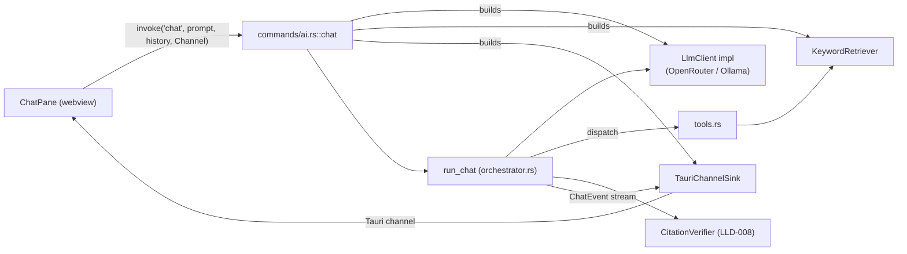

# LLD-007 — Chat Orchestration & the Agentic Tool Loop

> As-built low-level design, verified against the code on 2026-07-10 (branch
> `feature/conversational-chat` base). Every factual claim carries a `file:line` anchor; where
> something is inferred rather than cited, it says "inferred:". Paths are repo-relative.

---

## 1. Purpose & scope

This document describes the **chat orchestration layer** of NeuralNote's cited chat: the agentic
loop that hands an LLM four vault tools, drives tool-deciding turns until the model chooses to
answer (or a guard forces it), verifies every citation the answer makes, and streams the whole run
to the UI as a typed event protocol.

Files covered, all in `crates/neuralnote-core/src/ai/` unless noted:

| File | Role |
|---|---|
| `orchestrator.rs` | `run_chat`, the tool loop, guards, history sanitisation, citation extraction |
| `tools.rs` | The four tool schemas and the total dispatcher |
| `events.rs` | The `ChatEvent` protocol and the `EventSink` trait |
| `mod.rs` | The `ai` facade and its re-exports |

**Out of scope, covered by siblings:**

- **LLD-008** — retrieval (`retrieval.rs`), the evidence registry (`evidence.rs`), and citation
  verification (`verify.rs`). This document treats `RetrievalProvider`, `EvidenceRegistry`, and
  `CitationVerifier` as black boxes at their trait/struct seams.
- **LLD-009** — LLM transport and SSE (`llm.rs`, `openai.rs`, and the shell's
  `app/desktop/src-tauri/src/ai.rs` HTTP client). This document uses `LlmClient` as a trait and
  only describes transport behaviour where the orchestrator depends on it.

**Spec staleness note (once, here):** the governing spec `specs/ai-cited-chat-slice.md` still
carries the status line "design, approved in principle (2026-07-07)" (`specs/ai-cited-chat-slice.md:3`),
but the slice it describes is fully built — the code in this document is that implementation.
Treat the spec as intent and this document as reality.

---

## 2. Position in the architecture

See [`../architecture/system-overview.md`](../architecture/system-overview.md) for the full HLD.
In brief: the orchestrator is the top of the client-agnostic Rust core's AI stack
(`crates/neuralnote-core/src/ai/mod.rs:1-15`). It is **network-free and runtime-agnostic** — the
LLM transport arrives as a `&dyn LlmClient`, retrieval as a `&dyn RetrievalProvider`, and events
leave via a `&mut dyn EventSink` (`orchestrator.rs:77-86`). The Tauri shell's `chat` command
(`app/desktop/src-tauri/src/commands/ai.rs:274-347`) builds the concrete pieces — a
`KeywordRetriever`, an `OpenAiChatClient` (OpenRouter) or an Ollama-backed client, and a
`TauriChannelSink` — and both provider arms converge on the **same** `run_chat` call
(`app/desktop/src-tauri/src/commands/ai.rs:319-345`). Wiring lives at that composition seam; the
loop itself never constructs a dependency.



---

## 3. Public API surface

Everything below is re-exported from the `ai` facade (`mod.rs:28-43`).

| Item | Signature / value | Anchor |
|---|---|---|
| `run_chat` | `pub async fn run_chat(user_prompt: &str, history: &[LlmMessage], root: &Path, model: &str, provider: &dyn RetrievalProvider, llm: &dyn LlmClient, sink: &mut dyn EventSink, guards: &Guards) -> CoreResult<()>` | `orchestrator.rs:77-101` |
| `Guards` | `pub struct Guards { max_iterations: usize, max_spans: usize, max_context_chars: usize }`, `Default` = 8 / 60 / 60 000 | `orchestrator.rs:26-46` |
| `DEFAULT_MODEL` | `"anthropic/claude-sonnet-4.5"` — the client-agnostic OpenRouter default; the host may override | `orchestrator.rs:21` |
| `ChatEvent` | serde-tagged event enum, 11 variants (§4) | `events.rs:21-62` |
| `EventSink` | `pub trait EventSink: Send { fn send(&mut self, event: ChatEvent); }` — **infallible by design**: "an event stream must not fail mid-run" | `events.rs:68-70` |

Two properties of `run_chat`'s contract worth stating plainly:

- **The run always resolves via the event stream**: success ends with `Done`, a surfaced failure
  ends with `Error` (`orchestrator.rs:70-72`). The `CoreResult<()>` return is nearly always `Ok`
  — the internal driver's error is caught and converted to a `ChatEvent::Error`
  (`orchestrator.rs:94-99`); the shell still defensively surfaces a returned `Err` as a final
  `Error` event (`app/desktop/src-tauri/src/commands/ai.rs:384-399`).
- **`EventSink::send` cannot fail**, so the orchestrator has no back-channel to learn the UI went
  away. That is the root of the cancellation gap (GAP-007-1).

---

## 4. The event protocol

`ChatEvent` is a serde-tagged enum: `#[serde(tag = "type", rename_all = "camelCase",
rename_all_fields = "camelCase")]` (`events.rs:15-19`), exported to TypeScript via `ts-rs`
(`events.rs:20`). On the wire, `Reading { rel_path: "a/b.md", start_line: 3, end_line: 5 }`
serialises as `{"type":"reading","relPath":"a/b.md","startLine":3,"endLine":5}` — asserted in
tests (`events.rs:94-116`). Tool *argument* names, by contrast, are `snake_case`: those are
LLM-facing, not part of this frontend contract (`tools.rs:5-7`).

### 4.1 All 11 variants

| Variant | Wire tag | Payload (camelCase on the wire) | Emitted when | Anchor |
|---|---|---|---|---|
| `Searching` | `searching` | `query: String` | Just **before** a `search_notes` dispatch (the live "searching…" cue) | `events.rs:23`, `orchestrator.rs:278-281` |
| `Retrieved` | `retrieved` | `query: String`, `hitCount: u32` | After a search returns, with the deduped span count | `events.rs:25`, `orchestrator.rs:292-295` |
| `Reading` | `reading` | `relPath: String`, `startLine: u32`, `endLine: u32` | After a `read_note_span` dispatch | `events.rs:27-31`, `orchestrator.rs:310-314` |
| `Thinking` | `thinking` | `delta: String` | Reasoning tokens streamed during the answer turn, only if the client streams them | `events.rs:33` |
| `Verifying` | `verifying` | — | Once, after the tool loop ends and before the answer streams (the UI cue that grounding has begun) | `events.rs:35`, `orchestrator.rs:147` |
| `CitationDropped` | `citationDropped` | `reason: String` | A cited id failed verification (unknown id, or the source check failed) — the drop is never silent | `events.rs:38`, `orchestrator.rs:331-343` |
| `Answer` | `answer` | `delta: String` | Each streamed chunk of the final answer | `events.rs:40` |
| `Citation` | `citation` | `id`, `relPath`, `startLine: u32`, `endLine: u32`, `text` | A cited id survived verification; locates and quotes the source | `events.rs:43-49`, `orchestrator.rs:335-341` |
| `Coverage` | `coverage` | `searchedTerms: Vec<String>`, `notesRead: Vec<String>`, `truncated: bool`, `skippedFiles: u32` | Once, after citations — the honesty footer (§12) | `events.rs:52-57`, `orchestrator.rs:360-370` |
| `Error` | `error` | `message: String` | A fatal, user-facing error ended the run — terminal, **no `Done` follows** | `events.rs:59`, `orchestrator.rs:94-99` |
| `Done` | `done` | — | The run completed successfully — always the last event of a successful run | `events.rs:61`, `orchestrator.rs:157` |

### 4.2 Guaranteed ordering

The enum's declaration order is **not** the emission order; the guarantees below come from the
control flow in `drive` (`orchestrator.rs:122-159`) and are asserted in tests
(`orchestrator.rs:727-736`):

1. Zero or more tool-phase events, interleaved per call: each `Searching` precedes its
   `Retrieved`; `Reading` events appear per read. (`list_notes`/`list_folders` emit no event —
   `orchestrator.rs:317-319`.)
2. Exactly one `Verifying`, after the tool loop, before any `Answer` delta.
3. `Thinking` deltas (if any), then `Answer` deltas, during the streaming call. (Ordering within
   the stream is the transport's — LLD-009; the mock emits all `Thinking` before `Answer`,
   `orchestrator.rs:603-614`.)
4. `Citation` / `CitationDropped` events, in the answer's first-appearance citation order
   (`orchestrator.rs:329`), after the full answer has streamed. Note: despite `Verifying` firing
   before the stream, the actual checks run on the *completed* answer text
   (`orchestrator.rs:145-155`) — `Verifying` is a UI cue, not the moment of verification.
5. Exactly one `Coverage`.
6. `Done` — or, on any surfaced failure at any point, a single terminal `Error` instead, with no
   `Done` and no footer (asserted: `orchestrator.rs:983-993`).

### 4.3 Sequence diagram of a full successful turn

```mermaid
sequenceDiagram
    participant FE as Frontend (Tauri channel)
    participant O as run_chat / drive
    participant L as LlmClient
    participant T as tools::dispatch
    participant V as CitationVerifier

    O->>O: prepare_history (strip [eN], window to 12k chars)
    loop up to guards.max_iterations (8)
        O->>L: complete(messages, 4 tool schemas)
        L-->>O: Completion { tool_calls }
        alt no tool calls
            Note over O: clean stop — model chose to answer
        else tool calls
            O->>FE: Searching {query} (search calls only)
            O->>T: dispatch(name, args)
            T-->>O: ToolResult {content, outcome}
            O->>FE: Retrieved / Reading
            Note over O: budget checked after EVERY call;<br/>once tripped, remaining calls get a skipped stub
        end
    end
    O->>FE: Verifying
    O->>L: complete_streaming(messages, ZERO tools)
    L-->>FE: Thinking* / Answer* deltas
    L-->>O: full answer text
    O->>V: verify each extracted [eN]
    O->>FE: Citation / CitationDropped (per id)
    O->>FE: Coverage {searchedTerms, notesRead, truncated, skippedFiles}
    O->>FE: Done
```

---

## 5. Turn anatomy — `run_chat` → `drive`

`run_chat` bundles its collaborators into a `ChatSession` and calls `drive`; any `Err` from
`drive` becomes a single `ChatEvent::Error` (`orchestrator.rs:87-100`). `drive`
(`orchestrator.rs:122-159`) is the whole turn:

1. **`prepare_history`** (`orchestrator.rs:132`, §10) — sanitise and window the client-supplied
   history in the core.
2. **Message assembly** — `[system, ...history, user]` (`orchestrator.rs:133-136`). The system
   prompt is always prepended here; the client never sends one (§10).
3. **`collect_evidence`** (`orchestrator.rs:141-143`, §7) — the tool loop. Returns
   `guard_tripped: bool`: `false` for a clean stop (the model returned zero tool calls,
   `orchestrator.rs:183-185`), `true` if a guard forced the stop (`orchestrator.rs:200,206`).
4. **`Verifying`** (`orchestrator.rs:147`) — the single phase-transition cue.
5. **`stream_final_answer`** (`orchestrator.rs:153`, §6) — a fresh streaming call with zero
   tools; returns the complete answer text.
6. **`emit_citations`** (`orchestrator.rs:155`, `orchestrator.rs:327-346`) — extract `[eN]` ids
   from the answer (§11), look each up in the `EvidenceRegistry`, re-verify survivors against the
   vault on disk via `CitationVerifier` (LLD-008), emit `Citation` or `CitationDropped` per id.
7. **`emit_coverage`** (`orchestrator.rs:156`, `orchestrator.rs:360-370`, §12) — the footer.
8. **`Done`** (`orchestrator.rs:157`).

**On error:** any `Err` propagating out of steps 3 or 5 (an LLM transport failure is the realistic
case — tool dispatch itself never errors, §8) aborts `drive` at that point. The catch in
`run_chat` emits one `Error` event and stops: no partial footer, no `Done`
(`orchestrator.rs:94-99`; asserted `orchestrator.rs:983-993`).

---

## 6. The two-phase LLM call — a deliberate design

The loop uses **two different LLM entry points for two different jobs**:

- **Tool-deciding turns** use `LlmClient::complete` — non-streamed
  (`orchestrator.rs:182`). A buffered response yields clean, complete `tool_calls` to parse;
  there is no partially-streamed function-call JSON to reassemble. These turns also request no
  reasoning tokens — they are never shown, so they would be invisible cost
  (`app/desktop/src-tauri/src/ai.rs:414-422`).
- **The final answer** is a **fresh** `complete_streaming` call over the accumulated messages,
  advertising **zero tools**: `self.request(messages, &[])` (`orchestrator.rs:258-266`). Because
  no tools are offered, the model cannot emit a tool call on this turn — the one thing the
  streaming path would have no way to honour and would otherwise silently swallow
  (`orchestrator.rs:148-152`). The test `answer_turn_advertises_no_tools` pins this: the mock
  records `req.tools.len()` on the streaming call and the test asserts it is `Some(0)`
  (`orchestrator.rs:884-900`, capture at `orchestrator.rs:599`).

**The cost, accepted knowingly:** the answer turn *re-generates* rather than reusing the loop's
last non-streamed completion. When the model's final `complete` turn returned content alongside
zero tool calls (the clean stop at `orchestrator.rs:183-185`), that content is discarded and paid
for again by the streaming call — one extra generation per chat turn. The trade: tool-call parsing
stays on the buffered path where it is robust, while the user still watches the answer stream
live. Given the alternative — parsing incremental tool-call fragments out of an SSE stream and
reconciling them with text deltas — the double generation is the cheaper complexity, and the
`Guards` bound its token cost like everything else. (The answer turn additionally carries an
output ceiling, `ANSWER_MAX_TOKENS = 4096` — `openai.rs:88`, applied at
`app/desktop/src-tauri/src/ai.rs:353-361`; transport detail, LLD-009.)

---

## 7. Guards and budget enforcement

```rust
Guards { max_iterations: 8, max_spans: 60, max_context_chars: 60_000 }  // Default
```
(`orchestrator.rs:35-46`. `max_spans` was bumped 40 → 60 in lockstep with the search default
going 8 → 12, so richer per-search evidence doesn't starve query diversity —
`orchestrator.rs:39-42`, `tools.rs:23-28`.)

Three independent trips, all reported honestly:

- **`max_iterations`** bounds tool-deciding turns: the `for` loop in `collect_evidence`
  (`orchestrator.rs:178`). Running out of turns while the model was still issuing tool calls
  returns `guard_tripped = true` — "the model was mid-search, so coverage is partial, not
  complete" (`orchestrator.rs:204-206`).
- **`max_spans` and `max_context_chars`** are the evidence budget, checked by
  `evidence_budget_spent` (`orchestrator.rs:254-256`): registry span count, and the running total
  of tool-result content chars fed back to the model.

**The budget is checked *inside* the per-tool-call loop, not merely between iterations**
(`handle_tool_calls`, `orchestrator.rs:217-234`): after *every* dispatched call, not once per
turn. The comment states why: one turn issuing many search calls — each up to
`MAX_SEARCH_RESULTS` spans — "must not blow past the caps before the guard fires — that is the
token-cost spike the guard exists to prevent (a BYO-key user pays for it)"
(`orchestrator.rs:225-228`). Once the budget trips mid-turn, every remaining declared call in that
turn is **not dispatched**; instead the protocol-required result slot is filled with the stub

```json
{"error":"skipped: evidence budget reached"}
```

(`push_skipped_tool_result`, `orchestrator.rs:349-358` — the OpenAI protocol demands exactly one
result per declared call, so skipped calls are told they were skipped rather than left dangling.)
The test `span_cap_stops_dispatch_within_a_turn_and_reports_partial` pins the mid-turn stop: with
`max_spans: 1` and one turn of three searches, exactly one `Searching` event fires
(`orchestrator.rs:855-882`).

**A guard trip is reported as partial coverage, never a silent stop:** `guard_tripped` is OR-ed
into the footer's `truncated` flag (`emit_coverage`, `orchestrator.rs:360-369`; asserted at
`orchestrator.rs:826-853`). The run still answers from whatever evidence it gathered — the guard
forces the answer, it does not abort the run (`orchestrator.rs:797-823`).

---

## 8. The tool surface

Four tools, advertised in this order (`tool_schemas`, `tools.rs:68-75`; pinned by test
`tools.rs:476-491`). All spans produced by `search_notes` / `read_note_span` are registered in the
`EvidenceRegistry`, which assigns the citable `eN` ids the model must use (`tools.rs:162-163`;
registry internals in LLD-008).

Schemas are built as OpenAI-compatible `{"type":"function","function":{...}}` values
(`function_tool`, `tools.rs:77-82`). The advertised JSON, verbatim as constructed:

### `list_notes` (`tools.rs:84-101`)

```json
{
  "type": "function",
  "function": {
    "name": "list_notes",
    "description": "List notes (title and relative path only, no content). Pass `folder` to list only the notes inside that folder and its subfolders; omit it to list the whole vault. Use it to discover what exists before searching.",
    "parameters": {
      "type": "object",
      "properties": {
        "folder": {
          "type": "string",
          "description": "Optional vault-relative folder to scope the listing to."
        }
      },
      "additionalProperties": false
    }
  }
}
```

### `list_folders` (`tools.rs:103-111`)

```json
{
  "type": "function",
  "function": {
    "name": "list_folders",
    "description": "List every folder in the vault, each with its vault-relative path and how many notes it holds (counted recursively). Use it to discover how the vault is organised before scoping a search or listing to a folder.",
    "parameters": { "type": "object", "properties": {}, "additionalProperties": false }
  }
}
```

### `search_notes` (`tools.rs:113-141`)

```json
{
  "type": "function",
  "function": {
    "name": "search_notes",
    "description": "Keyword-search the vault. Returns evidence spans, each with an `id` you must cite (e.g. [e1]). Search is literal — vary wording, synonyms, and tags across several searches. Pass `folder` to search only within a folder and its subfolders; omit it to search the whole vault.",
    "parameters": {
      "type": "object",
      "properties": {
        "query": { "type": "string", "description": "The keyword query." },
        "max_results": {
          "type": "integer",
          "description": "Maximum evidence spans to return (default 12).",
          "minimum": 1,
          "maximum": 20
        },
        "folder": {
          "type": "string",
          "description": "Optional vault-relative folder to scope the search to (includes subfolders)."
        }
      },
      "required": ["query"],
      "additionalProperties": false
    }
  }
}
```

The `max_results` description string is interpolated from the constant so the schema can't drift
from the real default again — "it previously still said 'default 8'" (`tools.rs:126-128`).

### `read_note_span` (`tools.rs:143-160`)

```json
{
  "type": "function",
  "function": {
    "name": "read_note_span",
    "description": "Read a bounded line range of one note for more context around a search hit. Returns an evidence span with an `id` you must cite.",
    "parameters": {
      "type": "object",
      "properties": {
        "rel_path": { "type": "string", "description": "Vault-relative path of the note." },
        "start_line": { "type": "integer", "description": "1-based first line.", "minimum": 1 },
        "end_line": { "type": "integer", "description": "1-based last line (inclusive).", "minimum": 1 },
        "max_bytes": { "type": "integer", "description": "Byte cap on the returned text." }
      },
      "required": ["rel_path", "start_line", "end_line"],
      "additionalProperties": false
    }
  }
}
```

### Clamps

| Constant | Value | Applied at |
|---|---|---|
| `DEFAULT_SEARCH_RESULTS` | 12 | `tools.rs:28`, clamp `tools.rs:261-264` |
| `MAX_SEARCH_RESULTS` | 20 | `tools.rs:29`, same clamp — a model asking for 9999 gets 20, and the call still succeeds (test `tools.rs:647-659`) |
| `DEFAULT_READ_MAX_BYTES` | 2000 | `tools.rs:30`, clamp `tools.rs:329-332` |
| `MAX_READ_MAX_BYTES` | 8000 | `tools.rs:31`, same clamp |

### Total dispatch — agentic tolerance

`dispatch` is **total** (`tools.rs:8-11,164-177`): an unknown tool name (`tools.rs:175`), a
malformed argument object (`tools.rs:257-259`, `tools.rs:325-327`), or a provider error
(`tools.rs:203-205,265-267,333-335`) all become `reject(...)` — a `ToolResult` whose content is
`{"error": "..."}` and whose outcome is `ToolOutcome::Rejected` (`tools.rs:179-184`). The model
**reads the error in its tool-result slot and recovers**; the run never hard-fails on a bad tool
call. Nuance: `list_notes` accepts a bare `{}` or empty args as "whole vault", but a *genuinely
malformed* object is surfaced rather than silently un-scoped (`tools.rs:193-201`).

**Why tolerance is the right call:** an agentic loop's tool calls are model output — probabilistic
text, not typed code. A model will occasionally hallucinate a tool name, omit a required field, or
emit invalid JSON; if any of those aborted the run, chat reliability would be hostage to the
weakest model the user selects (and this app deliberately supports small local models —
`specs/ai-providers-slice.md`, referenced from `CLAUDE.md`). Feeding the error back as a tool
result turns a would-be crash into one wasted iteration the model can correct — while the
`Guards` cap how much correcting it can attempt. Rejections deliberately emit **no user-facing
event** (`orchestrator.rs:317-319`): the detail is in the content the model reads, and the user
sees only real search/read progress.

---

## 9. The system prompt

Verbatim (`orchestrator.rs:48-65`; `\` marks the source's line continuations, the wire string is
continuous):

> You are NeuralNote's research assistant. You answer questions strictly from the user's own
> notes, using the tools provided to search and read them.
>
> Rules you must follow:
> - Answer ONLY from evidence you retrieved with the tools. Never use outside knowledge and never
>   guess.
> - Before answering, issue 3 to 8 varied searches: try synonyms, tags, note titles, and the
>   user's own wording. Keyword search is literal, so rephrase generously.
> - The vault is organised into folders. Call `list_folders` to see them (each with its note
>   count). When the user asks about a specific folder — e.g. "what's in my Recipes folder" or
>   "search my Work notes" — pass that folder's path as the `folder` argument to `search_notes`
>   or `list_notes` to scope to it and its subfolders; omit `folder` to cover the whole vault.
> - Cite every claim with the evidence id in square brackets, e.g. [e1] or [e2]. Cite ids only —
>   never a file path, and never a quote you did not retrieve.
> - If the notes do not contain the answer, say so plainly. Do not invent a citation or an
>   answer.
> - Keep the answer concise and grounded in the cited evidence.

Rule-by-rule, what (if anything) enforces it in code:

| Rule | Enforcement mechanism | Status |
|---|---|---|
| "Answer ONLY from evidence… never outside knowledge, never guess" | **Prompt-only.** No code path classifies the question or detects an answer produced from outside knowledge. An uncited fabricated answer sails through: `extract_cited_ids` returns empty, zero citations are emitted, and the run ends `Done` (§16, GAP-007-5). | ⚠️ none |
| "Issue 3 to 8 varied searches" | **Prompt-only** as a *minimum*. The *maximum* is bounded by `Guards` (8 iterations / 60 spans / 60k chars, §7), but nothing requires the model to search at all — the `no_evidence_answer_emits_no_citations` test shows an immediate answer is a legal run (`orchestrator.rs:772-794`). | ⚠️ floor unenforced, ceiling enforced |
| "Call `list_folders`… pass `folder` to scope" | **Mechanically supported, not required.** The tools accept and honour `folder` (`tools.rs:203,265`; test `orchestrator.rs:1072-1103`); whether the model uses them is its choice. | supported |
| "Cite every claim with [eN]… ids only, never a path, never a quote you did not retrieve" | **Half-enforced, on the strong half.** Every id the answer *does* cite is verified: an unknown id → `CitationDropped` (`orchestrator.rs:330-333`); a known id is re-checked against the note on disk (`orchestrator.rs:334-343`, LLD-008). But *claims with no marker at all* are unchecked — enforcement is per-citation, not per-claim. | partial |
| "If the notes do not contain the answer, say so plainly" | **Prompt-only.** The coverage footer (§12) gives the *user* the honesty signal, but nothing verifies the model's admission. | ⚠️ none |
| "Keep the answer concise" | **Indirectly bounded** by the answer turn's `ANSWER_MAX_TOKENS = 4096` output cap (`openai.rs:88`) — a ceiling, not a conciseness check. | indirect |

The pattern is deliberate and worth naming: the loop **verifies what the model asserts
(citations) and bounds what the model spends (guards), but does not police what the model omits**.
The omission half is GAP-007-5 and pairs with LLD-008's citation-entailment gap.

---

## 10. History handling

**Ownership:** conversation history lives in the **frontend** and is resent in full on every
`chat` invoke as `Vec<ChatTurn>` — plain `{role, content}` pairs
(`app/desktop/src-tauri/src/commands/ai.rs:274-279`, `app/desktop/src-tauri/src/ai.rs:220-226`).
The core holds no session state between turns.

**Role coercion:** the client is never trusted to inject `system` or `tool` roles. In the
`ChatTurn → LlmMessage` conversion, anything that isn't exactly `"assistant"` is coerced to a
`user` turn (`app/desktop/src-tauri/src/ai.rs:228-244`; test
`app/desktop/src-tauri/src/ai.rs:490-504`). Precision note: this coercion lives in the **shell's**
boundary type, not in `orchestrator.rs` — the core's `run_chat` takes `&[LlmMessage]` and would
accept any role a different host passed. The core's own backstops are the sanitisation below;
the role firewall is the host's obligation at the IPC boundary (inferred: from the type seam —
`LlmMessage` itself carries a `Role` enum, `llm.rs:42`).

**`prepare_history`** (`orchestrator.rs:489-509`) is the core-side, client-agnostic backstop,
applied before the system prompt is prepended:

- **Windowing:** walk most-recent-first, keep **whole turns** while the cleaned-content char
  budget lasts, `MAX_HISTORY_CHARS = 12_000` (`orchestrator.rs:449`); then reverse back to
  chronological order. **The newest turn is always kept** even if it alone exceeds the budget —
  "never send empty history just because one turn is huge" (`orchestrator.rs:494-506`; tests
  `orchestrator.rs:1046-1070`). Why 12k: sized so `system + history + max_context_chars + answer`
  fit the smallest supported local window (`OLLAMA_NUM_CTX = 32_768` tokens,
  `app/desktop/src-tauri/src/local.rs:44`) with headroom, because Ollama silently truncates from
  the **front** — which would drop the grounding rules and earliest evidence, breaking cited
  recall (`orchestrator.rs:430-448`).
- **`strip_cited_markers`** (`orchestrator.rs:460-482`) removes every `[eN]` marker (plus one
  preceding space) from carried turn content, using the exact same grammar as the extractor
  (§11), "so it strips exactly what the verifier would parse" (`orchestrator.rs:452-455`).

**The SUS-1 hazard this closes:** evidence ids are assigned fresh per run — `e1` in turn 3 has no
relation to `e1` in turn 1. A stale `[e1]` surviving in carried history could be **echoed by the
model into its new answer**, where `extract_cited_ids` would pick it up and the verifier would
look it up in the *current* run's registry — finding an unrelated, freshly-retrieved span that
happens to bear the same id. That span verifies cleanly against disk, so the UI would render a
**"verified" citation whose source text has nothing to do with the prose claim** — the exact
mis-citation the moat forbids (`orchestrator.rs:453-459`; the "wrong citation is worse than no
answer" invariant, `mod.rs:4-6`). Stripping all markers from history closes the hole in the core
for every client, not just this frontend (`orchestrator.rs:457-459`; test
`orchestrator.rs:1028-1043`).

---

## 11. `extract_cited_ids`

(`orchestrator.rs:390-428`.)

- **Grammar:** a citation marker is `[`, then `e` or `E` (case-insensitive,
  `is_evidence_prefix`, `orchestrator.rs:426-428`), then **one or more ASCII digits**, then `]`
  (`citation_at`, `orchestrator.rs:407-424`). `[x]`, `[e]`, and `[e1x]` are all non-matches
  (test `orchestrator.rs:995-1002`). The extracted id is normalised to lowercase-`e` form:
  `format!("e{digits}")` (`orchestrator.rs:423`), so `[E12]` cites `e12`.
- **Order and dedupe:** ids are returned in **first-appearance order**, each id once — a repeat
  `[e1]` later in the answer adds nothing (`orchestrator.rs:394-404`; test asserts
  `["e1","e2"]` from `"see [e1] and [e2], again [e1]"`, `orchestrator.rs:996-1000`). Citation
  events therefore stream in the order the reader first meets them.
- **UTF-8 safety:** the scan is byte-wise over `text.as_bytes()`, but only ASCII bytes (`[`,
  `e`/`E`, digits, `]`) are ever matched or used as slice boundaries — ASCII bytes never occur
  inside a multibyte UTF-8 sequence, so every slice lands on a char boundary
  (`orchestrator.rs:388-389`). `strip_cited_markers` relies on the same property
  (`orchestrator.rs:459`).

---

## 12. The truncated-vs-capped distinction

Two flags on `SearchOutcome` that look alike and mean opposite things
(`retrieval.rs:68-79`):

- **`truncated`** — the vault search hit its **own global caps** (200 total hits / 50 per file —
  `retrieval.rs:70-72`): more matching lines exist than *any single search can surface*. A
  genuine coverage gap.
- **`capped`** — **this call's** `max_results` clipped the returned spans. Routine: the agent
  issues many searches and the default is only 12; a common term clips constantly
  (`tools.rs:23-27`, `retrieval.rs:74-77`).

The two audiences are told different things, deliberately:

- **The model hears about either.** The tool-result JSON reports
  `"truncated": outcome.truncated || outcome.capped` (`tools.rs:292-297`) — either way, the
  model should know "there were more; refine the query or raise `max_results`".
- **The user's coverage footer reports only the former.** The `ToolOutcome::Searched` carried to
  the orchestrator sets `truncated: outcome.truncated` alone (`tools.rs:299-305`), and
  `emit_coverage` ORs that with the guard trip (`orchestrator.rs:360-369`). A routine per-call
  clip **must not** make the footer claim "partial coverage" — that would train the user to
  ignore the flag (`tools.rs:302-304`; retrieval-side test `retrieval.rs:415-431`).

This is a precise honesty mechanism: `Coverage.truncated == true` means exactly "the sweep was
genuinely cut short — a loop guard stopped it, or the vault search's global cap hid matching
lines" (`orchestrator.rs:364-367`), never "a search returned its requested maximum". The footer's
other fields carry the same discipline: `searched_terms` and `notes_read` are deduped
(`push_unique`, `orchestrator.rs:296-299,372-376`), and `skipped_files` takes the **max**, not
the sum, across searches — each full-vault search re-reports the same unreadable files, so
summing would inflate it (`orchestrator.rs:301-303`).

---

## 13. Invariants & guarantees

| # | Invariant | Anchor |
|---|---|---|
| I1 | A run always terminates through the event stream: exactly one terminal event — `Done` (success) or `Error` (failure), never both, never neither. | `orchestrator.rs:70-72,94-100,157`; tests `orchestrator.rs:724,983-993` |
| I2 | No surfaced citation without verification: every `[eN]` in the answer is registry-checked and disk-re-verified before a `Citation` event; failures become `CitationDropped` **with a reason** — never silent. | `orchestrator.rs:327-346`; tests `orchestrator.rs:931-980` |
| I3 | The final answer turn advertises zero tools, so streaming can never swallow a tool call. | `orchestrator.rs:258-266`; test `orchestrator.rs:884-900` |
| I4 | The OpenAI tool protocol is always honoured: the assistant tool-call turn precedes its results, and exactly one result exists per declared call — including budget-skipped calls, which get the skip stub. | `orchestrator.rs:187-191,349-358` |
| I5 | The evidence budget cannot be overshot by a multi-call turn: caps are checked after every dispatched call. | `orchestrator.rs:219-232`; test `orchestrator.rs:855-882` |
| I6 | Every guard trip is visible: `guard_tripped` ORs into `Coverage.truncated`. | `orchestrator.rs:360-369`; tests `orchestrator.rs:826-853,875-881` |
| I7 | `Coverage.truncated` never fires for a routine per-call `max_results` clip. | `tools.rs:296-305` |
| I8 | Tool dispatch is total: unknown names, malformed args, and provider errors become error tool results, never a run failure. | `tools.rs:8-11,164-184`; tests `tools.rs:586-603` |
| I9 | History entering a request never carries a `[eN]` marker, and never exceeds `MAX_HISTORY_CHARS` (except the always-kept newest turn). | `orchestrator.rs:489-509`; tests `orchestrator.rs:1029-1070` |
| I10 | The system prompt is core-assembled and always first; the shell coerces every non-`assistant` client role to `user`. | `orchestrator.rs:133-136`; `app/desktop/src-tauri/src/ai.rs:228-244` |
| I11 | The event wire shape is `tag="type"` + camelCase everywhere, pinned by serde tests and `ts-rs` export. | `events.rs:14-20,94-130` |
| I12 | `EventSink::send` is infallible; the core cannot fail because the UI went away (this is also the cancellation gap, GAP-007-1). | `events.rs:67-70` |

---

## 14. Error handling & failure modes

Three deliberate tiers:

**Surfaced (terminal `Error` event, run stops):**
- LLM transport failure on any turn — a `complete` error propagates out of `collect_evidence`
  (`orchestrator.rs:182`), a streaming error out of `stream_final_answer`
  (`orchestrator.rs:263-265`); both land in `run_chat`'s catch (`orchestrator.rs:94-99`). This
  includes non-2xx HTTP, in-band SSE `error` frames (HTTP already 200 —
  `openai.rs:146-149,172-190`), and an empty streamed answer (`openai.rs:70`; transport detail,
  LLD-009).
- Shell-level preconditions, surfaced as `Error` events *before* `run_chat` is even called: no
  vault open, unreadable AI config, no provider configured, no/unreadable API key, sidecar or
  model pre-flight failures (`app/desktop/src-tauri/src/commands/ai.rs:288-344,365-454`).

**Deliberately converted to recoverable tool results (run continues):**
- Unknown tool name, malformed arguments, provider errors during a tool call, span-registration
  misses — all `{"error": ...}` content the model reads (§8; `tools.rs:175,179-184,257-267,
  280-283,325-341`).
- Budget-skipped calls — the `{"error":"skipped: evidence budget reached"}` stub
  (`orchestrator.rs:349-358`).
- A dropped citation degrades that one citation, never the answer: `CitationDropped` with a
  reason, and the run still reaches `Done` (`orchestrator.rs:330-343`).

**Deliberately swallowed (skipped, not fatal, not surfaced):**
- Malformed mid-stream SSE JSON: a `data:` payload that fails to parse is classified
  `SseEvent::Other` and skipped — "mid-stream JSON glitches shouldn't kill the run"
  (`openai.rs:150-151,155-161,209`; test `sse_malformed_json_is_skipped_not_fatal`,
  `openai.rs:475`). Comments, keep-alives, and `[DONE]` markers take the same path. (Transport
  detail — LLD-009 — but the orchestrator's answer integrity depends on it.)
- Unparsable `query` in a search call's raw arguments merely suppresses the `Searching` cue
  (`peek_query` returns `None`, `orchestrator.rs:278-282,379-385`); dispatch still runs and will
  reject the malformed args itself.
- A closed frontend channel: the shell's sink logs once and drops all further events; the run
  itself continues to completion (`app/desktop/src-tauri/src/ai.rs:266-280`) — see GAP-007-1.

---

## 15. Testing

The orchestrator suite (`orchestrator.rs:511-1104`) runs network-free against a real temp-dir
vault and `KeywordRetriever`, with a scripted **`MockLlmClient`**
(`orchestrator.rs:524-617`):

- `completions: Mutex<VecDeque<Completion>>` — each `complete` turn pops the next scripted
  completion; a dry script yields a no-tool-call turn, cleanly ending the loop
  (`orchestrator.rs:578-591`).
- `answer` — streamed by `complete_streaming` as word-chunk `Answer` deltas, then returned whole
  (`orchestrator.rs:610-615`).
- `streaming_tools_len` — records `req.tools.len()` at the streaming call, powering the
  zero-tools assertion (`orchestrator.rs:533-535,599,884-900`).
- `reasoning` — optional deltas emitted as `Thinking` events before the answer, proving reasoning
  reaches the sink without polluting the answer string (`orchestrator.rs:536-537,603-609,
  902-929`).
- **`before_answer` hook** — fires just before streaming, "letting a test mutate the vault to
  simulate an external edit landing mid-answer" (`orchestrator.rs:526-527,600-602`).
- `failing()` — every `complete` errors, for the terminal-error path (`orchestrator.rs:554-563`).

Coverage highlights:

| Test | Proves | Anchor |
|---|---|---|
| `happy_path_searches_reads_and_emits_a_verified_citation` | Full pipeline; **event-ordering assertions**: `Searching` < `Retrieved`, `Verifying` < `Citation`; `Done` last | `orchestrator.rs:686-736` |
| `coverage_footer_reports_searched_terms_and_notes_read` | Footer contents on a clean run | `orchestrator.rs:738-770` |
| `no_evidence_answer_emits_no_citations` | An immediate answer is legal; empty footer; no citations | `orchestrator.rs:772-794` |
| `max_iterations_guard_stops_a_runaway_loop` / `guard_trip_reports_partial_coverage` | Guard stops the loop, still answers, footer says partial | `orchestrator.rs:796-853` |
| `span_cap_stops_dispatch_within_a_turn_and_reports_partial` | Mid-turn budget stop (§7) | `orchestrator.rs:855-882` |
| `answer_turn_advertises_no_tools` | I3 | `orchestrator.rs:884-900` |
| `citing_an_unknown_evidence_id_is_dropped` | Registry-miss drop with reason | `orchestrator.rs:931-951` |
| `a_citation_whose_note_changed_mid_answer_is_dropped` | The **`before_answer` hook** rewrites the cited note while the answer streams; the recorded hash no longer matches, so the citation is dropped (`"changed on disk"`, `verify.rs:40`) — zero `Citation` events survive | `orchestrator.rs:953-980` |
| `an_llm_transport_error_surfaces_and_stops` | Terminal `Error`, no `Done` | `orchestrator.rs:983-993` |
| `extract_cited_ids…` / `strip_cited_markers…` / `prepare_history…` (×4) | §10–§11 mechanics, incl. the SUS-1 backstop | `orchestrator.rs:995-1070` |
| `folder_scoped_search_flows_through_the_loop` | `list_folders` → scoped search → verified citation | `orchestrator.rs:1072-1103` |

The tool layer has its own suite (`tools.rs:363-660`): schema pinning, folder scoping, span
registration and id assignment, duplicate-span dedupe via a `DupProvider` fake, list honesty
(`skipped`/`truncated`/`total`) via a `TruncatedListProvider` fake, rejection paths, and the
`max_results` clamp. The event protocol's serde shape is pinned in `events.rs:87-152`, and the
in-order `VecSink` used everywhere is `events.rs:73-84`.

---

## 16. Known gaps & edge cases

| ID | Description | Evidence | Impact | Suggested fix |
|---|---|---|---|---|
| GAP-007-1 | **No cancellation.** `EventSink::send` is infallible by design (`events.rs:68-70`), so a closed channel cannot abort a run. Closing the vault or destroying the window leaves an in-flight OpenRouter chat running to completion — **still spending the user's tokens** — bounded only by `Guards`; the shell's sink just logs once and drops further events. Contrast `pull_local_model`, which **is** cancellable via an `AtomicBool` token installed before startup and honoured mid-download (`commands/ai.rs:216,230-237,248-254`). Code's own words: "TODO(chat-cancellation): the core's EventSink is infallible, so we can't abort run_chat from here — a closed channel still lets the current run finish (bounded by the guards) before it stops. A future cancellation token checked in the loop would end token spend sooner." | `app/desktop/src-tauri/src/ai.rs:266-280`; `events.rs:67-70` | Wasted paid tokens per abandoned run (up to 8 turns + 60k chars of evidence + a 4096-token answer); a "stop" button is unimplementable | Thread a cancellation token (mirroring the pull path) into `Guards` or a new `run_chat` parameter, checked at each loop head and before the answer turn; trip it from the sink's closed detection and from an explicit `cancel_chat` command |
| GAP-007-2 | **No retry or backoff anywhere.** A single transient 429/5xx (or dropped connection) on any tool-deciding turn errors the whole run — evidence gathered so far is discarded and the user gets a terminal `Error`. Code's own words: "TODO(llm-retry): add one bounded backoff retry for idempotent tool-deciding `complete` turns on transient 429/5xx/dropped connection (not the streaming answer, PA-029)." | `orchestrator.rs:179-182`; propagation `orchestrator.rs:141-143,94-99` | Poor resilience against exactly the failures OpenRouter rate limiting makes routine; local sidecar cold-starts hit it too | Implement the TODO: one bounded backoff retry on `complete` turns only (they are idempotent — no state was committed); leave the streaming answer un-retried |
| GAP-007-3 | **Char-based budgets assume ~4 chars/token.** All three context budgets (`max_context_chars` 60k, `MAX_HISTORY_CHARS` 12k, and the sizing against `OLLAMA_NUM_CTX` 32 768) count chars. A CJK or symbol-dense vault tokenises nearer ~2 chars/token, so a near-max evidence turn can exceed a small local `num_ctx` and be **silently front-truncated by Ollama** — dropping the grounding rules and earliest evidence, i.e. degrading exactly the citation fidelity the loop protects. Code's own words: "TODO(token-aware-context-budget): all budgets here are in CHARS with an implicit ~4-chars/token assumption. A CJK/symbol-dense vault tokenises closer to ~2 chars/token, so a near-max evidence turn (`max_context_chars` 60k) could still exceed a small local `num_ctx` and be silently front-truncated. The robust fix is a token-aware (or provider-aware) budget that counts the *assembled* prompt against the active window before send — deferred because it couples to the model's RAM sizing. The English/Latin common case has ample headroom after this cap (H1), so the residual is a narrow edge." | `orchestrator.rs:442-448`; `app/desktop/src-tauri/src/local.rs:44` | Local-provider users with CJK/symbol-dense vaults can get silently degraded grounding on evidence-heavy turns | Token-aware (or at least provider-aware) budget on the assembled prompt before send, per the TODO |
| GAP-007-4 | **`tools.rs`'s module doc is stale.** It opens "Three tools, all whole-vault (folder/note scoping is deferred): `list_notes` …, `search_notes` …, and `read_note_span`" — but **four** tools exist (`list_folders` added, `tools.rs:19,68-75`) and folder scoping **is implemented** end-to-end (`tools.rs:93-98,132-135`, `retrieval.rs`, test `orchestrator.rs:1072-1103`). Documentation drift inside the code itself. | `tools.rs:3-4` vs `tools.rs:18-21,68-75` | A reader trusting the module doc gets the tool surface wrong; erodes trust in the other doc comments | One-line doc fix: "Four tools; `folder` scopes search/listing" |
| GAP-007-5 | **Grounding is prompt-only.** No code path decides whether a question was factual, and nothing detects an answer produced from outside knowledge with **zero** `[eN]` markers — such an answer emits no citations, an empty-ish footer, and a clean `Done` (legal by test `orchestrator.rs:772-794`). Verification is per-*citation*, not per-*claim* (§9). This is one half of a two-part weakness: even a *cited* claim is only checked for "the span still exists on disk unchanged", not for whether the span's text entails the claim — see **LLD-008's citation-entailment gap** for that other half. Together: uncited claims are unchecked, and cited claims are source-checked but not meaning-checked. | `orchestrator.rs:48-65` (rules), `orchestrator.rs:327-346` (per-citation-only verification) | A confident hallucination with no markers renders indistinguishable from a grounded uncited summary; the moat's "never outside knowledge" rule rests entirely on model obedience | Cheap first step: flag (UI badge or footer field) any non-refusal answer with zero citations when evidence was gathered; the fuller fix is claim-level entailment checking, shared with LLD-008 |

---

## 17. Suggested improvements

Ordered by leverage:

1. **Cancellation token (GAP-007-1)** — the only gap that spends the user's money after they've
   walked away, and the pull path already demonstrates the exact pattern in this codebase
   (`commands/ai.rs:216,230-254`). Highest value, known shape.
2. **Bounded retry on tool-deciding turns (GAP-007-2)** — one retry with backoff on 429/5xx,
   `complete` only. Small change, large reliability win for the BYO-key path.
3. **Zero-citation answer flagging (GAP-007-5, cheap half)** — the orchestrator already knows
   whether evidence was gathered and whether any citation survived; a `grounded: bool` (or
   count) on the `Coverage` footer would let the UI badge unverified answers without any new
   model call. Coordinate the fuller entailment check with LLD-008.
4. **Fix the `tools.rs` module doc (GAP-007-4)** — one line, restores trust in the file's
   otherwise-precise comments.
5. **Token-aware context budget (GAP-007-3)** — correctly deferred (it couples to local-model RAM
   sizing), but worth a cheap interim: expose the chars-vs-tokens assumption in the local-model
   settings docs, or scale `MAX_HISTORY_CHARS`/`max_context_chars` down when the active provider
   is Local with a small `num_ctx`.
6. **Consider reusing the clean-stop content (§6)** — if the final `complete` turn's content is
   non-empty when the model stops calling tools, it could be emitted as the answer (re-chunked)
   instead of paying for a re-generation. Trade-off: loses live streaming for that turn and adds
   a second answer path to verify; only worth it if token cost measurably bites. Documented here
   so the current double-generation stays a *decision*, not an accident.

---

## 18. References

- Source (all repo-relative):
  - `crates/neuralnote-core/src/ai/orchestrator.rs` — loop, guards, history, extraction
  - `crates/neuralnote-core/src/ai/tools.rs` — schemas + dispatcher
  - `crates/neuralnote-core/src/ai/events.rs` — `ChatEvent` / `EventSink`
  - `crates/neuralnote-core/src/ai/mod.rs` — facade
  - `crates/neuralnote-core/src/ai/llm.rs` — `LlmClient` seam (detail in LLD-009)
  - `crates/neuralnote-core/src/ai/retrieval.rs` — `SearchOutcome.truncated`/`capped` (detail in LLD-008)
  - `app/desktop/src-tauri/src/commands/ai.rs` — the `chat` command and provider arms
  - `app/desktop/src-tauri/src/ai.rs` — `ChatTurn` coercion, `TauriChannelSink`, HTTP client
- Sibling documents:
  - [`../architecture/system-overview.md`](../architecture/system-overview.md) — as-built HLD
  - `LLD-008` — retrieval, evidence registry, citation verification (incl. the entailment gap paired with GAP-007-5)
  - `LLD-009` — LLM transport & SSE (wire shapes, in-band error frames, `ANSWER_MAX_TOKENS`, redaction)
- Specs & bars:
  - `specs/ai-cited-chat-slice.md` — the governing slice spec (status line stale, §1)
  - `specs/neural-note.md` — product spec; the citation-fidelity moat
  - `docs/definition-of-done.md` — the shipping bar this slice was built against
