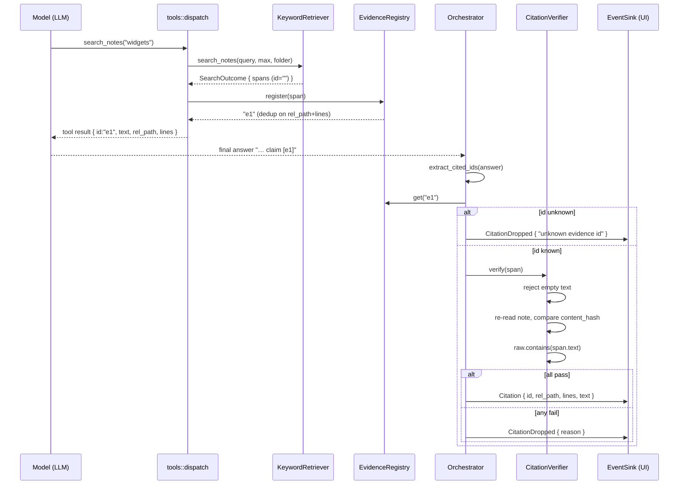

# LLD-008 — Retrieval, Evidence & Citation Verification (as-built)

> Status: as-built documentation, 2026-07-10 (branch `feature/conversational-chat` base).
> Every factual claim carries a `file:line` anchor; where something is inferred rather
> than cited, it says "inferred:". Covers `crates/neuralnote-core/src/ai/retrieval.rs`,
> `ai/evidence.rs`, and `ai/verify.rs`. The chat loop that drives them is LLD-007
> (chat orchestration); the vault keyword search they delegate to is LLD-004 (search &
> graph). This document does not restate those — it documents the seam between them.

---

## 1. Purpose & scope

Retrieval in NeuralNote today is **lexical keyword search over the vault's markdown
files, at line granularity**. A search hit becomes a single-line quotation
(`crates/neuralnote-core/src/ai/retrieval.rs:174-183`); a follow-up read returns an
arbitrary contiguous line range (`retrieval.rs:277-296`). There is **no embedding
model, no vector store, no SQLite index, and no chunker anywhere in the codebase** —
a repo-wide search for embedding/vector/chunker implementations returns nothing outside
comments and SSE-parsing variable names. The master spec describes all four: an
"Indexer — SQLite for structure/metadata; embedded vector store for embeddings of the
**full-source chunks**" (`specs/neural-note.md:289-290`) and "Retrieval / RAG — scoped
retrieval … over full-source chunks, returning chunks with exact provenance (file +
offset, or video timestamp)" (`specs/neural-note.md:291-293`). None of that exists.
The slice spec that this code implements says so itself: "It is **not** the
full-source cited-recall moat (spec §1). That needs embeddings, chunking, a vector
store, and full-source capture — all of which stay deferred here"
(`specs/ai-cited-chat-slice.md:16-17`).

What *is* built is the discipline around that keyword search: every quotable piece of
evidence is a typed `EvidenceSpan`, every citable id is owned by a per-run
`EvidenceRegistry`, and every citation the model emits is re-verified against the
live vault before it is surfaced. This document describes that mechanism precisely —
including what its verification does **not** prove (Section 9), which is the largest
gap in the product measured against its own spec.

## 2. Position in the architecture

See [`../architecture/system-overview.md`](../architecture/system-overview.md) for the
layered picture and [`../architecture/spec-vs-built.md`](../architecture/spec-vs-built.md)
for the full spec-drift ledger (rows 27, 39, 40, 66-67, 78 concern this module).

These three files are the evidence layer of the client-agnostic AI core
(`crates/neuralnote-core/src/ai/`). The orchestrator (LLD-007, `ai/orchestrator.rs`)
drives them through the `RetrievalProvider` trait; the tool dispatcher (`ai/tools.rs`)
translates model tool calls into trait calls and registers the resulting spans; the
verifier runs once per cited id after the answer streams.

The module docs anticipate the missing semantic retriever explicitly: "A later
embedding-RAG retriever slots in as just another `RetrievalProvider` returning the
same `EvidenceSpan` shape, with no change to the chat layer" (`ai/mod.rs:13-15`;
same promise at `ai/retrieval.rs:5-7` and `ai/evidence.rs:4-5`). **The seam exists;
the implementation does not.** What a real `VectorRetriever` would additionally need
is sketched in Section 16.

## 3. Public API surface

### `RetrievalProvider` (trait, `retrieval.rs:85-113`)

Sync ("it is file I/O"), `Send + Sync` so the orchestrator's future stays `Send`
(`retrieval.rs:82-84`). Four methods:

```rust
fn list_notes(&self, folder: Option<&str>) -> CoreResult<ListOutcome>;          // retrieval.rs:89
fn list_folders(&self) -> CoreResult<Vec<FolderMeta>>;                          // retrieval.rs:93
fn search_notes(&self, query: &str, max_results: usize, folder: Option<&str>)
    -> CoreResult<SearchOutcome>;                                               // retrieval.rs:97-102
fn read_note_span(&self, rel_path: &str, start_line: u32, end_line: u32,
    max_bytes: usize) -> CoreResult<EvidenceSpan>;                              // retrieval.rs:106-112
```

Spans come back with a placeholder `id`; the registry assigns the real citable id
(`retrieval.rs:83-84`).

### `KeywordRetriever` (`retrieval.rs:116-130`)

The only implementation. Holds the vault root, canonicalized up front so
vault-relative paths match the tree scan's on symlinked roots like macOS
`/var` → `/private/var` (`retrieval.rs:122-128`).

### `EvidenceRegistry` (`evidence.rs:38-86`)

Per-run map from citable id (`"e1"`, `"e2"`, …) to span. `register` (`evidence.rs:59-69`),
`get` (`evidence.rs:73-75`), `len`/`is_empty` (`evidence.rs:79-85`; `len` feeds the
orchestrator's `max_spans` guard, `evidence.rs:77-78`).

### `CitationVerifier` (`verify.rs:14-48`)

Holds the vault root; one method, `verify(&self, span: &EvidenceSpan) -> Result<(), String>`
(`verify.rs:29`), where the `Err` string is the human-readable reason carried into a
`CitationDropped` event (`verify.rs:24-25`).

## 4. Data model

### `EvidenceSpan` (`evidence.rs:19-29`)

```rust
pub struct EvidenceSpan {
    pub id: String,           // registry-assigned handle ("e1", …)
    pub rel_path: String,     // vault-relative note path
    pub content_hash: String, // owning note's hash at capture time
    pub start_line: u32,      // 1-based, inclusive (evidence.rs:25)
    pub end_line: u32,
    pub text: String,         // verbatim substring of the note's raw content
}
```

**There are no character offsets.** The slice spec's contract was
`{ rel_path, content_hash, start_line, end_line, char_start?, char_end?, text }`
(`specs/ai-cited-chat-slice.md:71`); the built type carries lines only. Citation
granularity is therefore the line, never a byte range within it — and the master
spec's "file + offset, or video timestamp" provenance (`specs/neural-note.md:292-293`)
is further away still.

`content_hash` reuses the vault's existing `note::content_hash` — a `DefaultHasher`
64-bit digest, deliberately not cryptographic ("No crypto dependency", `verify.rs:6-7`;
algorithm at `note.rs:22-27`). `text` is guaranteed a verbatim substring of the raw
note so the verifier's `contains` check is meaningful (`evidence.rs:16-18`,
`retrieval.rs:302-306`).

### Supporting types

- `NoteMeta { title, rel_path }` — metadata only, never content (`retrieval.rs:30-35`).
- `FolderMeta { rel_path, note_count }` — recursive note count per folder
  (`retrieval.rs:40-45`).
- `ListOutcome { notes, skipped, truncated, total }` — listing plus its honesty
  signals: unreadable notes counted, cap flagged, true total reported
  (`retrieval.rs:52-63`).
- `SearchOutcome { spans, truncated, capped, skipped_files }` — spans plus coverage
  signals (`retrieval.rs:67-80`; the `truncated`/`capped` distinction is Section 7).

Persistence: none of this is persisted. The registry, spans, and coverage state live
for one `run_chat` call and are dropped (inferred: no serialization of the registry
exists; `EvidenceSpan` is serde-serializable only for the tool-result JSON and events).

## 5. What a "chunk" is here

A "chunk" in this system is:

- **for a search hit — a single line.** `collect_spans` builds one span per content
  match with `slice_lines(&lines, m.line, m.line, …)` — start and end are the same
  line (`retrieval.rs:174-183`).
- **for `read_note_span` — an arbitrary contiguous line range** chosen by the model,
  clamped to the note's bounds (`retrieval.rs:277-296`, clamping at
  `retrieval.rs:317-318`).

Spans are keyed and deduped by `(rel_path, start_line, end_line)` (`evidence.rs:60`).
These are **not paragraphs, not semantic units, not embedding chunks** — nothing
resembling the spec's "full-source chunks" (`specs/neural-note.md:291`).

Consequence for citation precision: a verified citation points at exactly one line
(or one model-chosen range) of one note — very sharp for jump-to-source, but very
thin as *evidence*. A claim that a human would support with a paragraph is backed by
whichever single line the keyword landed on; surrounding context reaches the model
only if it issues a follow-up `read_note_span`, and multi-line reads become a
different span with a different id. Line-granularity also means a claim synthesised
across several lines cannot cite them as one unit — the model either cites several
ids or (more likely) cites the one hit line, under-representing its actual basis.

## 6. Retrieval algorithm

`search_notes` (`retrieval.rs:242-275`):

1. Delegate to `search::search_vault_with_content` (`retrieval.rs:253`;
   `search.rs:46` — LLD-004), which returns hits **plus** the raw content it already
   loaded, keyed by path.
2. **Filter hits by folder scope before the result cap** (`retrieval.rs:254-260`), so
   a folder's own matches are never lost to whole-vault hits that merely ranked ahead
   of them. Scope matching (`in_scope`, `retrieval.rs:347-364`) is slash-normalised,
   case-insensitive, whole-component ("Cook" ≠ "Cooking/…"), and includes subfolders.
3. `collect_spans` (`retrieval.rs:142-188`) builds one single-line span per match,
   **reusing the already-loaded content — no second disk read** (PA-007,
   `retrieval.rs:157-166`) — and computes `content_hash` over that same content
   (`retrieval.rs:167`), byte-identical to what `read_note` would load
   (`retrieval.rs:140-141`, single-source-of-truth note at `note.rs:18-21`), so the
   verifier's recomputed hash can match.
4. A hit whose content was **not** retained (delete/permission race between the scan
   and now) is counted in `skipped_readback`, logged with a `warn!`, and folded into
   `skipped_files` — never silently dropped (`retrieval.rs:159-166`,
   `retrieval.rs:270-273`).

`read_note_span` (`retrieval.rs:277-296`) goes through `note::read_note`, which runs
`ensure_within` — a `../` in `rel_path` is refused, not read (`retrieval.rs:284`,
`note.rs:79`; test `retrieval.rs:592-596`). `slice_lines` clamps the range, keeps
original line endings so the text stays a verbatim substring even for CRLF notes,
trims the trailing newline, and bounds to `max_bytes` on a char boundary
(`retrieval.rs:299-340`).

`list_notes` reads at most `MAX_LIST_NOTES` (200) notes but counts every in-scope
note for the honest `total`, flagging `truncated` past the cap (PA-002,
`retrieval.rs:23-27`, `retrieval.rs:203-211`); unreadable notes are skipped loudly
and counted (`retrieval.rs:214-225`).

## 7. `truncated` vs `capped` — the honesty distinction

`SearchOutcome` separates two different clips (`retrieval.rs:70-77`):

- **`truncated`** — the vault search hit its **own global caps** (200 total matches /
  50 per file, `search.rs:20-22`): a genuine coverage gap; more matching lines exist
  than any single search can surface. This is what drives the user-facing "partial
  coverage" footer (`retrieval.rs:264-268`).
- **`capped`** — this call's `max_results` clipped the spans. Routine (the agent
  issues many searches) and must **not** drive the footer; it only tells the model
  "there were more, refine if you need to" (`retrieval.rs:74-77`).

The model is told about *either* cap in its tool result (`tools.rs:295-297`), but only
`truncated` reaches the coverage footer (`tools.rs:299-305`). How the footer
accumulates across a run — including guard trips also reporting partial coverage — is
LLD-007 (`orchestrator.rs:360-370`). Tests pin the distinction both ways
(`retrieval.rs:414-445`).

## 8. The evidence registry — why the model cannot invent a source

The registry, not the model, owns id assignment. `register()` **ignores any incoming
id** ("it is a placeholder; the registry owns id assignment", `evidence.rs:49-51`,
overwrite at `evidence.rs:65`), dedupes on `(rel_path, start_line, end_line)`
(`evidence.rs:60-62`) so the same evidence found by two searches collapses to one
stable id, and hands back sequential `e1`, `e2`, … (`evidence.rs:64`). `get()` returns
`None` for an id never handed out — "a fabricated citation the caller must drop"
(`evidence.rs:71-74`).

The system prompt instructs the model to cite ids only — "never a file path, and
never a quote you did not retrieve" (`orchestrator.rs:61-62`) — but the *enforcement*
is structural, not prompt-based: the answer text is scanned for `[eN]` markers only
(`orchestrator.rs:390-405`), each id is resolved through `registry.get`
(`orchestrator.rs:330`), and an unknown id emits `CitationDropped` with reason
"unknown evidence id" (`orchestrator.rs:331-333`; test `orchestrator.rs:932-951`).

This closes the classic "model invents a citation to a file it never read" attack
precisely: a fabricated citation needs a valid id, valid ids exist only for spans the
retrieval layer actually produced from real vault content during this run, and the
span behind the id — path, lines, text, hash — was recorded by trusted code, not by
the model. The model cannot mint an id, cannot repoint an id at a different file, and
cannot alter the quoted text attached to one. What it *can* still do with a legitimate
id is Section 9.

## 9. Citation verification — the crux

### 9.1 The algorithm (`verify.rs:29-48`)

For each cited span, in order, all three must pass:

1. **Reject empty `text` up front** — `raw.contains("")` is vacuously true, so an
   empty span would otherwise verify against any note. Empty text is reachable: a
   blank line, an empty note, or `max_bytes` truncating a multibyte first char to
   zero (`verify.rs:31-36`).
2. **Re-read the note from disk** and **compare `content_hash`** — a mismatch means
   the note changed since capture: dropped with "the note changed on disk since it
   was read" (`verify.rs:37-41`). A note that cannot be re-read (deleted,
   permissions) is a drop, not a hard error — one bad citation never sinks the answer
   (`verify.rs:27-28`, `verify.rs:37-38`).
3. **Assert `doc.raw.contains(&span.text)`** — "belt-and-suspenders alongside the
   hash: guards a span whose recorded text was never actually in the note (a
   fabricated quote paired with a real hash)" (`verify.rs:42-46`).



(Emission loop: `orchestrator.rs:327-346`.)

### 9.2 What this proves — and what it does not

Passing verification proves the citation is a **real, current, verbatim quote from
that note**: the span was produced by the retrieval layer during this run, the note
is unchanged since capture, and the quoted text occurs in it verbatim. That is a
**provenance** guarantee.

It does **not** prove the quote **supports the claim it is attached to**. Nowhere in
`verify.rs` — or anywhere else in the codebase — is the *claim text* compared with
the *evidence text*. There is no entailment check, no LLM-judge, no semantic
comparison of any kind. `verify()` takes only the span (`verify.rs:29`); the answer's
prose never reaches it.

### 9.3 The exact bypass

1. The model legitimately retrieves span `e1`, whose text is
   `"Widgets are small components."` (the fixture line at `retrieval.rs:391`).
2. It writes: **"Widgets cure cancer [e1]."**
3. `verify(e1)` runs: text is non-empty; the note is unchanged, so the hash matches;
   `raw.contains("Widgets are small components.")` holds. **All three checks pass.**
4. A green, verified `Citation` event is emitted (`orchestrator.rs:334-341`) for a
   claim the source does not support. Nothing in the pipeline catches this.

The UI then renders exactly what the spec calls the worst outcome — a confident,
"verified" wrong citation.

### 9.4 What the spec requires

The master spec fixes the mechanism, and calls it the crux:

> "**Mechanism (the moat's crux, not an implementation detail):** the model is
> constrained to answer *only* from retrieved chunks and to tag each claim with its
> source chunk id; a **post-hoc verification pass** then checks that each cited chunk
> actually entails its claim, and **drops or flags any citation that fails**.
> Generated citation markers are never trusted unverified — that is exactly how a
> confident wrong citation slips through." — `specs/neural-note.md:294-299`

And §6: "**never fabricate a citation** … Every citation is verified before it
reaches the user … *A wrong citation is worse than no answer*"
(`specs/neural-note.md:318-321`).

The built verifier's own contract, by contrast:

> "Before any citation is surfaced, its span is re-read from disk and proven current:
> the note's content hash must be unchanged since the span was captured AND the
> quoted text must still occur verbatim." — `verify.rs:3-5`

The built check verifies **provenance**; the spec demands **entailment**. In the
Section 9.3 bypass, the citation marker *is* trusted in exactly the sense the spec
forbids: its claim-to-evidence link goes unexamined. To be fair to the slice: the
slice spec only ever asked for the provenance check (`specs/ai-cited-chat-slice.md:75-78`)
and the code meets that bar — but the product bar is the master spec's, and against
it this is the single largest architectural gap in the codebase
(`../architecture/spec-vs-built.md`, ledger row "Post-hoc verification").

### 9.5 The second half of the same weakness: uncited answers

Verification is driven entirely by `extract_cited_ids(answer)`
(`orchestrator.rs:329`). An answer produced from the model's outside knowledge with
**no `[eN]` markers at all** yields zero ids, zero `Citation` events, zero
`CitationDropped` events — and streams to the user unchallenged. The
no-evidence path is even pinned by a test as correct behaviour
(`orchestrator.rs:773-794`). Uncited hallucination is not detected anywhere;
grounding is enforced only by the system prompt ("Answer ONLY from evidence you
retrieved with the tools. Never use outside knowledge", `orchestrator.rs:53-54`) —
an instruction, not a mechanism. The coverage footer tells the user what was
searched and read (`orchestrator.rs:360-370`), which is honest context, but it does
not flag an answer whose claims cite nothing.

### 9.6 What is genuinely strong — credit where due

The provenance guarantee is real, layered, and well-tested:

- An unknown or invented id is dropped (`orchestrator.rs:331-333`; test
  `orchestrator.rs:932-951`).
- A note edited **mid-answer** fails the hash check and is dropped — pinned by a test
  that mutates the vault between evidence collection and streaming
  (`orchestrator.rs:954-980`).
- A **fabricated quote paired with the note's real, current hash** is caught by the
  `contains` check — explicitly tested (`verify.rs:88-103`).
- An empty-text span cannot verify vacuously (`verify.rs:31-36`; test
  `verify.rs:106-120`).
- A deleted note is a drop, not a crash (`verify.rs:123-128`).
- **Every** drop surfaces as `CitationDropped { reason }` (`events.rs:38`) rather
  than vanishing — failure is never silent.
- Stale cross-turn `[eN]` markers are stripped from history before they can
  re-validate against an unrelated fresh span in a later run — ids are per-run, and
  `prepare_history`/`strip_cited_markers` closes that mis-citation hole in the core,
  for every client (`orchestrator.rs:452-509`; test `orchestrator.rs:1029-1043`).

Within its declared scope — "is this quote real, current, and from where it says?" —
the mechanism is thorough. It is the *entailment* guarantee that is absent, not the
provenance one.

## 10. Caps

| Cap | Value | Anchor |
|---|---|---|
| Search results per call (default / max) | 12 / 20 spans | `tools.rs:28-29`, clamp `tools.rs:261-264` |
| Span text per search hit | ≤ 2 000 bytes | `retrieval.rs:21` |
| Span text per `read_note_span` (default / max) | 2 000 / 8 000 bytes | `tools.rs:30-31`, clamp `tools.rs:329-332` |
| Run-wide distinct spans (`Guards.max_spans`) | 60 | `orchestrator.rs:42` |
| Run-wide tool-result chars (`Guards.max_context_chars`) | 60 000 | `orchestrator.rs:43` |
| Tool-deciding turns (`Guards.max_iterations`) | 8 | `orchestrator.rs:38` |
| `list_notes` notes read per call | 200 | `retrieval.rs:27` |
| Underlying vault search (total / per-file matches) | 200 / 50 | `search.rs:20-22` (LLD-004) |
| Carried chat history | 12 000 chars | `orchestrator.rs:449` |

The 12-span default and the 60-span run budget were raised in lockstep so richer
per-search evidence doesn't starve query diversity (`orchestrator.rs:39-42`,
`tools.rs:23-27`). Guard enforcement mechanics (mid-turn cap checks, skipped-call
tool results) are LLD-007 (`orchestrator.rs:219-233`, `orchestrator.rs:349-358`).

## 11. Invariants & guarantees

- **A surfaced citation's quote is a verbatim, current substring of the cited note**
  — hash equality plus `contains`, re-read from disk at answer time
  (`verify.rs:37-46`).
- **Span `text` is always a verbatim substring of the note's raw content**, including
  through CRLF endings and byte-bounding (a prefix of a substring is a substring) —
  `retrieval.rs:302-306`, `retrieval.rs:319-326`.
- **Byte truncation never splits a UTF-8 scalar** — `retrieval.rs:331-340`; test
  `retrieval.rs:581-589`.
- **Only registry-issued ids can produce a `Citation` event** — `orchestrator.rs:330-333`,
  `evidence.rs:59-69`.
- **Ids are unique and stable within a run; identical evidence collapses to one id**
  — `evidence.rs:60-66`.
- **The reused search content hashes identically to a fresh `read_note`** — single
  hash implementation, `note.rs:18-27`; test `retrieval.rs:510-538`.
- **`read_note_span` cannot escape the vault root** — `ensure_within` via `read_note`
  (`retrieval.rs:284`, `note.rs:79`); test `retrieval.rs:592-596`.
- **No coverage loss is silent**: unreadable notes are counted (`retrieval.rs:214-225`),
  read-back misses are counted (`retrieval.rs:159-166`), caps are flagged
  (`retrieval.rs:203-211`, `retrieval.rs:263-273`), drops are evented
  (`orchestrator.rs:331-342`).
- **A failed citation never sinks the answer** — verification failure is a per-span
  drop, not an error (`verify.rs:27-28`).
- **Line numbers are 1-based and inclusive** (`evidence.rs:25`), clamped rather than
  rejected when out of range (`retrieval.rs:317-318`; test `retrieval.rs:569-578`).
- *Not* an invariant, stated for honesty: **nothing guarantees a cited span supports
  its claim** (Section 9), and **nothing guarantees an answer cites at all**
  (Section 9.5).

## 12. Error handling & failure modes

- **Tool-level**: `dispatch` is total — unknown tools, malformed arguments, and
  provider errors become an error *tool result* the model reads and recovers from,
  never a hard failure (`tools.rs:9-11`, `tools.rs:170-184`).
- **Retrieval I/O**: unreadable notes during listing are skipped loudly and counted
  (`retrieval.rs:221-224`); search-time read-back races are counted as
  `skipped_files` (`retrieval.rs:159-166`); a truly unreadable vault root fails
  loudly at first read rather than at construction (`retrieval.rs:125-128`).
- **Verification**: deleted/unreadable/changed/absent-text/empty-text spans are all
  per-span drops with a reason string (`verify.rs:34-46`); the run continues.
- **Hash collisions**: `content_hash` is a non-cryptographic 64-bit `DefaultHasher`
  digest (`note.rs:22-27`), a deliberate no-crypto-dependency choice (`verify.rs:6-7`).
  A colliding edit could theoretically pass the hash check — but the `contains` check
  would still have to pass, and the threat model is a single cooperative user
  (inferred: consistent with the accepted TOCTOU note at `note.rs:145-149`).
- **TOCTOU on verification**: the note is re-read at verification time; an edit landing
  *after* verify but before the UI renders is inside the accepted staleness window the
  spec itself grants v1 (`specs/neural-note.md:325-333`). Mid-answer edits *before*
  verification are caught (test `orchestrator.rs:954-980`).
- **Transport failures** surface as terminal `ChatEvent::Error`, never a panic
  (LLD-007; `orchestrator.rs:94-99`).

## 13. Performance characteristics

Every `search_notes` call re-scans the entire vault from disk — and the system prompt
instructs the model to issue "3 to 8 varied searches" per turn
(`orchestrator.rs:54-55`), so a single chat turn performs 3–8 full-vault scans. The
code owns this:

> ```
> // TODO(search-per-run-cache): each of the 3–8 searches per chat turn still
> // re-scans the whole vault from disk here; a run-scoped path→content cache
> // across searches within one run_chat is the remaining win, but it needs
> // state threaded through RetrievalProvider — deferred (PA-007). This call
> // eliminates only the *double*-read of each hit (search + a second read_note).
> ```
> — `retrieval.rs:249-253`

Why the cache needs state threaded through the trait: `RetrievalProvider` is a
stateless, `&self`, `Send + Sync` seam (`retrieval.rs:85`) shared by the orchestrator
across the whole run. A run-scoped cache must live *somewhere* with run lifetime —
either interior-mutable state inside the provider (breaking the "one retriever, many
runs" sharing unless keyed per run), a cache handle added to every trait method, or a
per-run provider instance constructed by the orchestrator. All three change the trait
contract or its ownership story, which is why it was deferred rather than patched.

What *was* fixed (PA-007): within one search, each hit's content is reused from the
scan rather than read a second time (`retrieval.rs:133-141`), and `content_hash` is
computed over that retained content (`retrieval.rs:167`). Verification adds one
re-read per *distinct cited note* at answer time (`verify.rs:37`). `list_notes` bounds
its disk reads to 200 notes per call (`retrieval.rs:203-211`).

Inferred: for the target v1 vault (a personal Obsidian vault, thousands of small
markdown files) this is fine on an SSD; the cost is linear in vault size per search
and the constant factor is the OS page cache's problem. It becomes user-visible on
very large or network-mounted vaults.

## 14. Testing

The three files carry substantive unit suites:

- `retrieval.rs:380-705` — span construction with hash and position, `capped` vs
  `truncated` both ways, list caps and honest totals, read-back-race skip counting,
  content-reuse (no re-read), unreadable-file counting, byte-bounding on char
  boundaries, path-escape refusal, folder scoping (case-insensitive, subfolders,
  whole-component).
- `evidence.rs:88-139` — sequential ids, range dedup, unknown-id `None`, camelCase
  serialization.
- `verify.rs:51-129` — unchanged citation passes; changed-on-disk drops;
  **a fabricated quote paired with a real current hash drops** (`verify.rs:88-103` —
  the strongest test in the set, directly targeting the quote-forgery vector);
  empty-text drops; deleted-note drops.
- Orchestrator integration tests exercise the full retrieve → register → cite →
  verify → emit/drop pipeline against a mock LLM, including mid-answer external edits
  (`orchestrator.rs:687-1103`).

What is **not** tested: **nothing tests entailment, because nothing implements it.**
There is no test in which a real quote is attached to an unsupported claim and
expected to be dropped — that case would fail today (Section 9.3).

The spec's own testing strategy demands more: a **citation-faithfulness eval
harness** with a "**golden set** of `question → expected-answer →
known-correct-source-chunk(s)`", scored by "automated **LLM-judge entailment**" and
"**retrieval hit-rate**", with a **≥ 95%** faithfulness target where "any drop below
the last release's number [is] a **release blocker**" (`specs/neural-note.md:341-348`).
**No such harness, golden set, judge, or score exists anywhere in the repository.**
Verified by searching the full tree for `entail`, `judge`, `golden`, `faithfulness`,
and `*eval*` file names: zero hits outside the spec documents themselves (the only
filename match is the substring in `retrieval.rs`). The slice spec's lighter ask — a
"minimal citation-faithfulness golden set from day one"
(`specs/ai-cited-chat-slice.md:162-163`, per the drift ledger) — is equally unbuilt.

## 15. Known gaps & edge cases

| ID | Description | Evidence | Impact | Suggested fix |
|---|---|---|---|---|
| **GAP-008-1** | **No entailment verification.** The verifier proves a citation is a real, current, verbatim quote — never that the quote supports the claim it is attached to. A legitimate span cited against a fabricated claim passes all checks and renders as a green "verified" citation (Section 9.3). The master spec fixes entailment as "the moat's crux". | `verify.rs:29-48` (span-only signature; no claim text ever reaches it) vs `specs/neural-note.md:294-299` | **Highest-impact finding in the codebase.** The product's stated differentiator — "a wrong citation is worse than no answer" (`specs/neural-note.md:320`) — is not enforced for the most dangerous wrong-citation class: the confident, well-quoted, unsupported claim. | `ClaimVerifier` seam composed after `CitationVerifier` (Section 16). |
| **GAP-008-2** | **Uncited hallucination undetected.** An answer with no `[eN]` markers emits no citation events and streams unchallenged; grounding is prompt-only. | `orchestrator.rs:329` (verification driven solely by extracted ids); `orchestrator.rs:53-54` (prompt is the only guard); `orchestrator.rs:773-794` (behaviour pinned as correct) | Outside-knowledge answers reach the user with no signal distinguishing them from grounded ones. | Flag (event or footer field) answers/claim-sentences carrying zero citations; a `ClaimVerifier` naturally covers this ("claim with no supporting span"). |
| **GAP-008-3** | **No citation-faithfulness eval harness or golden set**, despite §7 specifying one with an LLM-judge, hit-rate scoring, a ≥95% target, and regression-blocking status. Citation fidelity is currently unmeasurable. | Repo-wide search: zero hits for any harness (Section 14) vs `specs/neural-note.md:341-348` | The release gate the moat depends on cannot run; regressions in retrieval/prompts ship blind. | Build the harness (Section 16). |
| **GAP-008-4** | **No embeddings, vector store, chunker, or index** — retrieval is lexical only, so semantically-related-but-differently-worded content is invisible; mitigated only by prompting the model to vary queries. | `ai/mod.rs:13-15` (seam only); repo-wide absence (Section 1) vs `specs/neural-note.md:289-293`; mitigation `orchestrator.rs:54-55` | Recall quality is bounded by keyword overlap; "ask your whole library" (`specs/neural-note.md:36-38`) underdelivers on paraphrased questions. | Deliberate slice deferral (`specs/ai-cited-chat-slice.md:16-19`) — implement `VectorRetriever` when the embedding/store decisions are made (Section 16). |
| **GAP-008-5** | **Line-granularity chunks limit citation precision and evidence weight**: search evidence is one line; no char offsets (spec'd `char_start?/char_end?` absent); multi-line support for a claim can't be one citation. | `retrieval.rs:174-183`; `evidence.rs:21-29` vs `specs/ai-cited-chat-slice.md:71`, `specs/neural-note.md:292-293` | Citations jump to a line but under-represent context; thin evidence per span pushes extra `read_note_span` round-trips. | Paragraph/heading-bounded spans as an option; add char offsets when the chunker lands. |
| **GAP-008-6** | **Full vault rescan per search** — 3–8 disk scans of every markdown file per chat turn. | `retrieval.rs:249-253` (`TODO(search-per-run-cache)`) | Latency/IO scales linearly with vault size × searches per turn; noticeable on large or network vaults. | Run-scoped path→content cache; requires threading run state through `RetrievalProvider` (Section 13). |
| **GAP-008-7** | **`TODO(span-widen)`**: registry dedup is on the line range alone, so re-reading the same range with a larger `max_bytes` returns the first, *narrower* span's id and text — the wider context never reaches the model. Verbatim quoting (the moat) is unaffected. | `evidence.rs:54-58`: "TODO(span-widen): dedup keys on the line range only, so re-reading the same range with a larger `max_bytes` reuses the first (narrower) span rather than widening it." | Context-quality only: the model may reason from thinner evidence than it asked for. | Widen the stored span in place when a re-registration carries strictly more text for the same range (id stays stable). |
| **GAP-008-8** | Stale module doc: `tools.rs` header says "Three tools, all whole-vault (folder/note scoping is deferred)" — there are four tools and folder scoping is built. | `tools.rs:3-4` vs `tools.rs:18-21`, `tools.rs:113-140` | Doc rot only; misleads readers of the file header. | Update the comment. |

## 16. Suggested improvements

### 16.1 A `ClaimVerifier` seam (closes GAP-008-1 and most of GAP-008-2)

Compose a second verification stage after the existing one — provenance first (cheap,
local, already built), then entailment (expensive, LLM-backed) only for spans that
survive:

```rust
/// Verdict on whether cited evidence supports the claim it is attached to.
enum ClaimVerdict { Supported, Unsupported { reason: String }, Unverifiable { reason: String } }

/// Post-hoc claim-support check (spec §5's "post-hoc verification pass").
/// Async: it needs an LLM call. Implementations: LlmJudgeClaimVerifier (real),
/// AlwaysSupported (feature-off / tests).
#[async_trait]
trait ClaimVerifier: Send + Sync {
    async fn verify_claim(&self, claim: &str, spans: &[&EvidenceSpan]) -> ClaimVerdict;
}
```

Integration point: `emit_citations` (`orchestrator.rs:327-346`) currently iterates
ids; it would instead segment the answer into claim units (sentence or
citation-marker-bounded), run `CitationVerifier` per span as today, then
`ClaimVerifier` per (claim, surviving spans) pair, emitting `CitationDropped` (or a
new `CitationFlagged` — the spec allows "drops **or flags**",
`specs/neural-note.md:297`) on `Unsupported`. `Unverifiable` (judge transport failure)
must flag, never silently pass — failures are never silent (`CLAUDE.md` conventions).

Costs to budget explicitly: one judge call per claim adds latency after streaming
(the answer is already on screen — verdicts would retro-annotate citations, a UX
decision) and real money for BYO-key users. So it needs a cost/latency budget in
`Guards` (e.g. max judge calls per run, batch claims into one call) and a
cheaper-model option (the local Ollama provider is a natural free judge, with the
spec's human spot-audit caveat, `specs/neural-note.md:344-345`).

**Cheap first cut**: run the entailment check only over claims whose cited span was
never *read* in full — i.e. the citation rests on a single-line search hit with no
follow-up `read_note_span` over a surrounding range. Those are precisely the
citations where the model itself had the least context and mis-support is most
likely; the orchestrator already knows which spans came from search vs read
(`ToolOutcome::Searched` vs `Read`, `tools.rs:41-53`). This bounds judge calls to the
riskiest subset at a fraction of the cost.

### 16.2 The eval harness the spec demands (closes GAP-008-3)

A `crates/neuralnote-core/evals/` (or `xtask`) harness, runnable in CI:

- **Golden set**: fixture vault + YAML/JSON cases of
  `question → expected answer facets → known-correct spans (rel_path + lines)` —
  today's capture types are markdown-only, so the set starts there and grows per
  capture type as the spec requires (`specs/neural-note.md:342-344`).
- **Scores**: (1) retrieval hit-rate — did any known-correct span get registered
  during the run (observable from the registry / `Retrieved` events); (2) LLM-judge
  entailment of each emitted `Citation` against its claim, reusing the
  `ClaimVerifier` from 16.1 so the harness measures the same judge that production
  uses, spot-audited by hand.
- **Gate**: score ≥ 95% and no regression vs the last recorded baseline, wired as a
  blocking check alongside `rust-quality-gate.sh` (`docs/definition-of-done.md`
  gates) — run on every change to retrieval, prompts, or (future) chunking, the
  spec's three levers (`specs/neural-note.md:347-348`).
- The existing mock-LLM infrastructure (`orchestrator.rs:528-617`) already proves the
  loop is drivable without a network; the harness adds a real-provider mode behind an
  API-key env var.

### 16.3 What the `VectorRetriever` seam actually needs

The trait seam is real (`ai/mod.rs:13-15`) but the drop-in is not free:

- **Two near-irreversible decisions** the slice deliberately deferred: embedding
  model and vector store (`specs/ai-cited-chat-slice.md:19-20`, `specs/neural-note.md`
  §8).
- **A chunker whose chunks map back to line ranges** — `EvidenceSpan.text` must stay
  a verbatim substring with a valid `(start_line, end_line)` or the existing
  `CitationVerifier` breaks; embedding-friendly chunking (overlap, normalization)
  must not leak into the quoted text.
- **An index lifecycle**: persistence, incremental re-embedding on the spec's
  launch/focus re-index (`specs/neural-note.md:326-331`), and hash-based staleness so
  a stale vector can't yield a span whose `content_hash` no longer matches (it would
  verify-drop today — safe, but every stale hit becomes a lost citation).
- **State in the provider** — the same trait-statefulness question as the per-run
  cache (Section 13); solving one should solve both.
- `SearchOutcome`'s honesty flags need semantic analogues (what does `truncated` mean
  for a top-k ANN query?) so the coverage footer stays truthful.

## 17. References

- `crates/neuralnote-core/src/ai/retrieval.rs` — retrieval provider (705 lines incl. tests)
- `crates/neuralnote-core/src/ai/evidence.rs` — span contract + registry (139 lines)
- `crates/neuralnote-core/src/ai/verify.rs` — citation verifier (129 lines)
- `crates/neuralnote-core/src/ai/tools.rs` — tool schemas, caps, dispatch
- `crates/neuralnote-core/src/ai/orchestrator.rs` — the driving loop (LLD-007)
- `crates/neuralnote-core/src/search.rs` — the underlying vault search (LLD-004)
- `crates/neuralnote-core/src/note.rs` — `read_note`, `content_hash`, `ensure_within` usage
- `crates/neuralnote-core/src/ai/events.rs` — `Citation` / `CitationDropped` / `Coverage`
- `specs/neural-note.md` — §5 (`:289-300`), §6 (`:304-333`), §7 (`:336-348`)
- `specs/ai-cited-chat-slice.md` — the slice this code implements
- [`../architecture/system-overview.md`](../architecture/system-overview.md) — as-built HLD
- [`../architecture/spec-vs-built.md`](../architecture/spec-vs-built.md) — drift ledger
- `docs/definition-of-done.md` — the shipping bar the eval harness must join
