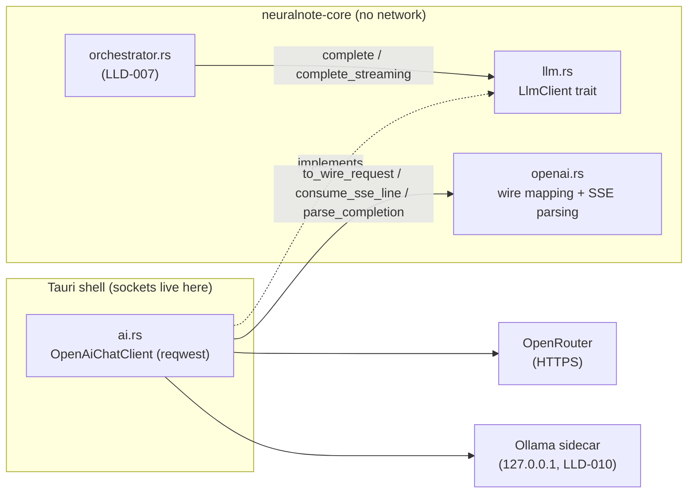
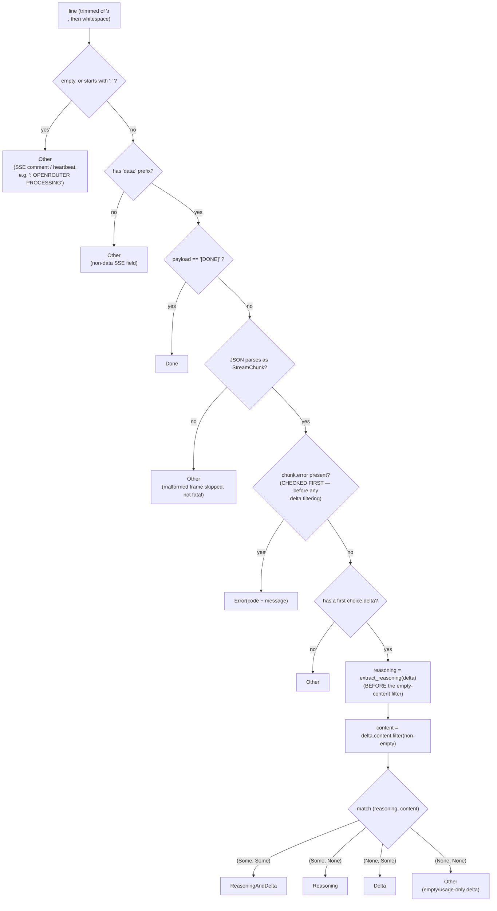

# LLD-009 — LLM Transport, Wire Protocol & SSE Streaming

> As-built documentation, verified against the source snapshot in this repo
> (branch base `feature/conversational-chat`, 2026-07-10). Every factual claim
> carries a `file:line` anchor; where something is inferred rather than cited, it
> says so. Sibling documents: **LLD-007** (chat orchestration — the loop that
> *drives* this transport) and **LLD-010** (provider configuration & secrets —
> where the key and provider choice *come from*). This document covers only the
> seam between them: the trait, the wire shape, and the stream.

---

## 1. Purpose & scope

This subsystem embodies one architectural principle: **the parsing is pure and
lives in the core; the sockets live in the shell.**

`crates/neuralnote-core/src/ai/openai.rs` performs no I/O at all. It maps the
core's request types to the OpenAI-compatible wire shape and folds SSE lines into
typed events — "pure, network-free glue" by its own module description
(`crates/neuralnote-core/src/ai/openai.rs:1-7`). The shell's
`app/desktop/src-tauri/src/ai.rs` owns the only sockets: a `reqwest` client that
POSTs the body and pumps bytes into the core's line parser. This split is why the
SSE grammar is unit-testable at all — every parsing decision in §6 is pinned by a
test that never opens a connection (`openai.rs:154-156`: "Pure (no I/O) so it is
unit-tested directly"). The module comment also names the second payoff: coverage
is measured where the behaviour is owned, and a later Ollama client reuses the
same protocol plumbing (`openai.rs:5-7`) — which is exactly what happened
(`app/desktop/src-tauri/src/local.rs:351-363`).

**In scope:** the `LlmClient` trait seam (`crates/neuralnote-core/src/ai/llm.rs`),
the pure wire mapping and SSE parsing (`openai.rs`), and the shell HTTP client
`OpenAiChatClient` (`app/desktop/src-tauri/src/ai.rs:286-472`).

**Out of scope (cross-reference, don't duplicate):** the agentic tool loop,
evidence registry, and citation verification (LLD-007); keychain storage,
provider config, model selection, and the Ollama sidecar lifecycle (LLD-010).
The keychain half of `ai.rs` (`ai.rs:48-215`) belongs to LLD-010 and is only
touched here where the key crosses into transport (redaction, §11).

---

## 2. Position in the architecture

See [`../architecture/system-overview.md`](../architecture/system-overview.md)
for the full layered picture. This subsystem is the boundary between the
network-free core and the host's real HTTP client (`llm.rs:1-3`):

One client type serves both providers: `OpenAiChatClient::new` builds the
OpenRouter client (`ai.rs:337-347`), and `local.rs::ollama_chat_client` builds
the same type pointed at `http://127.0.0.1:{port}/v1/chat/completions`
(`local.rs:351-363`). Provider capability differences (context sizing, reasoning)
live at the construction seam as constructor arguments, not as branches in the
shared streaming loop (`ai.rs:297-301`). Unit tests substitute a mock `LlmClient`
for the whole shell (`llm.rs:8`).

---

## 3. Public API surface

### The trait seam (`llm.rs`)

| Item | Anchor | Shape |
|---|---|---|
| `Role` | `llm.rs:17-24` | `System / User / Assistant / Tool`; serialises to OpenAI-compatible lowercase strings |
| `ToolCall` | `llm.rs:29-35` | `{ id, name, arguments }`; `arguments` is the raw JSON string exactly as the model emitted it — parsed at dispatch time so a malformed blob is the model's problem, not a hard failure |
| `LlmMessage` | `llm.rs:40-52` | `{ role, content?, tool_calls, tool_call_id?, name? }`; empty/absent fields skipped on serialisation. Constructors: `system`, `user`, `assistant_tool_calls`, `tool_result` (`llm.rs:54-102`) |
| `Completion` | `llm.rs:106-113` | Non-streamed response: `content?` and/or `tool_calls` |
| `LlmRequest` | `llm.rs:117-123` | `{ model, messages, tools: Vec<serde_json::Value> }` |
| `LlmClient` | `llm.rs:127-149` | `Send + Sync` trait: `complete(&LlmRequest) -> CoreResult<Completion>` (tool-deciding turn, non-streamed) and `complete_streaming(&LlmRequest, &mut dyn EventSink) -> CoreResult<String>` (answer turn) |

The two methods split the loop deliberately: tool-deciding turns run non-streamed
so `tool_calls` parse cleanly, and the final answer is streamed so the UI sees it
arrive live (`llm.rs:4-8`).

### The pure protocol functions (`openai.rs`)

| Function | Anchor | Role |
|---|---|---|
| `to_wire_request(req, stream, num_ctx, max_tokens, reasoning) -> serde_json::Value` | `openai.rs:95-106` | Core request → OpenAI-compatible JSON body (§5) |
| `parse_completion(value) -> CoreResult<Completion>` | `openai.rs:108-129` | Non-streamed response JSON → `Completion`; errors on unparseable body or zero choices |
| `parse_sse_line(&str) -> SseEvent` | `openai.rs:157-211` | One SSE line → its typed meaning (§6) |
| `consume_sse_line(&[u8], sink, &mut full) -> CoreResult<Option<String>>` | `openai.rs:29-66` | One line into the sink + accumulator; `Ok(Some(answer))` = `[DONE]` seen, `Ok(None)` = keep reading, `Err` = mid-stream error frame |
| `finish_answer(String) -> CoreResult<String>` | `openai.rs:72-80` | Empty-answer guard (§7) |
| `redact(text, key) -> String` | `openai.rs:17-23` | Replace the API key with `***` in error text (§11) |
| `ANSWER_MAX_TOKENS: u32 = 4096` | `openai.rs:88` | Answer-turn output ceiling (§5, GAP-009-1) |
| `SseEvent` | `openai.rs:132-152` | `Delta / Reasoning / ReasoningAndDelta / Done / Error / Other` |

### The shell client (`ai.rs`)

`OpenAiChatClient` (`ai.rs:286-302`) holds one reusable `reqwest::Client`, the
endpoint URL, an optional bearer key, an optional `X-Title` attribution header,
the optional Ollama `num_ctx`, and the reasoning opt-in flag. Constructors:
`new_with(...)` (`ai.rs:305-335`, fully parameterised) and `new(api_key,
reasoning)` (`ai.rs:337-347`, OpenRouter defaults). It implements `LlmClient` at
`ai.rs:411-472`.

---

## 4. The `LlmClient` conformance contract — load-bearing

The trait doc spells out a contract that every implementation MUST honour, quoted
verbatim from `llm.rs:137-141`:

> **Conformance contract:** the returned `String` MUST equal the concatenation
> of the `Answer` deltas streamed to `sink`. The orchestrator verifies citations
> against the *returned* text, so a client whose return value diverges from what
> it streamed could surface a citation for text the user never saw — a silent
> fidelity break. (The shell's reqwest client gets a test asserting this holds.)

Why this is load-bearing: citation verification (LLD-007) scans the *returned*
string for the `[eN]` evidence ids the model cited — but the user reads the
*streamed* deltas. If they diverge, a citation could be validated against text
the user never saw. For a product whose stated moat is citation fidelity ("a
wrong citation is worse than no answer" — project `CLAUDE.md`), that is the worst
silent failure available at this layer.

How each side upholds it:

- **The pure core, by design:** only `Delta` and the `delta` half of
  `ReasoningAndDelta` push into `full` (`openai.rs:35-41, 51-61`); `Reasoning`
  deliberately does not (`openai.rs:42-49`). `consume_sse_line`'s own doc calls
  the shared line/EOF path out as the mechanism that keeps "the returned string
  … byte-equal to the streamed deltas" (`openai.rs:27-28`).
- **The shell, by construction:** the streaming loop appends to `full` only via
  `consume_sse_line`, and returns exactly that string through `finish_answer`
  (`ai.rs:449-471`); the comment at `ai.rs:445-448` restates the contract.

One caveat: the parenthetical promise of a shell-side test is **not fulfilled in
this snapshot** — no test exercises `OpenAiChatClient::complete_streaming`
against a mock HTTP server; the contract holds by construction only. Recorded as
GAP-009-7.

---

## 5. The wire mapping

`to_wire_request` (`openai.rs:95-106`) serialises a `WireRequest`
(`openai.rs:258-297`). The core's `LlmMessage` serialises camelCase for the
IPC/UI contract; the wire is snake_case, so the mapping is explicit rather than
reusing the core's serde (`openai.rs:233-234`). Tool calls map to the
`{id, type: "function", function: {name, arguments}}` shape
(`openai.rs:312-333, 344-356`).

Four fields are conditional, and each condition carries meaning:

| Field | Condition | Why | Anchor |
|---|---|---|---|
| `tools` | Omitted entirely when empty | This is how the orchestrator's final answer turn (no tools) tells the model to prose, not tool-call | `openai.rs:261-264` |
| `options.num_ctx` | Set only when `num_ctx` is `Some` — i.e. only by the Ollama client | Ollama otherwise falls back to a ~4096 default and **silently truncates from the front**, dropping the grounding rules and earliest evidence — breaking cited recall on the Local path (PA-001) | `openai.rs:247-255`, `ai.rs:292-294`, `local.rs:358` |
| `max_tokens` | Set only when provided — the streamed answer turn passes `ANSWER_MAX_TOKENS`; tool-deciding turns pass `None` so long tool-call JSON is never truncated | `openai.rs:82, 270-272`, `ai.rs:353-361, 416-422` |
| `reasoning: {enabled: true}` | Emitted only on opt-in: OpenRouter client with the user's billed-reasoning consent; never for Ollama (which would ignore or reject it), never on tool-deciding turns (non-streamed, so reasoning tokens would be invisible cost) | `openai.rs:236-243, 273-276, 294`, `ai.rs:295-301, 414-421`, `local.rs:359-361` |

All four conditions are pinned by tests
(`openai.rs:480-549`; the client-level opt-in threading at `ai.rs:667-685`).

---

## 6. SSE parsing — `parse_sse_line`

This is the section that matters most. The function (`openai.rs:157-211`) is a
strict decision sequence, and **the ordering is the design** — two of the steps
exist specifically because running them in the naive order silently eats
failures.

Step by step, with the *why* for each ordering decision:

**1. Comments and blanks → `Other`** (`openai.rs:158-162`). `:`-prefixed lines
are SSE comments — OpenRouter sends `: OPENROUTER PROCESSING` as a heartbeat —
and blank lines are frame separators. Test: `openai.rs:452-458`.

**2. Non-`data:` lines → `Other`; `data: [DONE]` → `Done`**
(`openai.rs:163-169`). Test: `openai.rs:447-449`.

**3. The in-band error frame is checked FIRST** — before anything else touches
the delta (`openai.rs:170-188`). This is the crux of the parser, and it
generalises to any OpenAI-compatible stream:

- OpenAI-compatible endpoints commit **HTTP 200 on the first token**. A failure
  that occurs *after* streaming begins — rate-limit, out-of-credits, provider
  5xx, content filter — cannot change the status code; it arrives **in-band** as
  an `error` object inside a stream frame (`openai.rs:390-394`).
- The failure frame OpenRouter actually sends carries an **empty
  `delta.content`** alongside the error object (see the exact shape reproduced
  in the test at `openai.rs:589-599`). So if the empty-delta filter ran first,
  the frame would be classified `Other` and skipped — the stream would end, the
  answer would be empty, and the user would see a silently blank response with
  no error. The comment at `openai.rs:173-174` states this directly: "Check the
  error frame BEFORE the empty-delta filter: the failure frame carries an empty
  `delta.content`, so filtering first would drop it."
- This ordering is the fix for exactly that bug class, and it is pinned by two
  regression tests: `sse_error_frame_surfaces_even_with_empty_delta`
  (`openai.rs:588-599`) and — guarding the ordering against the *newer*
  reasoning path — `sse_error_frame_with_reasoning_still_surfaces_as_error`
  (`openai.rs:714-726`), which asserts that a frame carrying both an error
  object and reasoning text still surfaces as `Error`.
- Error rendering: a string `code` renders without JSON quotes
  (`rate_limited`, not `"rate_limited"`); numeric/other codes use `Display`;
  a missing message becomes `"unknown error"` (`openai.rs:175-187`, tests
  `openai.rs:601-607, 661-669`).

**4. Reasoning is extracted BEFORE the empty-content filter**
(`openai.rs:192-200`). A reasoning-only chunk also carries an empty
`delta.content`, so filtering first would silently drop every reasoning token —
"the exact mechanism that nearly ate the error frame" (`openai.rs:194-195`).
Two further properties protect the §4 contract:

- Reasoning text is **never** appended to the returned answer string. It is
  emitted as `ChatEvent::Thinking` only (`openai.rs:42-49`); `full` accumulates
  Answer deltas exclusively. This both keeps returned == streamed *and* keeps
  `finish_answer`'s empty-answer guard honest — a stream that only reasons
  leaves `full` empty and still surfaces as an error (`openai.rs:44-47`, test
  `openai.rs:791-818`).
- Reasoning and content are matched **exhaustively, not short-circuited**
  (`openai.rs:197-207`): the wire does not promise the two arrive in separate
  frames, so `(Some, Some)` is a real case (`openai.rs:139-143`). Returning
  early on reasoning would drop the answer token riding beside it.

**5. Then the content filter:** `content = delta.content.filter(|s|
!s.is_empty())` (`openai.rs:201`), and the exhaustive match over `(reasoning,
content)` yields `ReasoningAndDelta` / `Reasoning` / `Delta` / `Other`
(`openai.rs:202-207`). The genuinely-empty cases this filter exists for: the
final usage chunk carries `content: ""` (test `openai.rs:461-465`), and a
role-only or tool-call-fragment delta carries no `content` at all (test
`openai.rs:467-472`).

**6. Malformed JSON → `Other`, skipped, not fatal** (`openai.rs:208-210`).
"Mid-stream JSON noise (e.g. keep-alive artifacts) must not sink an
otherwise-good answer" (`openai.rs:155-156`). Test: `openai.rs:474-477`. The
flip side of this tolerance is GAP-009-3.

### The `[e1]`-marker test

`a_frame_carrying_reasoning_and_content_keeps_both` (`openai.rs:751-773`) feeds a
single frame whose delta carries reasoning text `"so"` **and** content
`"[e1] Plants"`, and asserts that `full == "[e1] Plants"` with both a `Thinking`
and an `Answer` event emitted. This test exists because the failure it guards is
maximally quiet and maximally damaging: if the parser short-circuited on
reasoning, the dropped content token would be the **first answer token — the one
carrying the leading `[e1]` citation marker**. The answer text would still read
fine to a human; only the citation would silently vanish (the marker never
reaches the returned string the orchestrator scans). That is a direct hit on
citation fidelity, invisible to any test that checks "some answer arrived". The
comment at `openai.rs:753-755` and the `ReasoningAndDelta` variant doc
(`openai.rs:139-143`) both name this scenario. A twin test covers the legacy
plain-string `reasoning` shape (`openai.rs:775-788`).

---

## 7. `finish_answer` — the empty-answer guard

`finish_answer` (`openai.rs:72-80`) maps an empty accumulated answer to
`CoreError::Llm("the model returned an empty answer (the stream ended without
content)")`. The critical property is that **both stream-termination paths route
through it** (`openai.rs:68-71`):

- `[DONE]` seen mid-loop → early return at `ai.rs:459-461` →
  `finish_answer(answer)`.
- Plain EOF (stream ends without `[DONE]`) → fallthrough at `ai.rs:470` →
  `finish_answer(full)`.

So an empty answer is **always** an error, whichever way the stream ended — a
blank result can never be returned as a successful empty answer the UI would
mark `Done`. Combined with §6's rule that reasoning never enters `full`, a
reasoning-only stream cannot masquerade as an answer: it reasons at length,
terminates, and still fails the guard (tests `openai.rs:652-658` and
`openai.rs:791-818`).

---

## 8. `extract_reasoning`

`extract_reasoning` (`openai.rs:219-230`) supports both reasoning shapes seen on
OpenAI-compatible streams:

1. **Preferred: structured `reasoning_details[]`** — it concatenates the `text`
   of consecutive entries whose `type == "reasoning.text"`; `reasoning.summary`
   and `reasoning.encrypted` entries carry no display text and are skipped
   (`openai.rs:213-218, 221-225`; entry shape at `openai.rs:424-434`, where
   serde's unknown-field tolerance means an encrypted/summary entry parses
   without error and simply yields no text). Tests: `openai.rs:672-681`
   (reasoning despite empty content), `openai.rs:684-691` (concatenation),
   `openai.rs:704-712` (summary/encrypted → no text → `Other`).
2. **Fallback: a plain-string `delta.reasoning`** — not documented as
   deprecated, and some providers still emit it instead of the array
   (`openai.rs:227-229, 417-421`). Test: `openai.rs:694-701`.

Returns `None` when there is no reasoning text, so the caller falls through to
the content classification (`openai.rs:218`).

---

## 9. Byte-level framing (shell)

The shell's streaming loop (`ai.rs:449-471`) buffers **bytes, not `str`**:

- Chunks arrive from `resp.bytes_stream()` and are appended to a `Vec<u8>`
  buffer (`ai.rs:449-455`). A network chunk can split a multi-byte UTF-8
  character, but it can never split the `\n` line delimiter — `\n` (0x0A) is a
  single byte that cannot appear inside a multi-byte UTF-8 sequence
  (`ai.rs:443-445`). So splitting on `\n` at the byte level is always safe.
- Each complete line is drained (`buf.drain(..=pos)`) and handed to
  `consume_sse_line`, which decodes it with `String::from_utf8_lossy`
  (`ai.rs:457-462`, `openai.rs:34`). Because only complete lines are decoded,
  the lossy decode never sees a split character mid-line. (Inferred: a
  hypothetical provider that emitted genuinely invalid UTF-8 *within* a line
  would be lossily replaced, not errored — acceptable for a JSON protocol that
  is valid UTF-8 by definition.)
- **The EOF flush:** after the stream ends, a trailing line left in the buffer
  without a final newline is flushed through the same `consume_sse_line`
  (`ai.rs:464-469`). Without this, "a last delta, or a terminal error frame, in
  the tail would be silently lost (and a cited id in that tail would go
  missing, corrupting verification)" (`ai.rs:465-467`). The shared-function
  design (`openai.rs:27-28`) is what guarantees the flush path behaves
  identically to the loop path, keeping returned == streamed across both.
- A transport-level read failure mid-stream surfaces immediately as
  `CoreError::Llm("stream read error: …")` (`ai.rs:454`).
- If `consume_sse_line` returns `Ok(Some(answer))` (`[DONE]`), the loop
  early-returns through `finish_answer` (`ai.rs:459-461`); a mid-stream error
  frame propagates as `Err` via the `?` on the same line.

---

## 10. Timeouts

A blanket `.timeout()` on the client is **deliberately omitted** — it would cap
total request duration and kill legitimately long streams. Instead the builder
sets exactly two knobs (`ai.rs:314-326`):

- `connect_timeout` — guards connection setup.
- `read_timeout` — a **per-read idle timeout**: it aborts a stream that goes
  quiet without capping one that keeps producing tokens.

The comment at `ai.rs:314-318` ties this to the project's "failures are never
silent" contract: a stalled or half-open endpoint can't hang `chat` forever with
no event. If the builder itself fails, the client falls back to a default
(timeout-less) `reqwest::Client` with a logged warning (`ai.rs:322-326`) —
inferred: this fallback trades the timeout guarantee for availability and is
effectively unreachable with these builder options.

| Provider | Connect | Read (idle) | Anchor |
|---|---|---|---|
| OpenRouter | 10 s | 120 s | `ai.rs:342-343` |
| Ollama (local chat) | 10 s | 300 s | `local.rs:356-357` |

The longer local read timeout is inferred to accommodate slow local inference
(first-token latency on cold models); the values themselves are cited above.
Non-chat Ollama HTTP (health probes, pulls) uses separate, shorter budgets in
`local.rs` (e.g. `local.rs:459, 500-501, 513-514`) — those belong to LLD-010.

---

## 11. Key redaction

`redact(text, key)` (`openai.rs:17-23`) replaces every occurrence of the API key
with `***`, and is a no-op for an empty key. The threat it defends against:
OpenRouter shouldn't echo the `Authorization` header, but a proxy or verbose
gateway error might — and a leaked key is catastrophic (`openai.rs:14-16`).
Defence in depth on the secret boundary (`ai.rs:396-398`).

**The redacted path:** every non-2xx HTTP response's body is passed through
`redact` before becoming a `CoreError::Llm` (`ai.rs:390-406`). This covers both
`complete` and `complete_streaming`, since both go through `post`. Tests:
`openai.rs:574-586` (key removed everywhere it appears; empty-key no-op).

**The one un-redacted path:** a mid-stream SSE `error` frame becomes
`CoreError::Llm(msg)` directly in `consume_sse_line` (`openai.rs:63`) and
propagates through the shell at `ai.rs:459` **without passing through
`redact`** — the pure core doesn't have the key, and the shell doesn't intercept
the error on the way out. This is not a proven leak: the frame carries
provider-generated response content (rate-limit text, provider error messages),
not an echo of the request's `Authorization` header. But it is the single gap in
an otherwise consistent defence-in-depth posture — the HTTP-error path assumes a
proxy might echo the key, and the SSE-error path makes the opposite assumption.
Recorded as GAP-009-2.

(Also un-redacted but key-free by construction, inferred: the transport error
strings at `ai.rs:388` and `ai.rs:454`, which interpolate `reqwest` error text,
not response bodies.)

---

## 12. Invariants & guarantees

| # | Invariant | Anchor |
|---|---|---|
| I-1 | The `String` returned by `complete_streaming` equals the concatenation of the `Answer` deltas streamed to the sink | Contract: `llm.rs:137-141`; upheld: `openai.rs:35-61`, `ai.rs:445-448` |
| I-2 | Reasoning text never enters the returned answer string — `Thinking` events only | `openai.rs:42-49, 51-61`; test `openai.rs:729-749` |
| I-3 | A mid-stream error frame always surfaces as `Err`, never as a silently empty answer — the error check precedes the empty-delta filter | `openai.rs:173-188`; tests `openai.rs:588-599, 714-726, 629-641` |
| I-4 | An empty answer is always an error, on both the `[DONE]` and EOF termination paths | `openai.rs:72-80`, `ai.rs:459-461, 470`; test `openai.rs:652-658` |
| I-5 | A frame carrying both reasoning and content surfaces both — no answer token (or citation marker) is dropped | `openai.rs:139-143, 197-207`; test `openai.rs:751-773` |
| I-6 | Line splitting never corrupts UTF-8: bytes are buffered and split only on `\n`, and only complete lines are decoded | `ai.rs:443-448, 457-458` |
| I-7 | A trailing unterminated line is flushed after EOF — a final delta or terminal error frame is never lost | `ai.rs:464-469` |
| I-8 | Empty `tools` is omitted from the wire body (the "prose, don't tool-call" signal); `num_ctx`, `max_tokens`, `reasoning` appear only when applicable | `openai.rs:261-276`; tests `openai.rs:480-549` |
| I-9 | Non-2xx HTTP error bodies are key-redacted before reaching a user-facing error or log | `ai.rs:396-399`; test `openai.rs:574-581` (exception: GAP-009-2) |
| I-10 | Long streams are never killed by a total-duration timeout; only idle streams and failed connects abort | `ai.rs:314-321` |
| I-11 | Tool-deciding turns are non-streamed, uncapped, and never request reasoning | `llm.rs:129-131`, `ai.rs:413-422` |

---

## 13. Error handling & failure modes

All failures surface as `CoreError::Llm(String)` (except keychain/config
failures, which are LLD-010's). The orchestrator (LLD-007) converts them to a
terminal `ChatEvent::Error` for the UI.

| Failure | Behaviour | Anchor |
|---|---|---|
| Connect failure / DNS / refused | `request to {provider} failed: …` | `ai.rs:388` |
| Non-2xx status | `{provider} returned {status}: {redacted body}`; falls back to status-only if the body is blank, so the error is never empty | `ai.rs:390-406` |
| Unparseable non-streamed response | `could not parse {provider} response: …` | `ai.rs:425-428`, `openai.rs:109-110` |
| Response with zero choices | `OpenRouter returned no choices` | `openai.rs:112-116` |
| Mid-stream in-band error frame | `OpenRouter stream error {code}: {msg}` — fatal, stops the stream | `openai.rs:174-187`, `ai.rs:459` |
| Mid-stream transport read error | `stream read error: …` | `ai.rs:454` |
| Stream ends with no content (either path) | `the model returned an empty answer …` | `openai.rs:72-80` |
| Idle stream (no bytes for `read_timeout`) | Read error via reqwest → `stream read error` path | `ai.rs:319-321` (inferred routing) |
| Malformed mid-stream JSON frame | Skipped (`Other`), not fatal | `openai.rs:208-210` (GAP-009-3) |
| Provider label in errors | `"OpenRouter"` vs `"Local AI"` chosen from client construction, so errors name the right provider | `ai.rs:363-369` |

What deliberately does **not** happen: no retry, no backoff, no fallback to the
other provider — a failure surfaces once, immediately (GAP-009-4, LLD-007's
`TODO(llm-retry)`).

---

## 14. Testing

The SSE test corpus (`openai.rs:436-826`) is unusually good, because the pure-
core design lets it exercise every grammar decision without a socket. What it
pins, and why:

- **The ordering bugs, as regressions.** The two nastiest failure classes this
  parser has — the error frame being eaten by the empty-delta filter, and
  reasoning re-introducing the same trap — each have a named regression test
  reproducing the exact wire shape (`openai.rs:588-599, 714-726`). These aren't
  coverage tests; they encode *why the code is ordered the way it is*, so a
  well-meaning refactor that "simplifies" the ordering fails loudly.
- **The citation-fidelity edge.** The `[e1]`-marker test (`openai.rs:751-773`)
  ties a parsing decision directly to the product moat (§6).
- **The contract's negative space.** Reasoning never accumulates
  (`openai.rs:729-749`); a reasoning-only stream still fails the empty-answer
  guard end-to-end across multiple frames plus `[DONE]`
  (`openai.rs:791-818`); the `[DONE]` path routes through the same guard as EOF
  (`openai.rs:652-658`).
- **Every conditional wire field, both ways** (`openai.rs:480-549`), plus the
  client-level proof that the reasoning opt-in threads from constructor to wire
  body without a live endpoint (`ai.rs:667-685`, enabled by the extracted
  `answer_wire_body` seam, `ai.rs:349-353`).
- **The boring frames**: heartbeats, blanks, usage chunks, role-only deltas,
  malformed JSON, string-vs-numeric error codes, summary/encrypted reasoning
  entries (`openai.rs:452-477, 601-607, 661-669, 704-712`).
- **`consume_sse_line` behaviourally**, via a recording `VecSink`
  (`openai.rs:565-572, 609-658`): accumulation, error propagation with a
  partial answer already buffered, `[DONE]` returning the accumulate.

What is **not** tested: the shell's byte-framing loop itself — chunk splits
mid-character, the EOF flush, `[DONE]`-early-return — has no mock-server test,
and the conformance test promised at `llm.rs:141` does not exist (GAP-009-7).
The keychain tests in `ai.rs:474-964` belong to LLD-010.

---

## 15. Known gaps & edge cases

| ID | Description | Evidence | Impact | Suggested fix |
|---|---|---|---|---|
| GAP-009-1 | **`ANSWER_MAX_TOKENS = 4096` truncation is not signalled.** The provider sends `finish_reason: "length"` before `[DONE]` when the cap is hit, but the parser never reads `finish_reason`, so a cut-off answer looks complete to the user. The code's own TODO, verbatim: *"TODO(answer-truncation-signal): if the model hits this ceiling the provider sends `finish_reason: "length"` before `[DONE]`; parse it in the SSE stream and surface a "answer truncated at the length limit" notice so a capped answer is never shown as a complete one. Moat-safe today (a cut-off `[eN]` marker simply goes uncited, never mis-cited), so this is UX polish, not a correctness fix."* The moat-safety claim holds (citation verification can only *drop* a truncated marker, never mis-attribute one), but a silently truncated answer sits uneasily against the project's "failures are never silent" convention — the failure here is soft (incomplete output presented as complete), not silent data loss. | `openai.rs:83-88` | Medium (UX/trust) | Parse `finish_reason` in `StreamChunk`, emit a truncation notice event when it is `"length"` |
| GAP-009-2 | **Un-redacted SSE error-frame path.** A mid-stream `error` frame becomes `CoreError::Llm(msg)` without passing through `redact`; the HTTP-error path redacts, this one doesn't. Not a proven leak — the frame carries provider response content, not the request's `Authorization` header — but it is the single inconsistency in the defence-in-depth posture (§11). | `openai.rs:63`, `ai.rs:459` vs `ai.rs:396-399` | Low (defence-in-depth) | Redact in the shell where the key is known: wrap the `Err` from `consume_sse_line` at `ai.rs:459/468` through `openai::redact` |
| GAP-009-3 | **Malformed mid-stream SSE JSON is silently skipped.** Intended tolerance (keep-alive noise must not sink a good answer), but a corrupt frame that actually carried a real token is lost without trace — no log, no counter. Bounded consolation: a wholly-corrupt stream still fails via the empty-answer guard. | `openai.rs:208-210`, test `openai.rs:474-477` | Low | `log::debug!`/count skipped `data:` frames in the shell; surface only if the stream also ends empty |
| GAP-009-4 | **No retry/backoff anywhere in the transport.** A transient 429/5xx/dropped connection fails the whole chat turn immediately. Acknowledged upstream as LLD-007's `TODO(llm-retry)`: one bounded backoff retry for idempotent tool-deciding `complete` turns (not the streaming answer, PA-029). | `orchestrator.rs:179-181`; absence in `ai.rs:374-471` | Medium (resilience) | Implement the orchestrator-level TODO; keep the transport retry-free (retrying a stream would violate I-1) |
| GAP-009-5 | **No response size caps on any HTTP body.** The error-body read (`resp.text()`), the non-streamed JSON parse, and the SSE line buffer are all unbounded; a hostile/broken endpoint sending an enormous body or one endless line is bounded only by the read timeout and available memory. Low practical risk: endpoints are OpenRouter over TLS or the localhost sidecar. | `ai.rs:394` (error body), `ai.rs:425-427` (JSON), `ai.rs:449-462` (line buffer grows until a `\n`) | Low | Cap the error-body read (e.g. `take(64KiB)`) and bail if the line buffer exceeds a sane frame size |
| GAP-009-6 | **No TLS pinning** — the default reqwest builder trusts the OS trust store; no certificate or public-key pinning for `openrouter.ai`. An accepted posture, not necessarily a defect: BYO-key desktop apps conventionally rely on the platform trust store, and pinning adds a rotation-breakage failure mode. Recorded so the acceptance is explicit. | `ai.rs:319-321` (builder sets only timeouts), `ai.rs:27` | Informational | None required; revisit only if the threat model adds hostile-network guarantees |
| GAP-009-7 | **The conformance contract is untested at the shell.** `llm.rs`'s doc comment promises "(The shell's reqwest client gets a test asserting this holds.)" — no such test exists in this snapshot; `complete_streaming` (byte framing, EOF flush, `[DONE]` early-return, returned==streamed) has no mock-HTTP-server coverage. The contract currently holds by construction only. | Promise: `llm.rs:141`; absence: `ai.rs:474-964` (tests cover keychain + `answer_wire_body` only) | Medium (regression risk on the moat-adjacent invariant I-1) | Add a mock-SSE-server test (e.g. `wiremock`/`httpmock`, or a local `hyper` responder) streaming split-mid-UTF-8 chunks, a tail without `\n`, and an in-band error frame; assert returned == concatenated Answer deltas |

---

## 16. Suggested improvements

Ordered by leverage:

1. **Close GAP-009-7 first.** I-1 is the invariant citation fidelity leans on,
   and it is the only load-bearing invariant with no test. One mock-server test
   covers GAP-009-7 and exercises the framing paths (I-6, I-7) in the same
   stroke.
2. **Signal truncation (GAP-009-1).** Add `finish_reason` to `StreamChunk` and a
   `ChatEvent` (or a suffix notice) for `"length"`. Small, pure-core change;
   fully unit-testable like the rest of the grammar.
3. **Route the SSE error frame through `redact` (GAP-009-2).** A two-line shell
   change erases the inconsistency; cheaper than arguing about whether the leak
   is reachable.
4. **Implement `TODO(llm-retry)` at the orchestrator (GAP-009-4)** — one bounded
   retry for non-streamed `complete` turns only. Keep the transport itself
   retry-free so the streaming contract stays trivially true.
5. **Observability for skipped frames (GAP-009-3)** — a debug log/counter in the
   shell, surfaced only when the stream also ends empty.
6. **Optional hardening (GAP-009-5)** — cap the error-body read and the SSE line
   buffer. Justified more by tidiness than by the actual failure mode.

Not suggested: TLS pinning (GAP-009-6) — the accepted posture is reasonable for
a BYO-key desktop client, and pinning's operational failure mode (cert rotation
bricking chat) is worse than the threat it removes here.

---

## 17. References

- Source (this repo's snapshot):
  - `crates/neuralnote-core/src/ai/llm.rs` — trait seam + message types
  - `crates/neuralnote-core/src/ai/openai.rs` — pure wire mapping + SSE parsing + tests
  - `app/desktop/src-tauri/src/ai.rs` — shell HTTP client (`OpenAiChatClient`), event sink, keychain (LLD-010)
  - `app/desktop/src-tauri/src/local.rs:351-363` — Ollama chat-client construction
  - `crates/neuralnote-core/src/ai/orchestrator.rs:179-181` — `TODO(llm-retry)` (LLD-007)
- Sibling documents:
  - [`../architecture/system-overview.md`](../architecture/system-overview.md) — as-built HLD
  - [`../architecture/spec-vs-built.md`](../architecture/spec-vs-built.md) — drift ledger
  - **LLD-007** — chat orchestration: the tool loop, evidence registry, citation verification, guards (drives this transport through `LlmClient`)
  - **LLD-010** — providers & secrets: keychain, provider config, model selection, Ollama sidecar lifecycle (constructs this transport's clients)
- Project ground rules: `CLAUDE.md` (citation fidelity as the moat; failures are
  never silent), `docs/definition-of-done.md` (coverage + gate bar)
