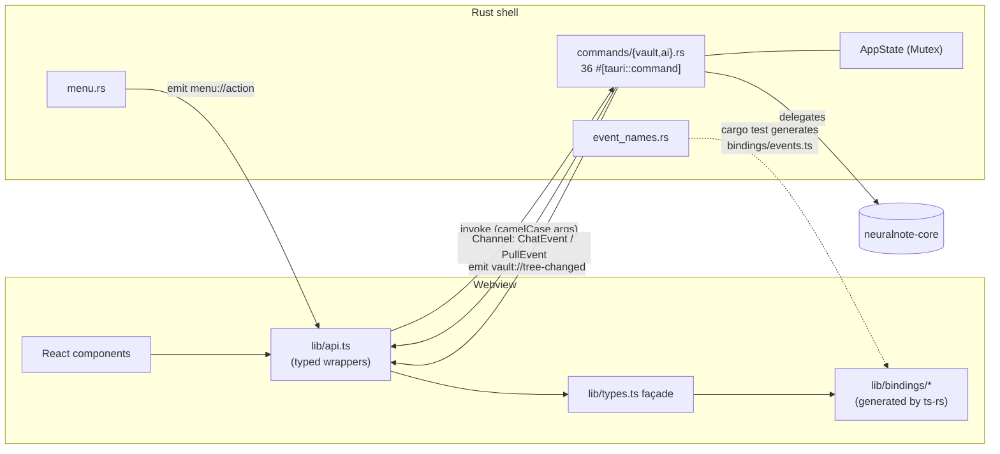

# LLD-011 — The IPC Surface, Event Contracts & Type-Binding Pipeline

**Status:** as-built · **Sources of truth:** `app/desktop/src-tauri/src/lib.rs`,
`app/desktop/src-tauri/src/commands/{vault,ai}.rs`, `app/desktop/src-tauri/src/{event_names,menu,ai,local}.rs`,
`app/desktop/src-tauri/tauri.conf.json`, `app/desktop/src-tauri/capabilities/default.json`,
`.cargo/config.toml`, `scripts/rust-quality-gate.sh`, `app/desktop/package.json`,
`app/desktop/src/lib/api.ts` (consumer side only), `app/desktop/src/e2e/mockVault.ts` (test seam)
**Every claim carries a `file:line` anchor. Claims marked "inferred:" are reasoning, not citation.**

---

## 1. Purpose & scope

This is the **contract document** for every boundary between the webview and Rust: the full
command registry (all 36 `#[tauri::command]`s), the two event mechanisms and their terminal-event
guarantees, the shared `AppState` and its locking discipline, the native-menu bridge, the `ts-rs`
type-binding pipeline that keeps the TypeScript mirror honest, the error wire shape, and the
security envelope (CSP + capabilities) that contains it all. It also audits the "thin shell"
convention (`CLAUDE.md`: commands delegate rather than re-implement) against what is actually
built, and names the one place the test harness leaves the contract unverified.

**Explicitly not owned here:**

- What each core function *does* behind its command — the per-subsystem LLDs
  (LLD-001 vault/paths, LLD-002 notes, LLD-003 tree/watcher, LLD-004 search, LLD-005 links,
  LLD-006 templates).
- The chat orchestration pipeline itself (`neuralnote-core/src/ai/orchestrator.rs`) — only its
  event stream as seen from the webview.
- The full path-authorisation treatment — summarised in §6, owned by
  [`LLD-001`](LLD-001-vault-and-path-safety.md) §4.
- The full security posture — summarised in §10, owned by LLD-010 (security boundary; sibling
  document in this set).

## 2. Position in the architecture

See [`../architecture/system-overview.md`](../architecture/system-overview.md) for the layered
picture. This LLD documents the middle of that picture: the webview never calls `invoke` directly
— every call funnels through the typed wrappers in `app/desktop/src/lib/api.ts` ("the single seam
between the React UI and the Rust backend", `api.ts:1-3`), across Tauri IPC, into a
`#[tauri::command]` in `commands/vault.rs` or `commands/ai.rs`, which delegates to
`neuralnote-core` ("this shell only wires it to the webview", `lib.rs:1-7`).



Data crosses the boundary in exactly four ways:

1. **Command invoke → return value** (request/response, §3).
2. **Per-invocation `ipc::Channel`** streamed payloads (`ChatEvent`, `PullEvent` — §4.2).
3. **Global bus events** (`vault://tree-changed`, `menu://action` — §4.1).
4. **Thrown errors**, serialised `CoreError` (§9).

## 3. The command table — exhaustive

The registry is `lib.rs:140-177` (`tauri::generate_handler![…]`). It lists **36 commands: 21
vault (`lib.rs:141-161`) + 15 AI (`lib.rs:162-176`)** — independently recounted against the
`#[tauri::command]` definitions below; the counts match.

**camelCase conversion (load-bearing):** Tauri converts JS argument keys to the Rust parameter
names, so `api.ts` sends camelCase and Rust declares snake_case. Verified pairs:
`parentDir → parent_dir` (`api.ts:64-65` / `commands/vault.rs:212`), `newName → new_name`
(`api.ts:106-107` / `vault.rs:415`), `parentPath → parent_path` (`api.ts:100-101` / `vault.rs:361`),
`newParentPath → new_parent_path` (`api.ts:112-113` / `vault.rs:429`), `expectedHash →
expected_hash` (`api.ts:93-97` / `vault.rs:320`), `localModelTag → local_model_tag`
(`api.ts:233-236` / `commands/ai.rs:102`), `hfRepo → hf_repo` (`api.ts:263-264` / `ai.rs:171`),
`onEvent → on_event` (`api.ts:219,281` / `ai.rs:195,279`). A hand-typed key in the wrong case
rejects at runtime with an argument error; only the e2e seam (§13) would catch it.

### 3.1 Vault commands (21) — `commands/vault.rs`

| Invoke string | Rust fn (`commands/vault.rs`) | Params (wire name: TS type) | Returns | Error type | Delegates to | Open vault required? |
|---|---|---|---|---|---|---|
| `list_recent_vaults` | `list_recent_vaults` `:119` | — | `RecentVault[]` | `CoreError` | `core::recents::list_recent_vaults` (`:120`) | No |
| `pick_vault_folder` | `pick_vault_folder` (async) `:138` | — | `string \| null` | `()` (never rejects with detail) | native dialog + `authorize_picked` (`:126-132`) | No |
| `pick_new_vault_location` | `pick_new_vault_location` (async) `:153` | — | `string \| null` | `()` | native dialog + `authorize_picked` | No |
| `open_vault` | `open_vault` `:166` | `path: string` | `Vault` | `CoreError` | `core::vault::open_vault` (`:183`) + watcher/recents/menu glue | No (creates the session) |
| `create_vault` | `create_vault` `:209` | `parentDir: string`, `name: string` | `Vault` | `CoreError` | `core::vault::create_vault` (`:226`) + same glue | No |
| `close_vault` | `close_vault` `:248` | — | `void` | infallible | clears `session`, `refresh_menu` | No |
| `set_menu_editing` | `set_menu_editing` `:264` | `editing: boolean` | `void` | infallible | `menu::refresh` via `refresh_menu` (`:272`) | No |
| `set_chat_visible` | `set_chat_visible` `:289` | `visible: boolean` | `void` | infallible | `menu::refresh` via `refresh_menu` (`:297`) | No |
| `read_tree` | `read_tree` (async) `:306` | — | `TreeNode[]` | `CoreError` | `core::tree::read_tree` (`:307`) | **Yes** |
| `read_note` | `read_note` (async) `:311` | `path: string` | `NoteDoc` | `CoreError` | `core::note::read_note` (`:312`) | **Yes** |
| `write_note` | `write_note` (async) `:316` | `path: string`, `content: string`, `expectedHash: string \| null` | `NoteDoc` | `CoreError` (`conflict` on hash mismatch) | `core::note::write_note` (`:322`) | **Yes** |
| `search_vault` | `search_vault` (async) `:329` | `query: string` | `SearchResponse` | `CoreError` | `core::search::search_vault` (`:333`) | **Yes** |
| `read_link_graph` | `read_link_graph` (async) `:337` | — | `LinkGraph` | `CoreError` | `core::links::read_link_graph` (`:338`) | **Yes** |
| `read_backlinks` | `read_backlinks` (async) `:342` | `path: string` | `Backlinks` | `CoreError` | shell path arithmetic (`:346-354`, see §11) then `core::backlinks::read_backlinks` (`:355`) | **Yes** |
| `create_folder` | `create_folder` `:359` | `parentPath: string`, `name: string` | `TreeNode` | `CoreError` | `core::entries::create_folder` (`:364`) | **Yes** |
| `create_note` | `create_note` `:368` | `parentPath: string`, `name: string` | `TreeNode` | `CoreError` | `core::entries::create_note` (`:373`) | **Yes** |
| `list_templates` | `list_templates` (async) `:377` | — | `TemplateInfo[]` | `CoreError` | `core::templates::list_templates` (`:378`) | **Yes** |
| `create_note_from_template` | `create_note_from_template` `:382` | `parentPath: string`, `name: string`, `template: string \| null` | `TreeNode` | `CoreError` | shell path arithmetic (`:388-401`, see §11) then `core::templates::create_note_from_template` (`:403-409`) | **Yes** |
| `rename_entry` | `rename_entry` `:413` | `path: string`, `newName: string` | `TreeNode` | `CoreError` | `core::entries::rename_entry` (`:418`) | **Yes** |
| `delete_entry` | `delete_entry` `:422` | `path: string` | `void` | `CoreError` | `core::entries::delete_entry` (`:423`) | **Yes** |
| `move_entry` | `move_entry` `:427` | `path: string`, `newParentPath: string` | `TreeNode` | `CoreError` | `core::entries::move_entry` (`:432-436`) | **Yes** |

"Open vault required" means the command starts with `root_of(&state)` (`lib.rs:86-92`), which
rejects with `CoreError::Io("no vault is open")` when `session` is `None`.

### 3.2 AI commands (15) — `commands/ai.rs`

| Invoke string | Rust fn (`commands/ai.rs`) | Params (wire name: TS type) | Returns | Error type | Delegates to | Open vault required? |
|---|---|---|---|---|---|---|
| `api_key_status` | `api_key_status` `:18` | — | `ApiKeyStatus` | `CoreError` | `crate::ai::api_key_status` (config read only, no keychain — `ai.rs:140-146`) | No |
| `save_api_key` | `save_api_key` `:23` | `key: string`, `model: string` | `void` | `CoreError` | `crate::ai::save_api_key` (keychain + config, `ai.rs:150-182`) | No |
| `clear_api_key` | `clear_api_key` `:34` | — | `void` | `CoreError` | `crate::ai::clear_api_key` (`ai.rs:187-210`) | No |
| `chat` | `chat` (async) `:274` | `prompt: string`, `history: ChatTurn[]`, `onEvent: Channel<ChatEvent>` | `void` — **all failures arrive as `ChatEvent::Error`, never a rejection** (`Result<(), ()>`, `:280`) | in-band | provider arm (`chat_via_openrouter` `:365` / `chat_via_local` `:405`) → `core::ai::run_chat`; see §11 | **Yes** (via `root_of`, `:288`; failure → `Error` event, `:290-295`) |
| `ai_status` | `ai_status` `:72` | — | `AiStatus` | `CoreError` | `core::ai::read_provider_config` + `build_ai_status` (`:73-94`); pure config read, never starts the sidecar (`:38-42`) | No |
| `set_active_provider` | `set_active_provider` `:99` | `provider: ProviderKind`, `localModelTag?: string` | `void` | `CoreError` | curated-allowlist check (`:107-113`) + config read-modify-write (`:114-120`); see §11 | No |
| `set_reasoning` | `set_reasoning` `:133` | `enabled: boolean` | `AiStatus` — **returns the persisted state; the caller must render it, not re-read** (`:127-131`) | `CoreError` | config read-modify-write + `build_ai_status` (`:135-138`) | No |
| `detect_hardware` | `detect_hardware` `:144` | — | `HardwareSpec` | infallible (`:143-145`) | `local::detect_hardware` (`local.rs:158-185`) | No |
| `local_candidates` | `local_candidates` `:152` | — | `CandidateModel[]` | infallible | `core::ai::curated_candidates` (`:153`) | No |
| `recommend_local_model` | `recommend_local_model` `:159` | — | `Recommendation` | infallible | `core::ai::recommend_model` (`:160-163`) | No |
| `hf_model_metadata` | `hf_model_metadata` (async) `:170` | `hfRepo: string` | `HfModelMeta` | `CoreError` — callers treat `Err` as "no metadata", non-fatal by contract (`:167-169`) | `local::fetch_hf_metadata` (`local.rs:424-432`) | No |
| `list_local_models` | `list_local_models` (async) `:179` | — | `InstalledModel[]` | `CoreError` | `local::ensure_ollama_started` + `local::list_local_models` (`:183-184`) | No |
| `pull_local_model` | `pull_local_model` (async) `:191` | `tag: string`, `onEvent: Channel<PullEvent>` | `void` — **all failures arrive as `PullEvent::Error`** (`Result<(), ()>`, `:196`) | in-band | allowlist check (`:205-210`), cancel-token install (`:216`), sidecar start, `local::pull_local_model` (`:237`); see §11 | No |
| `cancel_pull` | `cancel_pull` `:249` | — | `void` | infallible | stores `true` on the current pull's cancel token (`:250-253`) | No |
| `delete_local_model` | `delete_local_model` (async) `:258` | `tag: string` | `void` | `CoreError` | `local::ensure_ollama_started` + `local::delete_local_model` (`:263-264`) | No |

**Total: 21 + 15 = 36.** If a future edit changes this count, this table is stale — recount
against `lib.rs:140-177` before trusting anything below.

Two deliberate error-shape asymmetries worth naming:

- The **streaming commands (`chat`, `pull_local_model`) never reject.** Their Rust signature is
  `Result<(), ()>` and every failure — no vault, no key, transport, allowlist — is sent as the
  stream's terminal `Error` event (`commands/ai.rs:267-272`, `:187-189`). A consumer `catch`ing
  the promise for errors would wait forever for one.
- The **pickers (`pick_vault_folder`, `pick_new_vault_location`) also return `Result<_, ()>`**
  (`vault.rs:141,156`): cancellation is `Ok(None)`, and there is no failure detail to carry.

## 4. The event contract

Two mechanisms cross Rust→webview, and the distinction is load-bearing.

### 4.1 Global bus events (`emit` / `listen`)

Exactly **two**, both named in the single source of truth `event_names.rs`:

| Event | Constant | Payload | Emitted from | Consumed by |
|---|---|---|---|---|
| `vault://tree-changed` | `TREE_CHANGED` (`event_names.rs:14`) | none (`()`) | the watcher callback, `commands/vault.rs:89` | `api.ts:145-146` (`onTreeChanged`); the frontend debounces and re-reads the tree (`event_names.rs:12-13`) |
| `menu://action` | `MENU_ACTION` (`event_names.rs:17`) | `{ action: string, path?: string }` — `path` only for `open-recent`, omitted otherwise (`menu.rs:52-60`) | `menu.rs:348-355` (`on_menu_event` → `parse_menu_id` → `emit`) | `api.ts:190-193` (`onMenu`) |

There is no third bus event. In particular, **there is no `pull://` or `chat://` event** — a
reader expecting pull progress on the bus is wrong; those travel per-invocation (§4.2).

### 4.2 Per-invocation `ipc::Channel` payloads

`chat` and `pull_local_model` each take a `tauri::ipc::Channel<T>` as an argument
(`commands/ai.rs:279,195`); `api.ts` constructs a `Channel`, sets `onmessage`, and passes it as
`onEvent` (`api.ts:212-220`, `:275-282`). Events are scoped to that one invocation — two
concurrent chats cannot cross streams — and never appear on the global bus.

- **`ChatEvent`** (generated union, `bindings/ChatEvent.ts`): `searching`, `retrieved`, `reading`,
  `thinking`, `verifying`, `citationDropped`, `answer`, `citation`, `coverage`, `error`, `done`.
- **`PullEvent`** (`bindings/PullEvent.ts`): `progress`, `success`, `error`.

**Terminal-event contracts:**

- `chat` ends with **exactly one `done` xor `error`** ("a run ends with either Done (success) or
  Error (surfaced failure) — never silently", `bindings/ChatEvent.ts` doc comment; every shell
  pre-flight failure sends `Error` and returns, `commands/ai.rs:288-346`). One caveat, stated
  plainly: `run_chat` emits its own terminal event, and the shell *additionally* sends a final
  `Error` if `run_chat` returns `Err` — a defensive arm the shell itself annotates as such
  (`commands/ai.rs:316-319`, `:384-399`). If that defensive path ever fired after `run_chat` had
  already emitted a terminal, the stream would carry two terminals. Inferred: unobserved in
  practice; the UI treats the first terminal as the end of the run.
- `pull_local_model` ends with **exactly one `success` xor `error`** (`commands/ai.rs:187-189`):
  the streaming helper surfaces terminals through its `Result` and only forwards progress
  (`local.rs:583-590`), so the command owns emitting the single terminal (`:237-242`).

**Both channel sinks are infallible by contract.** `EventSink::send` / `PullSink::send` return
nothing; a closed channel (webview navigated away) is logged once and every further event is
dropped (`ai.rs:266-280` for `TauriChannelSink`, `local.rs:146-156` for `TauriPullSink`). Neither
can abort the underlying run — a chat whose UI has gone keeps spending tokens until the guards
bound it (`TODO(chat-cancellation)`, `ai.rs:272-276`); a pull continues unless `cancel_pull`
flips its token.

## 5. App state

```rust
// lib.rs:28-59
pub(crate) struct VaultSession { root: PathBuf, _watcher: Option<RecommendedWatcher> }
pub(crate) struct AppState {
    session: Option<VaultSession>,
    local_ai: local::LocalAiState,
    authorized: HashSet<PathBuf>,
    chat_visible: bool,
    editing: bool,
}
```

Managed as a single `Mutex<AppState>` (`lib.rs:130`); `Default` seeds `chat_visible: true`,
`editing: false` (`lib.rs:61-71`).

| Field | Write sites | Read sites |
|---|---|---|
| `session` | set: `open_vault` `vault.rs:196-199`, `create_vault` `:235-238`; cleared: `close_vault` `:251` | `root_of` `lib.rs:86-92` (every vault-scoped command); `menu_state` `menu.rs:97` (`session.is_some()` gates vault-only menu items) |
| `session._watcher` | created in `try_start_watcher` `vault.rs:108-116`; `Option` because watcher init is non-fatal (`lib.rs:23-27`); dropped with the session (stops the watch) | never read — held only for its `Drop` |
| `local_ai.sidecar` | promoted `local.rs:297`; taken by `shutdown_ollama` `:312` and `stop_running_sidecar` `:332` | `running_port` `local.rs:83-85` (`ensure_ollama_started` cache check `:198`, duplicate-race check `:289`) |
| `local_ai.starting` | `register_starting` `local.rs:94-99` (before the health poll, `:264`); reclaimed `take_starting` `:103-106`; drained on shutdown `:109-111` | `shutdown_ollama` `:313` |
| `local_ai.pull_cancel` | fresh token per pull: `install_pull_cancel` `local.rs:117-121` (called `commands/ai.rs:216`); set `true` by `cancel_pull` `commands/ai.rs:250-253`, `shutdown_ollama` `local.rs:310`, `stop_running_sidecar` `:331` | polled per stream line `local.rs:574`, and post-startup `commands/ai.rs:230` |
| `authorized` | inserted by `authorize_picked` `vault.rs:130` (both pickers); **never removed** (`TODO(authorized-set-unbounded)`, `lib.rs:41-43`) | membership checks in `open_vault` `vault.rs:175-177` and `create_vault` `:218-221`; deliberately preserved across vault switches (`:188`, "preserving the authorized set for later opens") |
| `chat_visible` | `set_chat_visible` `vault.rs:295` (the webview's only write path); force-reset `true` by `open_vault` `:200` and `create_vault` `:239`; seeded `true` by `Default` `lib.rs:67` | `menu_state` `menu.rs:97` → paints the `toggle-chat` checkmark `menu.rs:294-297` |
| `editing` | `set_menu_editing` `vault.rs:270`; reset `false` by `open_vault` `:201`, `create_vault` `:240`, `close_vault` `:254` | `menu_state` `menu.rs:97` → enables the Format items `menu.rs:221-250` |

### 5.1 Poisoned-mutex recovery

`lock_state` recovers a poisoned mutex by adopting the inner value instead of panicking
(`lib.rs:79-83`). The stated rationale: a panic in one short critical section must not brick
every later vault command for the rest of the process, and `AppState` is **plain data with no
invariant that a mid-section panic could half-apply** — each critical section is a handful of
field assignments, so the adopted value is at worst one write behind, never structurally broken
(`lib.rs:75-78`). The keychain cache (`ai.rs:59-63`) and the sidecar stderr buffer
(`local.rs:601-603`) apply the same recovery for the same reason.

### 5.2 The reentrant-lock footgun — flagged

`std::sync::Mutex` is not reentrant, and the menu rebuild **re-locks the state**:
`refresh_menu` (`vault.rs:47-51`) → `menu::refresh` (`menu.rs:361-364`) → `build_menu`
(`menu.rs:149-150`) → `menu_state` (`menu.rs:94-98`), which takes `lock_state` again. Every
mutating command therefore scopes its guard to an inner block and drops it **before** calling
`refresh_menu` — `open_vault` `vault.rs:187-202`, `create_vault` `:230-241`, `close_vault`
`:249-255`, `set_menu_editing` `:265-272`, `set_chat_visible` `:290-297`. The hazard is
documented only on `set_chat_visible` ("MUST drop before `refresh_menu` … holding it across the
call would deadlock", `vault.rs:285-287`).

**This is preserved by manual discipline alone.** No type, lint, or test prevents a future
command from holding the guard across `refresh_menu`; the failure mode is a runtime deadlock of
the whole command surface (every command funnels through the same mutex). Recorded as
GAP-011-2.

### 5.3 The guard never crosses an `.await`

The async commands keep the `std::sync::Mutex` guard away from every await point, by
construction, at each of these sites:

- The vault async commands have synchronous bodies; the guard lives only inside `root_of`
  (`vault.rs:300-304`, `:325-327`).
- The pickers run the blocking dialog *before* taking the lock (`vault.rs:123-125`).
- `chat` drops the guard (inside `root_of`) before its first await (`commands/ai.rs:270-272`).
- `pull_local_model` installs the cancel token in a single statement whose guard releases at
  statement end (`commands/ai.rs:213-216`).
- `ensure_ollama_started` binds the cached port out before awaiting the probe (`local.rs:196-198`)
  and parks/reclaims the starting child under short, await-free locks (`local.rs:258-264`,
  `:270-271`); `shutdown_ollama` takes everything under one short lock and kills outside it
  (`local.rs:301-315`).

## 6. The `authorized` allowlist (summary)

A webview-supplied path may become a vault root only if it is (a) in `authorized` — inserted
canonically when the user picks a folder via the native dialog (`vault.rs:126-132`) — or (b)
already in the on-disk recents list, itself written only from a prior explicit pick
(`vault.rs:53-66`, `:178`). Anything else is refused with `CoreError::OutsideVault`
(`vault.rs:178-182`, `:218-225`). Comparison is canonical (`canon_or_self`, `vault.rs:21-27`) so
a trailing slash, symlink, or case difference doesn't refuse a legitimate pick. This is the
PA-004 control: a compromised webview cannot point the vault — and thus every file command — at
an arbitrary path (`lib.rs:36-41`). Full treatment, including the recents trust chain:
[`LLD-001`](LLD-001-vault-and-path-safety.md).

## 7. The native menu

Built and installed at startup (`menu.rs:346-357`), rebuilt from state — never mutated in place —
on every vault open/close and flag change (`menu.rs:8-10`, `refresh` `:361-364`). The bridge:
`on_menu_event` → `parse_menu_id` → `emit("menu://action", {action, path?})`
(`menu.rs:348-355`). `parse_menu_id` is pure and unit-tested (`menu.rs:71-88`, tests `:370-399`);
it returns `None` for predefined natives and unknown ids so the handler stays silent on anything
it doesn't own. **`CUSTOM_ACTIONS` (`menu.rs:31-50`) is the single registry keeping the builder
and the parser in sync** — every custom item id appears there, and the
`parses_every_custom_action` test walks it (`menu.rs:371-377`). Predefined native items
(About/Services/Hide/Quit, undo/redo/cut/copy/paste/select-all, fullscreen,
minimize/maximize/close-window) are handled by the OS and carry no wiring at all
(`menu.rs:4-7`, `:152-153`, `:196-198`).

| Submenu | Item (label) | Id | Accelerator | Enabled when | Anchor |
|---|---|---|---|---|---|
| NeuralNote | About / Services / Hide / Hide Others / Show All / Quit | predefined | OS | always (OS-owned) | `menu.rs:154-168` |
| File | New Note | `new-note` | `CmdOrCtrl+N` | vault open | `:170` |
| File | New Folder | `new-folder` | `CmdOrCtrl+Shift+N` | vault open | `:171-177` |
| File | Open Vault… | `open-vault` | `CmdOrCtrl+O` | always | `:178-179` |
| File | Open Recent → *(per recent)* | `open-recent:<abs path>` | — | entry exists | `:112-144`; empty list shows a disabled `recent-empty` hint `:119-123` |
| File | Save | `save` | `CmdOrCtrl+S` | vault open | `:181` |
| File | Close Vault | `close-vault` | — | vault open | `:182-183` |
| Edit | Undo/Redo/Cut/Copy/Paste/Select All | predefined | OS | always (OS-owned) | `:206-214` |
| Edit | Find in Vault… | `search` | `CmdOrCtrl+K` | vault open | `:199-205` |
| Format | Bold | `format-bold` | `CmdOrCtrl+B` | **editing** | `:221` |
| Format | Italic | `format-italic` | `CmdOrCtrl+I` | editing | `:222` |
| Format | Heading 1 / 2 / 3 | `format-h1/h2/h3` | `CmdOrCtrl+Alt+1/2/3` | editing | `:223-243` |
| Format | Insert Link | `format-link` | `CmdOrCtrl+Alt+K` | editing | `:244-250` |
| View | Show Files | `view-files` | `CmdOrCtrl+1` | vault open | `:262-268` |
| View | Show Search | `view-search` | `CmdOrCtrl+2` | vault open | `:269-275` |
| View | Toggle Graph View | `toggle-graph` | `CmdOrCtrl+G` | vault open | `:276-282` |
| View | Toggle Editing / Reading | `toggle-mode` | `CmdOrCtrl+E` | vault open | `:283-289` |
| View | Toggle Sidebar | `toggle-sidebar` | `CmdOrCtrl+\` | vault open | `:301-307` (plain item — no checkmark, webview owns the state, `:298-300`) |
| View | Cited Recall Panel | `toggle-chat` | — | vault open; **checked = `chat_visible`** | `:290-297` |
| View | Enter Full Screen | predefined | OS | always | `:318` |
| Window | Minimize / Zoom / Close Window | predefined | OS | always | `:321-326` |

**The `toggle-chat` check item paints only.** It "no longer flips any state — it only paints its
checkmark from `chat_visible`, a copy the webview pushes back via `set_chat_visible`"
(`menu.rs:290-293`). The webview owns visibility; a failed push therefore drifts the checkmark
from reality (GAP-011-6, §14).

There is no Help submenu, deliberately:

> `// TODO(menu-help): add a Help submenu once there's something real to point it`
> `// at — external links (Documentation / Report an Issue) need the` `opener`
> `// plugin (a new dependency), and an in-app keyboard-shortcut sheet is net-new`
> `// UI. Deferred so every shipped menu item does something today.` (`menu.rs:328-331`)

## 8. The `ts-rs` binding pipeline

**How the mirror is generated.** Each shared type derives `TS` with `#[ts(export)]` (e.g.
`AiStatus`, `commands/ai.rs:43-50`; `CoreError`, `crates/neuralnote-core/src/error.rs:10-12`).
`ts-rs` turns each such type into a generated test; `cargo test --workspace export` runs them and
writes one `.ts` file per type into the bindings dir. Two knobs in `.cargo/config.toml`:

- `TS_RS_EXPORT_DIR = app/desktop/src/lib/bindings` (workspace-relative), one shared output dir
  for both crates so domain types and shell command types land side by side
  (`.cargo/config.toml:3-8,17`).
- `TS_RS_LARGE_INT = "number"` — `u64`/`i64` map to JS `number`, not `bigint`, because these
  values cross as JSON over Tauri IPC and `JSON.parse` never yields `bigint`; every value (byte
  sizes, epoch millis) sits far below 2⁵³, so nothing loses precision
  (`.cargo/config.toml:10-15,18`).

**Regenerate** with `npm --prefix app/desktop run gen:bindings`, which is exactly
`cargo test --manifest-path ../../Cargo.toml --workspace export` (`package.json:15`).
**Never hand-edit `bindings/`** — every generated file opens with a do-not-edit banner, and
`types.ts:6-9` repeats it.

**Two independent staleness gates:**

1. `rust-quality-gate.sh:45-61` — re-runs the export tests, then
   `git add --intent-to-add -- app/desktop/src/lib/bindings` + `git diff --quiet`; the
   intent-to-add makes the diff also catch a **brand-new untracked binding** for a newly added
   type, and any drift fails the gate red.
2. `npm run check:bindings` (`package.json:16`) — the same regenerate + intent-to-add +
   `git diff --exit-code` recipe, runnable from the frontend side.

**The generated set — 29 files: 28 `ts-rs` types + `events.ts`.**
Vault domain: `Vault`, `EntryKind`, `TreeNode`, `NoteDoc`, `RecentVault`, `TemplateInfo`,
`SearchMatch`, `FileHit`, `SearchResponse`, `GraphNode`, `GraphLink`, `LinkGraph`, `Backlink`,
`UnlinkedMention`, `Backlinks` (15). Error: `CoreError` (1). AI: `ApiKeyStatus`, `ChatEvent`,
`ProviderKind`, `AiStatus`, `OpenRouterStatus`, `LocalStatus`, `HardwareSpec`, `CandidateModel`,
`Recommendation`, `HfModelMeta`, `InstalledModel`, `PullEvent` (12). All 28 are re-exported by
the façade `lib/types.ts` (`types.ts:11-47`), which exists so call sites keep importing
`./types`. The façade also hand-writes the **two TS-only types with no Rust counterpart**:
`ChatRole` and `ChatTurn` (`types.ts:49-66`) — the Rust `ChatTurn.role` is a plain
`Deserialize`d `String` coerced server-side ("anything that isn't explicitly `assistant` is
treated as a user turn", `ai.rs:221-244`), so there is no Rust enum to mirror.

**Event names ride the same pipeline.** `event_names.rs` has a `#[cfg(test)]` generator that
writes `bindings/events.ts` from the Rust constants during the same `cargo test` step
(`event_names.rs:19-48`); `api.ts` imports `TREE_CHANGED` / `MENU_ACTION` from it
(`api.ts:10`). A renamed event constant therefore shows up as a bindings diff and **breaks the
drift gate, never a user** (`event_names.rs:6-10`). The menu *action vocabulary* does not ride
this pipeline — see GAP-011-4.

## 9. Error propagation across the boundary

Every command failure crosses as a serialised `CoreError`: adjacently tagged
`{ kind, message }` (`#[serde(tag = "kind", content = "message", rename_all = "camelCase")]`,
`error.rs:10-12`), with **9 variants**: `notFound`, `alreadyExists`, `outsideVault`,
`invalidName`, `conflict`, `io`, `frontmatter`, `llm`, `localAi` (`error.rs:13-34`; generated
union `bindings/CoreError.ts`). The UI narrows on `kind` (`isConflict`, `api.ts:44-51`) and
falls back to `errorMessage` for display (`api.ts:36-41`). The streaming commands bypass this
shape entirely — their failures are in-band `Error` events carrying just a message, built via
`error_detail` which strips the kind (`ai.rs:124-136`).

**Leakage assessment:**

- **Secrets: redacted.** The API key never crosses to the webview by design (`ai.rs:6-8`), and
  provider error bodies are redacted against the bearer before they can reach a user-facing error
  or a log (`ai.rs:395-399`). `api_key_status` reports presence only (`ai.rs:139-146`).
- **Absolute paths: do appear.** `open_vault` and `create_vault` rejections interpolate the
  requested path verbatim: *"refusing to open a path not chosen via the folder picker: {path}"*
  (`vault.rs:179-181`) and the create analogue (`vault.rs:222-224`). Mitigating context: these
  are paths **the webview itself supplied** (no new information crosses), and the CSP's
  `connect-src` forbids exfiltration to any remote origin (§10). Severity: low; recorded as
  GAP-011-5 so it isn't rediscovered.
- inferred: core-originating `Io`/`NotFound` messages can also carry OS error strings with paths
  the caller already named; same reasoning applies.

## 10. The security boundary (summary — see LLD-010)

- **CSP** (`tauri.conf.json:26`): `default-src 'self'`; `connect-src 'self' ipc:
  http://ipc.localhost` — the webview can talk to the IPC bridge and nothing else; `object-src
  'none'`, `frame-ancestors 'none'`. Dev CSP is looser (`ws: http: https:` for Vite HMR,
  `tauri.conf.json:27`).
- **Capabilities** (`capabilities/default.json:6-10`): `core:default` plus exactly two window
  grants — `core:window:allow-destroy` (the unsaved-edit guard's confirmed close) and
  `core:window:allow-start-dragging` (the custom titlebar drag region). App-defined commands
  need no capability entry.
- **`shell:allow-execute` is deliberately withheld** (`capabilities/default.json:4`): the Ollama
  sidecar is spawned Rust-side via `app.shell().sidecar()` (`local.rs:223-232`), which does not
  consult the capability; granting the JS Command API "would hand a compromised webview a spawn
  primitive with unvalidated env (e.g. rebinding Ollama to 0.0.0.0)".
- The sidecar binds loopback only (`OLLAMA_HOST=127.0.0.1:{port}`, `local.rs:228`), and the
  bundled binaries ship as `externalBin` (`tauri.conf.json:33`).

## 11. Convention audit: is the shell actually thin?

`CLAUDE.md` states: *"each one delegates rather than re-implements."* Assessed honestly,
command by command: **28 of 36 are genuinely thin** — a one-line delegation, optionally behind
`root_of` (§3 tables). The offenders, and a verdict on each:

| Command | What the shell does beyond delegating | Verdict |
|---|---|---|
| `read_backlinks` | resolves absolute-vs-relative, runs `ensure_within`, computes `rel_path` in the shell (`vault.rs:346-354`) | **Genuine leakage.** Path arithmetic is core competence (`paths.rs` is "the security spine", LLD-001 §2); the same absolute-vs-relative resolution now exists in two shell commands and could drift from core rules. |
| `create_note_from_template` | the same resolution for the optional template path (`vault.rs:388-401`) | **Genuine leakage**, same shape — inferred: both belong behind a core function taking the raw string. |
| `chat` + `chat_via_openrouter` + `chat_via_local` | provider selection (`:328-345`), retriever + guards construction (`:312-313`), key read + client build (`:368-383`), sidecar start + installed-model pre-flight (`:421-454`) | **Defensible seam.** This is composition-root work: the keychain, HTTP client, and sidecar are OS/transport concerns the core deliberately stays free of (`ai.rs:4-9`), and both arms converge on the same core `run_chat` (`:319-321`). The pre-flight (`:430-443`) is UX plumbing over a shell-owned resource. It is a *lot* of shell, but not core logic re-implemented. |
| `pull_local_model` | owns cancel-token lifecycle ordering — fresh token installed *before* sidecar startup so a cancel-during-startup still lands (`:213-216`, `:229-235`) | **Defensible.** The token lives in shell state (`local.rs:74-80`) because the sidecar is shell-owned; the ordering is the fix for a real lost-cancel bug and has nowhere else to live. |
| `set_active_provider` | curated-allowlist validation + config read-modify-write (`:107-120`) | **Split verdict.** The allowlist check delegates to `core::ai::is_curated_model` — fine. The read-modify-write of `ProviderConfig` is business logic (which fields update, when) living in the shell; `set_reasoning` repeats the pattern (`:135-138`). Inferred: a core `set_active_provider(dir, provider, tag)` would keep the config-update policy testable without an `AppHandle`. |

Net: the convention holds for the vault CRUD surface, bends acceptably at the AI composition
root, and is violated by the two path-arithmetic commands.

## 12. Invariants & guarantees

Each one enforced behaviour, with its anchor and stated exceptions:

1. **Every webview→Rust call goes through `api.ts`** — components never call `invoke` directly
   (`api.ts:1-3`). Enforced by convention + the e2e harness asserting through the same seam
   (`mockVault.ts:2-10`); not by lint.
2. **A vault-scoped command with no open vault fails typed, not silently** — `root_of` returns
   `CoreError::Io("no vault is open")` (`lib.rs:86-92`); `chat` converts it to a `ChatEvent::Error`
   (`commands/ai.rs:288-295`).
3. **Only picked-or-recent paths become vault roots** (`vault.rs:175-182`, `:218-225`; §6).
4. **The API key never crosses to the webview** — read Rust-side at call time (`ai.rs:6-8`),
   presence-only status (`ai.rs:139-146`), redacted from provider error bodies (`ai.rs:395-399`).
5. **Streaming runs always terminate visibly** — `chat`: one `done` xor `error`
   (`bindings/ChatEvent.ts` contract; shell arms `commands/ai.rs:288-346`); `pull_local_model`:
   one `success` xor `error` (`commands/ai.rs:187-189`, `:237-242`). *Exception:* a closed
   channel drops all further events including the terminal (`ai.rs:266-280`) — the contract holds
   toward a live webview only.
6. **Channel sinks are infallible and non-aborting** — closed channel: log once, drop the rest,
   run continues (`ai.rs:271-279`, `local.rs:146-156`).
7. **The state guard never crosses an `.await`** (§5.3 anchors: `vault.rs:300-304`,
   `commands/ai.rs:270-272`, `local.rs:196-198`, `:258-264`, `:301-315`).
8. **The guard is dropped before any menu rebuild** — deadlock otherwise (`vault.rs:285-287`;
   §5.2). *Exception:* nothing enforces it for future code.
9. **A poisoned state mutex never bricks the command surface** (`lib.rs:75-83`).
10. **Only curated models can be pulled or chatted against locally** — enforced Rust-side so a
    non-UI caller can't bypass it (`commands/ai.rs:107-113`, `:202-210`, `:413-420`).
11. **Rust↔TS type and event-name drift breaks the build, not the user** — the export tests +
    intent-to-add diff gate (`rust-quality-gate.sh:45-61`; `event_names.rs:6-10`).
    *Exception:* the `MenuAction` vocabulary (GAP-011-4).
12. **Every error crossing the boundary is `{kind, message}`** with the 9 kinds of
    `error.rs:13-34`. *Exception:* the pickers reject with unit (`vault.rs:141,156`) and the
    streaming commands report in-band (§3.2).
13. **Menu ids parse or are ignored — never crash** — `parse_menu_id` returns `Option`
    (`menu.rs:75-88`), and the emit failure is logged, not dropped silently (`menu.rs:352-354`).
14. **`set_reasoning` returns the persisted state** so a failed follow-up read can't render the
    billed toggle as "off" while the config says "on" (`commands/ai.rs:127-138`; mirrored by the
    mock, `mockVault.ts:1729-1735`).

## 13. Testing — and the blind spot

Three tiers touch this contract:

- **Rust unit tests** cover the pure pieces: `parse_menu_id` (`menu.rs:370-399`), `ChatTurn` role
  coercion (`ai.rs:491-504`), keychain/config interplay (`ai.rs:688-963`), pull-line handling
  (`local.rs:669-743`), `build_ai_status` (`commands/ai.rs:479-497`).
- **`api.test.ts`** mocks `invoke` itself (`vi.mock("@tauri-apps/api/core")`, `api.test.ts:6`)
  and asserts each wrapper passes the expected command string and args. This checks the TS side
  against itself — it cannot catch a wrapper whose string disagrees with Rust.
- **The e2e harness `src/e2e/mockVault.ts`** mirrors the Rust command surface behind the *real*
  IPC boundary via `mockIPC` (`mockVault.ts:1-10`) and is therefore **the only tier that catches
  a wrong command name, arg key, or return shape**: component tests `vi.mock` the whole api
  module, and `ts-rs` covers struct shapes, not command signatures. The
  [definition of done](../definition-of-done.md) leans on exactly this tier ("drives the app
  through its real IPC boundary", `definition-of-done.md:21-23`).

**The blind spot, stated as the finding it is.** `mockVault.ts` implements **34 of the 36**
commands (case arms `mockVault.ts:1623-1800`). **`set_menu_editing` and `set_chat_visible` have
no e2e seam.** Both are invoked fire-and-forget with a `.catch(console.error)`
(`Workspace.tsx:313-317`, `:320-324`), so in every e2e run they hit the mock's
`default: fail("io", "unknown command: …")` (`mockVault.ts:1801-1806`) and the rejection is
swallowed by that catch — the tests pass while the harness is, by its own standard, screaming.
Their real Rust contract (names, arg keys, the menu-side effects) is verified by **nothing**:
`api.test.ts:128-133` asserts `set_menu_editing`'s string against a mocked `invoke`
(self-referential), and `setChatVisible` isn't even imported there. This is precisely the bug
class the project says only the e2e seam catches — a renamed Rust command or arg would ship as
two silently-dead menu syncs. Recorded as GAP-011-1. The mock's own header comment ("Every
command name … is mirrored 1:1 from the real seam", `mockVault.ts:8-9`) currently overclaims by
two commands.

## 14. Known gaps & edge cases

| ID | Description | Evidence | Impact | Suggested fix |
|---|---|---|---|---|
| GAP-011-1 | `set_menu_editing` / `set_chat_visible` unmocked (34/36); their fire-and-forget `.catch(console.error)` call sites swallow the mock's `default: throw`, so no tier verifies their Rust contract | `mockVault.ts:1623-1806` (no case arms); `Workspace.tsx:313-324` | A renamed command/arg ships as a silent no-op menu sync; the harness's "mirrored 1:1" claim is false for these two | Add both case arms to `mockVault.ts` (recording state for assertion) and assert the calls in the menubar e2e; consider a mock-vs-registry parity test over the 36 names |
| GAP-011-2 | Reentrant-lock footgun: `refresh_menu → menu::refresh → build_menu → menu_state` re-locks the state mutex; guard-scoping before `refresh_menu` is manual discipline only | `menu.rs:94-98`; `vault.rs:285-287`, `:187-204` | A future mutating command holding the guard across `refresh_menu` deadlocks the entire command surface | Have `refresh_menu` take the pre-read `(vault_open, chat_visible, editing)` tuple as an argument so the rebuild never needs the lock; or a debug assertion that the state lock is free on entry |
| GAP-011-3 | `authorized` grows once per pick and is never pruned: `// TODO(authorized-set-unbounded): this grows once per folder picked and is never pruned. Bounded by picks-per-session (tiny in practice), so deferred — round-9 FYI. Cap or LRU-evict it if a session could realistically pick many.` | `lib.rs:41-44` | Unbounded per-session memory in theory; negligible in practice (picks are user-driven) | Accept as documented, or LRU-cap if a picker-heavy flow ever ships |
| GAP-011-4 | The `MenuAction` union in `api.ts` is hand-maintained while sibling event names are generated: `// TODO(menu-action-bindings): parity with Rust's CUSTOM_ACTIONS is hand-maintained and unenforced while sibling event names are generated (event_names.rs -> bindings/events.ts, gated by rust-quality-gate.sh). Deferred until that generator can emit the action vocabulary too; a Rust-only action falls through switch (e.action)'s default: break as a dead, silent no-op menu item.` Note the deliberate asymmetry: `open-recent` is in the TS union but not `CUSTOM_ACTIONS` (Rust synthesizes it from the id prefix), so naive list-reconciliation is a trap (`api.ts:148-154`) | `api.ts:155-180`; `menu.rs:31-50` | A menu action added in Rust but not TS ships as an enabled menu item that does nothing, silently | Extend the `event_names.rs`-style `#[cfg(test)]` generator to emit `CUSTOM_ACTIONS` (plus `open-recent`) into `bindings/`, putting the vocabulary behind the drift gate |
| GAP-011-5 | Absolute paths appear verbatim in `open_vault`/`create_vault` rejection messages | `vault.rs:179-181`, `:222-224` | Low: the path was webview-supplied (no new info), CSP blocks remote exfiltration (§10); still a path-in-error-string pattern to keep off logs shipped elsewhere | Truncate to the final component in the user-facing message if these ever feed telemetry |
| GAP-011-6 | `toggle-chat` checkmark can drift: the item paints only; the webview owns visibility and pushes it back via `set_chat_visible`, so a failed push leaves the checkmark showing stale state until the next successful push | `menu.rs:290-297`; `Workspace.tsx:320-324`; `vault.rs:275-287` | Cosmetic-only by design ("Best-effort — the checkmark is cosmetic", `api.ts:78-81`), but a user steering by the menu sees the wrong state | Retry-on-next-focus, or re-push on `refresh_menu`-relevant transitions; low priority |
| GAP-011-7 | No Rust-side watcher debounce: every visible filesystem event emits `vault://tree-changed`; only the frontend debounces | `vault.rs:76-101` (per-event `emit`, hidden-path filter `:86-88` is the only suppression); `event_names.rs:12-13` | A bulk external operation (git checkout, sync) fires an event per path; the webview absorbs it, but IPC churn is unbounded on the Rust side | Cross-reference [`LLD-003`](LLD-003-vault-tree-and-watcher.md) — the debounce ownership question is treated there |
| GAP-011-8 | A closed chat channel cannot abort the run: `// TODO(chat-cancellation): the core's EventSink is infallible, so we can't abort run_chat from here — a closed channel still lets the current run finish (bounded by the guards) before it stops.` | `ai.rs:272-276` | Token spend continues against a dead UI until the orchestrator's guards bound the run | The TODO's own answer: a cancellation token checked in the orchestrator loop |

## 15. Suggested improvements

Ranked by risk retired per unit of effort:

1. **Close GAP-011-1 now** — two mock case arms plus an assertion; it repairs the harness's core
   claim and is the cheapest fix in this table.
2. **Generate the menu-action vocabulary (GAP-011-4)** — the pattern already exists in
   `event_names.rs:19-48`; extending it removes the last hand-maintained Rust↔TS list.
3. **Defuse the reentrant lock (GAP-011-2)** — make `menu::refresh` take its state snapshot as a
   parameter; the deadlock class disappears structurally instead of by comment.
4. **Move the two path-arithmetic blocks into core (§11)** — `read_backlinks` and
   `create_note_from_template` should hand raw strings to core functions, restoring the thin-shell
   convention where it actually slipped.
5. **A registry parity test** — assert the mock's command set equals the 36 names in
   `lib.rs:140-177` (a string list is enough), so the *next* unmocked command fails loudly at the
   seam instead of resurfacing as a GAP in a future audit.
6. **Chat cancellation (GAP-011-8)** — worth doing when chat cost matters; the design is already
   sketched in the TODO.

## 16. References

- Registry & state: `app/desktop/src-tauri/src/lib.rs`
- Commands: `app/desktop/src-tauri/src/commands/vault.rs`, `app/desktop/src-tauri/src/commands/ai.rs`
- Events & menu: `app/desktop/src-tauri/src/event_names.rs`, `app/desktop/src-tauri/src/menu.rs`
- Transport plumbing: `app/desktop/src-tauri/src/ai.rs`, `app/desktop/src-tauri/src/local.rs`
- Security envelope: `app/desktop/src-tauri/tauri.conf.json`,
  `app/desktop/src-tauri/capabilities/default.json`
- Binding pipeline: `.cargo/config.toml`, `scripts/rust-quality-gate.sh`,
  `app/desktop/package.json` (`gen:bindings`, `check:bindings`),
  `app/desktop/src/lib/bindings/`, `app/desktop/src/lib/types.ts`
- Consumer seam: `app/desktop/src/lib/api.ts`; call sites `app/desktop/src/workspace/Workspace.tsx`
- Test seam: `app/desktop/src/e2e/mockVault.ts`, `app/desktop/src/lib/api.test.ts`
- Error contract: `crates/neuralnote-core/src/error.rs`
- Sibling docs: [`../architecture/system-overview.md`](../architecture/system-overview.md),
  [`LLD-001`](LLD-001-vault-and-path-safety.md) (path authorisation),
  [`LLD-003`](LLD-003-vault-tree-and-watcher.md) (watcher), LLD-010 (security boundary),
  [`../definition-of-done.md`](../definition-of-done.md)
