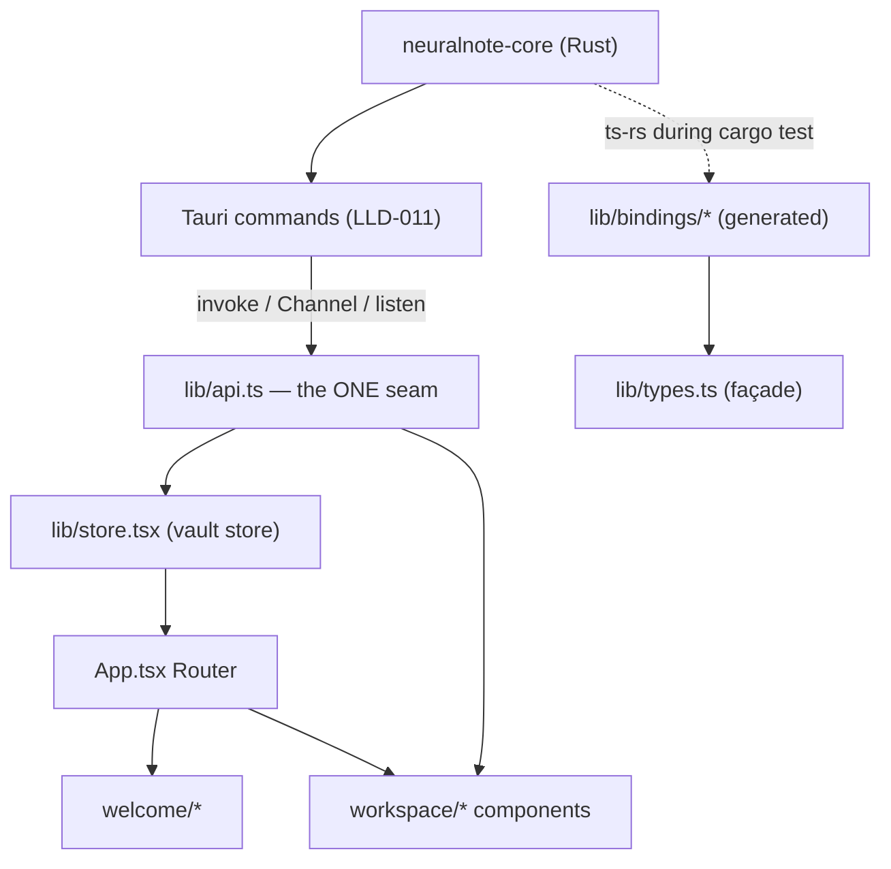
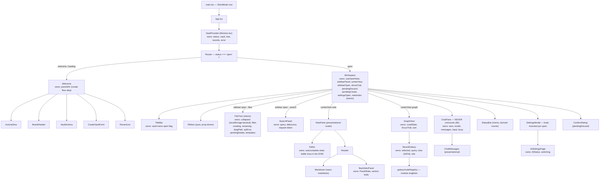

# LLD-012 — Frontend Architecture

**Status:** as-built · **Scope:** the React frontend of the desktop shell: `app/desktop/src/App.tsx`, `main.tsx`, `lib/` (`store.tsx`, `api.ts`, `types.ts`), `welcome/*`, `workspace/*` (including `workspace/galaxy/*`), and the test topology under `src/e2e/` and `src/test/`.

Unless otherwise qualified, file paths below are relative to `app/desktop/src/`. The IPC contract itself (command names, argument shapes, the Rust side of the seam) is LLD-011's territory — this document describes the frontend's side of that boundary and does not restate the contract.

---

## 1. Purpose & scope

This LLD documents how the webview half of NeuralNote is put together: the component tree, who owns which state, the single API seam to the Rust core, the markdown rendering pipeline and its injection-safety argument, the editor/reader state machine, the streamed chat pane, the 3D galaxy view, and the test topology. It records the load-bearing invariants (with `file:line` anchors), the known gaps, and the patterns this codebase has deliberately hardened against — so a future change doesn't undo a defence it didn't know was there.

Out of scope: the Rust core (LLD-001–005), the Tauri command layer and event contract (LLD-011), and the native menu implementation (Rust-side; only its frontend subscriptions appear here).

## 2. Position in the architecture

See [`../architecture/system-overview.md`](../architecture/system-overview.md). The project convention is a **shared Rust core, thin client shell** (`CLAUDE.md`, repo root): all product logic lives in `crates/neuralnote-core`, and this frontend is deliberately a presentation layer that calls typed wrappers over Tauri commands. Its types are **generated, not written** — `lib/bindings/` is emitted from the Rust types by `ts-rs` during `cargo test`, and `lib/types.ts` is a façade re-exporting them (`lib/types.ts:1-9`). Even the event-name strings are generated from Rust constants so emit and listen can't drift (`lib/bindings/events.ts:1-8`, `lib/api.ts:7-10`).

## 3. Stack

| Layer | Version (as pinned) | Notes |
|---|---|---|
| React | `^19.1.0` (`app/desktop/package.json`) | StrictMode at the root (`main.tsx:9-11`) — dev double-invoke is a live constraint (see §13). |
| TypeScript | **exactly `7.0.2` — no caret** (`app/desktop/package.json` devDependencies) | An intentional hard pin. |
| Vite | `^7.0.4`, via `@vitejs/plugin-react` | |
| Tailwind CSS | `^4.3.2` via `@tailwindcss/vite` | v4 CSS-first config: theme lives in `@theme` in `styles.css:8`; **there is no `tailwind.config.*`** (verified absent from `app/desktop/`). |
| Vitest + jsdom | `^4.1.9` / `^29.1.1` | With `@testing-library/react` 16 and `@tauri-apps/api/mocks` for the e2e tier. |
| Notable runtime deps | `react-markdown ^10.1.0`, `remark-gfm`, `react-force-graph-3d`, `three`, `@tanstack/react-virtual`, `lucide-react ^1.22.0` | The `lucide-react` pin is suspicious — see GAP-012-9. |

**Two TypeScript toolchains coexist.** The Tier-2 native WebDriver suite in `app/desktop/e2e-native/` is its own npm package pinning **`typescript ~5.8.3`** (`e2e-native/package.json`), against WebdriverIO 9 — a completely separate toolchain from the app's exact-`7.0.2` pin. It is CI-only (`tauri-driver` has no macOS support, per its package description).

## 4. Component tree

State-ownership annotations verified at: `store.tsx:51-55`, `Workspace.tsx:42-65`, `useOpenNote.ts:45-53`, `FileTree.tsx:95-107`, `ChatPane.tsx:80-90`, `GraphView.tsx:37-40`, `NeuralGalaxy.tsx:219-221`, `Welcome.tsx:28`, `SettingsModal.tsx:1-7` (body remounted per open, so its state resets naturally), `TitleBar.tsx:12-13`, `Ribbon.tsx:1-7` (pure).

## 5. Two mount invariants — both load-bearing

**`ChatPane` never unmounts while the workspace is mounted.** It is toggled with `display: contents | none`, never conditional rendering (`Workspace.tsx:391-397`). The reason is stated at the toggle site (`Workspace.tsx:385-390`): the pane owns a live streamed IPC `Channel` — `api.chat` binds the channel's `onmessage` to the pane's `applyEvent` (`lib/api.ts:212-220`, `ChatPane.tsx:149-169`) — and the transcript lives in the pane's own `messages` state (`ChatPane.tsx:88`). Unmounting would wipe the transcript and leave an in-flight Rust `chat` run streaming into a dead channel. `display: contents` lets the pane's `<aside>` participate in the flex row as if the wrapper didn't exist; `none` drops it from layout while React keeps the subtree — and its stream — alive. The same concern shapes the Settings interaction: closing Settings bumps `refreshSignal` so the pane re-reads `aiStatus` **without** remounting (`Workspace.tsx:62-65,395`, `ChatPane.tsx:72-75,126-146`).

**The sidebar collapses by unmounting** (`{sidebarOpen && …}`, `Workspace.tsx:358-374`). This is the opposite policy, and it is safe only because the sidebar holds no unrecoverable in-memory state: `FileTree` already unmounts on every Files↔Search swap, and its one durable piece of state — the collapsed-folder set — persists to `localStorage` keyed per vault path (`treeState.ts:15-44`), loaded lazily on mount (`FileTree.tsx:95`) and mirrored on every change (`FileTree.tsx:111-113`). The comment at the collapse site draws exactly this contrast with ChatPane (`Workspace.tsx:353-357`). The storage access is guarded on both sides: a disabled/full `localStorage` degrades to "don't persist", never a throw into render (`treeState.ts:22-44`).

## 6. State model

The vault store is **React Context + `useState`** — not Zustand, not `useReducer` (`store.tsx:48-55`). The context value is memoised over **all** of its fields so it stays referentially stable across renders that change nothing (`store.tsx:206-241`, citing Sonar S6481). Consumers call `useVault()`, which throws outside the provider (`store.tsx:246-250`).

| Store field | Written by | Read by |
|---|---|---|
| `status` (`welcome`/`loading`/`open`) | `openByPath` (`store.tsx:78,84,87`), `createVault` (`:114,120,123`), `close` (`:137`) | `App.tsx:8-9` (the router), `Welcome.tsx:30` (loading state), watcher effect gate (`store.tsx:151`) |
| `vault` | `openByPath` (`:82`), `createVault` (`:118`), `close` (`:135`) | `Workspace.tsx:40,100,326`, `ChatPane.tsx:77-78`, `GraphView.tsx:35-36` |
| `tree` | `openByPath`/`createVault` (`:83,119`), `refreshTree` (`:70`), `close` (`:136`) | `Workspace.tsx:40` (→ `FileTree` props, `noteIndex` memo `:115-125`), `StatusBar` (via props, `Workspace.tsx:400`) |
| `recents` | `refreshRecents` (`:62`) | `Welcome.tsx:17` → `RecentList` |
| `error` | every store op's `catch`, plus `reportError`/`clearError` (`:57-58`) | `Welcome.tsx:81` (inline alert), `Workspace.tsx:402-415` (toast) |

**State is derived, not duplicated.** `tree` is the single source of truth for vault structure. The wikilink/autocomplete note index is a `useMemo` over it (`Workspace.tsx:115-125`); the status bar's note/folder counts and word count are `useMemo`s over `tree`/`note` (`StatusBar.tsx:25-29`); the file tree's filtered/flattened row model is recomputed per render from `tree` + `collapsed` (`FileTree.tsx:235-245`).

**Open-note state lives in a separate `useOpenNote` hook** (`useOpenNote.ts:44-181`), owned by `Workspace` (`Workspace.tsx:42`), deliberately outside the vault store — the store's header comment scopes the store to lifecycle/tree/recents/error and notes that note I/O goes directly through `api` (`store.tsx:1-5`). Key properties:

- **`dirty` is derived, never stored:** `dirty: note !== null && draft !== note.raw` (`useOpenNote.ts:168`). There is no flag to forget to reset.
- **The editor `<textarea>` is uncontrolled** (`defaultValue`, `Editor.tsx:323`): the live buffer is DOM state, mirrored to `draft` on change (`Editor.tsx:324-327`), so a multi-MB note costs O(1) React work per keystroke instead of an O(size) controlled re-render (`Editor.tsx:5-12`). Every content swap that must re-seed the buffer (open another note, reload) drops to read mode in `useOpenNote` (`useOpenNote.ts:66`), which unmounts the editor, so the next edit-mode mount re-seeds from the fresh draft. Programmatic edits — the `[[` autocomplete insertion and the Format menu — write the DOM value directly and re-fire `onChange` to preserve the uncontrolled model (`Editor.tsx:171-179,240-247`).
- **A monotonic `loadId` token** guards every async resolution: a slow load can't overwrite a newer selection (`useOpenNote.ts:56-59,69,73,78`), and a save that lands after the user switched notes skips the state write while still clearing `saving` (`useOpenNote.ts:113-133`). `clear()` bumps the token to invalidate anything in flight (`useOpenNote.ts:148-149`).
- `Workspace` reads the latest snapshot through `openRef` so its stable callbacks and the OS close handler don't rebuild (or re-register listeners) per keystroke (`Workspace.tsx:66-72`) — which is what lets `React.memo(FileTree)` and `React.memo(StatusBar)` actually skip keystroke churn (`FileTree.tsx:77-80`, `StatusBar.tsx:5-8`).

Workspace-local view state (`sidebarPanel`, `centerView`, `sidebarOpen`, `showChat`, dialogs) stays in `Workspace` on purpose (`Workspace.tsx:45-65`); pure UI conveniences (folder folds) live in `localStorage` (§5), explicitly not in the shared core because a future mobile client shouldn't inherit desktop sidebar folds (`treeState.ts:5-9`).

## 7. The API seam

`lib/api.ts` is the **sole importer** of `invoke`, `Channel`, and `listen` (`lib/api.ts:5-6`; verified by grep — no other non-test source file imports from `@tauri-apps/api/core` or calls `listen`). Components call named, typed, documented wrappers; the store's header makes the rule explicit for lifecycle (`store.tsx:1-5`), and the welcome screen and workspace comply (`Welcome.tsx:2-4`).

**The one exception:** `Workspace.tsx` imports `getCurrentWindow` from `@tauri-apps/api/window` directly (`Workspace.tsx:19`) for the OS close-request guard (`onCloseRequested`, `Workspace.tsx:204`) and the force-close (`destroy()`, `Workspace.tsx:82-86`). Window-lifetime APIs bypass the seam; everything command-shaped goes through it.

The seam also owns error normalisation: `errorMessage` flattens a serialised `CoreError` (or anything) to a displayable string (`lib/api.ts:36-41`), and `isConflict` narrows on the discriminated `kind` (`lib/api.ts:44-51`, contract shape per `lib/types.ts:28-31`). Streamed commands (`chat`, `pullLocalModel`) construct the `Channel` inside the wrapper so no component touches channel mechanics (`lib/api.ts:212-220,275-282`).

## 8. Event subscriptions

There are exactly four `listen(...)` subscription sites, all through the two `api.ts` wrappers (`onTreeChanged` `lib/api.ts:145-146`, `onMenu` `lib/api.ts:190-193`):

| # | Site | Event | Purpose |
|---|---|---|---|
| 1 | `store.tsx:150-181` | `vault://tree-changed` | Debounced (300 ms) tree re-read on external disk changes; mounted only while `status === "open"`. |
| 2 | `store.tsx:187-204` | `menu://action` | Open Vault / Open Recent only — these must work on the welcome screen, before Workspace exists (`store.tsx:183-186`). |
| 3 | `Workspace.tsx:238-306` | `menu://action` | Every vault-scoped action (new note/folder, save, toggles, close-vault, search). |
| 4 | `Editor.tsx:163-198` | `menu://action` | The `format-*` actions only. |

**Every one of the four uses the same cancelled-flag + unlisten-if-torn-down-early pattern** (e.g. `store.tsx:152-180`): the effect sets `cancelled = true` in cleanup, and the `.then((fn) => { if (cancelled) fn(); else unlisten = fn; })` branch unlistens immediately when `listen()` resolves *after* the effect was torn down — otherwise the listener would leak and stack across reopens (the comment at `store.tsx:166-169` names exactly this). The OS `onCloseRequested` subscription mirrors the same teardown (`Workspace.tsx:201-231`, crediting the store's pattern at `:203`). All four also surface a *failed* `listen()` to the user rather than dying silently, each naming what still works (`store.tsx:171-175`, `store.tsx:199`, `Workspace.tsx:296-301`, `Editor.tsx:188-193`). This cleanup correctness is uniformly good across the codebase — a pattern worth preserving verbatim.

One scoping subtlety: `Editor.tsx` applies a `format-*` action **only when its textarea is `document.activeElement`** (`Editor.tsx:169-170`), so ⌘B pressed while focus is in the chat composer or search field can never rewrite the note. The native menu's Format items are additionally enabled only in edit mode via the best-effort `set_menu_editing` sync (`Workspace.tsx:311-317`, `lib/api.ts:69-75`).

## 9. The markdown pipeline and its safety argument

Vault notes are untrusted input — a vault can be an imported folder from anywhere — and the reader renders them, so this pipeline is the frontend's main injection surface. The as-built argument that **a vault note cannot inject HTML or script**:

1. **The primary defence is an omission.** Rendering goes through `react-markdown` v10 (`Markdown.tsx:14-17,227-233`), which does not render raw HTML unless `rehype-raw` is installed and configured. It is not: `rehype-raw` appears nowhere in `app/desktop/package.json`, and the lockfile contains no `rehype-raw` entry (its only rehype-family package is `remark-rehype 11.1.2`, react-markdown's own mdast→hast bridge, used with its default of *dropping* raw HTML nodes). There is **no `dangerouslySetInnerHTML` and no DOMPurify anywhere in `src/`** (verified by grep; the only "innerHTML" hit is a comment, `NeuralGalaxy.tsx:590`). Raw HTML in a note renders as inert text; there is no sanitiser because there is no raw-HTML path to sanitise.
2. **URL hygiene is delegated, not re-implemented.** The custom `urlTransform` passes only the private `nn-wikilink:` scheme through untouched and delegates every other URL to react-markdown's `defaultUrlTransform` (`Markdown.tsx:36-38`), which strips unknown/dangerous schemes — `javascript:` and `data:` included. The private scheme itself is constructed by `remarkWikilink` and consumed only by the app's own link resolver (`remarkWikilink.ts:15,44-50`, `Markdown.tsx:166-181`).
3. **Anchors never navigate.** Every rendered `<a>` — internal, external, or unresolved — calls `preventDefault()` on click (`Markdown.tsx:81,155-157,190`); internal links route through the app's guarded open instead. Rationale in the header (`Markdown.tsx:8-11`): no opener plugin ships yet, and navigating the Tauri webview away from the app would be strictly worse than an inert link.
4. **The one raw-innerHTML sink is the galaxy tooltip** — document it precisely, because here the argument rests on hand-escaping rather than construction. `react-force-graph-3d`'s `nodeLabel` string is rendered unescaped by its float-tooltip (`NeuralGalaxy.tsx:590-596`). Two vault-derived strings are interpolated — the note `title` and the cluster label — and both go through `escapeHtml`, which escapes `& < > " '` (single quotes included, so the value stays inert even if a refactor moves it into a single-quoted attribute — `NeuralGalaxy.tsx:90-99`). The third interpolation is a colour inside a `style` attribute: today always a `CLUSTER_PALETTE` hex assigned by index, never note data, but because the sink is raw HTML it is pinned through `safeHex` — a strict `#hex3|#hex6` regex with a palette fallback — so a future data-driven colour can never become a style/attribute injection (`NeuralGalaxy.tsx:101-107`). Everything else in the galaxy renders through JSX.
5. **Wikilink parsing can't be smuggled through code.** `remarkWikilink` walks only `text` mdast nodes (`remarkWikilink.ts:85-102`); code fences and inline code hold their content in a node's `value`, not text children, so `[[x]]` inside a fence stays literal — deliberately mirroring the Rust core's code masking (`remarkWikilink.ts:5-10`; the core side is LLD-005 §6). Link-in-link nesting is refused (`SKIP_CHILDREN`, `remarkWikilink.ts:17-19`), and mdast→hast percent-encoding is undone with a guarded `decodeURIComponent` that falls back to the raw string on malformed escapes (`Markdown.tsx:41-48`).

Residual exposure, stated honestly: the argument in (1) depends on `rehype-raw` *staying* uninstalled — nothing but this document and the absence itself guards that; and (4) is the single place where safety is hand-rolled rather than structural (see §19).

## 10. Editor vs Reader

`NotePane` routes between them: binary notes are forced to read mode with the edit controls hidden (`NotePane.tsx:82-85,116-118`), text notes get the Read/Edit toggle (`NotePane.tsx:153-181`), and the empty/loading/error presentations live here too (`NotePane.tsx:38-79`). Mode is `useOpenNote` state, reset to `"read"` on every load (`useOpenNote.ts:66`); the native `toggle-mode` menu action flips it only for non-binary notes (`Workspace.tsx:257-261`).

**Save is optimistic concurrency.** `save()` passes the `contentHash` the note was read at (`useOpenNote.ts:138-141`); the backend rejects with a `conflict` CoreError if the file changed on disk, which the hook maps to `conflict: true` (`useOpenNote.ts:127-130`). The editor then shows a banner with the two honest resolutions (`Editor.tsx:288-314`): **Reload (discard edits)** re-loads from disk (`reload`, `useOpenNote.ts:89-91`), or **Overwrite** re-saves with `expectedHash: null` to force past the external change (`overwrite`, `useOpenNote.ts:143-146`; `lib/api.ts:90-97`).

Two hardening details worth naming:

- **`writeNote` returns the fresh `NoteDoc`** built from the saved bytes (`lib/api.ts:90-97`), so there is no confirming re-read whose failure could mislabel a landed write as a save failure — the hook's comment states this exactly (`useOpenNote.ts:107-110`). See §15 for the general pattern.
- **Saving deliberately does not reset `draft`** (`useOpenNote.ts:120-126`): the user may have kept typing during the in-flight write; because `dirty` is derived, it self-corrects — false if nothing changed, true if in-flight keystrokes exist — and the unsaved-changes guard keeps protecting them. Resetting the draft here would silently discard those keystrokes.

Save errors render inline in the editor with the buffer kept (`Editor.tsx:315-320`); the toolbar's Save button disables while clean or saving and shows "Saving…" (`NotePane.tsx:96-115`). Encoding honesty: a lossily-decoded note shows a pane-level warning in both modes that saving would bake the `�` in permanently (`NotePane.tsx:122-133`).

## 11. The unsaved-edit guard

One guard, `Workspace.guard(action)`: run the action now, or park it in `pendingDiscard` behind a Discard/Cancel dialog when `openRef.current.dirty` (`Workspace.tsx:74-78`, dialog `Workspace.tsx:419-432`). Every navigation that could lose edits routes through it — opening a note (`openNoteAt`, `Workspace.tsx:91-98`), closing the note tab (`Workspace.tsx:339`), closing the vault from menu or titlebar (`Workspace.tsx:192-195,262-263`) — and the **OS window close / ⌘Q** path routes through the same mechanism: `onCloseRequested` calls `event.preventDefault()` when dirty and arms `pendingDiscard` with `closeWindow` (force `destroy()`), so confirming Discard closes the window for real (`Workspace.tsx:201-231,82-86`). If the close-guard listener fails to install, that degraded state is surfaced to the user, not just the console (`Workspace.tsx:218-226`).

**But the store's own `close()` performs no dirty check** (`store.tsx:129-139`): it calls `api.closeVault()` and unconditionally resets `vault`/`tree`/`status`. The protection lives entirely in `Workspace` — both current close paths happen to wrap `close()` in `guard(...)`, but any future call site that invokes `useVault().close()` directly (a command palette, a deep link, a new menu item wired in the store like Open Vault is) silently drops unsaved edits. Recorded as **GAP-012-1**. A known, documented edge on the guard itself: an OS close request while a *navigation* discard dialog is already open overwrites the pending action, so confirming Discard closes the window instead of navigating — consented-loss UX only, deferred as `TODO(close-vs-pending-discard)` (`Workspace.tsx:209-212`, GAP-012-5).

## 12. The chat pane

`ChatPane` is a small view machine: `loading → picker | setup | localSetup | disconnected | chat` (`ChatPane.tsx:35-41`), landed from the provider-aware `aiStatus` by `applyStatus` (`ChatPane.tsx:103-121`). The status is re-read on mount and whenever Settings closes (`refreshSignal`), with a guard so a later "nothing configured" refresh can't stomp a manually chosen first-run view (`ChatPane.tsx:126-146`). A failed status check still lands on the picker — never a raw error screen — while surfacing the failure on the shared channel (`ChatPane.tsx:139-142`).

**Streamed accumulation.** `send()` appends a user message and an `emptyAssistant()` turn, then folds each streamed `ChatEvent` into the last assistant turn via the pure reducer (`ChatPane.tsx:149-170`, `chatMessage.ts:98-154`). `reduceAssistant` is a **total switch over all 11 `ChatEvent` variants** — `searching`, `retrieved`, `reading`, `thinking`, `verifying`, `citationDropped`, `answer`, `citation`, `coverage`, `error`, `done` (`lib/bindings/ChatEvent.ts:8`) — with no `default` arm, so **a new backend variant is a compile error here rather than a silently ignored event** (`chatMessage.ts:95-97`). That property deserves credit: the generated union plus the total switch means the UI's event handling can never drift behind the Rust core without the build breaking.

- **`toHistory`** builds the next request's history from the transcript: empty assistant turns are dropped, **`[eN]` citation markers are stripped** (evidence ids are per-run; a stale marker re-entering a later run could be "verified" against an unrelated span — the mis-citation failure the moat forbids, `chatMessage.ts:242-252`), and the history is **windowed to the last 20 turns** (`MAX_HISTORY_TURNS`, `chatMessage.ts:254-276`) so per-turn token cost stays bounded (PA-003).
- **A transport rejection is never silent:** `api.chat(...).catch(...)` synthesises an inline `{ type: "error" }` event so a failed run renders like an errored run and the composer re-enables (`ChatPane.tsx:164-169`); `reduceAssistant` marks an errored turn `done` while keeping the message visible (`chatMessage.ts:147-150`).
- **Citations render as source chips** labelled `relPath:startLine` with the quoted evidence text (`ChatMessages.tsx:367-388`); clicking one routes through the workspace's guarded open — `openCitation` joins `vaultPath/relPath` and calls `openNoteAt` (`ChatPane.tsx:189-194`). Note precisely: the chip *displays* the line number, but the open lands at the top of the note — there is no scroll-to-line (GAP-012-10). Once a turn is done, `[eN]` markers with no verified citation are stripped from the rendered answer so a discredited citation never lingers as a live reference (`chatMessage.ts:163-175`, applied `ChatMessages.tsx:447-449`).
- The activity trace (live window → collapsed summary → "Stopped —" on error) and the coverage footer surface partial coverage, skipped files, and dropped citations rather than hiding them (`ChatMessages.tsx:114-179,303-347,418-438`).

## 13. The galaxy graph

`GraphView` owns fetch + drill state; `NeuralGalaxy` owns rendering. The pipeline is `readLinkGraph → toGalaxy(graph, rootLabel, focusPath) → <NeuralGalaxy data=…/>` (`GraphView.tsx:45-69,179-194`, `graphTransform.ts:221-247`).

- **3D/2D is a morph, not a swap.** One scene serves both views: "2D" tweens every node's `fz` pin toward 0 while the camera flies front-on and dolly-zooms to a narrow FOV (`FOV_2D = 20`), keeping the sim hot so links track the tween; returning to 3D deletes `fz` entirely so the layout goes fully organic again (`NeuralGalaxy.tsx:481-559`). `fz` is the only pin the morph ever holds — x/y stay free so drags tug the neighbourhood in both views; the header records two rejected alternatives (`NeuralGalaxy.tsx:487-491`). Layout physics per view live in `FORCE_PROFILES` and are re-applied on every morph (`NeuralGalaxy.tsx:43-81,150-155,537`).
- **`nodeRegistry` is a module singleton** (`nodeRegistry.ts:31`): each star registers a handle closing over its own materials (`starNode.ts:132`), and one `requestAnimationFrame` loop in the mount effect drives every node's twinkle, hover-glow easing, and screen-space label/hit chrome via `updateAll` — no per-node React work (`NeuralGalaxy.tsx:350-368`, `nodeRegistry.ts:41-43`). Hover/selection retarget dims through `applyFocus`, called on discrete changes, never per frame (`nodeRegistry.ts:49-55`, `NeuralGalaxy.tsx:277-306`).
- **`GALAXY_NODE_CAP = 500`** (`graphTransform.ts:27-32`, PA-006): above it, the level keeps its most-linked nodes (deterministic tie-break, `graphTransform.ts:146-170`) and the view shows an honest truncation notice — "Showing the N most-linked of M notes" — rather than passing a partial galaxy off as the vault (`graphTransform.ts:21-24`, `GraphView.tsx:195-205`). The legend keeps every folder navigable (clusters are deliberately uncut) so drilling under the cap restores full contents (`graphTransform.ts:148-150`).
- **Two documented invariants:**
  1. **The bloom pass must be removed on effect cleanup** (`fg.postProcessingComposer().removePass(bloom)`, `NeuralGalaxy.tsx:388-390`): the composer outlives the effect under React StrictMode's dev double-invoke, so a missing removal stacks two bloom passes and washes out the render. The cleanup also cancels both RAF loops and resets the singleton registry (`NeuralGalaxy.tsx:382-392`).
  2. **The graph payload is mutated in place by the simulation** — positions, pins, `__z3d` (`galaxy/graph.ts:5-9`) — so a refetch or drill must remount with fresh objects. `graphTransform` emits fresh plain objects per call (`graphTransform.ts:1-5`), and `GraphView` enforces the remount with `key={trail.join("/")}` (`GraphView.tsx:181-186`).
- **`graphTransform.ts` ignores the backend's `cluster`/`bridge` and re-derives them per drill level** (`graphTransform.ts:6-12`, clusters `:85-100`, bridges `:195-203`): at focus depth, "cluster" means the next path segment under the focus and "bridge" means "crosses the *current* boundary". At root the derivation matches the backend fields by construction, pinned by `graphTransform.test.ts`. The backend fields are consequently vestigial wire payload — cross-reference LLD-005 §9 / GAP-005-5, which owns that finding.
- Auto-framing fires at most once per mount and yields to the user's first wheel/pointerdown (`NeuralGalaxy.tsx:201-215,370-380`); fetch failures render an explicit error + Retry, never a silently empty galaxy (`GraphView.tsx:45-53,157-171`); a stale drill trail falls back to root in the same render (`GraphView.tsx:59-75`).

## 14. Error surfacing

Every store operation catches and routes to the single `error` channel (`store.tsx:60-139`), rendered as the welcome screen's inline alert (`Welcome.tsx:81,123-141`) or the workspace's dismissible toast (`Workspace.tsx:402-415`). `reportError` lets non-store failures join the same channel (`store.tsx:30-32,58`) — used by the close-guard install failure, the menu-subscription failures, the chat pane's status failures, and the search panel. Component-scoped failures that shouldn't block the whole UI render inline instead: FileTree's op toast (`FileTree.tsx:393-407`), the editor's save-error strip (`Editor.tsx:315-320`), the chat turn's error box (`ChatMessages.tsx:474-482`), backlinks/search/graph inline retries.

**The one deliberate swallow-and-proceed:** `close()` catches a `closeVault` failure, records it on the error channel, but proceeds to reset state and return to the welcome screen anyway (`store.tsx:129-139`) — the user's intent to leave the vault wins over a shell-side cleanup failure. (The window force-close is similar in spirit: a failed `destroy()` merely leaves the window open, so it logs rather than surfacing — `Workspace.tsx:81-86`.)

## 15. The `await write(); await refresh();` trap — and how this codebase is hardened against it

The trap: a caller writes, then confirms by re-reading; if the refresh can't reject (or its failure is conflated with the write's), a landed write reads as a failure — or worse, a failed *read* silently renders stale state as if the write hadn't happened. This codebase defends against it three ways, consistently:

1. **Writes return the persisted entity, so no confirming re-read exists.** `writeNote` returns the fresh `NoteDoc` built from the saved bytes (`lib/api.ts:90-97`; consumed at `useOpenNote.ts:107-126`), and `setReasoning` returns the freshly persisted `AiStatus` — with the wrapper's doc comment spelling out why: a failed follow-up read after a landed write would show "off" while the config says "on", **billing the user silently** (`lib/api.ts:238-244`; consumed at `OpenRouterCard.tsx:78-93`). Likewise the tree CRUD commands return the created/renamed/moved `TreeNode` (`lib/api.ts:100-113`).
2. **Where a refresh does follow a write, the write's rejection is caught first.** Every `FileTree` CRUD op awaits the write inside `try` and only then calls `refreshTree()`; the `catch` wraps both, and a write failure surfaces before any refresh runs (`FileTree.tsx:166-187,189-198,200-211,213-227`). The refresh exists for immediacy, not confirmation — the comment at `FileTree.tsx:161-165` frames the watcher as backstop, the explicit refresh as the guarantee.
3. **`refreshStatus()` is documented as unusable for write confirmation.** The AI settings' `refreshStatus` catches its own read failure internally (routing it to the status-error slot) and never rejects to the caller (`AiSettingsPage.tsx:79-86`); `OpenRouterCard.toggleReasoning`'s comment cites exactly that property as the reason it renders the `setReasoning` return value instead (`OpenRouterCard.tsx:83-87`).

This is a named pattern worth preserving: **a write's own return value is the only render-truth for that write.** Any new mutating command should return its persisted state, and any reviewer seeing `await write(); await refresh();` where the refresh is the confirmation should treat it as a defect. (The pattern earned its place: the vault memory records the original incident — a swallowed refresh rendering the old value of a billed setting.)

## 16. Test topology

Three tiers under `app/desktop/`, plus the out-of-scope native tier:

| Tier | Where | What it exercises |
|---|---|---|
| Unit (pure logic) | `*.test.ts` beside the module (`chatMessage.test.ts`, `graphTransform.test.ts`, `treeState.test.ts`, `remarkWikilink.test.ts`, `useOpenNote.test.ts`, `fileMeta`/`filterTree`/`flattenTree`/`linkResolve`/`markdownFormat`/`wikilinkAutocomplete`, galaxy `nodeChrome`/`nodeRegistry`/`starNode`) | Framework-free folds and transforms — the reason `chatMessage.ts` and `graphTransform.ts` are pure (`chatMessage.ts:4-6`). |
| Component (jsdom) | `*.test.tsx` beside the component | Each mocks its collaborators with `vi.mock` — `ChatPane.test.tsx:22` and `GraphView.test.tsx:16` mock `../lib/api` wholesale; `Workspace.test.tsx:54-134` mocks the store, hook, Tauri modules, and every child component; galaxy tests mock `react-force-graph-3d` against `test/fakeForceGraph.ts`, which fakes every imperative method the component calls so bloom add/remove, force tuning, and camera flights are assertable (`fakeForceGraph.ts:1-79`). |
| jsdom e2e | `src/e2e/*.e2e.test.tsx` (11 journey files) + `mockVault.ts` + `renderApp.tsx` | Renders the **real `<App/>`** through the **real IPC boundary** via `mockIPC` — the genuine `api.ts`, `store.tsx`, and component tree run end-to-end against a stateful in-memory backend that mirrors command names, camelCase arg shapes, and return shapes 1:1 (`mockVault.ts:1-21`). Events and the close-request/destroy window path are wired too (`mockVault.ts:17-21,1811-1813`), and chat streams replay through the real `Channel` dispatch path, not a poked `onmessage` (`mockVault.ts:1201-1237`). `mockVault.test.ts` tests the mock itself. |
| Native (Tier 2) | `app/desktop/e2e-native/` | WebdriverIO + `tauri-driver` smoke tests, Linux/Windows CI only (its `package.json` description; also `docs/definition-of-done.md:21-23`). Own TS toolchain (§3). |

**The hazard, stated plainly:** component tests `vi.mock` the whole api module, so a wrong Tauri command name, a wrong argument key, or a wrong return shape **passes them** — the mock returns whatever the test says. Only the `src/e2e` `mockVault` seam catches contract drift, because it sits *behind* the real `api.ts` and dispatches on real command strings. Its discipline makes that protection real: the **`default` case throws** a `CoreErrorLike` (`fail("io", "unknown command: …")`, `mockVault.ts:1801-1806`, `fail` at `:1356-1358`), so an unmocked command **rejects loudly** instead of resolving `undefined` and reading as silent empty success. The corollary: a command that components call with a caught, console-only failure path is *not* protected even by this tier — see GAP-012-2.

Global jsdom shims live in `test/setup.ts`: cleanup between tests, `matchMedia` and `ResizeObserver` stubs, and a minimal `<dialog>` `showModal`/`close` polyfill, with top-layer/focus behaviour explicitly left to the native tier (`test/setup.ts:39-48`). `renderApp.tsx` registers teardown so unmount happens while the IPC mock is still alive, then `clearMocks()` (`renderApp.tsx:4-21`).

## 17. Invariants & guarantees

| # | Invariant | Anchor |
|---|---|---|
| I1 | `ChatPane` never unmounts while the workspace is mounted; visibility is `display: contents\|none` only. | `Workspace.tsx:385-397` |
| I2 | The sidebar may unmount freely: its only durable state persists to `localStorage`, guarded against storage failure. | `Workspace.tsx:353-357`, `treeState.ts:22-44`, `FileTree.tsx:95,111-113` |
| I3 | `lib/api.ts` is the sole importer of `invoke`/`Channel`/`listen`; the only bypass is `Workspace`'s `getCurrentWindow` for window lifetime. | `lib/api.ts:5-6`, `Workspace.tsx:19` |
| I4 | `dirty` is derived (`draft !== note.raw`), never stored; a save never resets the draft. | `useOpenNote.ts:168,120-126` |
| I5 | Every async note operation is guarded by the monotonic `loadId`; a stale load/save cannot land on a newer note. | `useOpenNote.ts:56-59,69,114,119,148-149` |
| I6 | `reduceAssistant` is total over the generated `ChatEvent` union — a new backend variant fails the build. | `chatMessage.ts:98-154`, `lib/bindings/ChatEvent.ts:8` |
| I7 | A chat run is never silently dead: transport rejections synthesise an `error` event; `error` marks the turn done. | `ChatPane.tsx:164-169`, `chatMessage.ts:147-150` |
| I8 | No raw-HTML render path exists for vault markdown: no `rehype-raw`, no `dangerouslySetInnerHTML`; unknown URL schemes stripped by `defaultUrlTransform`; all anchors `preventDefault()`. | `app/desktop/package.json`, `Markdown.tsx:36-38,81,155-157,190` |
| I9 | The galaxy tooltip — the one raw-innerHTML sink — passes every vault-derived string through `escapeHtml` and the colour through `safeHex`. | `NeuralGalaxy.tsx:94-107,590-596` |
| I10 | The bloom pass is removed (and the node registry reset) on galaxy effect cleanup — StrictMode-safe. | `NeuralGalaxy.tsx:388-391` |
| I11 | A galaxy payload is immutable-per-mount; refetch/drill remounts with fresh objects (`key={trail.join("/")}`). | `galaxy/graph.ts:5-9`, `graphTransform.ts:1-5`, `GraphView.tsx:185` |
| I12 | All four `listen()` subscriptions use the cancelled-flag teardown and surface a failed subscribe to the user. | `store.tsx:150-204`, `Workspace.tsx:238-306`, `Editor.tsx:163-198` |
| I13 | Format menu actions apply only when the editor textarea is `document.activeElement`. | `Editor.tsx:169-170` |
| I14 | Mutating commands return their persisted state; no confirming re-read is the render-truth for a write. | `lib/api.ts:90-97,238-244`, `useOpenNote.ts:107-110`, `OpenRouterCard.tsx:83-87` |
| I15 | The e2e mock rejects loudly on any unmocked command (`default:` throws). | `mockVault.ts:1801-1806,1356-1358` |
| I16 | The store's context value is memoised over all fields; consumers don't re-render on unrelated ticks. | `store.tsx:206-241` |
| I17 | Truncation and skipped-file degradation are always surfaced (galaxy notice, coverage footer, search/backlinks notices). | `GraphView.tsx:195-211`, `ChatMessages.tsx:418-438`, `graphTransform.ts:21-24` |

## 18. Known gaps & edge cases

| ID | Description | Evidence | Impact | Suggested fix |
|---|---|---|---|---|
| GAP-012-1 | **`store.close()` has no dirty guard.** The unsaved-edit protection lives entirely in `Workspace.guard()`; both current close paths wrap `close()` in it, but any future path calling `useVault().close()` directly silently drops unsaved edits. | `store.tsx:129-139` (unconditional reset); guard only at `Workspace.tsx:75-78,192-195,262-263` | Silent data loss on a future call site — the exact class of bug the guard exists to prevent. | Move the dirty check (or a `beforeClose` hook) into the store, or have `close()` accept/require a confirmation token so an unguarded call is a type error. |
| GAP-012-2 | **`set_menu_editing` / `set_chat_visible` are unmocked in `mockVault`.** Neither command has a case; every e2e run drives the Workspace effects that invoke them, the mock's `default` rejects, and the components catch to `console.error` — so the two commands' names/shapes are never contract-checked by any tier (cross-reference LLD-011 for the Rust side). | no case in `mockVault.ts` (verified by grep; `default:` at `:1801`); callers `Workspace.tsx:313-317,321-324`; wrappers `lib/api.ts:74-83` | A renamed or re-shaped command would ship green: component tests mock `api`, e2e swallows the rejection as a cosmetic console error. | Add both cases to `mockVault` (recording calls, as it does elsewhere via `calls`), and assert the sync in `menubar.e2e.test.tsx`. |
| GAP-012-3 | **The `MenuAction` union is hand-maintained** against Rust's `CUSTOM_ACTIONS` while its sibling event *names* are generated and gate-checked. `TODO(menu-action-bindings): parity with Rust's `CUSTOM_ACTIONS` is hand-maintained and unenforced … a Rust-only action falls through `switch (e.action)`'s `default: break` as a dead, silent no-op menu item.` | `lib/api.ts:148-186` (union + TODO); dead-end `default` at `Workspace.tsx:283-284` | A menu item added in Rust renders, is clickable, and does nothing — silently. | Extend the `event_names.rs` → `bindings/events.ts` generator to emit the action vocabulary, then derive `MenuAction` from it. |
| GAP-012-4 | **Reader staleness on external edit.** The watcher refreshes the tree only. `TODO(reader-stale-on-external-edit): this refreshes the tree only, so the open reader can show stale content after an external edit/delete. Not a loss — a save then hits the content-hash Conflict (or NotFound) backstop.` | `store.tsx:157-161` | The open note can display outdated content until the user interacts; no data loss (conflict backstop). | Per the TODO: also reload the open note when its file changes on disk (debounced, draft-preserving). |
| GAP-012-5 | **OS-close overwrites a pending navigation discard.** `TODO(close-vs-pending-discard): if a discard dialog is already open for a pending navigation, this overwrites that action, so confirming "Discard" closes the window instead of doing the queued navigation. Consented-loss UX edge only (no silent data loss).` | `Workspace.tsx:209-212` | Confirming the dialog does something other than what it was opened for; the user consented to discarding either way. | Queue rather than overwrite `pendingDiscard`, or re-label the dialog when the action is replaced. |
| GAP-012-6 | **Rename-during-save race.** `TODO(rename-during-save-race): a write already in flight when the note is renamed/moved doesn't bump `loadId`, so on resolve it sets note.path/relPath back to the pre-rename value (stale breadcrumb) — display-only, self-heals on the next interaction, no content loss.` | `useOpenNote.ts:93-97` | Cosmetic stale breadcrumb in a narrow race window. | Per the TODO: bump the token on `repath` when a save is in flight. |
| GAP-012-7 | **`FileTree`'s row context is rebuilt every render.** `TODO(PA-010): `ctx` is rebuilt every render, so React.memo(TreeRow) never bites.` — the per-keystroke win comes from `memo(FileTree)` + virtualization instead. | `FileTree.tsx:229-234` (TODO), `ctx` built at `:260-292` | Row-level memoisation is inert; bounded by virtualization, so low-value. | `useCallback` the handlers + `useMemo` the ctx, as the TODO prescribes. |
| GAP-012-8 | **The titlebar drag region is untestable in jsdom.** The test proves buttons aren't DOM descendants of the drag layer, not that they stack above it: `TODO(titlebar-drag-hit-test): … A dropped `relative z-10` would let the inset-0 layer swallow every titlebar click and still pass here; when a Playwright harness exists, add a click-a-titlebar-button smoke test.` | `TitleBar.test.tsx:167-172`; layering contract `TitleBar.tsx:6-10` | A z-index regression would make every titlebar control dead in the real app while all tests stay green. | The TODO's own fix: a real-browser click-smoke test (Playwright or the Tier-2 native suite). |
| GAP-012-9 | **`lucide-react ^1.22.0` is a likely mis-pin.** The lockfile resolves and installs `1.22.0` (`node_modules/lucide-react 1.22.0` in `package-lock.json`), but lucide-react's known public release line is `0.x` — a `1.x` line is not something this document can confirm exists upstream. | `app/desktop/package.json` (dependencies); `package-lock.json` resolution | If the version came from a non-standard source or a typo'd pin that happens to resolve, upgrades and audits behave unpredictably. | Human check: confirm against the npm registry what `lucide-react@1.22.0` actually is, and re-pin to the intended release line. |
| GAP-012-10 | **Citation chips promise a line they don't navigate to.** The chip label is `relPath:startLine`, but clicking opens the note at the top — there is no scroll-to-line in the reader. | `ChatMessages.tsx:378-381` (label), `ChatPane.tsx:189-194` (open joins path only) | The citation-fidelity promise is visually stronger than the navigation delivers; the user must find the cited lines manually. | Thread `startLine` through `openNoteAt` into the reader and scroll/highlight the cited range. |

## 19. Suggested improvements

Ordered by risk retired per unit of work:

1. **Close the `close()` guard hole (GAP-012-1)** — it is the only gap here whose failure mode is silent data loss, and the fix is structural (make an unguarded close impossible), not behavioural.
2. **Mock + assert `set_menu_editing`/`set_chat_visible` (GAP-012-2)** and, with it, **generate the menu-action vocabulary (GAP-012-3)** — both are the same disease: a hand-maintained corner of an otherwise generated contract. LLD-011 owns the Rust half of this work.
3. **Structural tooltip safety (§9.4):** replace the `nodeLabel` HTML string with `react-force-graph-3d`'s element/`nodeLabel`-alternative or a portal-rendered JSX tooltip, eliminating the codebase's only hand-escaped sink. Until then, any change near `NeuralGalaxy.tsx:590-596` is security-adjacent under `docs/definition-of-done.md` §2 and needs adversarial review.
4. **Scroll-to-line for citations (GAP-012-10)** — cheap, and it converts the moat's citation promise from a label into behaviour.
5. **Draft-preserving note reload on external change (GAP-012-4)** — removes the one reader-honesty caveat; the conflict backstop already makes it safe to defer.
6. **A pinned dependency-absence test:** a one-line test asserting `rehype-raw` is not resolvable (or that raw HTML in a fixture note renders as text — the better assertion) would turn §9's primary defence from an omission into a regression-guarded property. `Markdown.test.tsx` is the natural home.
7. The two cosmetic TODOs (GAP-012-6, GAP-012-7) as opportunistic cleanups.

## 20. References

- Source: `app/desktop/src/App.tsx`, `main.tsx`, `lib/{api.ts,store.tsx,types.ts,bindings/}`, `welcome/*`, `workspace/*`, `workspace/galaxy/*`
- Tests: `app/desktop/src/e2e/` (11 journey files + `mockVault.ts` + `renderApp.tsx`), `src/test/{setup.ts,fakeForceGraph.ts}`, per-module `*.test.ts(x)`
- Toolchains: `app/desktop/package.json` (TS `7.0.2` exact), `app/desktop/e2e-native/package.json` (TS `~5.8.3`)
- Related LLDs: **LLD-011** (the IPC contract — command names, shapes, events; this document deliberately does not restate it), **LLD-005** (link grammar, code masking, and the `cluster`/`bridge` wire question the galaxy re-derivation feeds — GAP-005-5), LLD-004 (search, consumed by `SearchPanel`), LLD-002 (NoteDoc, content-hash conflict semantics behind §10)
- Architecture: [`../architecture/system-overview.md`](../architecture/system-overview.md)
- Shipping bar: [`../definition-of-done.md`](../definition-of-done.md) — §2 makes the markdown pipeline and the IPC seam security-adjacent surfaces
- Project conventions: `CLAUDE.md` (repo root) — generated bindings, thin-shell rule, failures-never-silent
